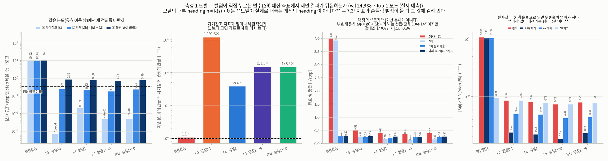
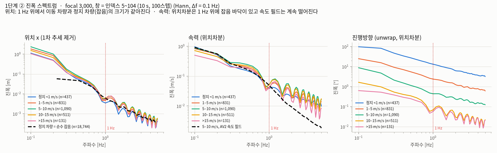
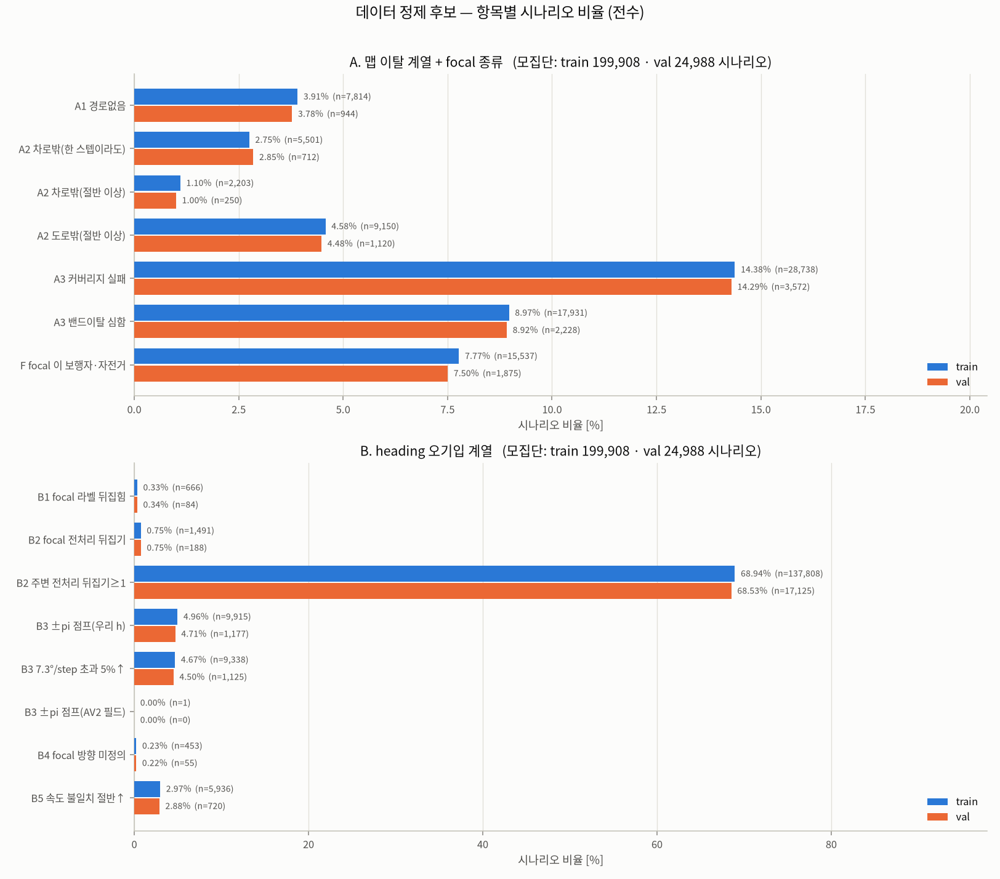
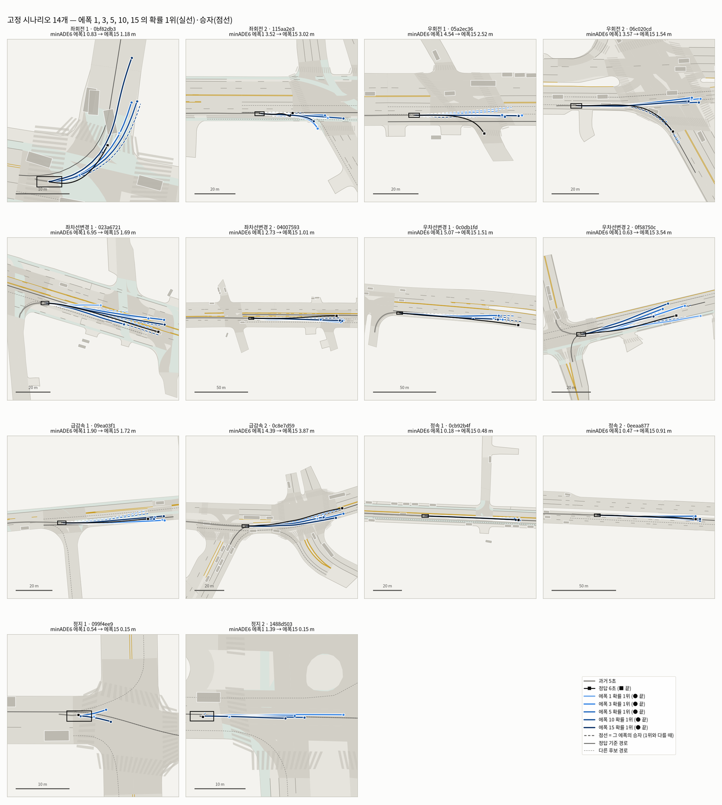

# Meeting(10/7)_yj

기간 2026-09-16 ~ 10-07 · 데이터 Argoverse 2 (train 199,908 / val 24,988) · 조건당 seed 3판 · 30에폭 cosine LR

모든 비교는 **paired-seed** 기준입니다. 같은 seed끼리 짝지어 차이를 보고, 세 seed의 부호가 일치할 때만 효과로 인정했습니다.

---

## 한 장 요약

1. **penalty의 측정 기준이 잘못돼 있었습니다.** violation rate를 model output 기준으로 재고 있었는데, penalty가 직접 누르는 값이라 penalty를 걸면 정의상 내려갑니다. predicted coordinate 기준으로 다시 재니 **8.47%**였습니다(ground truth 0.35%).
2. **penalty target을 predicted coordinate로 교체**했습니다. accuracy cost 없이 violation rate를 **8.47% → 2.28%**로 낮췄습니다. 10/6 기본 설정으로 전환 완료했습니다.
3. **lane heading alignment loss를 새로 도입**했습니다. 지금까지 어떤 방법으로도 움직이지 않던 **lane change 평가군이 처음으로 개선**됐습니다.
4. **preprocessing(smoothing + downsampling)** — 기존 smoothing이 no-op였음을 확인하고 고쳤습니다. input quality는 개선됐으나 accuracy 이득은 검출되지 않아 채택을 보류했습니다.
5. **data cleansing 전수 조사**(224,896건) — 폐기 대상은 0.17%뿐이고, 대신 preprocessing 결함 2건을 찾아 수정했습니다. 재학습 결과 3 seeds 모두 개선됐습니다.
6. **neighborhood vehicles**(radius 30 m)를 추가했고, **visualization framework를 cluster 기반으로 확장**했습니다. 상황 특성만으로 GMM cluster 8개를 만들어 보니, **scenario의 25.4%(회전 두 cluster)가 전체 오차의 40%를 만들고**, 특정 상황에서는 mode가 1.8갈래로 붕괴해 있었습니다. 전체 minADE6 한 줄로는 보이지 않던 것들입니다.

---

## 1. Penalty — 꼭 필요한가, 필요하다면 어떻게

### 1.1 기존 문제 ① self-referential measurement

예측 궤적이 step마다 급격히 꺾이는 것을 violation(위반)이라 하고, 7.3°/step을 넘으면 위반으로 셉니다. 실제 차량이 낼 수 없는 움직임입니다. penalty(벌점)는 이것을 loss에서 깎는 장치입니다.

문제는 violation rate를 **model output(모델이 출력한 각도)** 에서 재고 있었다는 것입니다. penalty가 최소화하는 변수가 바로 그 값이라, penalty를 걸면 지표가 내려가는 것이 성능이 아니라 정의였습니다.

**읽는 법**
- 연한 파랑이 model output 기준, 진한 파랑이 **predicted coordinate**(예측 좌표에서 복원한 진행방향) 기준입니다. 점선은 ground truth label 0.35%입니다.
- penalty를 걸면 연한 파랑만 0.001% 수준으로 내려가고, 진한 파랑은 0.7~0.8%에 남습니다. 두 번째 그래프에서 두 기준의 비율이 최대 1,191배입니다.
- 네 번째 그래프는 term별 기여도입니다. integrator geometry를 빼면 75% 줄지만, **model output(Δθ)을 전부 빼도 0.3%만 변합니다.**

**조치** — 모든 수치를 predicted coordinate 기준으로 재측정했습니다. ψ = atan2(Δy, Δx), |Δψ| > 7.3°/step, 양쪽 step 속력 1 m/s 이상일 때만 셉니다. 재채점한 minADE6가 학습 로그의 best와 소수점 셋째 자리까지 일치해 측정 코드를 검증했습니다.

### 1.2 기존 문제 ② action penalty의 accuracy cost가 회전에 몰림

기존 action penalty의 accuracy cost를 ground truth의 회전량으로 나눠 보면 직진 +0.055 / 완만 +0.093 / **회전 +0.164 m**입니다(no penalty 대비 paired 차이, 3 seeds 평균). cost가 회전에 몰려 있었습니다.

**회전량을 줄이는 몫은 일부입니다.** 회전 구간(ground truth 순 회전량 ≥ 30°, 4,021건)에서 확률 1위 mode의 평균 순 회전량은 ground truth 65.6° / no penalty 45.4° / action penalty 40.5°입니다. penalty와 상관없이 이미 20° 넘게 덜 돌고 있었고, action penalty는 거기에 5° 정도를 더했습니다(전체 부족분 25°의 1/5). 눈에 띄게 달라진 것은 **꺾는 방식**입니다.

| 회전 구간 (정답 순 회전량 ≥ 30°, 4,021건, 확률 1위 mode) | ground truth | action penalty |
| --- | --- | --- |
| 순 회전량 | 65.6° | 40.5° |
| 총 변화량 (\|Δψ\|를 모두 더함, 왕복 포함) | 85.2° | 51.4° |
| \|Δψ\| 중앙값 | 1.10°/step | 0.15°/step |
| \|Δψ\| p99 | 7.61° | 10.69° |

(seed 0, best checkpoint. 순 회전량은 예측 좌표의 Δψ를 부호 그대로 합친 절댓값이고, 양쪽 step 속력이 1 m/s 이상인 step만 셉니다.)

- 총 변화량이 ground truth보다 작고 중앙값이 1/7 수준이라 평소에는 거의 안 꺾습니다. 그런데 p99는 오히려 커서 **몇 step에 몰아서** 꺾습니다. 회전 중에는 ground truth도 1°/step 안팎으로 꾸준히 꺾는데, 이 패턴을 재현하지 못합니다.
- 이 꺾는 방식이 accuracy cost로 이어지는 경로는 확인하지 못했습니다. 가설은 하나 있습니다. action penalty는 임계가 없어서, ground truth에도 있는 정상적인 꺾임 변화까지 함께 누른다는 것입니다(검증 안 함).
- 회전 구간의 cost는 seed별로 +0.086 / +0.102 / +0.304로 폭이 넓습니다. 방향은 일치하지만 크기는 넓게 봐야 합니다.

### 1.3 현재 방식 — coordinate penalty와 채택 근거

#### ① 이전과 현재

| | 이전 (action penalty) | 현재 (coordinate penalty, 10/6부터 기본) |
| --- | --- | --- |
| penalty가 보는 값 | 모델이 낸 action (가속도 a, 방향 변화 Δθ) | predicted coordinate에서 복원한 진행방향 ψ = atan2(Δy, Δx) |
| 계산 방식 | 연속한 두 step의 값이 달라지는 만큼 전부 (제곱, **임계 없음**) | 한 step의 \|Δψ\|가 7.3°를 넘은 만큼만 (hinge, **임계 있음**). 양쪽 step 속력이 1 m/s 이상일 때만 셈 |
| 코드 | `--smooth-mode action --smooth 1.0` (재현할 때만 명시) | `--smooth-mode xy --smooth-xy 1.0` (기본) |

#### ② 채택 근거

1. **재는 곳과 거는 곳을 맞췄습니다.** 위반 여부는 실제로 쓰는 궤적(predicted coordinate)에서 정해집니다. 모델 내부 값으로 보장한 것이 좌표에서는 성립하지 않는 사례가 문헌에도 있습니다. MultiPath++(Varadarajan et al. 2021) 표 4에서 제어 출력을 쓰면 heading 기준 비실현율(TRI-h)은 4.10% → 0.00%가 되지만, 좌표 기준(TRI-c)은 1.08% → 1.22%로 오히려 늘었습니다(WOMD val). 우리도 같은 일이 있었습니다(1.1절: model output 기준은 0.001% 수준, 좌표 기준은 0.7~0.8%).
2. **임계를 7.3°로 둔 것은 정상 주행을 누르지 않기 위해서입니다.** 7.3°/step은 AV2 라벨 전수조사에서 차체 heading의 step 변화 `|Δh|`의 p99.99입니다(`docs/heading_quality.md` 3.1절). 이 값 안쪽은 실제 차가 내는 움직임이라 벌하지 않고, 넘는 분량만 벌합니다. 임계가 없던 이전 방식은 1.2절처럼 ground truth에 있는 꺾임까지 눌렀을 가능성이 있습니다.
3. **정확도를 내주지 않고 violation rate가 내려갔습니다.** 8조건 × 3 seeds = 24판에서 violation rate 8.47% → 2.28%, minADE6 1.359 → 1.359(paired +0.000, seed별 부호 불일치)였습니다(1.4절). seed 간 minADE6 범위도 0.035에서 0.006으로 줄었습니다.
4. **강도 1.0을 고른 이유.** 시험한 강도는 1.0과 3.0 두 가지입니다. 3.0은 violation rate가 1.13%까지 내려가지만 minADE6 +0.083이 붙었고(paired 3 seeds 일치), 1.0은 cost가 검출되지 않았습니다. 그래서 1.0을 기본으로 했습니다. 그 사이 값은 시험하지 않았습니다.

#### ③ 한계

- **violation rate가 더는 독립 검증이 아닙니다.** penalty가 누르는 값(predicted coordinate의 \|Δψ\|)과 지표가 같은 값이 되어서, 이 지표만으로는 "실제로 매끄러워졌다"를 확인할 수 없습니다. 1.1절의 구조가 좌표 쪽에서 되풀이될 수 있습니다. jerk, 횡가속 같은 별도 지표를 새 기본 판에서 재측정한 기록은 아직 없습니다.
- **좌표에 penalty를 거는 직접 선례는 찾지 못했습니다.** 좌표로 "재는" 관행은 확인했지만(MultiPath++ TRI-c, WOSAC), 이 방식을 정당화하는 근거는 우리 실험이 중심입니다.
- **남은 문제.** 2.28%는 ground truth(0.35%)보다 높습니다. hinge라서 임계 아래 흔들림은 남고, 회전 구간 p99는 13.05°로 ground truth(7.61°)보다 큽니다(확률 1위 mode, seed 0). tail을 겨냥하는 term은 6장 "해야 할 것" ④에서 다룹니다.
- **임계가 속도와 무관한 고정값입니다.** 7.3°/step은 약 3.8 m/s 이하에서 회전반경 3 m 미만에 해당합니다(R = v·0.1 s ÷ 7.3°, 계산값). 저속에서는 임계가 느슨해서 비현실적인 꺾임을 통과시킬 수 있습니다. 속도에 따라 달라지는 임계는 시험하지 않았습니다.

### 1.4 측정 결과 (조건당 3 seeds)

| condition | minADE6 | seed range | violation rate (top-1) | paired Δ vs no penalty |
| --- | --- | --- | --- | --- |
| no penalty | 1.359 | 0.035 | 8.47% | — |
| **coordinate penalty 1.0 (현재 기본)** | **1.359** | **0.006** | 2.28% | **+0.000 (부호 불일치)** |
| coordinate penalty 3.0 | 1.442 | 0.137 | 1.13% | +0.083 |
| action penalty 1.0 (기존) | 1.440 | 0.105 | 0.76% | +0.081 |
| ground truth label | — | — | 0.35% | — |

- minADE6은 6개 예측 중 정답에 가장 가까운 것의 평균 거리 오차입니다. 낮을수록 정확합니다.
- "부호 불일치"는 seed별 차이가 +0.018 / −0.003 / −0.014로 방향이 갈렸다는 뜻입니다. **accuracy cost 없이 violation rate를 1/4로 낮춘 구간**입니다.
- 2.28% 아래로 내리는 것부터는 약 +0.08 m의 cost가 붙습니다. cost는 penalty target이 아니라 **penalty 강도**의 함수입니다.

### 1.5 새 방안 — lane heading alignment loss

penalty가 "덜 꺾도록" 누르는 방식이라면, 이 loss는 **그 mode가 주행하는 candidate route의 tangent angle로 정렬**시키는 방식입니다. tolerance 15°는 ground truth 분포의 p95에서 정했습니다.

| condition | minADE6 | violation rate | cost |
| --- | --- | --- | --- |
| coordinate penalty 1.0 | 1.359 | 2.28% | 기준 |
| **+ lane-yaw 1.0** | 1.372 | **1.33%** | **+0.013 m** |
| coordinate penalty 3.0 (같은 폭을 penalty로) | 1.442 | 1.13% | +0.083 m |

같은 폭의 violation 감소를 penalty 강도로 사면 **6배 비쌉니다.**

**읽는 법**
- **(a)** 가로축이 violation rate, 세로축이 minADE6입니다. 왼쪽 아래로 갈수록 좋습니다. coordinate penalty 1.0이 no penalty와 같은 높이에서 왼쪽에 있는 것이 1.3절의 결과입니다. 점선은 ground truth 0.35%입니다.
- **(b)** ground truth(검은 별)는 직진에서 회전으로 갈 때 |Δψ| 중앙값이 9배 커집니다. action penalty(주황·빨강)는 2.7배에 그쳐 turn 구조를 재현하지 못합니다. lane-yaw(초록)가 ground truth에 가장 가깝습니다.
- **(c)** accuracy cost가 회전 구간에 몰려 있습니다.

### 1.6 lane change 전용 평가군

lane change는 val의 2.51%(627건)라 전체 지표로는 판정되지 않습니다. 전용 평가군에서 재측정했습니다.

| condition | minADE6 (627건) | paired Δ | seed별 부호 |
| --- | --- | --- | --- |
| coordinate penalty 1.0 (기준) | 2.001 | — | — |
| **+ lane-yaw 3.0** | **1.932** | **−0.069** | **일치 (−0.064 / −0.054 / −0.090)** |
| coordinate penalty 3.0 | 1.991 | −0.011 | 불일치 |
| action penalty 1.0 | 2.011 | +0.010 | 불일치 |

smoothing · band rule · neighborhood vehicles · lateral mode axis가 전부 검출 불가였던 문제에서 **처음으로 일관된 효과**가 확인됐습니다.

**방향성이 반대인 두 loss가 구분됐습니다.** smoothness를 강화하면(coordinate 3.0) 횡방향 운동까지 억제해 lane change와 U-turn이 악화됩니다(U-turn +0.201, 3 seeds 일치). lane-yaw는 악화시키지 않습니다. lane change 중에는 그 mode의 route가 목표 차로이므로 정렬이 오히려 돕기 때문입니다.

---

## 2. Preprocessing = smoothing + downsampling

기록된 차량 위치에는 측정 잡음이 섞여 있습니다. **smoothing**은 그 잡음을 누르는 것이고, **downsampling**은 10 Hz(0.1초) 기록을 2 Hz(0.5초)로 솎는 것입니다. 모델 입력은 2 Hz입니다.

### 2.1 downsampling은 현행 유지

순서(smoothing → sampling)와 window edge 4 step 제외가 측정상 타당했습니다. downsampling만으로 heading jitter p90이 6.04 → 3.23 °/s로 줄어듭니다. 즉 **2 Hz 입력 자체가 이미 smoothing 효과**를 냅니다.

### 2.2 기존 smoothing은 no-op였음

| metric (2 Hz input, straight) | no smoothing | 기존 SG(5,2) |
| --- | --- | --- |
| heading jitter p90 | 3.23 °/s | **3.23 °/s** |
| zigzag ratio | 36.7% | 36.6% |

filter cutoff가 2.38 Hz여서 2 Hz sampling의 anti-aliasing 역할을 전혀 하지 못했습니다.

### 2.3 어떤 방식을 왜 선택했나

**읽는 법**
- 가로축이 frequency, 세로축이 그 성분의 크기입니다. 색은 속력 구간이고, **검은 점선은 정지 차량** — 움직이지 않으므로 전부 noise입니다.
- 왼쪽에서 moving vehicle(색)과 정지 차량(검정)의 선이 **1 Hz 근처에서 만납니다.** 그 위는 signal과 noise가 구분되지 않습니다.
- 오른쪽 heading은 저속일수록 크기가 큽니다. 저속에서 heading이 사실상 정의되지 않음을 보여 줍니다.

**선택** — Gaussian σ = 0.25 s (cutoff 0.53 Hz). signal이 우세한 대역은 남기고 noise 대역만 자르는 지점입니다. 경계는 2차 외삽으로 처리합니다.

함께 변경한 것 둘입니다.
- heading을 V_MIN 1 m/s **hard switch**에서 **speed-weighted blend**(crossover 3 m/s)로 바꿨습니다. 기존 방식은 경계에서 step당 ±150 °/s의 discontinuity를 만들었습니다.
- 180° flip 판정을 **실제 이동 구간**으로 제한했습니다. stationary vehicle은 position noise가 판정을 결정하고 있었습니다.

### 2.4 전후 차이 — input

**읽는 법** (빨강 = 전, 파랑 = 후, 점 하나가 1 step)
- 1행 궤적: 두 선이 거의 겹칩니다. position은 거의 건드리지 않습니다.
- 2행 heading: 전은 ±5°로 계속 떨리고, 후는 매끄럽습니다.
- 3행 |Δh|/Δt: 전은 44 °/s까지 튑니다. 후는 대부분 5 °/s 아래입니다.
- 4행 속력: 전의 앞 0.5초가 7 → 14 m/s로 치솟습니다. window edge ramp라는 artifact이고, 후는 이 구간을 제외합니다.

**읽는 법** — 800 시나리오를 ground truth 회전량으로 3구간으로 나눈 중앙값입니다. 왼쪽이 heading 변화율, 오른쪽이 jerk(가속도의 변화율)입니다.

| 구간 | heading 변화율 p90 [°/s] | jerk p90 [m/s³] |
| --- | --- | --- |
| 직진 (401건) | 2.32 → **1.55** | 19.57 → **2.44** |
| 완만 (293건) | 9.05 → **5.05** | 22.32 → **3.10** |
| 회전 (106건) | 27.40 → **23.22** | 14.91 → **2.16** |

### 2.5 전후 차이 — output(accuracy)

| metric | 기존 | 변경 후 |
| --- | --- | --- |
| straight heading jitter p90 | 2.70 °/s | **2.22 °/s** (−18%) |
| jerk p90 | 9.75 m/s³ | **7.61 m/s³** (−22%) |
| turn preservation ratio | 1.022 | 1.022 (감쇠 없음) |
| **model accuracy (3 seeds, paired)** | — | **−0.053 ± 0.069 m, 부호 불일치 → 검출 불가** |

**읽는 법** — 같은 비교를 실제 모델 입력인 2 Hz에서 그린 것입니다. 막대 차이가 훨씬 작습니다(1.28 → 1.14, 4.56 → 3.59, 21.71 → 19.34 °/s). downsampling이 이미 대부분을 정리하기 때문이고, accuracy 이득이 검출되지 않은 결과와 일치합니다. 그래서 **채택은 보류**했고, noise가 큰 neighborhood vehicle input에서 재검증할 예정입니다.

### 2.6 smoothing으로 U-turn·lane change가 개선되지 않는 이유

**smoothing이 그 운동을 감쇠시켜서가 아닙니다.** 관측 구간의 횡이동과 heading 변화가 smoothing 뒤에 얼마나 남는지 측정했습니다(시나리오별 비율의 중앙값).

| 상황 | 횡이동 보존 | heading 변화 보존 |
| --- | --- | --- |
| 직진 | 83.6% | 91.2% |
| **lane change** | **95.3%** | **96.4%** |
| 회전 | 92.1% | 95.6% |
| U-turn | 88.1% | 91.1% |

직진에서 가장 많이 깎이고 lane change에서 가장 적게 깎입니다. 깎인 쪽이 noise, 남은 쪽이 signal입니다.

**읽는 법** — 2행에서 jitter는 사라졌지만 차로를 옮기는 완만한 S자 운동은 그대로 남아 있습니다.

**실제 원인 3가지**
1. **lateral mode axis 부재** — 같은 route의 sub-mode 간 endpoint spread가 종방향 11.32 m, 횡방향 0.31 m입니다. 실패의 55.7%가 여기서 나옵니다.
2. **candidate route coverage 부족** — ground truth를 담는 route가 존재하는 비율이 3.7%입니다.
3. **관측 불가능 구간** — lane change의 49%가 prediction window에서 신규 시작합니다. 과거 5초에 단서가 없습니다.

input을 다듬는 것으로는 셋 다 해결되지 않습니다. 원인 ①에 대한 처방(같은 route의 2·3번째 mode를 lane width만큼 유도하는 auxiliary loss)도 3 seeds에서 −0.013 ± 0.060으로 부호 불일치였습니다.

> **규모**: lane change를 완전히 해결해도 전체 minADE6 개선 상한은 **−0.015 m**로 seed range의 1/7입니다. accuracy 지표로는 보이지 않으므로 전용 평가군이 필요합니다.

---

## 3. Neighborhood vehicles

요청대로 **radius 30 m** 단순 방식으로 구현했습니다.

- **input** — radius 30 m 내 vehicle 최대 32대의 past 5 s를 0.5 s 간격으로. channel 5개(relative position 2, sin/cos heading, observation 여부)
- **encoder** — vehicle별 MLP embedding 후 focal trajectory feature를 query로 attention pooling
- **parameter** — 450,681 → 556,153
- **결과** — 3 seeds paired Δ −0.028 m, **부호 불일치로 전체 지표에서는 판정 불가**

문헌도 같은 방향입니다. VectorNet은 주변 차량 추가로 ADE가 1.7% 개선에 그쳤고, LaneGCN의 A2A 순이득은 minFDE 1.10 → 1.08이었습니다. 상호작용이 드문 모집단에서는 전체 지표가 효과를 희석합니다. lane change 같은 전용 평가군에서 재판정해야 합니다.

---

## 4. Data cleansing — 폐기 vs 보정

val 24,988건을 포함한 **train + val 224,896건 전수**를 항목별로 집계했습니다. 출발 질문은 "이상 데이터를 폐기할 것인가"였고, 결론은 **폐기 대상이 거의 없고 preprocessing 결함이 원인**이었습니다.

**읽는 법** — 위는 map 관련, 아래는 heading 관련 항목입니다. 파랑이 train, 주황이 val이고 비율과 건수를 함께 적었습니다. 두 색 길이가 비슷하면 train과 val의 성질이 같다는 뜻입니다.

| item | ratio | 해석 |
| --- | --- | --- |
| no candidate route | 3.9% | 81.5%가 pedestrian·cyclist. vehicle만 0.78% |
| off-road | 4.6% | 99.7%가 pedestrian·cyclist |
| coverage failure | 14.4% | turn·lane change가 대부분이라 폐기 불가 |
| **our heading의 급격한 변화** | **0.79%** | **AV2 원본은 0.01%** — preprocessing에서 유입된 것 |

**발견한 결함 2건 (수정 완료)**
1. **candidate lane distance를 centerline vertex 기준으로 측정**하고 있었습니다. vehicle "no route" 사례의 91%가 실제로는 lane polyline 위(중앙 0.49 m)에 있었고, vertex 간격이 5 m를 넘는 구간에서 배제됐습니다. point-to-segment distance로 수정했습니다.
2. **AV2 body heading이 반전된 scenario 18건**의 minADE6이 15.07 m였습니다(전체 1.49). normalization frame과 candidate route filter가 같은 각도를 써서 scene 전체가 반전됐습니다. 이동 구간 기준 판정으로 교정했습니다.

**결론**
- 결함 수정 후 폐기 대상은 **train의 0.17%(약 340건)**뿐입니다.
- pedestrian·cyclist는 폐기 시 오히려 저하됩니다(val minADE 1.490 → 1.522).
- 수정한 preprocessing으로 재학습한 결과 **3 seeds 모두 개선**(−0.043 m)됐습니다.
- 폐기 불가로 남긴 것: window edge ramp, stationary track의 heading 미정의(33.4%), slip angle.

---

## 5. Visualization framework — cluster로 모델을 설명하기

### 5.1 왜 cluster인가

minADE6 1.359 m 한 줄은 "평균적으로 1.36 m 틀린다"만 말합니다. **어떤 상황에서 무엇을 못하는지**는 안 보입니다. 규칙으로 만든 상황 label(정지·좌회전·…·기타 9종)은 사람이 정한 임계라 **43.4%가 '기타'로 빠집니다.**

그래서 **모델 출력을 한 개도 쓰지 않은 상황 특성 6개**로 GMM(Gaussian Mixture Model)을 적합해 상황을 cluster로 나누고, cluster마다 모델 지표를 따로 쟀습니다.

- **특성** v0(예측 시작 속력) · Δv(6초 속도 변화) · a_min · a_max · |Δh|(6초 진행방향 변화) · |Δd|(route 횡변위). 양 끝 0.5%는 자르고 표준화합니다. 좌·우는 크기만 써서 cluster가 대칭으로 쪼개지지 않게 했습니다.
- **K = 8** 70/30으로 나눠 학습하고 보류표본(hold-out) 평균 로그가능도를 봅니다. 증가분이 0.2 nats 이상인 마지막 K입니다. BIC는 K=11까지 계속 내려가지만 cluster가 쪼개지기만 하고 해석이 안 됩니다. 두 곡선을 함께 남겼습니다.
- **안정성** seed를 바꿔 다시 적합해도 같은 묶음이 나옵니다(adjusted Rand index 0.998 / 0.998).
- **측정 검증** 이 판의 minADE6는 dump와 `score_xy_viol.py` 재채점이 완전히 일치합니다(차 0.0). violation rate는 top-1 mode 기준입니다.

**읽는 법** — 왼쪽 위 BIC는 낮을수록, 오른쪽 위 hold-out 로그가능도는 높을수록 좋습니다. 오른쪽 위 숫자가 K를 하나 늘렸을 때의 증가분입니다(K=8에서 +0.436, 그 다음부터 +0.098·+0.105·+0.044). 오른쪽 아래는 **소속 확신도**입니다 — GMM은 경계 scenario를 확률로 표현하므로, 규칙 분류로는 적을 수 없는 "애매한 사례"가 몇 %인지 볼 수 있습니다.

### 5.2 나온 cluster 8개

**읽는 법** — 점 하나가 scenario 하나(7,000개만 그렸습니다). 색이 cluster, 테두리 있는 큰 점이 cluster 중심입니다. 축은 전부 ground truth 쪽 상황 값입니다.

| cluster | 비중 | v0 | Δv | \|Δh\| | minADE6 | top-1 ADE | miss | violation | 전체 오차 기여 |
| --- | --- | --- | --- | --- | --- | --- | --- | --- | --- |
| C1 정속 순항 | 23.6% | 9.1 | +0.1 | 1° | 0.90 | 1.94 | 35% | 2.25% | 15.7% |
| C2 직진 가감속 | 18.6% | 7.6 | −0.3 | 2° | 1.41 | 3.25 | 50% | 2.09% | 19.3% |
| **C0 회전** | 18.1% | 4.6 | +1.6 | 46° | 1.79 | 3.56 | 72% | 6.22% | **24.0%** |
| C7 완만한 곡선 | 15.6% | 8.3 | −0.1 | 5° | 1.31 | 2.58 | 56% | 2.42% | 15.0% |
| **C6 급가감속 섞인 회전** | 7.3% | 4.8 | +2.3 | 35° | **2.94** | 4.71 | **82%** | 5.33% | 15.9% |
| C3 정지 → 출발 | 6.7% | 0.0 | +5.4 | 2° | 1.04 | 2.84 | 41% | 2.44% | 5.1% |
| C4 저속 배회·정체 | 5.1% | 1.3 | 0.0 | 11° | 0.84 | 0.94 | 26% | 3.24% | 3.2% |
| C5 감속 → 정지 | 4.9% | 2.3 | −2.3 | 1° | **0.54** | 1.55 | 10% | 1.66% | 2.0% |
| 전체 | 100% | | | | 1.359 | 2.770 | 50% | 3.23% | 100% |

단위: v0·Δv는 m/s, minADE6·top-1 ADE는 m. 이름은 cluster 중심을 보고 붙인 것이고, 규칙은 script에 적어 두었습니다.

### 5.3 cluster로 나누니 보이는 것

**읽는 법** — 가로축이 cluster(아래 숫자는 비중)입니다. 점선이 전체 평균이고, 막대가 점선보다 높으면 그 상황이 평균보다 어렵다는 뜻입니다. 왼쪽 아래는 **오차가 언제 벌어지는지**를 step마다 점으로 찍은 것이고, 오른쪽 아래는 전체 minADE6를 어느 cluster가 만드는지입니다.

1. **전체 오차의 40%가 회전 두 cluster에서 나옵니다.** scenario의 25.4%(C0 18.1% + C6 7.3%)가 오차의 39.9%(24.0 + 15.9)를 만듭니다. "회전이 어렵다"는 알고 있었지만, **전체 지표를 개선하려면 어디를 고쳐야 하는지**가 숫자로 나옵니다.
2. **가장 어려운 상황은 '급가감속이 섞인 회전'입니다**(minADE6 2.94 m, miss 82%). 같은 회전이라도 속도가 함께 변하면 1.79 → 2.94로 뜁니다. 회전 전용 평가군을 만들 때 이 둘을 섞으면 안 됩니다.
3. **오차는 시간에 비례해 벌어지지 않습니다.** C6은 3초 이후 기울기가 꺾여 6초에 7 m를 넘고, C5(감속 → 정지)는 6초 내내 1 m 아래입니다. 6초 끝점 하나로만 보는 minFDE6은 이 차이를 지웁니다.
4. **violation rate도 회전에 몰립니다**(C0 6.22% / C6 5.33% vs 직진 계열 2.1~2.4%). 1.2절의 회전량 구간별 cost(직진 +0.055 → 회전 +0.164 m)와 독립적으로 같은 결론이 나옵니다.

**읽는 법** — 왼쪽 위는 승자 mode의 6초 뒤 끝점이 ground truth 끝점에서 어느 쪽으로 어긋났는지(중앙값)입니다. 음수면 **덜 나아간** 것입니다. 가운데 위는 6 mode의 끝점을 2.5 m 안이면 한 묶음으로 세어 "진짜 몇 갈래를 내놓나"를 본 것이고, 주황 선이 1위 mode 확률입니다.

5. **회전에서 종방향으로 덜 나아가는 쪽으로 치우칩니다**(끝점 편차 중앙값 C0 −0.44 m, C6 −0.27 m). 직진 계열은 ±0.03 m로 치우침이 없습니다. 다만 **치우침의 크기는 분포의 폭에 비하면 작습니다** — 5.4절에서 다시 봅니다.
6. **mode 다양성은 상황마다 다릅니다.** C4(저속 배회·정체)는 끝점 묶음이 1.8갈래뿐이고 1위 확률이 0.85입니다 — **확신하며 한 갈래만** 내놓습니다. 전체 평균(4.62갈래, 0.38)만 보면 "mode는 살아 있다"로 읽히지만, 상황별로 보면 특정 상황에서 완전히 붕괴해 있습니다.
7. **top-1 ADE와 minADE6의 간격이 상황마다 다릅니다.** C4는 0.84 → 0.94(1.1배)인데 C2(직진 가감속)는 1.41 → 3.25(2.3배)입니다. 즉 직진 가감속에서는 **정답에 가까운 mode를 갖고 있으면서도 확률 1위로 고르지 못합니다.** 이것은 정확도 문제가 아니라 **고르기(확률) 문제**이고, 6장 "해야 할 것" ①(top-1 병기)의 근거입니다.

### 5.4 분포로 다시 보기 — 평균 막대가 가리는 폭

**읽는 법** — 5.2~5.3의 막대와 표는 전부 **평균 하나**였습니다. 이 그림은 같은 수치의 폭입니다. 상자가 가운데 50%, 상자 안 선이 중앙값, ◆가 평균, 수염이 5~95 백분위입니다.

| cluster | p25 | 중앙값 | p75 | p95 | 평균 |
| --- | --- | --- | --- | --- | --- |
| C1 정속 순항 | 0.47 | 0.71 | 1.08 | 2.16 | 0.90 |
| C2 직진 가감속 | 0.69 | 1.04 | 1.60 | 3.79 | 1.41 |
| C0 회전 | 1.00 | 1.45 | 2.15 | 4.22 | 1.79 |
| C7 완만한 곡선 | 0.73 | 1.06 | 1.57 | 3.03 | 1.31 |
| C6 급가감속 섞인 회전 | 1.30 | 2.11 | 3.64 | 7.61 | 2.94 |
| C3 정지 → 출발 | 0.37 | 0.68 | 1.23 | 2.78 | 1.04 |
| C4 저속 배회·정체 | 0.35 | 0.56 | 0.98 | 2.72 | 0.84 |
| C5 감속 → 정지 | 0.15 | 0.32 | 0.65 | 1.72 | 0.54 |
| 전체 | 0.59 | 0.98 | 1.61 | 3.75 | 1.359 |

minADE6 [m]. 단위는 전부 m입니다.

8. **평균은 꼬리에 끌려갑니다.** 전체 중앙값은 0.98 m인데 평균은 1.359 m입니다. "평균적으로 1.36 m 틀린다"가 아니라 **"절반은 1 m 안쪽이고 상위 5%가 3.75 m를 넘는다"** 가 실제 모습입니다. C6은 중앙값 2.11 / 평균 2.94 / p95 7.61로 격차가 가장 큽니다.
9. **끝점 치우침은 폭에 비하면 작습니다.** 5.3의 5번에서 C0의 종방향 편차를 −0.44 m라고 적었는데, 상자를 보면 Q1~Q3가 −2.75~+1.69 m이고 "덜 나아간" 비율은 55.7%입니다(직진 계열 49.7%). **방향은 분명하지만 매 scenario마다 그런 것은 아닙니다.** 평균 −0.84 m는 꼬리에 끌린 값입니다. 중앙값·사분위로 다시 적는 편이 안전합니다.
10. **cluster 간 상자가 겹치는 정도**도 함께 봐야 합니다. C5(0.15~0.65)와 C6(1.30~3.64)은 상자가 완전히 떨어져 있어 "다른 상황"이라고 말할 수 있지만, C2(0.69~1.60)와 C7(0.73~1.57)은 상자가 거의 포개집니다 — 평균 차이 0.10 m는 "C2가 더 어렵다"보다 **꼬리 두께의 차이**에 가깝습니다.

### 5.5 cluster를 사람이 읽는 규칙으로 — decision tree

**읽는 법** — GMM이 만든 cluster를 깊이 4 decision tree로 다시 적은 것입니다. 잎 상자의 '순도'는 그 잎에 모인 scenario 중 적힌 cluster의 비율입니다. 검증 정확도 65.1%는 "이 규칙으로 cluster의 65%를 재현한다"는 뜻입니다. 100%가 아닌 이유는 GMM이 경계를 확률로 두기 때문입니다 — tree는 서술용 요약이지 cluster의 정의가 아닙니다.

**상관을 요약한 서술이지 인과가 아닙니다.** "속력이 낮아서 오차가 작다"가 아니라 "속력이 낮은 묶음에서 오차가 작게 관측된다"로 읽어야 합니다. 쓸 데가 있는 쪽은 **평가군 정의**입니다 — GMM 모델 파일 없이 |Δh| > 14.7° & |Δd| ≤ 4.7 같은 규칙만으로 회전 평가군을 재현할 수 있습니다.

### 5.6 cluster별 대표 scenario

**읽는 법** — cluster마다 minADE6가 그 cluster 중앙값에 가장 가까운 scenario를 한 개씩 골랐습니다(극단 사례를 피하려는 것). 제목의 '규칙 label'은 기존 9종 분류가 그 scenario에 붙인 이름입니다 — C1·C2·C4·C5의 대표가 모두 '기타'인 것이 규칙 분류의 한계를 보여 줍니다.

### 5.7 framework 자체

- **필수 요건 11가지**를 agent 정의 파일에 명시했습니다. time series, 상태별 통계, scenario별 지표, loss 항 분해, 분포를 뭉치지 않기, 단위 통일, step마다 점 찍기, 대표 scenario, 독립 검증, 특성 표, decision tree입니다. 이번 cluster 분석도 이 요건을 그대로 따릅니다.
- **표준 작업 A**(checkpoint 분석: dump → cases → stats → gallery), **표준 작업 B**(epoch별 학습 방향), 이번에 추가한 **표준 작업 C**(상황 cluster 분석)로 고정했습니다.
- **독립 검토 agent**가 핵심 수치를 다른 코드 경로로 재계산합니다. 지금까지 3회, 지적 60여 건입니다.
- scenario ID를 유형별로 묶어 json으로 저장해, 같은 사례를 다시 꺼내 볼 수 있습니다. cluster label도 `situation/labels.npy`로 저장해 다른 판과 같은 묶음으로 비교할 수 있습니다.

**읽는 법** — 표준 작업 B의 결과입니다. 상황별 14개 scenario를 고정해 두고 epoch 1·3·5·10·15의 확률 1위 예측을 겹쳐 그렸습니다. 연할수록 초기입니다. 검은 선이 ground truth, 네모가 끝점입니다. 제목의 숫자가 epoch 1 → 15의 minADE6입니다.

- **회전과 정지는 학습이 진행되며 뚜렷이 개선**됩니다(우회전 4.54 → 2.52, 정지 1.39 → 0.15).
- **lane change는 사례마다 갈립니다.** 개선되는 사례와 악화되는 사례가 공존합니다. lateral mode axis 부재라는 진단과 일치합니다.
- **6개 mode가 같은 route 위에 종방향으로 늘어섭니다.** 속도 프로파일로만 갈라지고 횡방향으로는 거의 벌어지지 않습니다. 5.3절 6번(C4의 mode 붕괴)과 같은 현상을 다른 각도에서 본 것입니다.

---

## 6. 현재 진행 중인 작업과 해야 할 것

### 완료

| 항목 | 상태 |
| --- | --- |
| penalty target → predicted coordinate | 기본 설정 전환 완료 |
| lane heading alignment loss | 3 seeds 완료. lane change에서 유일하게 일관된 개선 |
| data cleansing 결함 2건 수정 | 수정 후 재학습 3 seeds 개선 |
| neighborhood vehicles (radius 30 m) | 구현·3 seeds 완료. 전체 지표로는 판정 불가 |
| preprocessing smoothing | input quality 개선 확인, accuracy 미검출로 채택 보류 |
| visualization framework | 요건 11가지·표준 작업 A/B/C·독립 검토 정착 |
| 상황 cluster 분석 (GMM K=8) | 현재 기본 판에 적용 완료. cluster label 저장, 다른 판과 같은 묶음으로 비교 가능 |

### 해야 할 것

1. **top-1 accuracy 병기** — 현재 accuracy는 min-of-6, violation rate는 top-1 mode로 재고 있어 두 축이 서로 다른 mode를 봅니다. 같은 checkpoint에서 top-1의 ADE를 함께 적으면 재학습 없이 해결됩니다.
2. **U-turn·lane change 전용 평가군 정식화** — U-turn은 73건(0.29%)이라 전체 지표로는 어떤 변경도 판정되지 않습니다. 5.4절의 decision tree 규칙으로 회전·급가감속 회전 평가군을 먼저 고정합니다.
3. **neighborhood vehicles를 전용 평가군에서 재판정** — cluster 단위(C0·C6·C4)로 paired-seed 차이를 봅니다. 전체 minADE6로는 −0.028(부호 불일치)이라 판정이 안 됩니다.
4. **tail을 겨냥하는 term 검토** — |Δψ| p99가 6.4~8.1°로 ground truth(4.50°)보다 두껍습니다. 중앙값은 이미 작으므로 hinge보다 분포를 맞추는 항이 후보입니다.
5. **lane-yaw 3.0의 전체 cost(+0.017 m) seed 부호 확인** — lane change 쪽은 일치가 확인됐지만 전체 쪽은 아직입니다.
6. **band cost 수치의 재현 script** — 문서에 인용되는 수치의 계산 코드가 저장소에 없습니다.
7. **원 논문 대조** — 이번에 도입한 lane heading alignment loss의 원 논문(Greer et al.)과 tolerance·적용 범위·보고 지표를 맞춰 봅니다.
