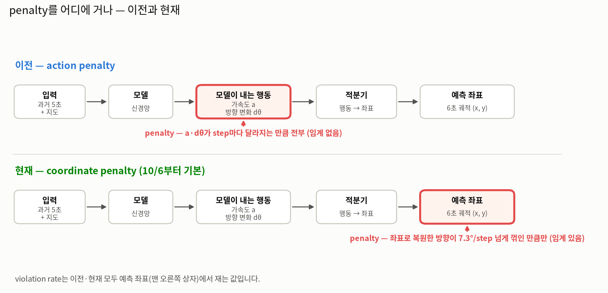
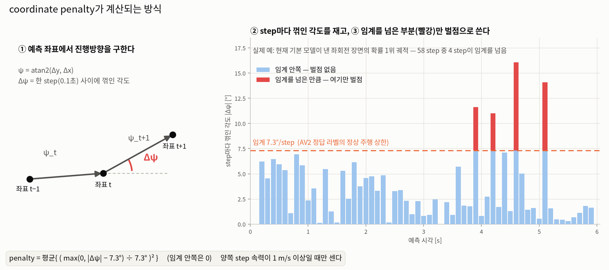
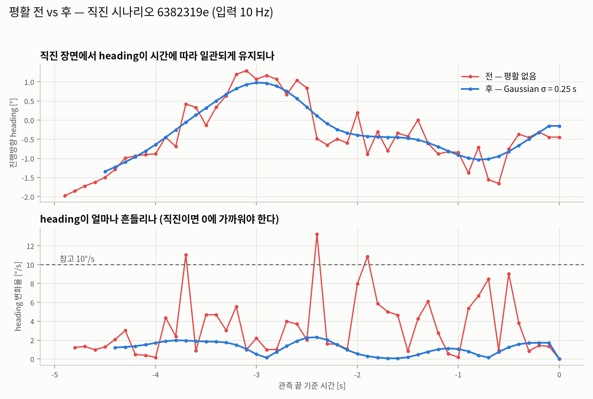
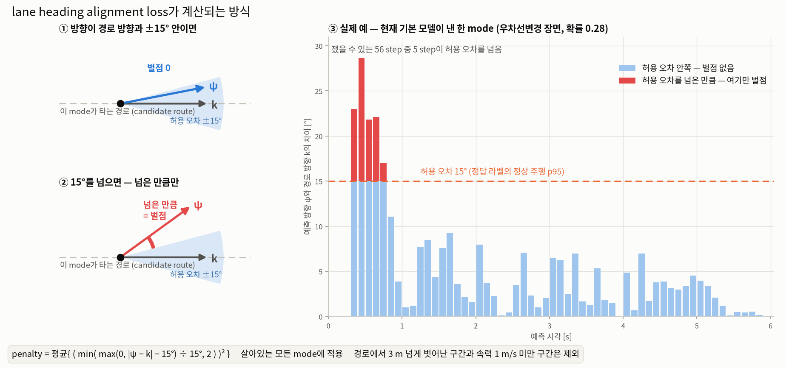
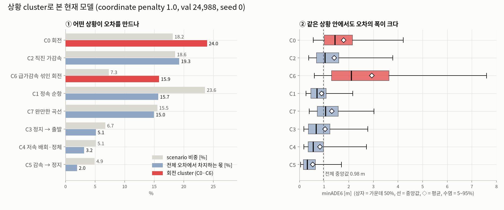

# Meeting(10/7)_yj

지난 미팅의 Action Item에 대한 답변입니다. 수치보다 **어떤 작업을 어떤 근거로 했는지**를 중심으로 적었습니다.

- 데이터 Argoverse 2 (train 199,908 / val 24,988), 30 epoch cosine
- 비교는 같은 seed끼리 짝지어 보는 paired-seed 방식입니다. seed 3판의 부호가 일치할 때만 효과로 인정했습니다.

---

## Action Item 답변 한눈에 보기

| Action Item | 답변 | 본문 |
| --- | --- | --- |
| 벌점: 꼭 필요한가? 필요하다면 어떻게? | **필요합니다.** 없으면 정답보다 약 24배 많은 step이 실제 차량이 낼 수 없는 각도로 꺾입니다. 다만 기존 방식(action penalty)에 문제가 있어, penalty를 **모델 출력이 아니라 예측 좌표에** 거는 방식으로 바꿨습니다. | 1.1 |
| preprocessing — downsampling | 기계적으로 해 봤고, 10 Hz → 2 Hz는 정확도가 나빠져서 **모델 입력은 10 Hz를 유지**합니다. | 1.2 |
| preprocessing — smoothing (위치 + 각) | 데이터의 잡음 특성을 측정해서 방법(Gaussian)을 골랐고, 직진 heading은 일관되게 개선됐습니다. 다만 **accuracy 이득은 검출되지 않아 채택은 보류**했습니다. | 1.2 |
| neighborhood vehicle | 지시대로 단순하게 **radius 30 m**로 구현했습니다. 전체 지표로는 판정이 안 되어 전용 평가군에서 다시 봅니다. | 1.3 |
| U턴, 차로변경 | U턴은 제외했습니다. 차로변경은 **제시된 두 가설(smoothing, 1.75 m band)이 모두 원인이 아니었고**, 새로 도입한 lane heading alignment loss가 처음으로 일관된 개선을 냈습니다. | 1.4 |
| 데이터 cleansing (맵 이탈 + heading 오기입) | 전수 집계 결과 **폐기 대상은 0.17%뿐**이라, 폐기 대신 원인인 전처리 결함 2건을 보정했습니다. | 2 |
| Visualization | agent 기반 framework를 정리했고, 상황 cluster와 박스 플롯으로 **현재 모델의 특성**을 설명했습니다. | 3 |

---

## 1. 모델링 관련

### 1.1 벌점 — 꼭 필요한가? 필요하다면 어떻게?

#### 결론

- **필요합니다.** penalty 없이 학습하면 예측 궤적의 step 8.47%가 실제 차량이 낼 수 없는 각도(7.3°/step 초과)로 꺾입니다. 정답 label은 0.35%입니다.
- 다만 기존 방식에는 문제가 둘 있었습니다. 그래서 **penalty를 거는 대상을 모델 출력(action)에서 예측 좌표로 바꿨고**, 10/6부터 기본 설정입니다.

#### 논문에서 찾은 것과 v4에 맞춘 선택

v4의 L0 모델은 매 step마다 action(가속도 a, 방향 변화 Δθ)을 내고, integrator가 이것을 좌표로 바꿉니다. 이 구조를 기준으로 문헌을 찾았습니다.

1. **같은 구조(action 출력 + integrator)를 쓴 연구들은 비현실적 궤적을 구성상 거의 0%로 줄였다고 보고합니다**(DKM, MultiPath++). v4도 구조로는 비슷한 보장을 기대할 수 있습니다.
2. **그런데 그 보장은 "모델 내부 변수로 잴 때"만 성립합니다.** MultiPath++ 표 4에서 제어 출력을 쓰면 내부 변수 기준 비실현율은 0.00%가 되지만, 좌표 기준(TRI-c)은 1.08% → 1.22%로 오히려 늘었습니다. 우리도 같은 현상을 겪었습니다(아래 문제 ①). → **위반 여부는 예측 좌표로 재기로 했습니다.**
3. **평활성·실현가능성 평가 지표도 문헌에서는 좌표 기반이 표준입니다**(MultiPath++ TRI-c, WOSAC 등). → 모든 수치를 좌표 기준으로 다시 쟀습니다.
4. **기존 action penalty에도 근거는 있었습니다.** RL의 action smoothness regularization 계열입니다(문헌 조사 기준, 원문 대조 전). 그래서 이번 변경은 "근거 없음 → 있음"이 아니라, **두 갈래 중 v4에 맞는 쪽을 다시 고른 것**입니다. v4는 평가와 위반 판정이 모두 최종 궤적(좌표)에서 이뤄지므로 좌표에 직접 거는 쪽을 택했습니다.

**한계** — 좌표에 penalty를 거는 직접 선례는 찾지 못했습니다. 이 선택은 위의 "좌표로 재야 한다"는 문헌과 우리 실험이 근거입니다. 원문을 직접 대조한 것은 DKM과 MultiPath++이고, 나머지는 2차 서술 기준입니다.

#### 기존 방식의 문제

**① 측정이 자기참조였습니다.** violation rate를 모델이 낸 각도(model output)로 재고 있었습니다. penalty가 직접 줄이는 값을 지표로 쓴 것이라, penalty를 걸면 지표는 성능과 상관없이 내려갑니다. 그래서 **최종 궤적이 실제로 현실적인지는 확인된 적이 없었습니다.** 예측 좌표로 다시 재니, model output 기준으로 거의 0%였던 값이 0.7~0.8% 남아 있었습니다.

**② accuracy cost가 회전에 몰렸습니다.** 기존 action penalty의 accuracy cost는 직진에서 +0.055 m인데 회전에서는 +0.164 m였습니다(no penalty 대비 paired 차이, 3 seeds 평균). 회전 구간(정답 순 회전량 ≥ 30°, 4,021건, 확률 1위 mode)에서 보면 꺾는 방식이 달라져 있습니다.

| 회전 구간 | ground truth | action penalty |
| --- | --- | --- |
| 순 회전량 | 65.6° | 40.5° |
| \|Δψ\| 중앙값 (step당 꺾인 각도) | 1.10° | 0.15° |
| \|Δψ\| p99 | 7.61° | 10.69° |

(seed 0, best checkpoint. 순 회전량은 예측 좌표의 Δψ를 부호 그대로 합친 절댓값입니다.)

- 평소에는 거의 안 꺾다가(중앙값이 ground truth의 1/7) 몇 step에 **몰아서** 꺾습니다(p99는 더 큼). 회전 중에는 ground truth도 꾸준히 꺾는데 이 패턴을 재현하지 못합니다.
- 회전량이 줄어든 것의 대부분은 penalty 때문이 아닙니다. no penalty도 이미 45.4°로 정답보다 20° 넘게 덜 돌고, action penalty는 거기에 5° 정도를 더했습니다.
- 이 꺾는 방식이 accuracy cost로 이어지는 경로는 확인하지 못했습니다. 가설은 하나 있습니다. action penalty는 임계가 없어서 ground truth에도 있는 정상적인 꺾임 변화까지 함께 누른다는 것입니다(검증 안 함).

#### 현재 방식 — 작동 방식

| | 이전 (action penalty) | 현재 (coordinate penalty) |
| --- | --- | --- |
| penalty가 보는 값 | 모델이 낸 action (a, Δθ) | 예측 좌표에서 복원한 진행방향 ψ |
| 계산 방식 | 연속한 두 step의 값이 달라지는 만큼 전부 (**임계 없음**) | 한 step의 \|Δψ\|가 7.3°를 넘은 만큼만 (**임계 있음**) |
| 특징 | 지표와 같은 내부 값을 눌러서, 효과를 독립적으로 확인하기 어려움 | 최종 궤적을 직접 겨냥. 정상 주행 범위는 벌하지 않음 |

현재 방식은 이렇게 작동합니다. 예시는 현재 기본 모델이 낸 실제 예측입니다.

1. 모델이 낸 각 mode의 **예측 좌표**에서 진행방향 ψ = atan2(Δy, Δx)를 구합니다.
2. step마다 꺾인 각도 \|Δψ\|를 잽니다(양쪽 step 속력이 1 m/s 이상일 때만).
3. **7.3°를 넘은 부분만** 제곱해서 평균을 내고, loss에 더합니다(가중치 1.0). 임계 안쪽은 0입니다.

**기존 문제를 어떻게 줄였나** — penalty가 보는 값이 모델 내부 값이 아니라 최종 궤적이므로, "최종 궤적이 실제로 현실적인가"를 직접 보게 됐습니다(문제 ①). 임계를 둬서 정상 주행 범위는 누르지 않습니다(문제 ②를 줄이려는 설계).

#### 채택 근거

1. **재는 곳과 거는 곳을 최종 궤적에 맞췄습니다.** 위 문헌 2·3에 따른 선택이고, 우리 데이터에서도 내부 값과 좌표 값이 크게 달랐습니다.
2. **임계 7.3°는 정상 주행을 누르지 않기 위한 값입니다.** AV2 라벨 전수조사에서 차체 heading의 step 변화 p99.99가 7.3°였습니다. 이 안쪽은 실제 차가 내는 움직임이라 벌하지 않고, 넘는 분량만 벌합니다.
3. **정확도를 내주지 않고 violation rate가 내려갔습니다.** 조건 8개 × 3 seeds = 24판에서 violation rate 8.47% → 2.28%였고 minADE6는 그대로였습니다(paired +0.000, seed별 부호 불일치). seed 간 minADE6 변동도 줄었습니다(0.035 → 0.006).
4. **강도 1.0을 고른 이유.** 시험한 강도는 1.0과 3.0 두 가지입니다. 3.0은 violation rate를 1.13%까지 낮추지만 minADE6 +0.083이 붙었고, 1.0은 cost가 검출되지 않았습니다. 그래서 1.0을 기본으로 했습니다. 그 사이 값은 시험하지 않았습니다.

#### 한계와 남은 것

- **violation rate가 더는 독립 검증이 아닙니다.** penalty가 누르는 값과 지표가 같은 값(예측 좌표의 \|Δψ\|)이 되어서, 이 지표만으로는 "실제로 매끄러워졌다"를 확인할 수 없습니다. jerk, 횡가속 같은 별도 지표를 새 기본 판에서 재측정한 기록은 아직 없습니다.
- **2.28%는 ground truth(0.35%)보다 높습니다.** hinge라서 임계 아래 흔들림은 남고, 회전 구간 p99는 13.05°로 ground truth(7.61°)보다 큽니다. 꼬리를 겨냥하는 항을 검토 대상으로 남겼습니다.
- **임계가 속도와 무관한 고정값입니다.** 7.3°/step은 약 3.8 m/s 이하에서 회전반경 3 m 미만에 해당하므로(계산값), 저속에서는 비현실적인 꺾임을 통과시킬 수 있습니다. 속도에 따라 달라지는 임계는 시험하지 않았습니다.
- violation rate를 penalty 강도로 더 낮추면 비쌉니다. 더 낮추는 방법은 1.4절의 lane heading alignment loss에서 다룹니다.

### 1.2 preprocessing = smoothing + downsampling

기록된 차량 위치에는 측정 잡음이 섞여 있습니다. **smoothing**은 그 잡음을 누르는 것이고, **downsampling**은 10 Hz(0.1초) 기록을 2 Hz(0.5초)로 솎는 것입니다.

#### downsampling — 기계적으로 해도 됨

- 해 본 것: 10 Hz → 2 Hz. 순서는 smoothing 후 sampling이고, 창 시작 4 step(초기화 구간)은 제외합니다.
- 결과: 2 Hz 입력은 정확도가 나빠졌습니다(약 +0.11 m, 최근 5 epoch 평균 기준, 3 seeds 부호 일치). 입력 step이 1/5로 줄어 가속·heading 변화를 놓치는 것으로 해석합니다.
- 결정: **모델 입력은 10 Hz를 유지**합니다. 2 Hz는 neighborhood vehicle 입력(0.5초 간격)에만 씁니다.
- 부수 발견: downsampling만으로도 heading 흔들림이 절반으로 줄어듭니다(p90 6.04 → 3.23 °/s). 즉 2 Hz로 솎는 것 자체가 smoothing 효과를 냅니다.

#### smoothing (위치 + 각) — 가장 중요

**① 먼저 데이터의 잡음이 어떤 모양인지 쟀습니다.** 방법을 고르기 전에 "무엇을 평활해야 하나"를 확인했습니다.
- AV2 위치는 이미 시간 평활·보간·재표집을 거친 값입니다(AV2 데이터 논문). 우리가 거는 것은 2차 평활입니다.
- 잡음은 백색이 아니라 **느린 흔들림 + 드문 큰 튐**입니다. 움직이지 않는 차량(순수 잡음)과 움직이는 차량의 위치 신호가 **0.6~1.0 Hz에서 같아집니다.** 그 위 주파수는 대부분 잡음입니다.
- 저속·정지 차량은 heading 자체가 사실상 정의되지 않습니다. 정지 차량의 heading은 위치 잡음이 정합니다.

**② 후보를 비교하고 하나를 골랐습니다.** SG(Savitzky–Golay), Butterworth, Gaussian, Kalman/RTS 계열 등 후보 31개를 12개 지표로 비교했습니다.

선택은 **Gaussian σ = 0.25 s + 경계 2차 외삽**입니다. 이유는 다음과 같습니다.
- 컷오프(0.53 Hz)가 위의 신호/잡음 교차 주파수 바로 아래입니다. 실제 회전 성분은 0.5 Hz 아래에 있어서 거의 깎이지 않습니다.
- 입력 위치를 원본에서 거의 움직이지 않습니다. 반면 Kalman(속도 필드 포함)은 창 시작 구간과 정지 차량 문제를 가장 잘 고치지만, 입력 위치를 15.8 cm 옮겨서 "입력과 정답이 같은 궤적에서 나온다"는 전제를 깨기 때문에 뺐습니다.
- Butterworth는 50 step짜리 짧은 창에서 경계가 불안정합니다.
- 실행 전에 적어 둔 판별 규칙을 통과한 방법은 없었습니다. 규칙의 두 조건(직진 잡음 줄이기, 회전 보존)이 서로 상충해서입니다. 그래서 규칙 대신 위 근거를 종합해서 골랐습니다.

함께 바꾼 것 둘이 있습니다.
- heading을 1 m/s에서 위치차분 ↔ AV2 차체 heading으로 **딱 바꾸던 방식**을 속력 가중 혼합(3 m/s 기준)으로 바꿨습니다. 기존 방식은 경계에서 계단 같은 불연속을 만들었습니다.
- 180° 뒤집힘 판정을 **실제로 이동한 구간에서만** 하도록 제한했습니다. 정지 차량은 위치 잡음이 판정을 정하고 있었습니다.

기존 SG(5,2)는 평활 없음과 지표로 구별되지 않았습니다. 컷오프(2.38 Hz)가 2 Hz 샘플링의 Nyquist(1 Hz)보다 높아서, 반에일리어싱 역할을 못 했기 때문입니다.

**③ 전/후를 직진 시나리오의 heading vs time으로 그렸습니다.**

**읽는 법** — 위는 진행방향(heading)을 시간에 따라 그린 것이고, 아래는 step마다 heading이 얼마나 변하는지입니다. 직진이므로 매끄러워야 합니다.
- 전(빨강)은 ±1° 안에서 계속 떨고, heading 변화율이 최대 13 °/s까지 튑니다.
- 후(파랑)는 완만한 하나의 곡선으로 이어지고, 변화율이 대부분 2 °/s 아래입니다. 직진 시나리오 401건 전체로도 heading 변화율 p90이 2.32 → 1.55 °/s로 약 1/3 줄었습니다.
- 평활 후 시작점이 조금 뒤에 있는 것은 창 시작의 인공 구간(속도가 실제의 절반으로 보이는 초기화 구간)을 제외했기 때문입니다.

**④ 모델 정확도로는 이득이 검출되지 않아 채택은 보류했습니다.**
- 입력의 질(heading 일관성, jerk)은 분명히 좋아졌지만, 3 seeds paired 비교에서 2 Hz 입력은 −0.053 ± 0.069로 부호가 갈렸습니다.
- 현재 입력의 heading은 이미 위치차분이라 방향 잡음이 모델에 크게 해롭지 않을 수 있다고 봅니다.
- 평활의 값어치는 **정지·저속 차량이 많아 잡음이 큰 neighborhood vehicle 입력**에서 더 크게 나타날 것으로 보고, 그쪽에서 다시 확인합니다.

### 1.3 neighborhood vehicle — 어떻게 적용하지?

**지시대로 단순하게 구현했습니다.** radius 30 m 안의 vehicle만 씁니다.

- 입력: radius 30 m 안 vehicle 최대 32대의 과거 5초를 0.5초 간격으로(상대 위치, sin/cos heading, 관측 여부)
- 적용 방식: vehicle마다 MLP로 embedding한 뒤, focal agent의 궤적 feature를 query로 attention pooling해서 기존 feature에 붙입니다. 모델 구조는 거의 그대로입니다.

**왜 단순한 방식으로 시작했나**
- 지도 정보를 이미 쓰는 모델에서 주변 차량의 추가 이득은 문헌에서도 작습니다. VectorNet은 지도를 쓴 뒤 주변 차량을 더해 ADE가 1.75 → 1.72(−1.7%)였고, LaneGCN은 agent 간 상호작용(A2A)을 더했을 때 minFDE가 1.10 → 1.08이었습니다.
- radius 30 m는 문헌에서 쓰는 범위(대략 20~150 m)의 짧은 쪽입니다. HiVT에서는 20 m와 50 m의 성능 차이가 작았습니다.

**결과** — 전체 지표로는 효과를 판정할 수 없었습니다(3 seeds paired −0.028 m, 부호 불일치). 상호작용이 드문 모집단에서는 전체 평균이 효과를 희석하는 것으로 봅니다. 이 판은 기존 action penalty 위에서 학습했기 때문에, **현재 baseline(coordinate penalty)에서 다시 학습한 뒤 전용 평가군에서 판정**합니다.

### 1.4 U턴, 차로변경

**U턴은 제외했습니다.** val 73건(0.29%)으로 희소해서, 지시대로 신경 쓰지 않기로 했습니다.

**차로변경 — 제시된 두 가설을 모두 검증했고, 둘 다 원인이 아니었습니다.**

| 가설 | 판정 | 근거 |
| --- | --- | --- |
| (1) smoothing을 잘 하면 heading tracking이 좋아져 자연스럽게 해결된다 | 기각 | 평활은 차로변경의 횡이동을 깎지 않습니다(횡이동의 95.3%가 남음). 입력 heading은 개선됐지만 차로변경 성능은 seed 변동 안에서 변하지 않았습니다. |
| (2) rule(1.75 m band)을 섞는다 | 기각 | band는 모델의 횡위치 d를 자르지 않는 구조라 구속이 아닙니다. band가 3.6 m로 열린 463건과 1.75 m로 묶인 159건의 1위 적중률이 같았습니다(12.5% vs 11.9%). |

**실제 원인은 세 가지입니다.**
1. **횡방향으로 갈라지는 mode가 없습니다.** 같은 route의 mode들이 앞뒤(종방향)로는 11 m 퍼지는데 좌우(횡방향)로는 0.3 m밖에 안 퍼집니다.
2. **후보 route가 차로변경 궤적을 못 담습니다.** 차로변경 정답을 ±1.75 m 안에 담는 route는 3.7%뿐입니다.
3. **관측할 수 없는 구간이 있습니다.** 차로변경의 49%는 예측 구간에서 새로 시작해서, 과거 5초에 단서가 없습니다.

원인 ①에 대해 같은 route의 2·3번째 mode를 옆 차로 쪽으로 보내는 보조 loss를 넣어 봤지만 효과가 검출되지 않았습니다(3 seeds 부호 불일치).

**새로 도입한 것 — lane heading alignment loss**

각 mode가 **자기가 타는 경로의 방향대로** 달리도록, 예측 좌표의 방향을 경로 방향에 맞춰 주는 loss입니다.

#### 왜 필요했나
- 1.1절의 coordinate penalty는 "급하게 꺾지 마라"는 **금지**만 말합니다. 어느 쪽으로 돌아야 하는지는 알려 주지 않습니다.
- 모델 내부에서는 방향을 "경로 접선 k + 경로 대비 각도 θ"로 만듭니다. 그런데 **최종 좌표에서 복원한 방향은 이 값과 다를 수 있고**, 이 차이가 위반의 큰 몫이었습니다. 이 loss는 그 차이를 직접 겨냥합니다.

#### 작동 방식
1. mode마다 달릴 경로(candidate route, 지도의 차선에서 열거한 후보)가 정해져 있습니다.
2. 그 mode의 **예측 좌표에서 진행방향 ψ**를 구하고, 같은 위치의 **경로 접선 방향 k**와 비교합니다.
3. 차이가 **허용 오차 15° 안이면 벌점 0**, 넘으면 **넘은 만큼만** 벌점입니다(coordinate penalty와 같은 hinge 구성).
4. 승자 mode만이 아니라 **살아있는 모든 mode**에 겁니다. 선택되지 않는 mode는 거리 loss의 감독을 받지 못하기 때문입니다.
5. 제외하는 것: 경로에서 3 m 넘게 벗어난 구간(그 mode가 자기 경로 위에 있지 않음), 속력 1 m/s 미만 구간. 허용 오차의 2배를 넘는 극단값은 잘라서 셉니다.

**읽는 법**
- ①②는 개념도입니다. 회색 선이 그 mode의 경로, k가 경로의 방향, ψ가 예측 방향입니다. 파란 부채꼴이 허용 오차 ±15°입니다. ψ가 부채꼴 안에 있으면 벌점이 없고(①), 밖으로 나가면 **나간 만큼만** 벌점입니다(②).
- ③은 현재 기본 모델이 낸 실제 예측 하나입니다(우차선변경 장면, 확률 0.28인 mode). 막대는 step마다 ψ와 k의 차이이고, 파랑은 허용 오차 안쪽(벌점 없음), 빨강은 넘은 만큼(벌점)입니다. 이 mode는 쟀을 수 있는 56 step 중 5 step만 넘고, 나머지는 경로 방향을 잘 따릅니다.
- 이 예는 규칙으로 골랐습니다. 차로변경 장면에서 확률 0.05 이상인 mode 중 초과 step이 3~8개인 35개 가운데, 범위의 가운데(5개)인 것입니다.

#### 허용 오차 15°는 어떻게 정했나
정답 라벨에서 정했습니다. 정답 주행도 차의 방향이 경로 접선과 조금씩 어긋나고(코너 컷팅, 차로 안 미세 조정, 차로변경), 정상 주행의 95%가 들어오는 값(p95)이 15°입니다. 이보다 작게 잡으면 정답에도 있는 움직임을 벌하게 됩니다.

#### 문헌(Greer et al.)과 다른 점
원문은 KB에서 10/7에 본문을 확인했습니다.
- **따른 것**: 예측 좌표 두 점에서 방향을 만든다 / 허용 오차 안은 벌점 0 / 모든 mode에 건다.
- **바꾼 것**: 기준 방향(논문은 가장 가까운 차선, 우리는 그 mode가 타는 경로), 허용 오차(논문은 논리로 정한 45°, 우리는 정답 분포 p95인 15°), 벌점 형태(논문은 넘으면 각도 전체를 벌하고, 우리는 넘은 만큼만), 제외 구간(논문은 교차로 안 점, 우리는 경로에서 3 m 넘게 벗어난 구간).
- 논문은 nuScenes에서 이 loss가 정확도를 해치지 않았다고 보고합니다. 데이터가 달라 수치는 비교하지 않았습니다.

#### 결과와 왜 되는가
- **결과**: 차로변경 전용 평가군(627건)에서 **처음으로 3 seeds 일관된 개선**이 나왔습니다(가중치 3.0, −0.069 m). 앞서 시도한 평활, band, 횡방향 보조 loss, neighborhood vehicle은 모두 검출 불가였습니다.
- **비용**: 전체 정확도 비용은 +0.017 m로 작습니다. 같은 폭으로 violation rate를 낮추려고 penalty 강도를 올리면 +0.083 m가 듭니다.
- **왜 되는가(해석)**: 차로변경 중인 mode는 목표 차로 route를 따라가므로, 그 방향에 정렬시키는 것이 오히려 돕습니다. 반대로 smoothness를 강하게 거는 쪽(coordinate penalty 3.0)은 횡방향 움직임까지 눌러서 차로변경과 U턴이 나빠졌습니다(U턴 +0.201 m, 3 seeds 일치). 사전에 걱정했던 "차로변경을 역방향으로 억제할 위험"은 나타나지 않았습니다.

#### 한계
- **규모**: 차로변경 627건(2.51%)을 완전히 풀어도 전체 minADE6 개선 상한이 −0.015 m라서, 전체 지표로는 보이지 않습니다. 전용 평가군으로만 판정할 수 있습니다.
- **전체 정확도 비용(+0.017 m)의 seed 부호는 아직 확인하지 않았습니다.** 차로변경 쪽은 부호가 일치했습니다.
- hinge라서 허용 오차 안쪽(±15°)의 방향 오차는 줄이지 못합니다.

---

## 2. v4 관련 — 데이터 cleansing (맵 이탈 + heading 오기입)

Action Item은 "버릴지 보정할지는 데이터의 양으로 결정"이었습니다. 그래서 먼저 **train + val 224,896건 전수**를 항목별로 세었습니다.

| 항목 | 비율 | 판단 |
| --- | --- | --- |
| 후보 route 없음 | 3.9% | 81.5%가 보행자·자전거. vehicle만 보면 0.78% |
| 맵 이탈 (off-road) | 4.6% | 99.7%가 보행자·자전거 |
| 후보 route가 정답을 못 담음 | 14.4% | 대부분 회전·차로변경이라 폐기할 수 없음 |
| **우리 heading의 급격한 변화** | **0.79%** | **AV2 원본은 0.01%** — 전처리에서 생긴 것 |

**결론 — 폐기가 아니라 보정입니다.** 맵 이탈과 heading 문제는 데이터 오류가 아니라 **전처리 결함**에서 왔습니다.
- 결함 1: 후보 route까지의 거리를 centerline 꼭짓점 기준으로 재고 있었습니다. vehicle의 "route 없음" 사례 91%가 실제로는 차로 위에 있었고, 꼭짓점 간격이 넓은 구간에서 빠졌습니다. 점과 선분 사이 거리로 고쳤습니다.
- 결함 2: AV2 heading이 반대로 기록된 scenario 18건에서 scene 전체가 뒤집혔습니다(minADE6 15.07 m). 이동 구간 기준 판정으로 고쳤습니다.
- 수정 뒤 폐기 대상은 train의 0.17%(약 340건)입니다. 보행자·자전거를 폐기하면 오히려 나빠집니다.
- 수정한 전처리로 재학습한 결과 3 seeds 모두 개선됐습니다.
- 폐기 불가로 남긴 것: 창 시작의 인공 구간, 정지 차량의 heading 미정의(33.4%).

---

## 3. Visualization — agent 기반 framework

### 3.1 만든 agent

모델을 평가할 때 숫자 한 줄이 아니라 **어떤 상황에서 무엇을 하는지**를 정성적으로 볼 수 있게, 시각화·분석 전용 agent를 만들었습니다.

| 구성 | 내용 |
| --- | --- |
| 역할 | 체크포인트를 받아 추론만 합니다(학습은 안 함). 그림, 통계, 리포트를 자동으로 만듭니다. |
| 필수 요건 11가지 | 시계열, 상황별 통계, 상관된 양을 묶은 조건별 그래프, 단위 통일, step마다 점 찍기, 대표 scenario 궤적, 독립 검증, 특성 표, decision tree 등. agent 정의 파일에 명시했습니다. |
| 표준 작업 | A) 체크포인트 하나 분석 · B) epoch별 학습 방향을 agent 정의에 고정했습니다. 상황 cluster 분석은 별도 스크립트(`src/viz_v4_situation_gmm.py`)로 만들어 같은 요건을 따르게 했고, agent 정의에는 아직 반영 전입니다. |
| 독립 검토 | 별도 agent가 핵심 수치를 다른 코드 경로로 다시 계산해 틀린 그림이 들어가지 않게 합니다(지금까지 3회). |
| scenario 묶음과 번호 기록 | scenario를 **유사한 유형(cluster)으로 묶고**, 대표 scenario의 ID를 json(`situation/summary.json`)에 남깁니다. cluster label은 `labels.npy`로 저장해 다른 판과 같은 묶음으로 비교합니다. |

대표 scenario는 임의로 뽑지 않고 **규칙으로 고릅니다**(예: cluster 중앙값에 가장 가까운 것). 고른 규칙을 그림에 적어 둡니다.

### 3.2 cluster로 본 현재 모델의 특성

**cluster를 어떻게 만들었나** — 사람이 정한 규칙 label(정지·좌회전 등)은 임계가 임의라서 43%가 '기타'로 빠졌습니다. 그래서 **모델 출력을 전혀 쓰지 않고** 상황 특성 6개(시작 속력, 6초 속도 변화, 최대·최소 가속도, 6초 방향 변화, 횡변위)만으로 GMM(Gaussian Mixture Model)을 적합해 상황을 8개 cluster로 나눴습니다. seed를 바꿔 다시 적합해도 같은 묶음이 나왔습니다.

**읽는 법**
- 왼쪽: 회색 막대는 그 cluster가 전체 scenario에서 차지하는 비중, 색 막대는 전체 오차에서 차지하는 몫입니다. 색 막대가 더 길면 평균보다 어려운 상황입니다. 빨강이 회전 cluster입니다.
- 오른쪽: 같은 cluster의 오차 분포를 박스 플롯으로 그린 것입니다. 상자가 가운데 50%, 상자 안 선이 중앙값, 마름모가 평균, 수염이 5~95%입니다.

**이 그림과 cluster 분석으로 설명되는 현재 모델의 특성**
1. **회전이 오차의 대부분을 만듭니다.** 회전 두 cluster는 scenario의 약 25%인데 전체 오차의 약 40%를 만듭니다. 전체 지표를 올리려면 어디를 고쳐야 하는지가 여기서 나옵니다.
2. **가장 어려운 상황은 "급가감속이 섞인 회전"입니다.** 같은 회전이라도 속도가 함께 변하면 오차가 크게 뜁니다. 회전 전용 평가군을 만들 때 둘을 섞으면 안 됩니다.
3. **평균은 꼬리에 끌려갑니다.** 박스 플롯에서 평균(마름모)이 중앙값(선)보다 오른쪽에 있습니다. 전체로 보면 절반은 1 m 안쪽이고 일부가 크게 틀립니다. "평균 1.36 m 틀린다"는 표현은 실제 모습과 다릅니다.
4. **mode 다양성이 상황마다 다릅니다.** 저속 배회·정체 cluster는 6개 mode가 사실상 2갈래로 붕괴해 있고 1위 mode만 확신합니다. 전체 평균으로는 "mode가 살아 있다"로 읽히던 것이, 상황별로 보면 특정 상황에서 무너져 있었습니다.
5. **직진 가감속은 정답에 가까운 mode가 있는데도 1위로 못 고릅니다.** 정확도 문제가 아니라 고르기(확률) 문제입니다.

이 분석은 상관을 요약한 서술이지 인과가 아닙니다.

---

## 4. 현재 진행 중인 것과 앞으로 할 것

### 진행 중

- **경로별 관측 이력 입력 (`route_hist`) 학습 중 (3 seeds)** — 각 후보 route 위에서 과거 5초의 횡위치·방향 이력을 모델 입력에 추가합니다. 관측 구간에서 이미 시작된 차로변경의 단서가 입력에 들어가는지 확인하는 실험입니다. 사전 측정에서 이 이력이 차로변경을 구별하는 신호를 가진다는 것은 확인했습니다.
- **다음 순서** — 중심선 평활(`ls10`, σ = 1.0 m) 학습 → 위반율 채점 → 차로변경 627건 전용 평가군 채점.

### 앞으로 할 것

1. **neighborhood vehicle을 현재 baseline에서 재학습**하고 전용 평가군에서 판정합니다. smoothing도 같은 입력에서 다시 확인합니다.
2. **평가 지표 보강** — 지금은 정확도를 6개 중 최선(min-of-6)으로, violation rate를 확률 1위 mode로 재서 두 축이 서로 다른 mode를 봅니다. 확률 1위의 정확도와 확률 품질 지표를 함께 적습니다.
3. **전용 평가군 정식화** — U턴, 차로변경, 회전, 급가감속 회전을 cluster 규칙으로 고정해 판정합니다.
4. **penalty 후속** — violation rate와 독립인 지표(jerk, 횡가속)로 다시 확인하고, 꼬리를 겨냥하는 항과 속도에 따라 달라지는 임계를 검토합니다.
5. **lane heading alignment loss** — 원 논문과 허용 오차·적용 범위·보고 지표를 대조하고, 전체 지표 cost의 seed 부호를 확인합니다.
