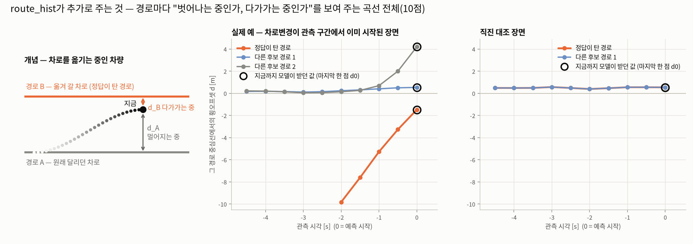

# Meeting(10/7)_yj — 추가

본문(`meeting_1007_yj.md`)에 합칠 내용입니다. 두 부분입니다.
- **A.** lane heading alignment loss (본문 1.4절의 설명을 보강한 것)
- **B.** route_hist — 경로별 관측 이력 입력 (새로 추가)

---

## A. lane heading alignment loss

각 mode가 **자기가 타는 경로의 방향대로** 달리도록, 예측 좌표의 방향을 경로 방향에 맞춰 주는 loss입니다.

### 왜 필요했나
- 1.1절의 coordinate penalty는 "급하게 꺾지 마라"는 **금지**만 말합니다. 어느 쪽으로 돌아야 하는지는 알려 주지 않습니다.
- 모델 내부에서는 방향을 "경로 접선 k + 경로 대비 각도 θ"로 만듭니다. 그런데 **최종 좌표에서 복원한 방향은 이 값과 다를 수 있고**, 이 차이가 위반의 큰 몫이었습니다. 이 loss는 그 차이를 직접 겨냥합니다.

### 작동 방식
1. mode마다 달릴 경로(candidate route, 지도의 차선에서 열거한 후보)가 정해져 있습니다.
2. 그 mode의 **예측 좌표에서 진행방향 ψ**를 구하고, 같은 위치의 **경로 접선 방향 k**와 비교합니다.
3. 차이가 **허용 오차 15° 안이면 벌점 0**, 넘으면 **넘은 만큼만** 벌점입니다(coordinate penalty와 같은 hinge 구성).
4. 승자 mode만이 아니라 **살아있는 모든 mode**에 겁니다. 선택되지 않는 mode는 거리 loss의 감독을 받지 못하기 때문입니다.
5. 제외하는 것: 경로에서 3 m 넘게 벗어난 구간(그 mode가 자기 경로 위에 있지 않음), 속력 1 m/s 미만 구간. 허용 오차의 2배를 넘는 극단값은 잘라서 셉니다.

**읽는 법**
- ①②는 개념도입니다. 회색 선이 그 mode의 경로, k가 경로의 방향, ψ가 예측 방향입니다. 파란 부채꼴이 허용 오차 ±15°입니다. ψ가 부채꼴 안에 있으면 벌점이 없고(①), 밖으로 나가면 **나간 만큼만** 벌점입니다(②).
- ③은 현재 기본 모델이 낸 실제 예측 하나입니다(우차선변경 장면, 확률 0.28인 mode). 막대는 step마다 ψ와 k의 차이이고, 파랑은 허용 오차 안쪽(벌점 없음), 빨강은 넘은 만큼(벌점)입니다. 이 mode는 쟀을 수 있는 56 step 중 5 step만 넘고, 나머지는 경로 방향을 잘 따릅니다.
- 이 예는 규칙으로 골랐습니다. 차로변경 장면에서 확률 0.05 이상인 mode 중 초과 step이 3~8개인 35개 가운데, 범위의 가운데(5개)인 것입니다.

### 허용 오차 15°는 어떻게 정했나
정답 라벨에서 정했습니다. 정답 주행도 차의 방향이 경로 접선과 조금씩 어긋나고(코너 컷팅, 차로 안 미세 조정, 차로변경), 정상 주행의 95%가 들어오는 값(p95)이 15°입니다. 이보다 작게 잡으면 정답에도 있는 움직임을 벌하게 됩니다.

### 문헌(Greer et al.)과 다른 점
원문은 KB에서 10/7에 본문을 확인했습니다.
- **따른 것**: 예측 좌표 두 점에서 방향을 만든다 / 허용 오차 안은 벌점 0 / 모든 mode에 건다.
- **바꾼 것**: 기준 방향(논문은 가장 가까운 차선, 우리는 그 mode가 타는 경로), 허용 오차(논문은 논리로 정한 45°, 우리는 정답 분포 p95인 15°), 벌점 형태(논문은 넘으면 각도 전체를 벌하고, 우리는 넘은 만큼만), 제외 구간(논문은 교차로 안 점, 우리는 경로에서 3 m 넘게 벗어난 구간).
- 논문은 nuScenes에서 이 loss가 정확도를 해치지 않았다고 보고합니다. 데이터가 달라 수치는 비교하지 않았습니다.

### 결과와 왜 되는가
- **결과**: 차로변경 전용 평가군(627건)에서 **처음으로 3 seeds 일관된 개선**이 나왔습니다(가중치 3.0, −0.069 m). 앞서 시도한 평활, band, 횡방향 보조 loss, neighborhood vehicle은 모두 검출 불가였습니다.
- **비용**: 전체 정확도 비용은 +0.017 m로 작습니다. 같은 폭으로 violation rate를 낮추려고 penalty 강도를 올리면 +0.083 m가 듭니다.
- **왜 되는가(해석)**: 차로변경 중인 mode는 목표 차로 route를 따라가므로, 그 방향에 정렬시키는 것이 오히려 돕습니다. 반대로 smoothness를 강하게 거는 쪽(coordinate penalty 3.0)은 횡방향 움직임까지 눌러서 차로변경과 U턴이 나빠졌습니다(U턴 +0.201 m, 3 seeds 일치). 사전에 걱정했던 "차로변경을 역방향으로 억제할 위험"은 나타나지 않았습니다.

### 한계
- **규모**: 차로변경 627건(2.51%)을 완전히 풀어도 전체 minADE6 개선 상한이 −0.015 m라서, 전체 지표로는 보이지 않습니다. 전용 평가군으로만 판정할 수 있습니다.
- **전체 정확도 비용(+0.017 m)의 seed 부호는 아직 확인하지 않았습니다.** 차로변경 쪽은 부호가 일치했습니다.
- hinge라서 허용 오차 안쪽(±15°)의 방향 오차는 줄이지 못합니다.

---

## B. route_hist — 경로별 관측 이력 입력

후보 경로마다 **"이 경로에 대해 지난 5초 동안 어떻게 움직였나"** 를 모델에 알려 주는 입력입니다.

### 왜 필요했나
- 차로변경이 풀리지 않는 원인 중 하나는 **관측할 수 없는 구간**입니다. 차로변경의 49%는 예측 구간에서 새로 시작해서 과거 5초에 단서가 없습니다. 이 부분은 입력으로 풀 수 없습니다.
- 나머지는 **관측 구간에서 이미 시작됐거나 진행 중**이라, 단서가 과거 궤적에 있습니다. 그런데 모델은 후보 경로마다 "지금 이 경로에서 얼마나 떨어져 있나(d0)" 한 점만 받고 있었습니다. **"그 경로로 다가가는 중인가, 벗어나는 중인가"** 는 경로와 연결된 값으로는 주어지지 않았습니다.

### 작동 방식
1. 후보 경로 각각에 대해, 관측 과거 5초를 **2 Hz로 10점** 뽑습니다.
2. 점마다 5개 값을 계산합니다: ① 그 경로 중심선에서의 횡오프셋 d ② 경로 위 진행 위치(지금 기준 상대값) ③④ 차의 방향과 경로 접선 사이 각도 θ의 sin, cos ⑤ 유효 여부(경로에서 10 m 이내인가).
3. 이 10 × 5 값을 **경로 encoder의 입력에 이어 붙입니다.** 그러면 경로 하나의 embedding이 "이 경로의 모양"과 "이 경로에 대한 최근 5초의 움직임"을 함께 담습니다. 다른 구조는 바꾸지 않았습니다.
4. 값이 전부 **경로에 대한 상대값**이라, 어떤 경로든 같은 방식으로 읽힙니다.

**읽는 법**
- 왼쪽은 개념도입니다. 차로를 옮기는 차량은 원래 차로(경로 A)에서는 **멀어지고**, 옮겨 갈 차로(경로 B)에는 **다가갑니다.**
- 가운데는 실제 장면입니다. 차로변경이 관측 구간에서 이미 시작된 scenario이고, 가로축은 관측 5초, 세로축은 각 후보 경로 중심선까지의 거리 d입니다. 정답이 탄 경로(주황)는 2초 전 약 10 m 밖에 있다가 지금 1.5 m까지 다가왔고, 원래 달리던 경로(회색)는 3초 동안 0 근처에 있다가 최근 1.5초에 멀어집니다.
- 검은 동그라미(◯)가 **지금까지 모델이 받던 값**, 마지막 한 점입니다. 이 한 점만으로는 "경로에서 1.5 m 떨어져 있다"만 알 수 있어서, 다가가는 중인지 그 자리에 있는 건지 구별할 수 없습니다. route_hist는 **곡선 전체**를 줍니다.
- 오른쪽은 직진 대조 장면입니다. 곡선이 평평해서 "변화 없음"이라는 정보가 됩니다.
- 두 장면은 규칙으로 골랐습니다. 왼쪽은 "관측 구간에서 이미 시작한 차로변경" 중 후보 경로가 2개 이상인 173건에서 관측 횡이동이 중앙값에 가장 가까운 것, 오른쪽은 차로변경이 아닌 직진 중 후보 경로가 2개 이상이고 시작 속력이 왼쪽과 가장 가까운 것입니다.

### 정말 신호가 있나 — 사전 측정
학습하기 전에, 이미 있는 예측 덤프로 먼저 확인했습니다.
- 관측 구간에서 이미 시작된 차로변경(180건)은 관측 5초 동안 경로에 대한 횡이동이 중앙 3.4 m였습니다. 대조군은 0.35 m입니다.
- 이것을 대조군과 구별하는 정도(AUC)는, 모델이 지금 받는 값(d0 한 점)으로는 0.62이고 관측 구간의 d 변화를 주면 0.84였습니다. 즉 새 정보는 "지금 얼마나 벗어났나"가 아니라 **"벗어나는 중인가"** 입니다.
- 예측 구간에서 새로 시작하는 차로변경(309건)은 관측 구간에 신호가 없었습니다(AUC 0.49). 이 입력으로 풀 수 없다는 뜻입니다.
- 한계: 이 측정은 정답으로 고른 경로를 기준으로 해서 다소 유리하게 잡힌 값입니다. 실제 입력은 후보 경로 6개 각각에 대해 계산하므로 크기는 이보다 작을 수 있습니다. 순서(관측 중 > 중간 > 새로 시작)는 바뀌지 않습니다.

### 어떻게 판정하나
효과가 있을 수 있는 scenario(관측 구간에서 시작했거나 진행 중인 차로변경)는 **val의 1.3%(318건)** 뿐입니다. 전체 minADE6로는 보이지 않으므로, **차로변경 전용 평가군(627건)과 시작 시점별 부분집합**에서 paired-seed 부호 일치로 판정합니다.

### 현재 상태
- **3 seeds 학습이 끝났습니다.** 전체 minADE6(best 기준)는 seed 0, 1이 기준 판보다 0.04~0.05 m 좋고, seed 2는 최적화가 끝까지 내려오지 못해 1.55에 머물렀습니다(에폭 곡선이 마지막까지 내려오는 중이었고, 발산이 아니라 학습이 못 따라간 쪽입니다). 부호가 갈려서 **전체 지표로는 판정할 수 없습니다.** 효과가 있을 모집단이 1.3%라 예상된 결과입니다.
- **차로변경 전용 평가군 채점은 아직 안 했습니다.** 다음 순서(중심선 평활 학습 이후)에 합니다. 이 결과가 나와야 효과를 말할 수 있습니다.

### 한계
- 예측 구간에서 새로 시작하는 차로변경(49%)과 U턴은 이 입력으로 풀 수 없습니다. U턴은 관측 구간의 신호도 약했습니다.
- 효과를 판정할 모집단이 작아서, seed 변동이 효과보다 클 수 있습니다. 부분집합에서도 3 seeds 부호가 일치할 때만 효과로 봅니다.
