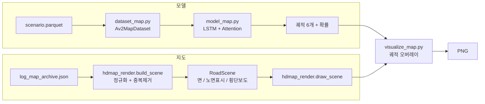

# v3 예측 시각화 — HD map을 '도로처럼' 그리기

작업일: 2026-08-20 · 위치: `Argoverse2study/src/` · 산출물: `prediction_map_{avg,hard,single}.png`

---

## 1. 목적

v3(K=6 + HD map + Attention)의 예측 결과를 **지도 위에서 판단할 수 있게** 만드는 것.

기존 `visualize_map.py`도 지도를 그리긴 했지만, 그림만 보고는
"이 예측이 차로를 따라간 건지, 역주행인지, 교차로에서 회전을 놓친 건지"를 구분할 수 없었다.
숫자(minADE/minFDE)로는 **얼마나 틀렸는지**만 알 수 있고 **왜 틀렸는지**는 안 보이기 때문에,
도로가 도로로 보이는 그림이 필요했다.

기준은 이미 만들어 둔 [focal 추종 애니메이션](../animation/docs/focal_animation_report.md)의
렌더링 규칙이다. 그 화면은 도로·차선·램프가 한눈에 읽히므로, **같은 규칙을 AV2 HD map에 옮기는 것**을 목표로 잡았다.

## 2. 문제 — 이전 그림이 안 읽혔던 이유

| # | 원인 | 화면에서 나타나는 증상 |
| --- | --- | --- |
| 1 | 차선 조각마다 폴리곤을 그리고 **테두리(edgecolor)를 넣음** | 조각 이음매 · 차로 구분선 · 도로 바깥 경계가 **전부 같은 회색 선**이 됨. 도로가 '격자무늬 조각보'로 보임 |
| 2 | 노면표시를 **전혀 안 그림** | 중앙선/차로선 구분이 없어 진행 방향과 차로 수를 알 수 없음 |
| 3 | city 절대좌표로 그림 | 9칸이 전부 제각각 방향(북쪽 기준). 칸끼리 비교가 안 됨 |
| 4 | 밝은 회색 배경 + 검정 과거궤적 | 도로와 궤적의 대비가 약해 궤적이 묻힘 |

핵심은 1번이다. **면(도로)과 선(노면표시)이 같은 색·같은 굵기로 섞여 있었다.**
실제 도로에서 우리가 도로를 읽는 방식은 "회색 면 위에 흰/노란 선"인데, 그 구조가 없었다.

> 조각이 많다는 게 문제가 아니다. AV2의 차선은 짧은 lane segment로 잘려 있어
> **한 장면 평균 68조각**(최소 18 / 최대 173)인데, 조각마다 테두리를 그리면 68개의 가짜 경계선이 생긴다.

## 3. 해결 방향

애니메이션 렌더러(`animate_focal.py`)의 규칙 세 가지를 그대로 가져왔다.

1. **면은 테두리 없이** 한 색으로 깔아 조각들이 하나의 아스팔트로 이어지게 한다
2. **선은 실제 노면표시만** 그린다 (점선/실선, 흰색/노란색)
3. 카메라는 **focal 기준으로 정렬**한다 (focal 중앙, 진행방향이 화면 오른쪽)



렌더러를 `visualize_map.py` 안에 두지 않고 **`hdmap_render.py`로 분리**했다.
나중에 AV2 쪽에도 애니메이션을 붙이거나 `explore_map.py`를 같은 그림체로 바꿀 때 재사용하기 위함이다.

## 4. 구현

### 4.1 파일 구성

| 파일 | 줄 수 | 상태 | 역할 |
| --- | --- | --- | --- |
| `src/hdmap_render.py` | 241 | **신규** | AV2 HD map → 도로 그림. 색 팔레트, 면/노면표시/횡단보도, 차량 박스, 축척 막대 |
| `src/visualize_map.py` | 184 | 재작성 | v3 추론 + 궤적 오버레이 + 3×3 그리드 / 단일 그림, CLI |

### 4.2 면과 선을 분리 (zorder)

| zorder | 요소 | 색 | 테두리 |
| --- | --- | --- | --- |
| 1 | drivable area (갓길 포함 주행가능영역) | `#2b2d32` | 연석 `#4a4d55` (여기만 테두리 있음) |
| 2 | 차로 폴리곤 (`left_lane_boundary` + `right_lane_boundary` 역순) | 일반 `#34363c` / 교차로 `#3b3d44` / 자전거 `#31403b` | **없음** |
| 3 | 횡단보도 얼룩말 무늬 | `#b9bcc4` (alpha 0.5) | 없음 |
| 4 | 노면표시 | 흰 `#d8d8d0` / 노랑 `#e0c85a` / 파랑 `#5aa9e0` | — |
| 5~9 | 예측 6개 → 과거 → 정답 → best → focal 박스 | — | — |

**근거**: 조각의 테두리를 없애면 인접 조각의 면이 맞닿아 시각적으로 하나의 도로가 된다.
바깥 윤곽선이 필요한 곳은 "도로의 끝"인 drivable area뿐이므로 거기만 연석 색 테두리를 남겼다.
교차로 차로를 한 톤 밝게 해서 **교차로 영역이 저절로 드러나게** 했다.

### 4.3 노면표시는 HD map에 이미 들어 있다

AV2의 `LaneSegment`는 좌·우 경계마다 `left_mark_type` / `right_mark_type`을 갖고 있다.
이걸 그대로 스타일로 매핑했다.

| mark_type | 그리는 방법 | val 100장면 비율 |
| --- | --- | --- |
| `NONE` | **안 그림** (실제로 도색이 없는 구간 — 주로 교차로 안) | 51.9% |
| `DASHED_WHITE` | 흰 점선 | 18.4% |
| `SOLID_WHITE` | 흰 실선 | 16.1% |
| `DOUBLE_SOLID_YELLOW` | 노란 실선 2줄 (±0.18 m) | 9.2% |
| `DASH_SOLID_*` / `SOLID_DASH_*` | 점선 1줄 + 실선 1줄 | 2.1% |
| `SOLID_YELLOW` / `DASHED_YELLOW` | 노란 실선 / 점선 | 1.9% |
| `DOUBLE_DASH_*` / `DOUBLE_SOLID_WHITE` | 2줄 | 0.3% |

`NONE`을 회색 선으로라도 그리면 다시 조각보가 된다. **안 그리는 것이 정답**이고,
그 결과 교차로 안이 표시 없는 넓은 면으로 남아 실제 도로와 같아진다.

### 4.4 점선은 미터 단위로 자름

matplotlib의 `ls="--"`는 dash 길이가 **point(화면) 단위**라, 확대/축소하면 점선 간격이 달라지고
칸마다 축척이 다른 3×3 그리드에서는 같은 도로가 다르게 보인다.

→ 폴리라인을 **데이터 좌표(m)에서** 3 m 실선 / 9 m 공백(미국 기준)으로 잘라 여러 개의 실선 조각으로 그린다.

```python
def _dashes(poly, dash=3.0, gap=9.0):
    s = _cumdist(poly)          # 누적거리
    a, out = 0.0, []
    while a < s[-1]:
        b = min(a + dash, s[-1])
        out.append(_sample(poly, s, np.linspace(a, b, ...)))  # 곡선 유지
        a += dash + gap
    return out
```

축척·dpi·figsize가 바뀌어도 점선 하나는 항상 실제 3 m다. (애니메이션에서는 `pt_per_m`으로
환산해 해결했지만, 그건 축척이 화면 전체에 하나뿐일 때만 쓸 수 있는 방법이다.)

### 4.5 공유 경계선 중복 제거

인접한 두 차로는 **같은 물리적 선**을 각자 자기 경계로 갖고 있다.
그대로 그리면 같은 선을 두 번 그리게 되고, 점선이 두 번 겹치면서 위상이 어긋나 지저분해진다.

→ 좌표를 0.01 m로 반올림한 폴리라인을 키로 만들고(뒤집힌 순서도 같은 키로 취급) 한 번만 그린다.

| 단계 | 선 개수 (val 100장면) |
| --- | --- |
| 경계선 후보 (조각 × 2) | 13,616 |
| `NONE` 제외 | 6,548 |
| 공유 경계 중복 제거 후 **실제로 그리는 선** | **3,935** (후보의 29%) |

즉 표시가 있는 경계선의 **40%가 옆 차로와 공유하는 중복**이었다.

### 4.6 이중선 · 횡단보도

- **이중선**: 폴리라인의 접선을 `np.gradient`로 구하고 법선 방향으로 ±0.18 m 평행이동해 2줄을 그린다.
- **횡단보도**: `PedestrianCrossing`은 마주보는 두 edge로 주어진다. 두 edge를 같은 파라미터 t로
  훑으면서 한 칸 건너 하나씩 사각형을 채우면 얼룩말 무늬가 된다 (장면당 평균 4.2개).

### 4.7 focal 정규화 좌표로 그림

이전에는 정규화 좌표를 **다시 city 좌표로 되돌려** 그렸다. 이번에는 되돌리지 않는다.

- focal은 항상 원점, 진행방향은 항상 +x → **9칸이 전부 같은 방향**으로 정렬된다
- 애니메이션의 "도로 정렬 카메라"와 같은 규칙이 된다
- 모델이 실제로 보는 좌표계와 그림의 좌표계가 일치한다 (디버깅 시 좌표를 그대로 대조 가능)

지도도 궤적과 **똑같은 정규화**(원점 이동 + heading 회전)를 적용하므로 관계는 그대로 보존된다.

### 4.8 궤적 가독성

| 요소 | 색 | 처리 |
| --- | --- | --- |
| 과거 5초 | `#c9ccd2` | 어두운 외곽선(path effect) |
| 정답 미래 6초 | `#4da3ff` | 어두운 외곽선 |
| 예측 6개 | `#ff5c33` 점선 | **확률에 비례한 alpha** (0.35~0.9) |
| best of 6 | `#5ce08a` 점선 | 어두운 외곽선 |
| focal | `#ff5c33` 박스 | 실제 크기 4.8 × 2.0 m |

과거 궤적(밝은 회색)이 흰색 차선 표시와 색이 비슷해서 섞이는 문제가 있었다.
→ `matplotlib.patheffects.Stroke`로 궤적 밑에 어두운 테두리를 깔아 어떤 배경 위에서도 분리되게 했다.

focal 박스를 실제 크기로 그린 것과 **축척 막대**(시야에 맞춰 10/20/50/100 m 자동 선택)를 넣은 것도
"이 오차 2 m가 얼마나 큰가"를 눈으로 가늠하기 위한 것이다.

### 4.9 시야

궤적 전체(과거+정답+예측 6개)의 bounding box에 20% 여유를 준 뒤, **축의 가로/세로 비율에 맞춰** 확장한다.
정사각형으로 잡으면 도로가 가로로 긴 장면에서 위아래가 전부 검은 여백이 된다.
`draw_case(..., aspect=w/h)`로 그리드(1:1)와 단일 그림(15:8.5)이 각각 자기 비율을 쓴다.

## 5. 결과

| 항목 | 값 |
| --- | --- |
| val pool 300 기준 | minADE6 **1.45 m** / minFDE6 **2.96 m** |
| 그림 2장(hard 9칸 + avg 9칸) 생성 시간 | 16 s (추론 + 지도 로드 + 렌더 포함) |
| `build_scene` 비용 | 5 ms/장면 |

> 인수인계 표의 v3 성능(1.32 / 2.95)은 val 2000 기준이고, 위 값은 시각화용 300개 표본 기준이라 조금 다르다.

**그림에서 새로 보이게 된 것**

- hard 9칸(FDE 11~35 m)의 실패가 거의 전부 **교차로 좌/우회전**이다.
  정답은 파란 곡선으로 꺾여 나가는데 예측 6개는 직진 방향으로만 퍼진다.
  → 회전 의도를 만들어내는 정보(차선 연결관계 `successors`)가 모델에 없다는 게 그림으로 확인된다.
- avg 9칸은 대부분 직진이고, 예측 6개가 차로 폭 안에 모여 있다.
- 교차로 안은 노면표시가 없는 넓은 면으로 그려져서, **어디가 교차로인지**가 색만으로 구분된다.

## 6. 검증한 것 / 못한 것

**검증한 것**

- val 300개로 hard/avg 그리드와 단일 그림을 실제로 렌더링해서 확인함
- 이전 작업의 미확인 항목이었던 **"긴 궤적에서 도로가 끊기는 문제"** — 장면의 모든 조각을 그리므로 끊김 없음을 확인함
- 렌더 결과 픽셀 색을 직접 샘플링해 면 색이 의도한 팔레트대로 나오는지 확인함 (배경 `#16171b`, 차로 `#34363c`, 교차로 `#3b3d44`)
- mark_type 분포·중복 제거 효과를 val 100장면 통계로 확인함

**검증하지 못한 것**

- `SOLID_BLUE` 등 희귀 표시 타입은 표본에 없어 실제로 그려진 걸 못 봄
- `explore_map.py`는 아직 예전 그림체 그대로 (같은 렌더러로 통일 가능하나 미적용)
- 3차원 높이(고가/지하차도)는 무시하고 xy 평면에 투영함 — 겹치는 도로는 겹쳐 보임

## 7. 사용법

```bash
conda activate av2
cd ~/Argoverse2study

python src/visualize_map.py                    # hard 9칸 + avg 9칸
python src/visualize_map.py --pool 500         # 후보 시나리오 수
python src/visualize_map.py --single 20        # FDE 21등 하나만 크게
python src/visualize_map.py --split val --ckpt lstm_map.pth
```

| 옵션 | 기본값 | 설명 |
| --- | --- | --- |
| `--pool` | 300 | 추론·정렬에 쓸 시나리오 수 |
| `--single N` | 없음 | FDE 오름차순 N등 하나만 큰 그림으로 (0 = 가장 정확) |
| `--split` | val | train / val / test |
| `--ckpt` | `lstm_map.pth` | 가중치 경로 |

## 8. 다음에 할 것

- [ ] `src/hdmap_render.py` 포함 v3 파일들 **git 커밋 & push** (아직 untracked)
- [ ] **차선 방향 벡터 추가** — `lanes (20,10,2) → (20,10,4)` `[x,y,dx,dy]`, 역주행 예측 방지.
      새 그림에서 역주행 여부를 눈으로 검증할 수 있게 됨
- [ ] 모델이 실제로 본 **근처 차선 20개만 강조 표시**하는 옵션 → attention이 엉뚱한 차선을 보는지 확인
- [ ] `explore_map.py`도 같은 렌더러로 통일
- [ ] 교차로 회전 실패 대응 — 조각 연결정보(`successors`/`predecessors`)를 모델 입력에 추가
