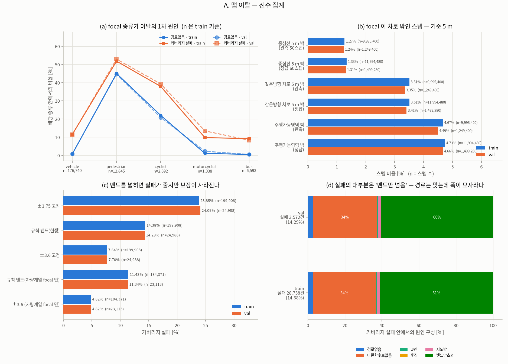
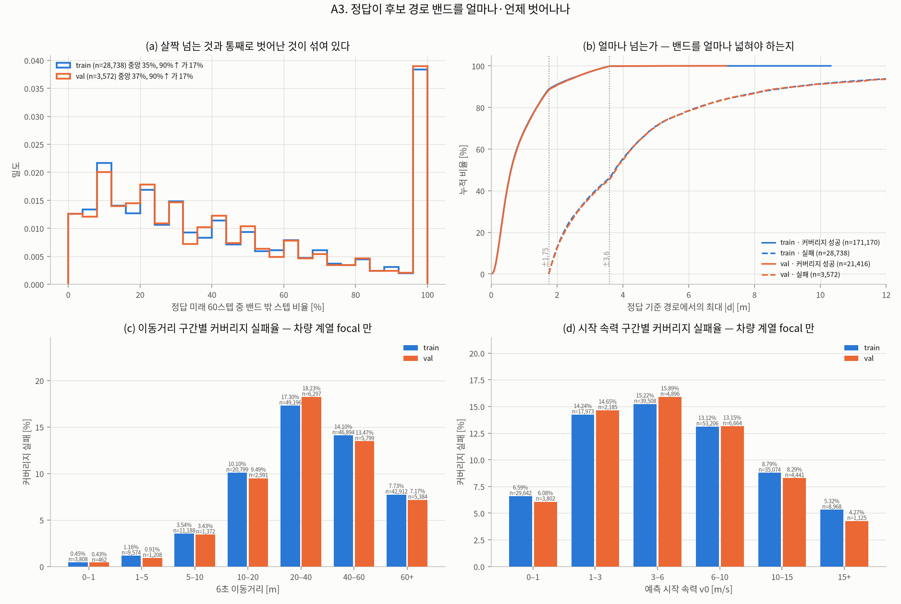
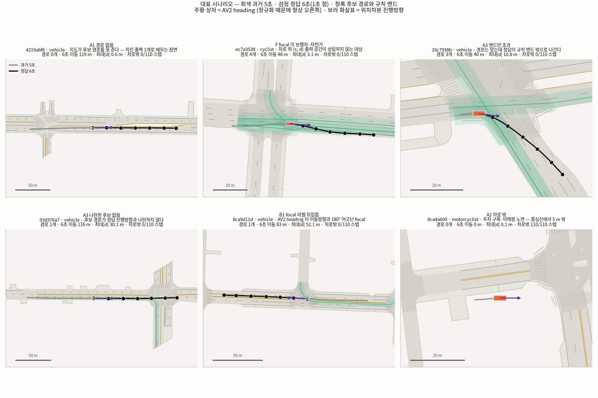
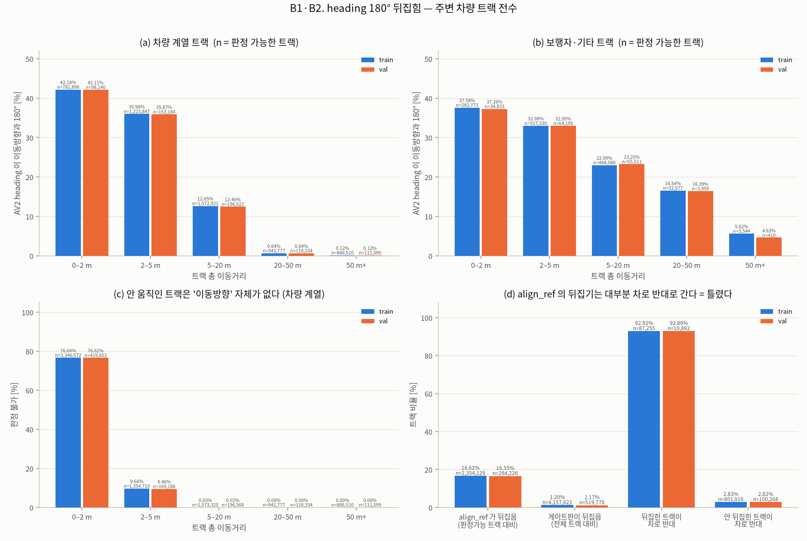
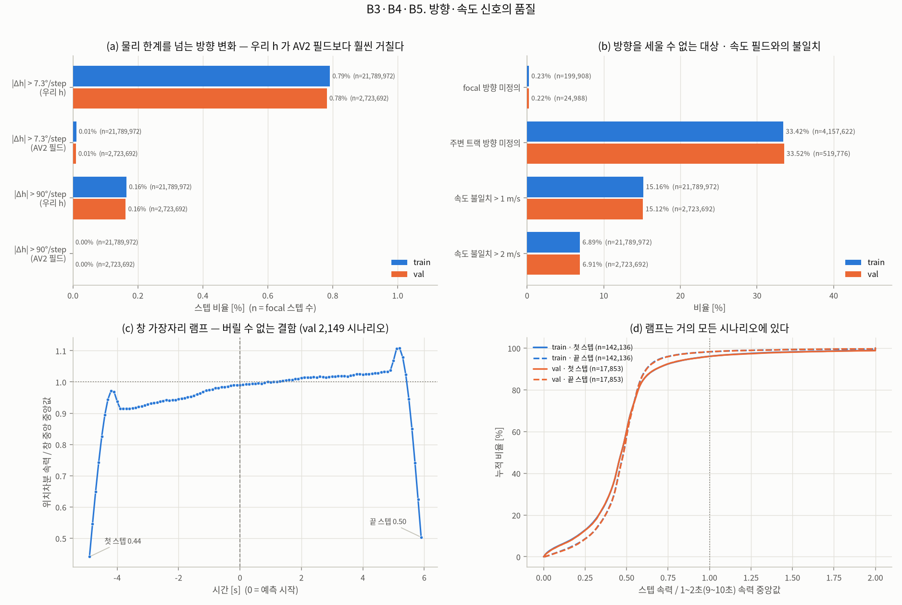
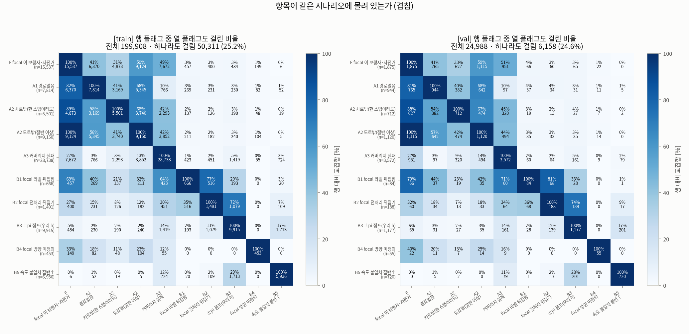
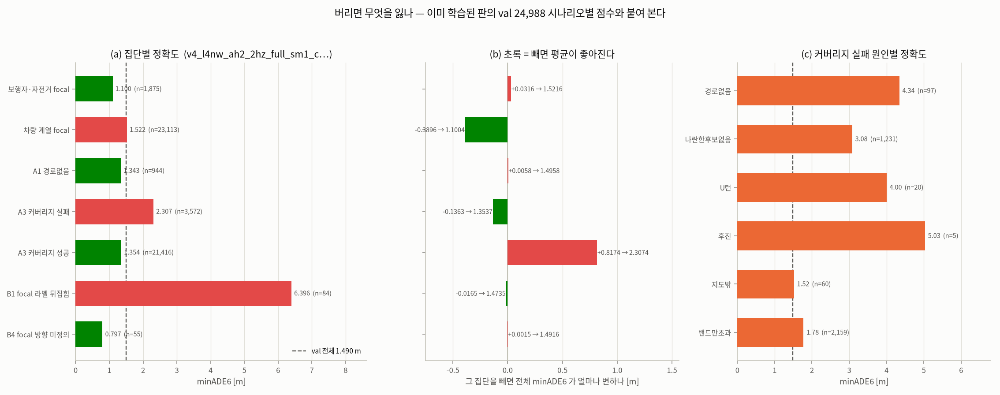
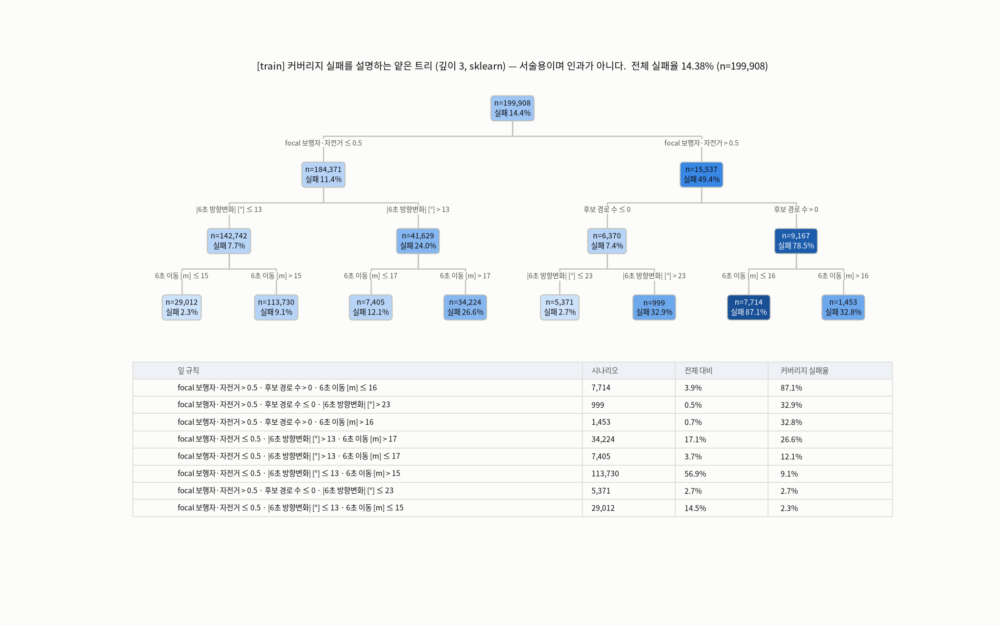
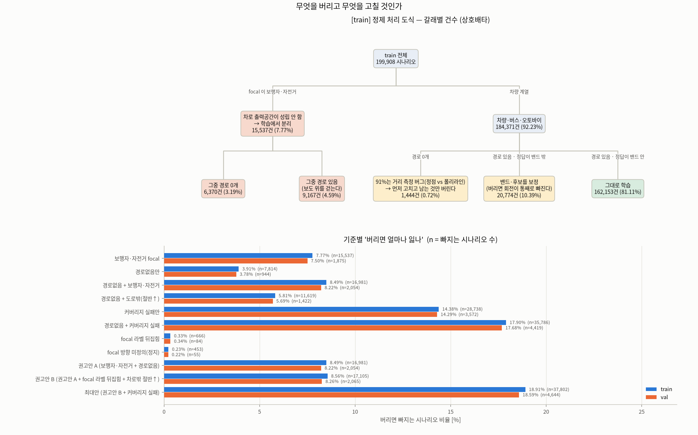
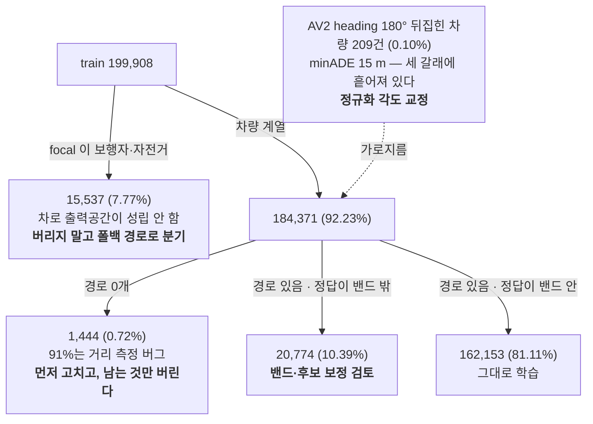

# v4 데이터 정제 조사 — 맵 이탈·heading 오기입은 몇 건인가 (train + val 전수)

**질문**: 버릴지 보정할지는 **양**이 정한다. 그래서 먼저 셌다. 표본이 아니라 **train 199,908 + val 24,988 전수**(224,896 시나리오, 실패 0건)다.

**답 세 줄**

1. **맵 이탈의 주범은 지도가 아니라 대상이다.** focal 이 보행자·자전거인 7.77%(train 15,537건)가 '경로 없음'의 **81.5%**, '도로 밖'의 **99.7%** 를 만든다. 차량 계열 focal 만 보면 경로 없음은 3.91% → **0.78%**, 도로 밖은 4.58% → **0.014%**(184,371건 중 26건)로 내려간다.
2. **버릴 것은 거의 없다. 고칠 것이 있다.** 커버리지 실패 14.38%는 회전·차선변경이라 버리면 그 행동이 통째로 빠진다. 반면 **focal 의 AV2 heading 이 180° 뒤집힌 차량 209건(train 0.10%)은 minADE6 이 15.07 m**(전체 1.49 m)로 재앙인데, 정규화 각도 한 줄만 고치면 된다.
   그리고 **차량인데 경로가 0개인 179건(val)의 91.1%는 지도 탓이 아니다** — 같은 방향 차로 폴리라인까지 거리가 중앙 **0.49 m** 인데, `candidate_lanes` 가 중심선 **정점**까지의 거리를 재기 때문에(정점 간격이 10~15 m) 반경 5 m 밖으로 판정된다. 점-선분 거리로 바꾸면 사라지는 문제다.
3. **주변 차량 heading 의 뒤집기 교정(`align_ref`)은 지금 틀리게 동작한다.** 판정 가능한 트랙의 16.6%를 뒤집는데 그중 **92.9%가 차로와 반대 방향**이 된다(안 뒤집은 트랙은 2.8%). 이미 있는 게이트판(`align_ref_gated`)으로 바꾸면 뒤집는 트랙이 전체의 1.2%로 줄어든다.

만든 것: `src/cleanse_census.py`(전수 집계) · `src/viz_cleanse_report.py`(표·요약) · `src/viz_cleanse_figs.py`(그림)
숫자: `viz/v4/cleanse/data/summary.json` · `census_{train,val}.npz` · `ids_{train,val}.json`(플래그별 시나리오 ID)

---

## 1. 정의 — 무엇을 어떤 기준으로 셌나

모든 임계값은 이미 코드에 있는 상수를 그대로 썼다(새로 정하지 않았다).

| 코드 | 항목 | 판정식 | 모집단 |
|---|---|---|---|
| **A1** | 경로 없음 | `dataset_lane` 과 같은 절차(`candidate_lanes`(AV2 heading 방향 필터) → `reachable` → `build_routes(v0)`)로 후보가 0개 | 시나리오 |
| **A2** | 차로 밖 | focal 위치가 **밀집화(0.5 m) 중심선 점**에서 5 m 초과 (`CAND_RADIUS_M` = `MAX_LAT_M` = 5) | 스텝 / 시나리오 |
| | 같은방향 차로 밖 | 위와 같되 접선이 진행방향과 90° 안쪽인 점만 (`heading_decomp.decompose` 와 동일) | 스텝 |
| | 도로 밖 | 지도 `drivable_areas` 폴리곤 **어디에도** 안 들어감 | 스텝 / 시나리오 |
| **A3** | 커버리지 실패 | 중복 제거된 ≤6개 후보 슬롯 중 **어느 것도** 정답 6초를 규칙 밴드(`rule_band`: ±1.75, 차선변경 허용쪽·교차로 ±3.6)로 못 덮음. 경로가 0개면 폴백 직진(±3.6)으로 판정 | 시나리오 |
| **A4** | 실패 원인 | 상호배타·우선순위: 경로없음 → U턴(\|Δh6\|>135°) → 후진(진행방향 성분<0 & 이동>2 m) → 지도밖(미래 절반이 차로밖) → 나란한후보없음(모든 슬롯 max\|θ\|≥30°) → 밴드만초과 | 실패 시나리오 |
| **B1** | AV2 라벨 뒤집힘 | 트랙 안에서 `median\|wrap(h_AV2 − h_위치차분)\| > 90°`. 위치차분이 1 m/s 를 넘긴 스텝이 5개 이상일 때만 판정 | 트랙 |
| **B2** | 전처리가 뒤집음 | `build_heading` 안에서 `align_ref` 가 관측 50스텝의 AV2 heading 을 뒤집는가 | 트랙 |
| | 차로 반대 | 방향 무시 최근접 중심선 점의 접선과 `\|wrap(h − k)\| > 90°`. 보조(AV2)로 메운 스텝만 본다 | 스텝 / 트랙 |
| **B3** | 방향 점프 | 스텝간 \|Δh\| > **7.3°**(정상값 p99.99) / > 90°(사실상 ±π) | 스텝 |
| **B4** | 방향 미정의 | 트랙 내내 위치차분이 `V_MIN`(1 m/s)을 못 넘음 | 트랙 |
| **B5** | 속도 불일치 | \|위치차분 속력 − AV2 속도 필드\| > 1 m/s | 스텝 |
| **F** | focal 종류 | parquet `object_type` 이 pedestrian / cyclist / riderless_bicycle | 시나리오 |

---

## 2. 항목별 건수·비율 (전수)


| 항목 | train n | train % | val n | val % | 버리면 잃는 것 | 보정 비용·위험 |
|---|--:|--:|--:|--:|---|---|
| A1 경로 없음 | 7,814 | 3.91% | 944 | 3.78% | 대부분 보행자. 차량은 1,444건(전체의 0.72%)뿐 | 폴백 직진 유지가 이미 보정. 기하 다양성 0 |
| A2 차로밖(1스텝↑) | 5,501 | 2.75% | 712 | 2.85% | 거의 전부 보행자 | 없음(차량은 사실상 0) |
| A2 차로밖(절반↑) | 2,203 | 1.10% | 250 | 1.00% | 〃 | 〃 |
| A2 도로밖(절반↑) | 9,150 | 4.58% | 1,120 | 4.48% | 〃 (train 차량 26건) | 〃 |
| **A3 커버리지 실패** | **28,738** | **14.38%** | 3,572 | 14.29% | **회전·차선변경이 통째로 빠진다** | 밴드 ±3.6 면 7.64%로 반감 — 대신 역주행·도로이탈 보장 상실 |
| A3 밴드이탈 심함(25%↑ 스텝) | 17,931 | 8.97% | 2,228 | 8.92% | 〃 | 〃 |
| B1 focal 라벨 뒤집힘 | 666 | 0.33% | 84 | 0.34% | 0.33% — 사실상 없음 | **정규화 각도만 뒤집으면 끝** (아래 7절) |
| B2 focal 전처리 뒤집기 | 1,491 | 0.75% | 188 | 0.75% | — | 게이트판으로 0.20%까지 내려감 |
| B2 주변 전처리 뒤집기 ≥1대 | 137,808 | 68.94% | 17,125 | 68.53% | **버릴 수 없다**(2/3) | 코드 교체(게이트판). 위험: 진짜 뒤집힘을 놓침 |
| B3 ±π 점프(우리 h) | 9,915 | 4.96% | 1,177 | 4.71% | 5% | 평활판(ah3)이 이미 겨냥 |
| B3 ±π 점프(AV2 필드) | **1** | 0.00% | 0 | 0.00% | — | AV2 필드 자체는 깨끗하다 |
| B4 focal 방향 미정의(정지) | 453 | 0.23% | 55 | 0.23% | 정지 시나리오 | 정의상 보정 불가 |
| B5 속도 불일치 절반↑ | 5,936 | 2.97% | 720 | 2.88% | 3% | 창 가장자리 램프가 4%p — 보정 불가 |
| **F focal 이 보행자·자전거** | **15,537** | **7.77%** | 1,875 | 7.50% | **평가 모집단에 들어 있다** | 폴백 경로로 다루는 별도 처리 |

**train 과 val 은 모든 항목에서 0.3%p 안쪽으로 일치한다**(가장 큰 차이가 B3 ±π 점프 0.25%p, 보행자 비율 0.27%p). 분포 차이는 없다 — 한쪽에서 정한 기준을 다른 쪽에 그대로 쓸 수 있다.

스텝 단위 (train / val):

| 항목 | train | val |
|---|--:|--:|
| 중심선 5 m 밖 (관측 / 정답) | 1.27% / 1.33% | 1.24% / 1.31% |
| 같은방향 차로 5 m 밖 (관측 / 정답) | 3.51% / 3.51% | 3.35% / 3.41% |
| 주행가능영역 밖 (관측 / 정답) | 4.67% / 4.73% | 4.49% / 4.66% |
| \|Δh\| > 7.3°/step — 우리 h / AV2 필드 | 0.79% / 0.01% | 0.78% / 0.01% |
| \|Δh\| > 90°/step — 우리 h / AV2 필드 | 0.16% / 0.00% | 0.16% / 0.00% |
| 속도 불일치 > 1 m/s | 15.16% | 15.12% |
| 차로 반대 — 우리 h / AV2 필드 | 6.34% / 6.13% | 6.20% / 6.00% |

---

## 3. A. 맵 이탈 — 원인은 지도가 아니라 대상이다



| focal 종류 | train n | 전체 대비 | 경로 없음 | 커버리지 실패 | 차로밖 스텝 | 6초 이동 중앙 |
|---|--:|--:|--:|--:|--:|--:|
| vehicle | 176,740 | 88.41% | 0.79% | 11.52% | 0.05% | 39.3 m |
| bus | 6,593 | 3.30% | 0.50% | 9.22% | 0.02% | 35.9 m |
| motorcyclist | 1,038 | 0.52% | 1.06% | 9.73% | 0.08% | 32.8 m |
| **pedestrian** | **12,845** | **6.42%** | **44.99%** | **51.79%** | **18.03%** | 7.7 m |
| **cyclist** | **2,692** | **1.35%** | **21.95%** | **37.89%** | **7.57%** | 17.2 m |

- '도로 밖(절반 이상)' val 1,120건의 구성: 보행자 1,036 · 자전거 79 · 오토바이 4 · **차량 1**. `drivable_areas` 폴리곤 판정이 이상한 게 아니라(표본 지도 두 장에서 차로 중심선 점의 97.4% / 97.9%가 폴리곤 안) **보도 위를 걷는 보행자**를 잡은 것이다. 실제로 `016571a9` 의 focal 은 폴리곤 경계에서 2.6 m 밖, 가장 가까운 중심선에서 4.2 m 인 **보행자**였다.
- **차량인데 경로가 0개인 179건(val)을 하나씩 열어 봤다.** 그중 **163건(91.1%)** 은 같은 방향 차로의 **폴리라인**까지 거리가 5 m 이내(중앙 **0.49 m**, p90 3.97 m)다. 왜 후보가 0개인가: `lane_graph.candidate_lanes` 가 `np.linalg.norm(ln.centerline − xy)` 로 **중심선 정점**까지만 잰다. 중심선은 10점이라 직선 차로에서는 정점 간격이 10~15 m 이고, 차로 한가운데 서 있어도 가장 가까운 **정점**은 5 m 밖일 수 있다. 대표 사례 `4219abf6`: 폴리라인까지 **0.32 m**, 정점까지 **5.66 m** → 후보 0개 → 폴백 직진. 반경을 10 m 로 늘리면 후보 4개가 나온다. **점-선분 거리로 바꾸는 것이 옳은 수정**이다(반경을 키우면 엉뚱한 차로가 같이 들어온다).
- **A3 커버리지 실패의 원인 구성** (train 28,738건): 밴드만초과 61.2% · 나란한후보없음 34.0% · 경로없음 2.7% · 지도밖 1.4% · U턴 0.6% · 후진 0.15%. 즉 "지도가 길을 못 준다"가 아니라 **"길은 맞는데 정답이 차로 폭을 넘는다"** 가 대부분이다.
- 밴드 폭을 바꾸면 (train): ±1.75 고정 23.85% → **규칙 밴드 14.38%** → ±3.6 고정 7.64%. 차량 계열 focal 만 보면 11.43% → 4.82%.



실패해도 통째로 벗어나는 건 아니다 — 밴드 밖 스텝 비율의 중앙은 35%(train), 90% 넘게 벗어나는 건 실패의 17%다. 최대 \|d\| 중앙은 차량 계열 실패 기준 3.17 m(val, p90 10.5 m)로 **±3.6 바로 아래**다. 차량 계열에서 실패율이 가장 높은 구간은 6초 이동 20–40 m(17.3%)와 시작 속력 3–6 m/s(15.2%) — **교차로 회전 속도대**다.



| 상황 | 수치 (val) | 해석 | 대표 시나리오 |
|---|---|---|---|
| 경로 0개 · 차량 | 179건 (차량 계열 focal 의 0.77%) | **91.1%는 지도 탓이 아니다** — 중심선 정점까지의 거리로 재서 반경 밖이 된다 | `4219abf6` vehicle, 폴리라인 0.32 m / 정점 5.66 m |
| focal 이 보행자·자전거 | 1,875건 (7.50%) | 차로 위 (s, d) 가 성립하지 않는 대상. 도로 옆을 따라간다 | `ec7a3538` cyclist, 경로 6개인데 커버리지 실패 |
| 밴드만 초과 | 2,159건 (실패의 60%) | 경로는 맞고 폭이 모자라다. 교차로 회전에서 코너를 크게 돈다 | `33c7938b` vehicle, 최대 \|d\| 10.8 m |
| 나란한 후보 없음 | 1,231건 (실패의 34%) | 후보 경로가 정답 진행방향과 나란하지 않다 | `93d376a7` vehicle, 최대 \|d\| 30.1 m |
| focal 라벨 뒤집힘 | 84건 (0.34%), 차량 계열 18건은 minADE 15 m | 프레임과 후보 차로가 통째로 반대쪽으로 간다 | `8ca9d11d` vehicle, 최대 \|d\| 52.1 m |
| 차로 밖(주차 구획) | 250건 (1.00%) — 차량 0건, 오토바이 1·자전거 19·보행자 230 | 정지한 이륜차가 주차 구획에 있다. 6초 이동 0.3 m | `8ca4a609` motorcyclist, 110/110 스텝 차로 밖 |

---

## 4. B. heading 오기입



**B1 — AV2 heading 이 이동방향과 180°** (train 트랙 전수, 차량 계열 8,102,894 트랙)

| 트랙 총 이동거리 | 판정가능 | 뒤집힘 % | 판정불가 % |
|---|--:|--:|--:|
| 0–2 m | 781,898 | 42.18% | 76.6% |
| 2–5 m | 1,223,847 | 35.99% | 9.7% |
| 5–20 m | 1,572,921 | 12.66% | 0.03% |
| 20–50 m | 941,777 | 0.64% | 0.00% |
| 50 m+ | 886,510 | 0.12% | 0.00% |
| 합계 | 5,406,953 | 18.06% | 33.27% |

**실제로 움직인 차량의 라벨은 멀쩡하다**(20 m 이상 0.64%). 크게 나오는 수치는 비교 기준인 '이동방향'을 못 세우는 저속 트랙이다 — 그래서 "라벨이 몇 % 틀렸다"는 말 자체가 그 구간에서는 성립하지 않는다.

**B2 — 우리 전처리(`align_ref`)가 뒤집는 것** (train, 입력 후보 주변 트랙 4,157,622)

| 항목 | train | val |
|---|--:|--:|
| 판정 가능한 트랙 | 2,354,129 | 294,226 |
| `align_ref` 가 뒤집음 (판정가능 대비) | 391,283 = **16.62%** | 48,696 = 16.55% |
| 게이트판(`align_ref_gated`)이 뒤집음 (전체 대비) | 50,027 = **1.20%** | 6,102 = 1.17% |
| **뒤집힌 트랙이 차로 반대 방향** | **92.92%** (n=87,255) | 92.89% (n=10,892) |
| 안 뒤집힌 트랙이 차로 반대 방향 | 2.83% | 2.82% |

92.9% 대 2.8% — 이 두 숫자의 차이가 **`align_ref` 의 뒤집기가 대체로 틀렸다**는 근거다. 정지 차량의 위치 잡음이 만든 '이동방향'으로 동전 던지기를 하고 있다. (최근접 차로가 대향차로일 수 있어 '차로 반대'에는 오판이 섞이는데, 그 오판율의 상한이 안 뒤집힌 쪽의 2.8%다.)



**B3 — 물리 한계를 넘는 방향 변화**: 우리 h 는 7.3°/step 초과가 0.79%, 90° 초과가 0.16%. **AV2 heading 필드는 0.01% / 0.00%**(train 20만 시나리오에서 ±π 점프가 **1건**). 즉 이 거칠기는 라벨 오류가 아니라 **우리가 위치차분으로 방향을 만들면서 들여온 것**이다.

**B4 — 방향 미정의**: focal 0.23%, 주변 입력 후보 트랙 **33.42%**. 1/3은 주차·정지 차량이라 위치차분으로 방향을 세울 수 없다.

**B5 — 속도 불일치**: 15.16%의 스텝이 1 m/s 이상 어긋난다. 이 중 약 4%p 는 창 가장자리 램프다(양 끝 5스텝을 빼면 15.2% → 11.0%, val 2,000 재측정). 중앙값 어긋남은 0.24 m/s 로 작고, 꼬리 현상이다.

---

## 5. 겹침 — 같은 시나리오에 몰려 있나



train 기준, 대표 플래그 중 **하나라도 걸리는 시나리오는 50,311건(25.17%)**.

| 행 플래그 | n | 겹침 (행 대비) |
|---|--:|---|
| A1 경로없음 | 7,814 | 보행자·자전거 **81.5%** · 도로밖 68.4% · 커버리지실패 9.8% |
| A3 커버리지 실패 | 28,738 | 보행자·자전거 26.7% · 도로밖 13.4% · ±π 점프 4.9% · focal 뒤집힘 1.5% |
| B1 focal 라벨 뒤집힘 | 666 | **B2 전처리 뒤집기 77.5%** · 보행자·자전거 68.6% · 커버리지실패 63.5% · 경로없음 40.4% |

읽는 법: A 계열은 **보행자 축 하나로 거의 설명된다**. B1 은 작지만 A·B 양쪽에 동시에 걸린 '진짜 망가진' 집합이다.

---

## 6. 버리면 무엇을 잃나 — 이미 학습된 판의 점수로

`runs/v4_l4nw_ah2_2hz_full_sm1_cos30_s0` 의 val 24,988 시나리오별 점수를 플래그와 붙였다(학습하지 않았다. 읽기만 했다).



| 집단 | n | minADE6 | miss>2 m | 이 집단을 빼면 전체 minADE6 |
|---|--:|--:|--:|--:|
| 전체 | 24,988 | 1.490 | 55.3% | — |
| 보행자·자전거 focal | 1,875 | **1.100** | 36.2% | 1.522 (**+0.032, 나빠진다**) |
| A1 경로없음 | 944 | 1.343 | 36.1% | 1.496 (+0.006) |
| A3 커버리지 실패 | 3,572 | 2.307 | 71.6% | 1.354 (−0.136) |
| **B1 focal 라벨 뒤집힘** | 84 | **6.396** | 96.4% | 1.474 (−0.017) |
| └ 그중 **차량 계열** | **18** | **15.074** | — | — |
| └ 그중 차량 & 6초 10 m 이상 이동 | 12 | **21.333** | — | — |
| B4 focal 방향 미정의 | 55 | 0.797 | 49.1% | 1.492 (+0.002) |

**보행자를 버리면 평균이 나빠진다.** 천천히 움직여 거리 오차가 작기 때문이다(6초 이동 중앙 7.7 m). 즉 "맵 이탈의 주범"이라고 버릴 대상이 아니다 — 출력 공간이 안 맞을 뿐 점수는 벌어 주고 있고, 평가 모집단에도 들어 있다.

**반대로 focal 라벨이 뒤집힌 차량 18건은 minADE 15 m 다.** 왜 이렇게 큰가: `dataset_lane` 은 정규화 각도 θ 와 후보 차로 방향 필터를 **둘 다 AV2 heading 으로** 잡는다. heading 이 180° 뒤집히면 프레임이 뒤집히고 후보 차로가 **대향차로로 뽑힌다** — 경로 자체가 반대쪽이 된다.



커버리지 실패 원인별 정확도(val): 경로없음 4.34 · U턴 4.00 · 나란한후보없음 3.08 · 밴드만초과 1.78 · 지도밖 1.52 m.

---

## 7. 권고 — 버릴 것 / 보정할 것 / 두고 볼 것



### 버릴 것 — 거의 없다

| 대상 | train | 근거 |
|---|--:|---|
| **AV2 heading 이 뒤집힌 차량 focal** | **209건 (0.105%)** | minADE 15 m. 단, 아래 '보정'이 더 낫다 |
| 차량인데 경로 0개 **이면서 고쳐도 안 되는 것** | 1,444건 중 약 9% ≈ **130건 (0.065%)** | 나머지 91%는 거리 측정 수정으로 되살아난다 |

> 고치지 않고 **경로 0개 전부 + 뒤집힘 전부를 버리면 train 의 0.78%(1,568건, 두 집합이 85건 겹친다)가 빠진다.** 남는 198,340건.
> 거리 측정을 먼저 고치고 남는 것만 버리면 **0.17%(약 340건)** 다.
> 굳이 더 버린다면 보행자·자전거까지 포함해 **8.49%(16,981건)** — 하지만 점수는 나빠진다(위 6절).
> 커버리지 실패까지 버리는 최대안은 **18.91%(37,802건)** 이고, 이건 **회전·차선변경을 통째로 버리는 것**이라 권하지 않는다.



세 갈래는 상호배타다(1,444 + 20,774 + 162,153 = 184,371). 뒤집힘 209건은 그 위에 겹쳐 있고, 그중 85건이 '경로 0개'와 겹친다.

### 보정할 것 (데이터가 아니라 코드)

0. **`candidate_lanes` 의 거리 측정을 점-정점 → 점-선분으로** — 차량 '경로 0개' 179건(val)의 **91.1%** 가 이것 때문이다(폴리라인까지 중앙 0.49 m). **비용**: 함수 한 곳, 반복 횟수는 그대로. **위험**: 후보가 늘어나면서 지금까지의 recall·경로 통계가 전부 바뀐다 → 캐시 전량 재굽기와 기준선 재측정이 필요하다. 그래서 **먼저 이 수정만 하고 recall@K 를 다시 재는 실험**을 권한다.

1. **정규화 각도 뒤집힘 교정** — 예측 시작점에서 `|wrap(course − AV2 heading)| > 90°` 면 θ 에 π 를 더한다. train 0.10%(209건 차량, 666건 전체)에만 걸리고, 그 집합의 minADE 15 m → 정상 수준으로 돌아올 여지가 있다. **위험**: 저속·정지 focal 에서 course 자체가 잡음이라 게이트(구간속력 ≥ 2 m/s, 관측 이동 ≥ 5 m)를 같이 걸어야 한다. 캐시 키가 바뀌므로 전처리 재굽기 필요.
2. **`align_ref` → `align_ref_gated` 교체** — 이미 `heading_decomp.py` 에 있다(ah3 경로에서만 쓰인다). 뒤집는 트랙이 16.6% → 1.2%, 그중 차로 반대 비율이 92.9%였다는 점에서 **지금 쪽이 틀린 것**이다. **비용**: 주변 차량 heading 캐시 재굽기. **위험**: 판정하는 트랙이 전체의 56.6% → **32.9%** 로 줄어(= 판정 안 하는 트랙 43% → 67%) 진짜 뒤집힘을 놓칠 수 있다 — 대신 그 트랙들은 애초에 저속이라 h 에 미치는 영향이 작다.
3. **밴드·후보 확장은 신중히** — 커버리지 실패의 61%는 '밴드만 초과'이고 최대 \|d\| 중앙이 3.17 m 다. ±3.6 평평하게 열면 실패 14.38% → 7.64% 지만 **±3.6 밴드의 대가(대향차로·도로 밖 비율)는 아직 출처가 없는 수치**다. 먼저 그 대가를 실측하고 결정할 것.

### 두고 볼 것

- **보행자·자전거 focal 7.77%** — 버리지 말고 **폴백 경로 쪽으로 명시 분기**(이미 `route_fallback` 플래그가 있다). 평가는 종류별로 나눠 보고할 것.
- **±π 점프 4.96% / 7.3° 초과 4.67%** — 우리 전처리가 만든 거칠기다. 평활판(ah3)의 효과를 이 지표로 재측정하면 된다.
- **속도 불일치 15%** — 위치차분과 속도 필드는 애초에 다른 양이다. 중앙 0.24 m/s.

---

## 8. 버릴 수 없는 것 (데이터 생성 방식에서 온다)

| 항목 | 수치 | 왜 못 버리나 |
|---|---|---|
| 창 가장자리 속도 램프 | 첫 스텝 속력 / 1\~2초 구간 중앙값 = **0.469**, 끝 스텝 / 9\~10초 구간 중앙값 = **0.482** (train 142,136 시나리오의 중앙값) | 거의 모든 시나리오에 있다. 끝 0.5초 인공 감속은 **정답 y 안에** 들어간다 |
| 정지·저속 트랙의 방향 미정의 | 주변 트랙의 **33.42%** | 실제로 안 움직였다. 방향이 없는 게 맞다 |
| AV2 heading 의 슬립각 | p95 9.9° (기존 측정) | 차체 방향과 진행방향은 원래 다르다 |

스텝별 곡선은 c5 (c) 에 있다(val 2,149 시나리오 평균, 창 중앙 속력으로 나눈 값): 첫 스텝 **0.44** → −4.2 s 에서 0.97로 튀었다가 0.91로 내려앉고, 완만히 1.0으로 올라간 뒤 **+5.1 s 에서 1.11로 과잉**, 마지막 스텝 **0.50** 으로 무너진다. 단순한 양 끝 감쇠가 아니라 **양 끝에서 위치가 창 안쪽으로 당겨진 모양**이다 — 이 되튐(1.11)은 이번에 처음 측정됐다.

---

## 9. 검증 — 핵심 수치는 다른 코드 경로로 다시 셌다

| 수치 | 대조 경로 | 결과 |
|---|---|---|
| parquet 읽기 | `av2.scenario_serialization` vs 여기 pyarrow 판 | 300 시나리오에서 focal 위치·heading·속도·트랙 수·종류 **불일치 0건** |
| A1 경로없음 (val) | 학습 캐시 `val_e67373005962be8a_n24988` 의 `route_fallback` | 캐시 3.78% vs 전수집계 3.78%, **24,988건 중 불일치 0건** |
| A3 커버리지 실패 (val) | 같은 캐시를 64점 경로 + 밴드 보간 + 110스텝 투영으로(= `viz_v4_dump` 정의) | 캐시 14.11% vs 전수집계 14.29%, 불일치 65건(0.26%). 기존 문서값 14.1%와 일치 |
| B1 이동거리별 뒤집힘 | `heading_decomp.py --task flip`(av2 로더 + 독립 구현), val 앞 3,000 | 5개 구간 × 2계열 **전 칸 일치** (42.4/35.3/12.3/0.7/0.1%, 트랙 수까지) |
| A2 차로밖 | 밀집화 0.5 m vs 원본 중심선 점(≈2 m), val 앞 500 | 1.00% vs 1.86% — 해상도 차이만큼만 벌어진다(밀집화가 옳다) |
| 창 램프 | 문서 기존값 0.48배 | 0.469 / 0.482 |
| B5 속도 불일치 | 전방차분 vs 중앙차분, 창 가장자리 포함/제외 (val 앞 2,000) | 15.16 / 14.81% (차분 방식은 무관), 가장자리 5스텝 빼면 10.98 / 10.13% |
| move6 · dh6 | `viz/v4/.../scenarios.parquet`(viz_v4_dump) | move6 최대 차 0.006 m. dh6 중앙 차 0.37°, p95 4.4°(정의가 다름 — 아래 한계) |
| 차로밭 반경 150 m | focal 이 예측 시작점에서 얼마나 멀어지나 | val 4,000 표본 최대 143.5 m, p99 106 m — 반경 안에 있다 |
| 경로 0개 차량 179건의 원인 | 같은 방향 차로 **폴리라인**까지 거리를 따로 계산(0.25 m 밀집화) | 163건(91.1%)이 5 m 이내, 중앙 0.49 m — `candidate_lanes` 의 정점 거리 측정이 원인 |

---

## 10. 한계

- **`cause` 는 상호배타 우선순위 배정**이다. 한 시나리오가 여러 원인을 가질 수 있고, 순서를 바꾸면 구성이 바뀐다.
- **`dh6`(6초 방향변화)** 는 여기서 `wrap(h[109] − h[49])` 이다. `viz_v4_dump` 는 움직인 스텝만 이어 붙여 unwrap 한다 — 중앙 0.37° 차이지만 저속에서는 크게 벌어진다. U턴 원인(train 176건)과 결정 트리 분기는 이 정의에 의존한다.
- **'차로 반대'** 는 방향 무시 최근접 중심선을 쓴다. 양방향 도로의 반대 차로가 더 가까우면 오판이 난다. 오판율 상한은 안 뒤집힌 트랙의 2.8%.
- **주변 트랙의 차로 반대 검사**는 가까운 8대만, 2 m 간격 축약 차로밭으로 했다(비용). focal 은 전체 밭·전체 스텝으로 했다.
- **6절의 점수**는 판 하나(시드 1개)의 결과다. 같은 설정 3시드가 1.407 / 1.415 / 1.547 이었으므로 **집단 간 비교는 유효하지만 소수 셋째 자리는 신뢰 구간 밖**이다.
- **버리는 실험을 실제로 돌리지 않았다.** "빼면 minADE 가 이렇게 된다"는 **평가 모집단에서 뺀 값**이지 **학습에서 빼고 다시 학습한 값이 아니다**. 학습 데이터에서 빼면 gradient 가 바뀌어 나머지 시나리오의 점수도 움직인다(폴백 실험에서 실측된 적 있다).
- `drivable_areas` 폴리곤은 지도마다 한두 개의 큰 폴리곤이라 경계에서 판정이 흔들린다(같은 지도에서 차로 중심선 점의 2.6%가 폴리곤 밖). '도로 밖'은 그래서 보조 지표로만 읽을 것.

---

## 부록 — 재현

```bash
PY=/home/user/miniforge3/envs/av2/bin/python
cd /home/user/Argoverse2study
$PY src/cleanse_census.py --split val   --workers 16     # 2.7분
$PY src/cleanse_census.py --split train --workers 16     # 18분
$PY src/cleanse_census.py --check-loader --limit 300     # 로더 대조
$PY src/cleanse_census.py --check-cache                  # A1·A3 을 학습 캐시로 재집계
$PY src/viz_cleanse_report.py                            # 표 + summary.json + ids_*.json
$PY src/viz_cleanse_figs.py                              # c1~c10
$PY src/heading_decomp.py --task flip --split val --limit 3000 --workers 8   # B1 독립 대조
```

시나리오 ID 목록은 `viz/v4/cleanse/data/ids_{train,val}.json` 에 플래그별로 들어 있다(5만 건이 넘는 플래그는 npz 로 재현). 대표 시나리오(전부 val): 경로없음 `4219abf6` · 자전거 focal `ec7a3538` · 밴드만초과 `33c7938b` · 나란한후보없음 `93d376a7` · focal 라벨 뒤집힘 `8ca9d11d` · 차로밖 `8ca4a609`.
