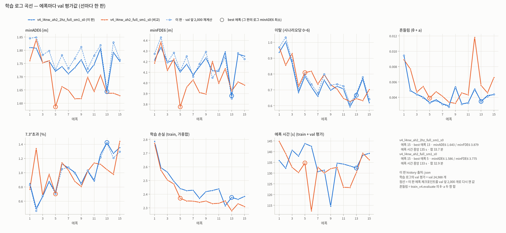
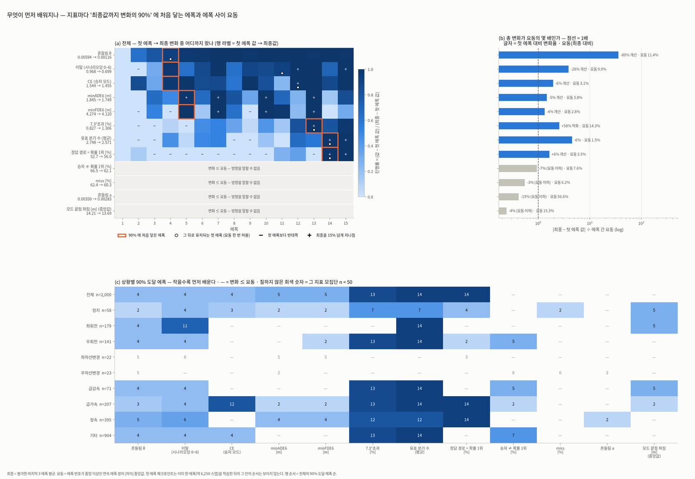
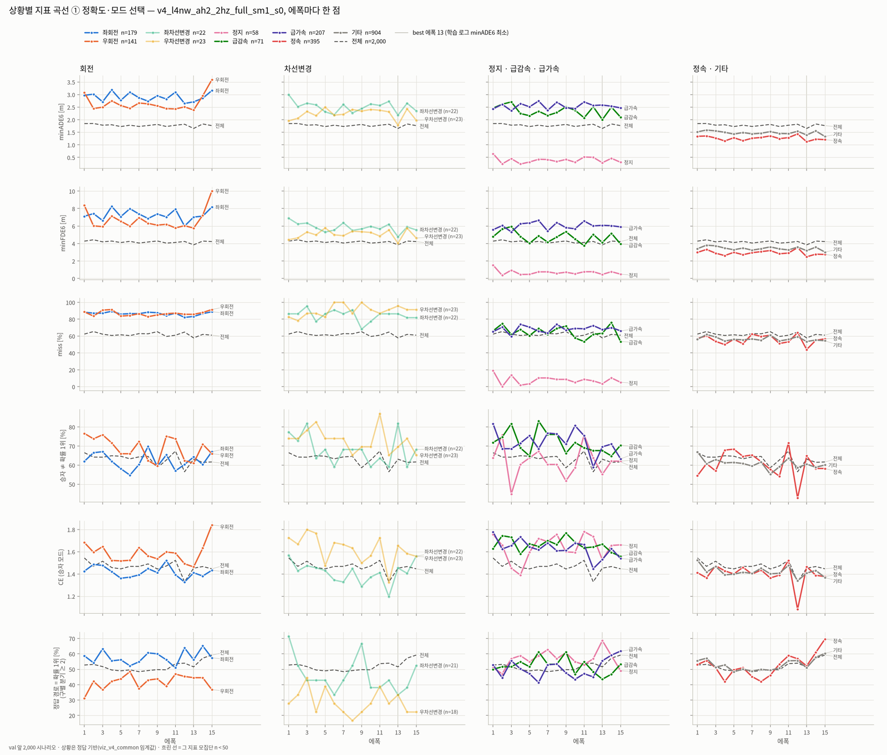
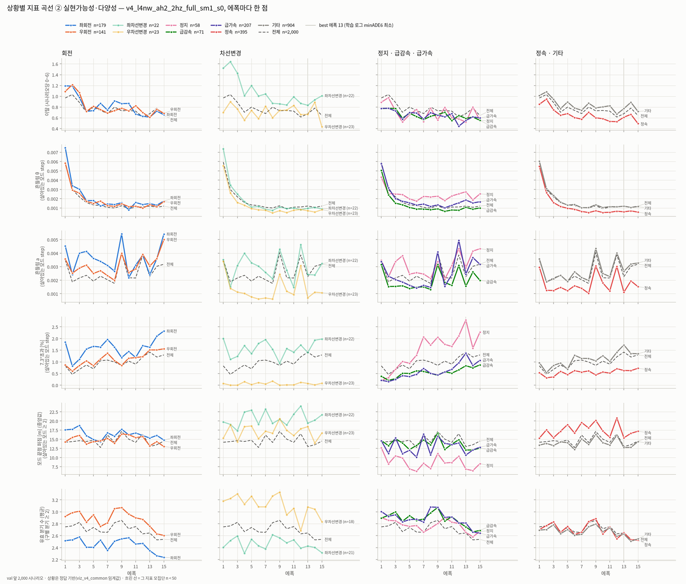
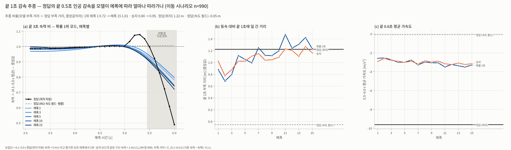
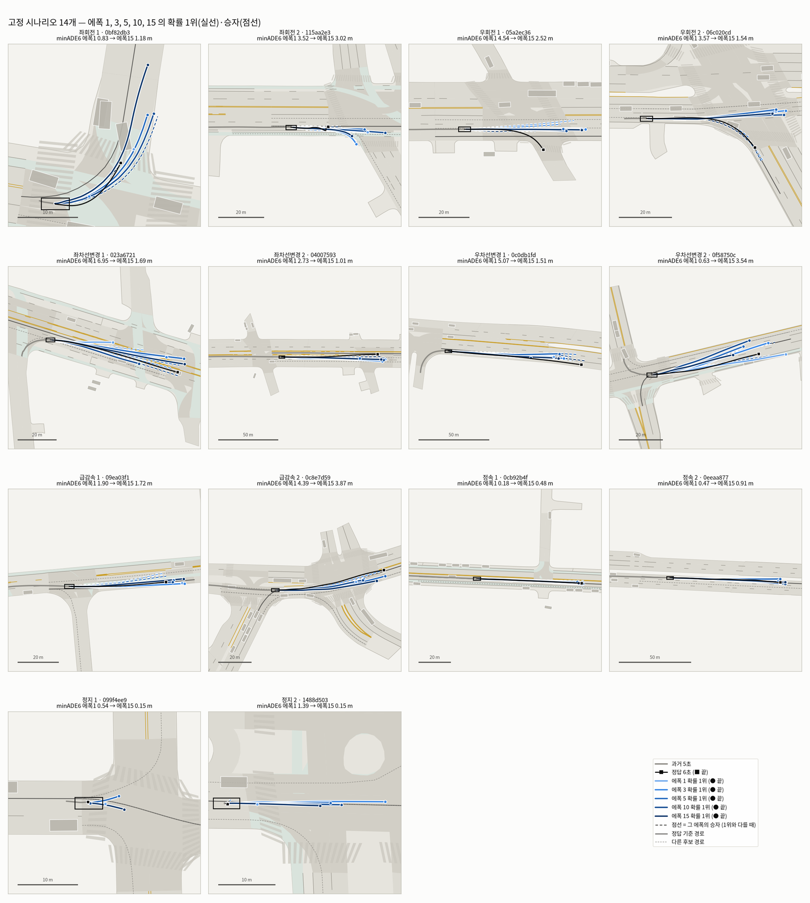

# v4 에폭별 학습 방향 — L4nw (a, h) 2 Hz 입력 · 전체 데이터 · 흔들림 벌점 1.0

- **모델:** `v4_l4nw_ah2_2hz_full_sm1_s0`
  - L4 이탈 벌점 1.0 (버려진 모드만), (a, h) **2 Hz 입력**, θ₀ guard, 흔들림 벌점 1.0
  - train 199,908, 15 에폭, 시드 0
- **체크포인트:** `runs/ckpt/v4_l4nw_ah2_2hz_full_sm1_s0/ep01~15.pth` — 에폭이 끝날 때마다 저장한 것
- **평가:** 2 Hz val 캐시 앞 **2,000** 개를 모든 에폭에서 똑같이 쓴다. 재현 확인만 24,988 전체로 한다.
- **비교 판:** 10 Hz 판 `v4_l4nw_ah2_full_sm1_s0` — 입력만 다르다. 에폭 체크포인트가 없어서 학습 로그 곡선만 겹쳤다.
- **그림:** `viz/v4/v4_l4nw_ah2_2hz_full_sm1_s0/epochs/`. 이 문서에 넣은 그림은 줄여서 `docs/figures/v4/epochs_l4nw_2hz/` 에 복사했다
  (고정 시나리오 개별 14장은 워크스테이션의 `epochs/panel/` 에만 있다).
- **숫자 출처:** 모두 직접 계산했다. 저장소 사본은 `runs/v4_epochs_v4_l4nw_ah2_2hz_full_sm1_s0_{n2000,n24988,picks}.json` 이다.
  - `data/epochs_n2000.json`·`epochs_n24988.json`·`epoch_scen_n2000.npz`
  - 두 판의 `runs/<tag>.json` history
- **만든 명령:** `python src/viz_v4_epochs.py`

---

## 0. 발견 요약

| # | 발견 | 숫자 (val 2,000, 에폭 1 → 최종 = 13~15 평균) |
| --- | --- | --- |
| 1 | **먼저 배우는 것은 '매끄러움·차로 유지·모드 CE'** (에폭 4 에 변화의 90%) | 흔들림 θ −80% (0.00594 → 0.00116, 에폭 사이 요동의 36배) · 이탈 −28% (0.968 → 0.699) · CE −6% (1.544 → 1.455). 흔들림 θ 는 정지(−45%)를 빼면 모든 상황에서 −71~−89% 이고, 에폭 3~5 에 90% 에 닿는다 |
| 2 | **정확도는 에폭 5 이후 요동에 묻힌다** | minADE6 1.845 → 1.749 (−5.2%). 에폭 5 에 90% 에 닿지만 그 뒤 유지되지 않는다(요동 3.8%, 총 변화가 요동의 1.5배). minFDE6 −3.6% (1.3배). miss·승자≠1위·흔들림 a·끝점 퍼짐은 총 변화가 요동보다 작다 |
| 3 | **확률은 늦게(에폭 12~15) 한쪽으로 모인다** | 유효 분기 수 2.748 → 2.571 (요동 1.5%), 정답 경로 = 확률 1위 52.7 → 56.0%. 둘 다 에폭 14 에 90% 에 닿는다. 확률 1위 모드 ADE 3.58 → 3.20 m (−11%) |
| 4 | **7.3°초과는 끝까지 늘어난다** | 0.83 → 1.31% (+58%, 에폭 13). 증가가 큰 상황은 정지 0.19 → 2.22%, 급가속 0.21 → 1.09%, 급감속 0.38 → 0.82% 다(급가속의 59% 는 v0 < 1 m/s 출발). 흔들림 벌점은 dθ 의 **변화**만 벌해서, 일정하게 큰 dθ 는 막지 않는다. 저속에서는 θ 가 위치를 거의 바꾸지 않아 거리 손실도 이를 감독하지 못하는 것으로 **추정**한다 |
| 5 | **상황마다 학습 방향이 다르다** | 좋아짐: 정지 0.65 → 0.35 m (에폭 2), 정속 1.34 → 1.19 m (에폭 4). 제자리: 좌회전 2.97 → 2.91 m, 우회전 3.08 → 2.98 m (둘 다 변화 ≤ 요동). **나빠짐:** 급가속 2.43 → 2.53 m, minFDE6 5.58 → 6.01 m (+8%, 요동의 3.1배) |
| 6 | **best 에폭(13)을 고르는 것은 회전이다** | 에폭 13 → 15 에 전체 minADE6 가 1.652 → 1.764 로 나빠진다. 합산 차 224 m 중 우회전(141개)이 170 m(76%), 좌회전이 80 m(36%)이다. 회전을 뺀 나머지는 1.478 → 1.462 로 오히려 좋아진다. 우회전 minADE6 는 에폭에 따라 2.38(13) ~ 3.59(15) m 를 오간다 |
| 7 | **라벨 끝 인공 감속을 에폭이 갈수록 더 따라간다** | 등속 대비 끝 1초 부족 거리: 정답(위치) 1.22 m, 정답(속도 필드) −0.05 m. 확률 1위 모드의 추종 비율은 처음 3에폭 0.64 → 마지막 3에폭 1.08, 승자는 0.73 → 0.96. val 24,988 에폭 15 에서는 모델의 부족 거리가 속력과 무관하게 1.16~1.27 m 다. 정답은 속력에 따라 0.85 m (5–10 m/s) → 2.72 m (20–40 m/s) 로 커진다 |
| 8 | **10 Hz 판보다 학습 데이터에서도 덜 맞춘다** (2절) | 최근 5에폭 minADE6 1.749 vs 1.651 (+6%). 학습 손실 중 SL1+CE 도 2.249 vs 2.197 이다. 흔들림은 2 Hz 가 더 조용하다 (0.0041 vs 0.0066) |

---

## 1. 재현 확인

| 대조 | 결과 |
| --- | --- |
| 에폭 15, val 24,988 ↔ 학습 로그 | 통과. minADE6 1.75849 / 1.75849 (차 2.4e-9) · minFDE6 4.25291 (6.9e-9) · 이탈 0.61872 (2.1e-8) · 7.3°초과 1.35369% (0) · 흔들림 0.00435 (6.5e-12) |
| best 체크포인트 | `lstm_<tag>.pth` = `ep13.pth` (가중치 전부 같다) |
| 에폭 13, val 2,000 ↔ `runs/v4_full_compare.json` | 최대 차 2.5e-8 |
| 시나리오별 손실 분해 | 에폭마다 `train_v4` 배치 손실과 차 ≤ 2.4e-7 |
| val 2,000 곡선 ↔ 로그(24,988) 곡선 | 15 에폭 상관: minADE6 0.97 (2,000 쪽이 평균 +0.027 m), 이탈 0.998, 7.3°초과 0.994, 흔들림 0.999. 최소 에폭은 둘 다 13 이다 → **val 2,000 으로 에폭 순위를 볼 수 있다** |

---

## 2. 10 Hz 판과 비교한 학습 곡선 (`e3_train_log.png`)



학습 로그 기준(val 24,988)이다. "최근 5" 는 에폭 11~15 평균이다.

| 항목 | 2 Hz (이 판) | 10 Hz |
| --- | --- | --- |
| best 에폭 · minADE6 / minFDE6 | 13 · 1.643 / 3.879 | 5 · 1.586 / 3.775 |
| 최근 5 minADE6 / minFDE6 | **1.749 / 4.161** | **1.651 / 4.009** |
| 최근 5 이탈 · 7.3°초과 | 0.670 · 1.24% | 0.650 · 1.14% |
| 최근 5 흔들림 (θ + a) | 0.0041 | 0.0066 |
| 최근 5 학습 손실 / 그중 SL1 + CE | 2.375 / 2.249 | 2.320 / 2.197 |
| 에폭 시간 중앙 · 합 | 134.7 s · 33.7 분 | 132.7 s · 32.9 분 |

- **에폭 1~4 는 같다가 에폭 5 부터 벌어진다.**
  - 에폭 1~4 의 minADE6 차는 −0.03 ~ +0.05 m 다.
  - 에폭 5 에 10 Hz 가 1.586 으로 내려간 뒤로는 에폭 5~15 전부에서 2 Hz 가 더 나쁘다(+0.006 ~ +0.154 m).
- **학습 데이터에서도 덜 맞춘다.**
  - 학습 손실은 15 에폭 중 14 에폭에서 2 Hz 가 높다.
  - 이탈·흔들림 벌점을 뺀 SL1 + CE 도 최근 5 평균이 +0.052 높다.
  - 그래서 과적합보다는 **입력이 담는 정보가 줄어든 차이**로 본다(추정). 입력 효과를 떼려면 같은 판의 시드 반복이 필요하다.
- **흔들림은 2 Hz 가 후반에 더 조용하다.**
  - 에폭 3 이후 최대는 2 Hz 0.0054(에폭 9)다. 10 Hz 는 0.0118(에폭 12)까지 튄다.
  - 이탈은 두 판이 거의 같다. 7.3°초과는 두 판 모두 에폭에 따라 는다(처음 5 → 최근 5: 2 Hz 0.72 → 1.24%, 10 Hz 0.89 → 1.14%).
- **요동 모양과 에폭 시간은 같다.**
  - 로그 minADE6 의 연속 에폭 차 중앙은 0.050 / 0.054 로 비슷하다.
  - 두 판 모두 best 가 한 에폭만 튄 값이다(2 Hz 13, 10 Hz 5).
  - 입력이 50 → 10 스텝이어도 에폭 시간은 같다.
- 그림의 점선은 이 판을 val 2,000 으로 다시 잰 값이다. 로그 곡선을 따라간다(1절).

---

## 3. 2 Hz 판의 학습 방향

| 그림 | 무엇이 / 어떻게 바뀌었나 |
| --- | --- |
|  | **무엇이 먼저 배워지나.** 90% 도달 순서는 흔들림 θ·이탈·CE (4) → minADE6·minFDE6 (5, 유지 안 됨) → 7.3°초과 (13) → 유효 분기 수·정답 경로 1위 (14) 다. 행동을 매끄럽게 하고 차로에 붙이는 것이 먼저이고, 모드 확률 정리는 마지막에 온다 |
|  | **상황별 정확도·선택.** minADE6 가 뚜렷이 내려가는 것은 정지·정속뿐이다. 회전은 2.4~3.6 m 를 오르내리고, 에폭 15 에 우회전이 3.59 m 로 튄다. 정답 경로 1위 비율은 정속 53 → 61%, 우회전 31 → 42% 로 오르지만 에폭 13(best)은 전체 51.6% 로 낮은 에폭이다(에폭 15: 59.2%) |
|  | **상황별 실현가능성·다양성.** 흔들림 θ 는 모든 상황에서 에폭 4 까지 꺾인다. 흔들림 a 는 0.0018~0.0040 사이를 튄다. 7.3°초과는 정지·급가속·우회전에서 계속 오른다. 유효 분기 수는 대부분 에폭 8~10 에 최대였다가 내려간다 |
|  | **끝 1초 감속 추종** (이동 990개). 확률 1위의 부족 거리는 에폭 2 의 0.68 m 에서 커져 정답(1.22 m)에 닿는다. 끝 0.6초 평균 가속도는 −2.6 → −3.3 m/s² 로 커진다. 정답(위치)의 −9.6 m/s² 보다 훨씬 완만해서, 5.0 s 부터 서서히 줄여 같은 거리를 맞춘다. 정답은 5.3 s 에 +8% 넘쳤다가 6.0 s 에 0.49 배로 떨어진다 |

**상황별 요약** — minADE6 는 에폭 1 → 최종 값이다. 90% 칸의 "—" 는 변화가 요동 이하라는 뜻이다. 차선변경 두 상황은 표본이 22·23 개라 해석하지 않는다.

| 상황 (n) | minADE6 | 90% 에폭 | 같이 움직인 것 |
| --- | --- | --- | --- |
| 정지 (58) | 0.65 → 0.35 (−46%) | 2 | miss 19 → 6%, 7.3°초과 0.19 → 2.22% |
| 정속 (395) | 1.34 → 1.19 (−12%) | 4 (유지 13) | 정답 경로 1위 53 → 61%, 흔들림 a −48% |
| 기타 (904) | 1.52 → 1.43 (−6%) | — | 1위 ADE 3.22 → 2.71 m (−16%) |
| 좌회전 (179) | 2.97 → 2.91 (−2%) | — | 이탈 −44% (에폭 11), 흔들림 θ −80% 만 뚜렷 |
| 우회전 (141) | 3.08 → 2.98 (−3%) | — | 에폭별 2.38 ~ 3.59 m, 정답 경로 1위 31 → 42%, 1위 ADE −18% |
| 급감속 (71) | 2.46 → 2.20 (−10%) | — (요동 18%) | 7.3°초과 0.38 → 0.82% |
| 급가속 (207) | 2.43 → 2.53 (**+4%**) | 2 (나빠지는 쪽) | minFDE6 +8%. 끝점 퍼짐은 14.6 → 11.9 m 로 줄고, 승자≠1위는 82 → 68%, CE 는 −12% 다. 선택은 나아지는데, 모드가 종방향으로 모이면서 best-of-6 이 나빠지는 것으로 **추정**한다 |

---

## 4. 고정 시나리오 (`panel_overview.png`, `panel/`)



**구성**
- 7개 상황에서 2개씩, 모두 14개다(시드 0, 폴백 제외, ID 는 `data/epoch_picks_n2000.json`).
- 에폭 1·3·5·10·15 의 확률 1위(실선)와 승자(점선)를 파랑 순서색으로 겹쳤다.
- 한 장에 에폭별 모드 확률, 요약표, 1위 모드의 v·a 가 함께 있다.

**사례**
- `panel/03_right_turn_1_05a2ec36.png` — **커버리지 실패인 우회전.**
  - 후보 경로 3개가 모두 직진이라, 1위가 나란한 직진 차로 r0 과 r1 사이를 오간다(에폭 1·3·15 r0, 5·10 r1).
  - minADE6 4.54 → 2.52 m 는 에폭 15 승자가 느린 모드(5초 속력 3.1 m/s)라서 나온 값이다. 1위 ADE 는 4.54 → 4.69 m 로 그대로다.
- `panel/08_lc_right_2_0f58750c.png` — **정답 경로를 끝까지 고르지 않는다.**
  - 정답 경로 r3 의 확률이 모든 에폭에서 0.00~0.01 이다. minADE6 는 0.63 → 3.54 m 로 나빠진다.
  - 1위 모드의 5초 속력은 에폭 1·3·5·10·15 에서 12.4 · 10.2 · 6.4 · 8.1 · 5.3 m/s 로 대체로 낮아진다. 정답(속도 필드)은 9.5 m/s 다.
- `panel/14_stop_2_1488d503.png` — **정지 모드는 배웠지만 1위가 아니다.**
  - 에폭 5 부터 승자는 제자리 모드이고, minADE6 는 1.39 → 0.11~0.15 m 다.
  - 그런데 확률 1위는 에폭 3 부터 계속 출발하는 m5 다(5초 속력 4.8~8.1 m/s, 1위 ADE 5.66~9.19 m).
  - 정지 58개 전체에서도 같다. 5초에 1 m/s 넘게 움직이는 비율이 승자는 21% → 5~14% 로 줄었다. 1위는 에폭 1 에 64% 였고, 그 뒤로도 26~60% 사이를 오간다.

---

## 5. 정의·임계값 (`src/viz_v4_epochs.py`, `src/viz_v4_common.py`)

| 항목 | 정의 |
| --- | --- |
| 상황 | `viz_v4_dump.raw_one` 의 정답 기반 분류(임계값은 `docs/v4_viz_report.md` 2절). val 앞 2,000: 정지 58 · 좌회전 179 · 우회전 141 · 좌/우차선변경 22/23 · 급감속 71 · 급가속 207 · 정속 395 · 기타 904 |
| 지표 | `train_v4.evaluate` 와 같다. 흔들림·7.3°초과는 상황 안에서 step 가중이다. 정답 경로 = 1위·유효 분기 수는 구별 분기 ≥ 2 만 센다. 끝점 퍼짐(중앙값)은 살아있는 모드 ≥ 2 만 센다 |
| 최종값 | 마지막 3 에폭(13~15) 평균 |
| 90% 도달 에폭 | (값 − 에폭 1 값) / (최종 − 에폭 1 값) ≥ 0.9 가 처음 되는 에폭 |
| 유지 에폭 | 90% 에 닿은 뒤 끝까지 (0.9 − 요동 / \|변화\|) 아래로 내려가지 않는 첫 에폭 |
| 요동 | 에폭 8~15 에서 연속 에폭 사이 \|차이\| 의 중앙값. \|최종 − 에폭 1\| ≤ 요동이면 방향을 말하지 않는다(—) |
| 끝 1초 부족 거리 | Σ_(5.1–6.0 s) (4.1–5.0 s 평균 속력 − 속력) × 0.1 s |
| 끝 감속 모집단 | 4.1–5.0 s 정답(위치 차분) 속력 > 5 m/s 이면서, 평가한 모든 에폭에서 1위·승자 모드의 같은 구간 속력 > 1 m/s. 이동 1,199 중 990 개가 해당한다 |
| 추종 비율 | 모델 부족 거리 중앙값 ÷ 정답(위치) 부족 거리 중앙값 |
| 흐린 선·회색 칸 | 그 지표 모집단 n < 50 |

---

## 6. 한계

- **시드 1개, 체크포인트 한 벌이다.**
  - 에폭 간 요동에는 학습의 확률성과 val 2,000 의 표본 크기가 섞여 있다(차선변경 22·23, 정지 58).
  - 그래서 작은 상황의 곡선과 상황 간 작은 차이는 해석하지 않았다.
- **에폭 1 이전은 보이지 않는다.** 첫 체크포인트가 이미 한 에폭(6,247 스텝)을 학습한 뒤라, 그 안의 학습 순서는 알 수 없다.
- **'90% 도달'은 곡선이 비단조이면 한 번 튄 값으로 정해질 수 있다.** 그래서 유지 에폭을 따로 적었다. minADE6 는 유지되지 않았다.
- **10 Hz 판과는 학습 로그로만 비교했다.** 에폭 체크포인트가 없어 상황별 곡선·끝 감속은 비교하지 못했다.
- **원인은 추정이다.** 7.3°초과 증가(벌점 식 구조)와 급가속 악화(끝점 퍼짐 감소와 동시 발생)는 직접 확인하지 않았다.
- **상황 분류 임계값의 민감도는 재지 않았다.** `docs/v4_viz_report.md` 7절과 같은 한계다.
- **git 에 들어가지 않는 것:** 원본 그림과 `data/`(npz·parquet)는 git 이 무시한다. 이 문서의 그림 6장은 `docs/figures/v4/epochs_l4nw_2hz/` 에, 숫자 요약·고른 시나리오 ID 는 `runs/v4_epochs_v4_l4nw_ah2_2hz_full_sm1_s0_{n2000,n24988,picks}.json` 에 복사해 저장소에 남겼다.

---

## 7. 재현

```bash
cd /home/user/Argoverse2study
pgrep -af "python -u src/train_v4[.]py"     # 비어 있어야 GPU 를 쓴다 (학습 중이면 --device cpu --n-val 200 으로만)
PY=/home/user/miniforge3/envs/av2/bin/python
$PY src/viz_v4_epochs.py --tag v4_l4nw_ah2_2hz_full_sm1_s0 --device cuda --workers 14                             # val 2,000 · 약 1분
$PY src/viz_v4_epochs.py --tag v4_l4nw_ah2_2hz_full_sm1_s0 --device cuda --workers 14 --n-val 24988 --epochs 15    # 재현 · 약 2.5분
# 새 학습: --tag 만 바꾼다. 같은 고정 시나리오로 비교하려면 --picks-from viz/v4/<이 판>/data/epoch_picks_n2000.json
```
