# v4 입력 전처리 — heading (a, h) 10 Hz vs 2 Hz

- **무엇:** 모델 결과가 아니라 **입력 전처리 자체**를 본다.
  - 같은 시나리오에서 focal 과 주변 차량의 h(와 a)가 10 Hz 와 2 Hz 에서 어떻게 다른지 본다.
  - 왜 이렇게 만들었는지, 그리고 어디서 틀어지는지도 본다.
- **데이터:** val 24,988 전체.
  - focal 10 Hz: `val_e67373005962be8a` 의 x
  - focal 2 Hz: `val_32e2b95fe31293fd` 의 x
  - 주변 차량 10 Hz: `agents_hist_val_361221aa2f2e23f3`
  - 주변 차량 2 Hz: 캐시가 없다. 관측 50스텝이 모두 있는 차량만 `ah_features_2hz` 로 **즉석 계산**했다.
  - 원본 parquet·지도도 함께 읽었다. 세 캐시의 인덱스 순서가 같은지 확인했다.
- **만든 명령:**
  - `python src/viz_v4_heading_prep.py` (CPU, 약 4분)
  - 교차 검증: `python src/viz_v4_heading_prep_check.py`
- **그림:** 원본은 `viz/v4/heading_prep/`(git 무시). 이 문서에 넣은 그림은 폭 2000 px 사본 `docs/figures/v4/heading_prep/` 이다(분포 11장 + 패널 8장).
  - 숫자 사본: `runs/v4_heading_prep_{summary,check,verify,picks,panel_facts}.json`, 트리 규칙 `runs/v4_heading_prep_tree_rules.txt`
  - 패널 11장 `panel_*.png`, 분포 11장 `dist_*.png`
  - 숫자 출처: `data/summary.json`·`verify.json`·`check.json`·`picks.json`·`panel_facts.json`
  - 결정 트리 규칙 원문: `data/tree_*_rules.txt`
- 학습·모델·전처리 코드는 건드리지 않았다(import 만). 시드 0, 표본은 한 번 뽑았다.
- "과거 4.9 s" = 관측 50스텝(t = −4.9 … 0 s)이다.

---

## 0. 발견 요약

| # | 발견 | 숫자 (val 24,988) |
| --- | --- | --- |
| 1 | **2 Hz 는 focal h 의 ±π 점프와 초당 방향 잡음을 줄인다** | 점프가 있는 시나리오: 10 Hz 1.58% (396) → 2 Hz 0.62% (154). 위치차분 구간 \|Δh\| 중앙: 2.09 → 1.41 °/s, p99: 57.4 → 32.2 °/s. 1~2 m/s 구간에서 중앙 8.2 → 4.3 °/s 로 차이가 가장 크다 |
| 2 | **h 를 직접 만드는 이유는 복원이 되기 때문이다** | 방향만 바꿔 과거 4.9 s 를 다시 굴린 끝점 오차 평균: AV2 heading 0.879 m (p95 3.19) vs 10 Hz h 0.082 m (p95 0.46). 2 Hz(4.5 s)도 0.920 m vs 0.067 m |
| 3 | **AV2 heading 과 이동방향은 저속일수록 크게 어긋난다** | 위치차분 스텝 99.9만 개에서 \|AV2 − h\| 중앙 1.22°, p95 11.5°, p99 34.1°. 1~3 m/s 구간은 중앙 2.77°·p95 24.5°, 15 m/s 이상은 0.62°·4.38°. 회전 중 중앙은 5.5~6.5° |
| 4 | **10 Hz 입력의 창 시작 약 1.1 s 는 가짜 가속이다. 2 Hz 첫 표본은 중앙값만 보정된다** | 10 Hz 첫 스텝 속력은 기준의 0.48배이고, 96.5% 가 0.8배 미만이다(n=16,208). \|a\| 중앙은 9.9 m/s² 에서 0.8 s 에 1.6 으로 내려간 뒤, 0.9·1.0 s 에 3.4·2.9 로 다시 오른 뒤 1.1 s 에 1.0 으로 돌아온다(구간 중간 0.8). 2 Hz 첫 표본의 중앙은 1.017배로 보정되지만, IQR 0.95–1.07(폭 0.125)이 둘째 표본(0.030)의 약 4배라 개별 값은 흔들린다 |
| 5 | **2 Hz 첫 표본 중앙값이 맞는 것은 '인덱스 4 에서 시작'하기 때문이다. 평활을 4 부터 자르는 것은 거의 기여하지 않는다** | 첫 표본 비율 중앙: 실제 1.017, 원본 위치 그대로 1.016, 평활을 0 부터 했을 때 1.016. 두 평활의 차는 중앙 0.001, p99 0.008 |
| 6 | **주변 차량의 AV2 보조 48% 는 거의 정지 차량에서 나온다** | 전체 슬롯 스텝: 미관측 21.9 / 위치차분 29.7 / AV2 보조 48.4%. AV2 보조 스텝의 96.7% 가 AV2 속력 0.5 m/s 미만 스텝이다. 84.5% 는 4.9 s 내내 0.5 m/s 미만인 차량(전체의 53.4%)에서 나온다 |
| 7 | **정지 차량의 180° 뒤집힘 교정은 위치 잡음이 정한다 → 10 Hz 가 방향을 틀리게 만든다** | 정지 차량의 26.3% 가 잡음 위치차분 ≥ 3 스텝으로 판정을 받는다. 판정 받은 이동 0~2 m 트랙의 38.0% 가 '뒤집힘'이다. 근거 두 가지(아래 표) |
| 8 | **2 Hz 는 이 오류를 줄이지만 없애지 못한다. 10 Hz 와 판정이 갈리기도 한다** | 차로 안·50스텝 관측 정지 차량 42,094대의 '차로 반대': AV2 0.51 / 10 Hz 6.40 / 2 Hz 2.89%. 두 판이 모두 AV2 로 메운 표본에서 방향이 90° 넘게 갈린 차량: 50스텝 관측 차량의 4.19% (10,752대), 이동 2~5 m 구간에서는 27.4% |
| 9 | **focal 도 같은 문제가 조금 있다** | 10 Hz 가 AV2 보조 구간을 뒤집은 시나리오 180개(그중 t=0 입력 h 가 뒤를 향함 90개), 2 Hz 는 70개. focal 과거 상태 '정지'에서는 판정 받은 시나리오의 21% (10 Hz 95/447) |
| 10 | **2 Hz 계산이 가능한 주변 차량은 절반뿐이다** | 관측 50스텝이 모두 있는 차량 52.3% (거리 < 10 m 71%, ≥ 100 m 32%). 위치차분이 한 번도 없는 차량 41.5% |

**발견 7 의 근거 — 정지 차량에서 누가 맞나**

| 기준 | 모집단 | AV2 원본이 맞음 | 10 Hz h 가 맞음 | 출처 |
| --- | --- | --- | --- | --- |
| t=0 차로 방향 | 차로 안 정지 · 10 Hz 가 실제로 뒤집음, 6,162대 | 98.1% | 10.3% | 이 분석 |
| 나중에 3 m 이상 전진한 방향 (차로와 무관) | 정지 · 10 Hz 뒤집음, n=140 | 97.9% | 17.1% | 독립 재현, 표본 4,000 |
| 같은 기준, 차로 밖만 | n=57 | 96.5% | 22.8% | 독립 재현, 표본 4,000 |
| 두 기준의 일치 (AV2 라벨 판정) | 전진 차량 중 차로 안 1,183 | 99.3% 일치 | — | 독립 재현, 표본 4,000 |

- **차로 기준이 덮는 범위:** 차로 기준은 뒤집힌 정지 차량 27,955대의 **22%**(차로 안 6,162대)만 덮는다. 나머지 78% 는 차로 밖(주로 주차 차량)이다.
  - 차로와 무관한 미래 전진 기준으로도 결론이 같다.
- **'차로 반대 12.2%'(차로 안 정지 57,838대 중 7,084대)의 원인 분해:**
  - 트랙 단위로 보면 뒤집힘 판정을 받은 트랙이 86% (6,084), 아닌 트랙이 14% (1,000)다.
  - t=0 스텝의 출처로 더 나누면 다음과 같다.
    - AV2 보조 값이 뒤집힌 경우: 64% (4,514)
    - t=0 가 위치차분 잡음인 경우: 32% (2,241, 그중 1,570 은 뒤집힌 트랙)
    - AV2 원본 자체가 차로와 반대인 경우: 5% (329)

---

## 1. 정의

| 이름 | 정의 |
| --- | --- |
| **좌표·시간** | focal 정규화. 원점 = focal t=49 위치, +x = focal t=49 AV2 heading. 시간 0 = t=49(예측 시작), 과거는 음수 [s]. 램프 그림은 창 시작 기준(0 = −4.9 s) 축과 예측 시작 기준 축을 함께 적었다 |
| **10 Hz (a, h)** | `heading_decomp.ah_features`. h[t] = t→t+1 위치차분 방향이고, 마지막 값은 직전 값 복제다. a = 속도 증분[km/h]/3 이고 첫 값은 v0 다 |
| **2 Hz (a, h)** | `ah_features_2hz`. 위치를 인덱스 4~49 에서 Savitzky–Golay(5점·2차)로 평활한다. 그 뒤 인덱스 4, 9, …, 49 를 뽑아 0.5 s 구간에 같은 규칙을 적용한다 |
| **h 출처** | 0 미관측 / 1 위치차분(구간 속력 ≥ 1 m/s) / 2 AV2 보조(< 1 m/s) / 3 이웃 유지(val 에서 0건) |
| **뒤집힘 판정** | `align_ref`. 위치차분 스텝이 **3개 이상**일 때만 한다. \|가드된 AV2 − 위치차분 h\| 의 중앙값이 90° 를 넘으면 그 트랙의 AV2 보조 값을 모두 180° 돌린다. 가드 = 0.1 s 당 30° 넘는 튐을 직전 값으로 바꾼다 |
| **±π 점프** | 입력 h 의 이웃 스텝 차(wrap 전)가 π 를 넘는 곳 |
| **\|Δh\| [°/s]** | 스텝 간 방향 변화. 10 Hz 는 ÷0.1 s, 2 Hz 는 ÷0.5 s. '위치차분 구간' = 구간 양 끝이 모두 출처 1 |
| **슬립각+잡음** | AV2 heading(차체) − 위치차분 h. 실제 슬립각, 차체 방향 추정 오차, 위치 잡음이 섞여 있다 |
| **램프 기준 속력** | 스텝 10~15(창 시작 1.0~1.6 s)의 위치차분 속력 평균. 기준 > 3 m/s 인 focal 만 본다 |
| **정지 (두 정의)** | 주변 차량 = 과거 4.9 s 관측 스텝의 AV2 속력 최대 < 0.5 m/s. focal 과거 상태 '정지' = AV2 속력(median5 → SG15 평활) 최대 < 1 m/s |
| **차로 방향 대조 (참고값)** | t=0 위치가 교차로 밖 차로 중심선 1 m 안인 차량(주변 차량의 33%)만 본다. t=0 방향이 그 접선과 ±90° 안이면 '같은 쪽'이다 |
| **θ, 누적 횡이동** | θ = h − k, k = 5 m 안 같은 방향 최근접 중심선 접선(`heading_decomp.decompose`). 누적 횡이동 = Σ 스텝길이·sin θ |
| **과거 상태** | `viz_v4_common` 임계값을 과거 4.9 s 에 적용했다(`dist_8` 아래 정의). 정답 기반 상태가 **아니다** |

---

## 2. 검증 (필수 요건 9)

**(a) 재현·대조 — 원본에서 다시 만들기**

| 대조 | 결과 |
| --- | --- |
| 세 캐시와 정렬된 val 디렉터리의 순서 | 모두 같다 |
| focal 10 Hz / 2 Hz ↔ 캐시 x | 24,988개 모두 비트 단위로 같다 |
| 주변 차량 `agents_one` 재구축 ↔ 캐시 7개 필드 | 24,988개 모두 같다. 슬롯 → 트랙 대응 불일치 0 |
| 주변 차량 위치차분 h ↔ 원본 위치로 따로 계산 | 730만 스텝, 최대 차 1.19e-7 rad. 출처 1 ↔ '구간 속력 ≥ 1' 불일치 0 |
| 뒤집힘 판정 재구현 ↔ 캐시 출력에서 본 뒤집힘 | 주변 차량·focal × 10·2 Hz 모두 불일치 0 |
| focal (a, h) 독립 재구현 (pandas, heading_decomp 미사용), 400개 | h 최대 차 1.2e-7 rad |
| 독립 중심선(지도 JSON 좌/우 경계 평균)으로 한 차로 대조, 6,005대 | 차로 안 판정 99.5% 일치, 같은 쪽 판정 100% 일치 |

**(b) 숫자 재집계 (`check.json`, 69개 모두 일치)**
- 대부분 **같은 scan.npz 를 pandas group-by 로 다시 집계**한 것이다. 원본부터의 독립성은 (a)와 (c)가 맡는다.
- 점검한 항목: 점프, 방향 변화, 슬립각, 램프, 출처 비율(캐시 meta 와도), 정지 비율, 트리 갈래 수(출력 기준), 상태별, 트리 B AUC·Brier(잎 group-by 확률로), 패널 제목 숫자.

**(c) 독립 검토 — 새 컨텍스트 검토자가 원본에서 따로 계산 (표본 val 4,000, 주변 차량 78,096대)**

| 항목 | 리포트 (24,988) | 재현 (4,000) | 판정 |
| --- | --- | --- | --- |
| 정지 주변 차량 비율 | 53.4% | 53.48% [53.13, 53.83] | 일치 |
| 정지 차량 중 뒤집힘 판정 받음 | 26.3% | 26.82% | 일치 |
| 이동 0~2 m, 판정 중 뒤집힘 | 38.0% | 38.01% | 일치 |
| 차로 안 정지, 차로 반대 AV2 → 10 Hz | 0.97 → 12.2% | 1.02 → 12.42% | 일치 |
| 차로 안 정지·뒤집힘: AV2 / 10 Hz 같은 쪽 | 98.1 / 10.3% | 97.95 / 10.17% (n=1,121) | 일치 |
| 50스텝 관측 주변 차량 10 Hz ±π 점프 | 13.6% | 13.51% | 일치 |
| focal 10 Hz 뒤집음 시나리오 | 180 (0.72%) | 29/4,000 (0.72%) | 일치 |
| 램프: 첫 스텝 비율 / < 0.8 비율 / 2 Hz 첫 표본 | 0.484 / 96.5% / 1.017 | 0.486 / 96.7% / 1.016 | 일치 |
| summary `focal_flip` 200 / 78 | logic_tree 180 / 70 과 정의가 달랐다 | — | 이름을 `focal_frame_opposite` 로 바꾸고 정의를 적었다 |

- 그림 22장은 모두 열어 확인했고, 검토 뒤 고친 그림도 다시 열었다.

---

## 3. 처리 로직 결정 트리 — `dist_9_h_logic_tree.png`

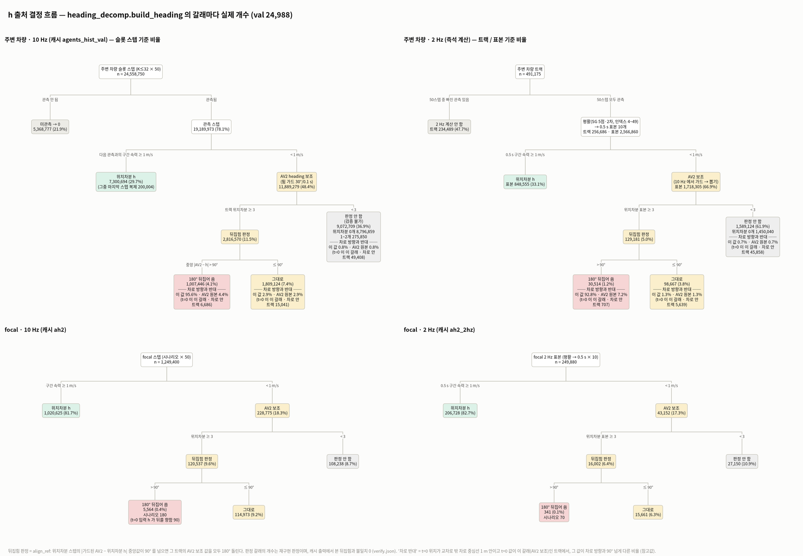

- **보여주는 것:** `build_heading` 의 갈래마다 실제 개수다. 네 트리는 주변 차량/focal × 10 Hz/2 Hz 다.
- **알 수 있는 것:**
  - 주변 차량 슬롯 스텝의 **36.9% 는 '판정 안 함'**(위치차분 < 3)이고, 대부분 위치차분이 0개인 정지 차량이다.
  - '180° 뒤집어 씀' 갈래는 4.1% (41,089 트랙)다.
    - 그 갈래에서 차로 안이고 t=0 이 AV2 보조인 트랙 6,686대의 95.6% 가 차로와 반대다. 원본 AV2 는 4.4% 만 반대다.
  - **같은 트랙(관측 50스텝 전부, 256,686대)**끼리 비교하면 2 Hz 가 판정 비율과 뒤집는 비율을 모두 낮춘다(`summary.logic_tree.agents_same_tracks_full`).
    - 판정까지 가는 스텝: 10 Hz 12.02% → 2 Hz 5.03%
    - 뒤집는 갈래: 3.88% → 1.19%
    - 그래도 2 Hz 의 뒤집는 갈래는 92.8% 가 차로와 반대다.

| 갈래 (주변 차량 10 Hz, 슬롯 스텝 24,558,750) | 스텝 | 비율 |
| --- | --- | --- |
| 미관측 | 5,368,777 | 21.9% |
| 위치차분 (마지막 스텝 복제 200,004 포함) | 7,300,694 | 29.7% |
| AV2 보조 → 판정 → 뒤집음 | 1,007,446 | 4.1% |
| AV2 보조 → 판정 → 그대로 | 1,809,124 | 7.4% |
| AV2 보조 → 판정 안 함 (위치차분 0개 8,796,859 · 1~2개 275,850) | 9,072,709 | 36.9% |

---

## 4. focal — 10 Hz vs 2 Hz

**`dist_1_jump_turnrate.png`**

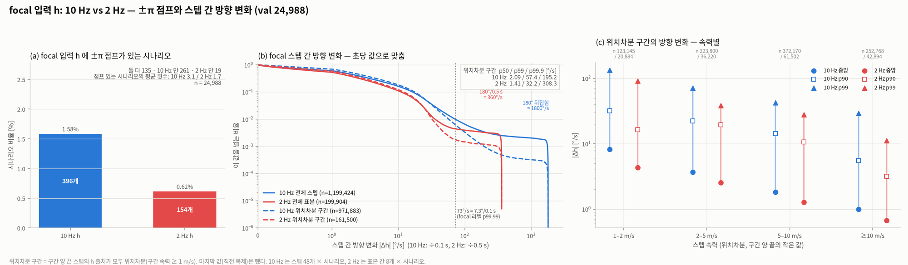

- **보여주는 것:** ±π 점프 시나리오 비율, 초당 방향 변화 CCDF, 속력별 방향 변화다.
- **알 수 있는 것:** 2 Hz 는 저속 방향 잡음을 절반쯤으로 줄인다.
  - 180° 뒤집힘은 10 Hz 에서 1800 °/s, 2 Hz 에서 360 °/s 로 보인다. 그래서 위치차분 구간 p99.9 는 2 Hz 가 더 크다 (195 vs 308 °/s).
  - **위치 잡음은 정지에서도 움직임을 만든다.** 창 시작 1.5 s 동안 AV2 < 0.3 m/s 인 focal 4,243개 중 4.9% 가 첫 스텝에 1 m/s 이상의 가짜 움직임을 갖는다(중앙 0.03 m/s). 이것은 램프가 아니라 위치 잡음이다.

**`dist_2_slip_recon.png`**

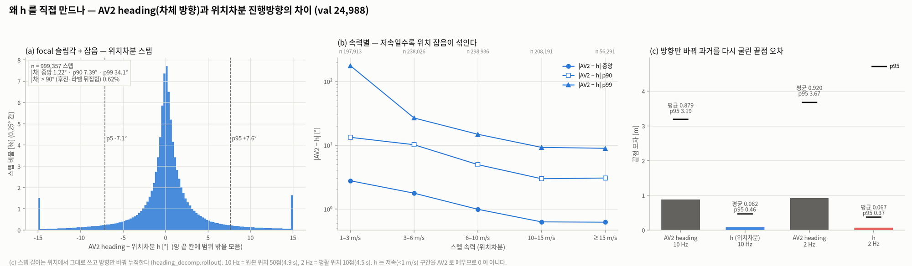

- **보여주는 것:** 슬립각+잡음 분포, 속력별 분포, 방향만 바꿔 복원한 끝점 오차다.
- **알 수 있는 것:** AV2 heading 으로 굴리면 4.9 s 에 평균 0.88 m 어긋난다. h 로 굴리면 0.08 m 다. h 가 0 이 아닌 것은 저속 AV2 보조 구간 때문이다.

**`dist_3_ramp.png`, `dist_3b_ramp_by_speed.png`** — 위 축은 예측 시작 기준(−4.9 s …)이다.

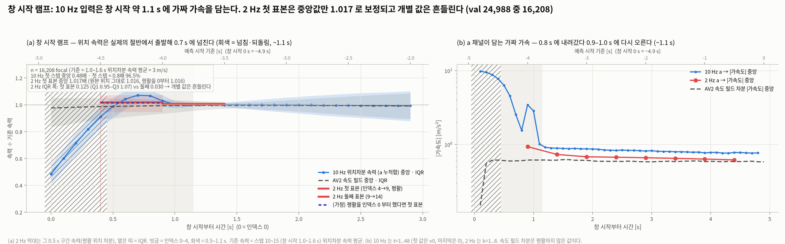
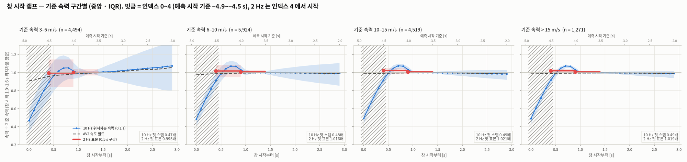

- **보여주는 것:** 10 Hz 위치 속력은 0.48 → 0.99배(0.5 s)로 오르고, 0.7 s 에 1.07배로 넘친 뒤 약 1.1 s 에 가라앉는다. AV2 속도 필드는 0.98배로 평평하다.
- **알 수 있는 것:**
  - 2 Hz 첫 표본(0.4~0.9 s)은 모자람과 넘침이 평균되어 **중앙값만** 1.017배가 된다. IQR 은 0.95–1.07 로 둘째 표본의 약 4배다.
  - 기준 속력 구간(3–6 / 6–10 / 10–15 / >15 m/s)이 모두 같은 모양이다 → 속력에 비례하는 인공물이다.

**`dist_8_by_state.png`** — focal 과거 4.9 s 상태별 small multiples (n < 50 흐리게)

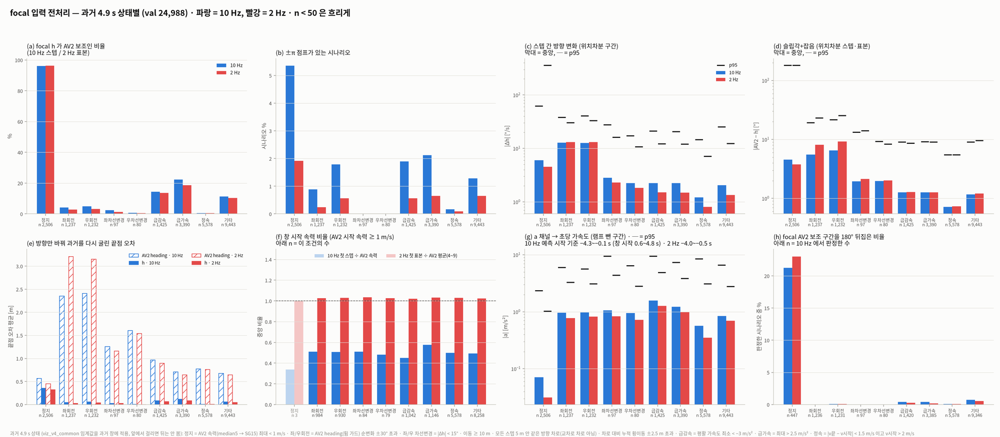

- **정지(2,506):** 96% 가 AV2 보조다. 점프는 5.35% → 1.92% 로 준다. 뒤집힘 판정을 받은 것 중 21%(10 Hz)·23%(2 Hz)가 뒤집혔다.
- **회전(각 약 1,230):** 슬립각 중앙이 5.5~6.5° 로 가장 크다. AV2 heading 복원 오차는 2.3~2.4 m 다.
- **초당 \|a\| p95:** 2 Hz 가 모든 상태에서 10 Hz 의 0.37~0.55배다.
- **차선변경(97·80):** 표본이 적다.

---

## 5. 주변 차량

**`dist_4_agents_count_type.png`**

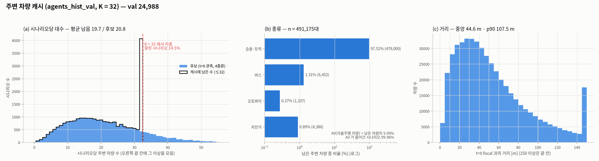

- 시나리오당 평균 19.7대가 남는다(후보 20.8, 최대 81). 14.5% 는 32대에서 잘린다.
- 종류: vehicle 97.5 · bus 1.31 · cyclist 0.89 · motorcyclist 0.27%.
- AV 는 남은 차량의 5.09% 이고, 99.96% 시나리오에 들어 있다.

**`dist_5_agents_src.png`** — 출처 × (스텝 속력 · 트랙 최대 속력 · 거리 · 종류)

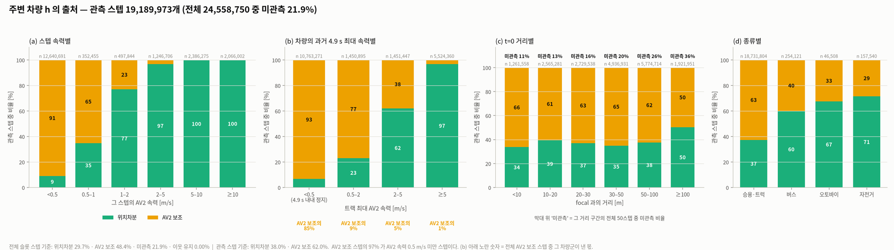

- **AV2 보조는 정지·주차 차량 현상이다.**
  - 트랙 최대 속력 < 0.5 m/s 인 차량은 관측 스텝의 93% 가 AV2 보조이고, 전체 AV2 보조의 85% 를 낸다.
  - 스텝 속력 < 0.5 m/s 에서도 9% 는 위치차분이다. 위치 잡음(0.1 s 에 10 cm 이상)이다.

**`dist_6_agents_moved_2hz.png`**

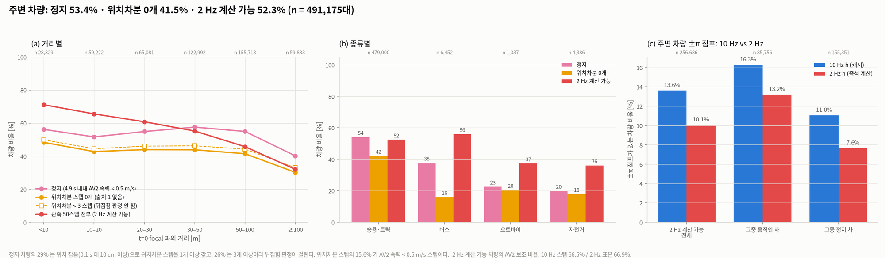

- 정지 53.4%, 위치차분 0개 41.5%, 위치차분 < 3개 44.0%, 2 Hz 계산 가능 52.3% 다.
- 정지 차량의 29% 는 잡음 위치차분 스텝을 갖는다.

**`dist_7_agents_flip_lane.png`**

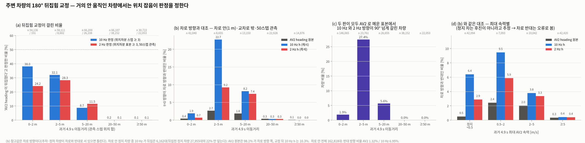

- **뒤집힘 판정:** 이동 0~2 m 차량은 판정을 받으면 38% 가 '뒤집힘'이다.
- **차로 대조, 10 Hz 가 원본보다 틀린 방향이 많다:**
  - 차로 안 전체 162,818대: 1.32 → 6.95% (5배)
  - 차로 안 정지 57,838대: 0.97 → 12.2% (13배)
  - 이동 2~5 m (차로 안·50스텝 관측 8,655대): AV2 2.7% vs 10 Hz 22.7%
- **20 m 이상 움직인 차량:** 세 값이 모두 0.4% 이하로 같다.
- (d) 는 '정지 차는 후진이 아니다'를 **가정**하고 차로 반대를 오류로 본다.

---

## 6. 분석용 얕은 결정 트리 — `dist_10_cart_trees.png`

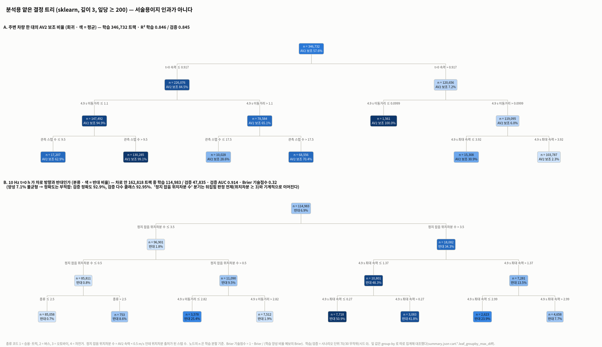

- **설정:** sklearn, 깊이 3, 잎당 ≥ 200. 학습/검증은 시나리오 단위 70/30 (시드 0)이다. 노드 n 은 학습 분할이다.
- **주의:** **서술용이지 인과가 아니다.**
- **A. AV2 보조 비율 (회귀):**
  - R² 는 학습 0.846 / 검증 0.845 다.
  - 첫 분할은 t=0 AV2 속력 ≤ 0.92 m/s 다(정의상 거의 자명하다).
- **B. 10 Hz t=0 h 가 차로와 반대 (분류):**
  - 차로 안 162,818대를 학습 114,983 / 검증 47,835 로 나눴다. 양성은 학습 6.9% / 검증 7.1% 다.
  - 불균형 자료라 **정확도는 맞지 않는 지표**다(검증 정확도 92.9%, 검증 다수 클래스 92.95%).
  - 잎 통계 확률로 재면 **검증 AUC 0.914, Brier 기술점수 0.32** 다. 검토자 값과 같다.
  - '정지 잡음 위치차분 수' 분기는 뒤집힘 판정의 전제(위치차분 ≥ 3)와 기계적으로 이어진다. **새 발견이 아니다.**

| 트리 | 규칙 | n (학습) | 결과 (학습 / 검증) | 대표 시나리오 (슬롯) |
| --- | --- | --- | --- | --- |
| B | 정지 잡음 위치차분 > 3.5 · 최대 속력 ≤ 0.27 | 7,718 | **반대 50.9% / 49.3%** | e5f24bc4-25c9-42a3-8371-65288537d77b (10) |
| B | 정지 잡음 > 3.5 · 0.27 < 최대 속력 ≤ 1.37 | 3,083 | 반대 41.8% / 42.5% | 3c7d6e9f-dc7f-43f8-8315-136c8ed15a69 (12) |
| B | 정지 잡음 1~3 · 이동 ≤ 2.82 m | 3,578 | 반대 25.4% / 27.0% | 761c7f97-df5c-40e7-81ad-239c8c5cce7d (16) |
| B | 정지 잡음 > 3.5 · 1.37 < 최대 속력 ≤ 2.99 | 2,623 | 반대 23.9% / 25.9% | dbfce851-4764-45a8-9179-7220d315a9e5 (16) |
| B | 정지 잡음 > 3.5 · 최대 속력 > 2.99 | 4,658 | 반대 7.7% / 8.7% | 31789fdb-3d4a-4a6a-a841-93e5ae850a59 (8) |
| B | 정지 잡음 0 · 오토바이·자전거 | 753 | 반대 8.6% / 8.3% | 4f6a83d2-9ad6-4c80-b7d3-96a0683edefa (4) |
| B | 정지 잡음 1~3 · 이동 > 2.82 m | 7,512 | 반대 1.9% / 2.2% | 5b9b3a2b-2d1c-4eba-95e3-4128a919ee51 (16) |
| B | 정지 잡음 0 · 승용·트럭·버스 | 85,058 | 반대 0.73% / 0.70% | 6fa1d2f7-a43a-4fe7-b644-2dda579671a5 (9) |
| A | t=0 속력 ≤ 0.92 · 이동 ≤ 1.1 m · 관측 > 9.5 | 130,285 | AV2 보조 99.1% / 99.1% | 8b912f11-f91a-4cc2-a4d8-52453f205ee0 (3) |
| A | t=0 속력 ≤ 0.92 · 이동 > 1.1 m · 관측 > 17.5 | 68,556 | 70.4% / 70.4% | 56800d61-d248-4c9e-a4dd-ae7c0c0c70d1 (7) |
| A | t=0 속력 ≤ 0.92 · 이동 ≤ 1.1 m · 관측 ≤ 9.5 | 17,207 | 62.9% / 63.1% | cb6c8eb0-ccbc-4dc0-9c92-959222a37f68 (7) |
| A | t=0 속력 > 0.92 · 이동 > 0.1 m · 최대 속력 ≤ 3.92 | 15,308 | 30.9% / 31.2% | 43979381-48cd-4e3a-9c6a-69cc1cffc555 (18) |
| A | t=0 속력 ≤ 0.92 · 이동 > 1.1 m · 관측 ≤ 17.5 | 10,028 | 28.6% / 28.4% | ea0b4fb4-a5d4-4384-af75-c5a9a872b964 (14) |
| A | t=0 속력 > 0.92 · 이동 > 0.1 m · 최대 속력 > 3.92 | 103,787 | 2.3% / 2.3% | 84849e44-8243-41b9-958d-d48d33e90c62 (8) |
| A | t=0 속력 > 0.92 · 이동 ≤ 0.1 m | 1,561 | 100% / 100% | c47ece9c-d21b-4b9c-9d0a-f6ca3591d8df (23) |

- '정지 잡음 위치차분 수' = AV2 속력 < 0.5 m/s 인데 위치차분 출처가 된 스텝 수. 이동·최대 속력은 과거 4.9 s 기준이다.
- B 의 대표 시나리오는 잎 안의 '반대' 트랙에서 무작위로 뽑았다. 그림으로 그린 대표는 패널 7·8 이다.

---

## 7. 대표 시나리오 패널 (11장)

- **칸 구성:**
  - 왼쪽은 어두운 HD 맵이다. 화살표 = 10 Hz h[49], 색 = 출처(초록 위치차분 / 노랑 AV2 보조).
  - focal 은 0.1 s 점과 2 Hz 표본점(빈 원 = AV2 보조)으로, 주변 차량은 1 s 점으로 그렸다.
  - 오른쪽 시계열은 초 단위이고, 10 Hz 작은 점·2 Hz 큰 점이다.
    - ① h ② AV2 − h ③ θ·차로 대비 누적 횡이동 ④ v ⑤ 초당 a ⑥ 주변 차량 N 의 h(출처 색 띠, 뒤집힘 판정과 그 중앙차)
- **고르는 법:** 1~6 은 요청한 상황, 7~11 은 발견을 보여 주는 칸이다. 시드 0 으로 뽑았고, 규칙은 그림 셋째 줄과 `picks.json` 에 있다.

| 칸 | 파일 · 시나리오 | 한 줄 |
| --- | --- | --- |
| 1 정속 직진 | `panel_01_straight` · d80c7505-36ed-4757-8708-ec82354d9b76 | 9 m/s. 10 Hz·2 Hz h 가 ±1° 안에서 겹친다. 첫 스텝 속력 0.49배, 10 Hz a 는 창 시작에 11 m/s² 가짜 가속 |
| 2 좌회전 | `panel_02_left_turn` · aac1b604-a96f-4f8f-9057-f14a5928995a | +84°. 이동방향이 AV2 heading 을 최대 22° 앞선다(슬립 중앙 12.9°). 2 Hz 는 계단으로 같은 곡선을 따른다 |
| 3 우회전 | `panel_03_right_turn` · 8184be0f-0f44-4482-a03b-528dcb3fc18d | −67°. 교차로 안에서는 k 가 회전 차로를 따라가 θ 가 −70° 안팎까지 튄다(점무늬, 참고만) |
| 4 저속·정지 | `panel_04_slow_stop` · 4334f370-733a-4fa1-a6d1-d7bcbcd7de48 | 1.1 m/s, 출처가 위치차분 50 / AV2 50% 로 번갈아 나온다. 10 Hz h 는 ±10° 흔들린다. 2 Hz h 도 −1.5 s 에 12° 떨어지고(10 → −2°), t=0 에서 10 Hz 와 8.9° 다르다. 5 m 안에 차로가 없다 |
| 5 차선변경 | `panel_05_lane_change` · 6405f80b-4720-4c55-9f33-7a0c2936f8a5 | θ ≈ +3° 가 3.4 s 이어져 차로 대비 +2.8 m 이동(−4.1 ~ −0.7 s). h 변화는 2° 안이다 |
| 6 혼잡 | `panel_06_crowded` · 0c42bdd2-3ffc-42ac-b222-99726d9e9368 | 후보 50대. N(대향차, ±180°)은 두 주기 모두 ±π 점프 2회. 주차 줄의 화살표가 노랑(AV2 보조)뿐 아니라 초록(위치차분 잡음)도 제각각이다. 정지 11대 중 6대는 t=0 출처가 위치차분이다 |
| 7 정지 차량 뒤집힘 | `panel_07_parked_flip` · 178cda8b-242c-4bc6-b6fd-d5bf6ed5db4e | N 은 최대 AV2 속력 0.203 m/s 인데 위치차분이 8스텝이다(도시 좌표 −138~−136° 4개, +44~+46° 4개). 중앙 \|AV2 − h\| = 90.65° 로 **판정 경계 사례**다(값은 `panel_facts.json` nb_flip). 10 Hz 가 뒤집어 차로와 반대가 됐고, 2 Hz 는 판정 안 함이라 AV2 그대로(차로 방향)다. 같은 장면의 저속 차량 2대(34·42 m, 최대 0.75·1.12 m/s — 정지 정의 밖)도 뒤집혀 차로와 반대다 |
| 8 정지 차량 많음 | `panel_08_many_stopped` · 049b91df-a0c0-4ab9-8f6a-a7f7a64dba62 | 주변 25대 중 15대가 위치차분이 없다. N 은 AV2 속력 0 인데 위치차분 38스텝이라 10 Hz h 가 사방으로 튄다(점프 6회, 중앙차 34.6°라 뒤집지는 않음). 2 Hz 는 1회 |
| 9 focal ±π 점프 | `panel_09_focal_pi_jump` · 2f4dd018-c54f-4a1d-a3e4-cbb8f5fe93bc | 0.2 m/s focal. 창 시작 위치차분(3 m/s, AV2 1.25 — 램프·잡음)이 +175° 라 10 Hz 가 AV2 보조 구간을 뒤집었다. t=0 h 가 뒤를 향한다(점프 3회). 2 Hz 는 판정 안 함 → 0° |
| 10 큰 슬립각 | `panel_10_large_slip` · d4122e99-f2bd-400c-8313-2df2626139eb | 6.7 m/s 회전 내내 AV2 − h ≈ −10°(중앙 9.6°) |
| 11 램프 뚜렷 | `panel_11_strong_ramp` · a530face-2297-4058-9ff7-e4f0feb3c8e5 | 11 m/s 인데 첫 스텝 속력 0.33배, 10 Hz a 최대 16.7 m/s². 2 Hz a 는 최대 1.7 m/s² |

**패널 예시** — 7 정지 차량 뒤집힘 / 9 focal ±π 점프 / 4 저속·정지 / 11 램프 뚜렷

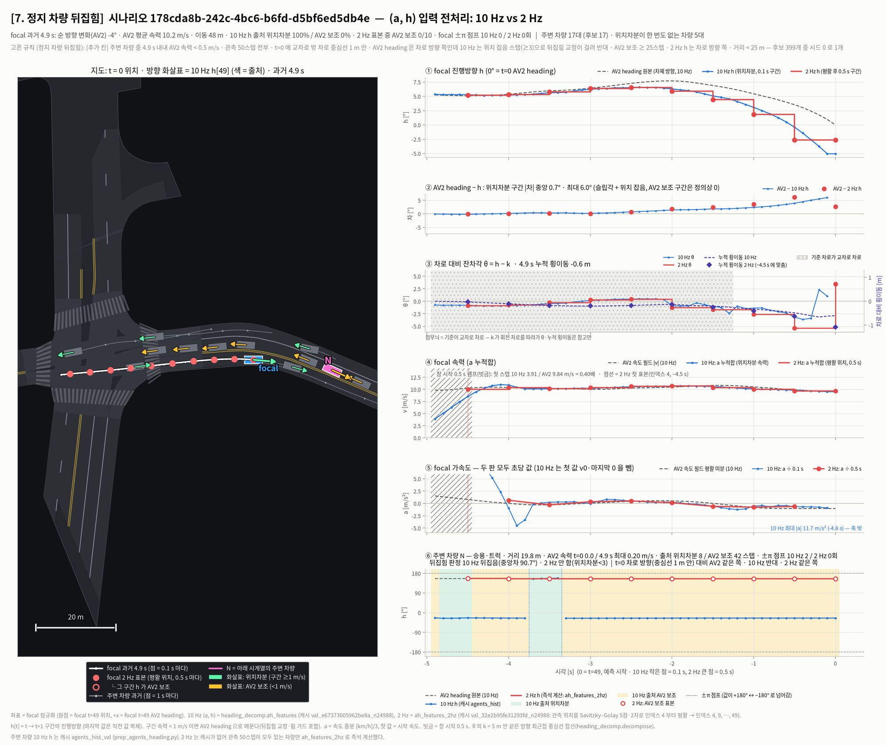
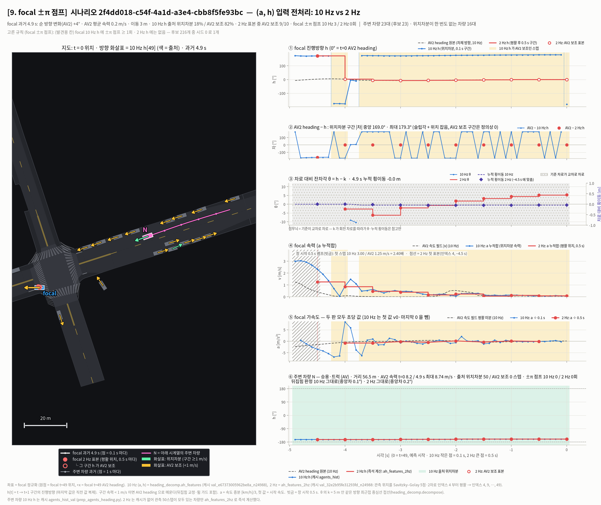
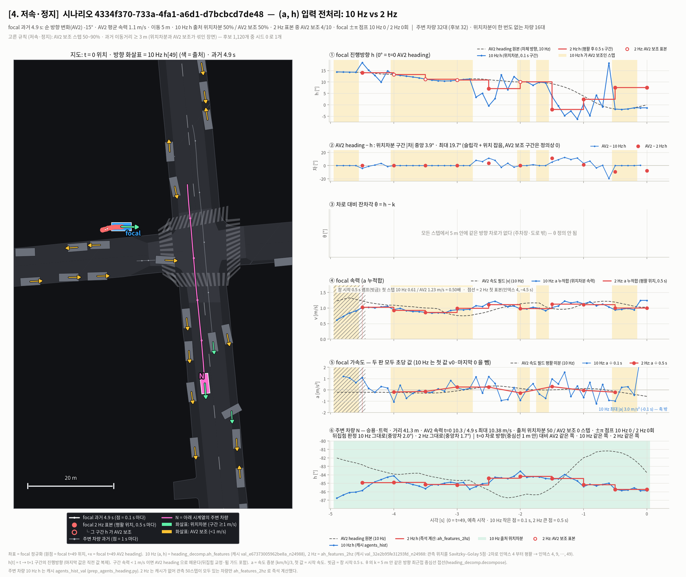
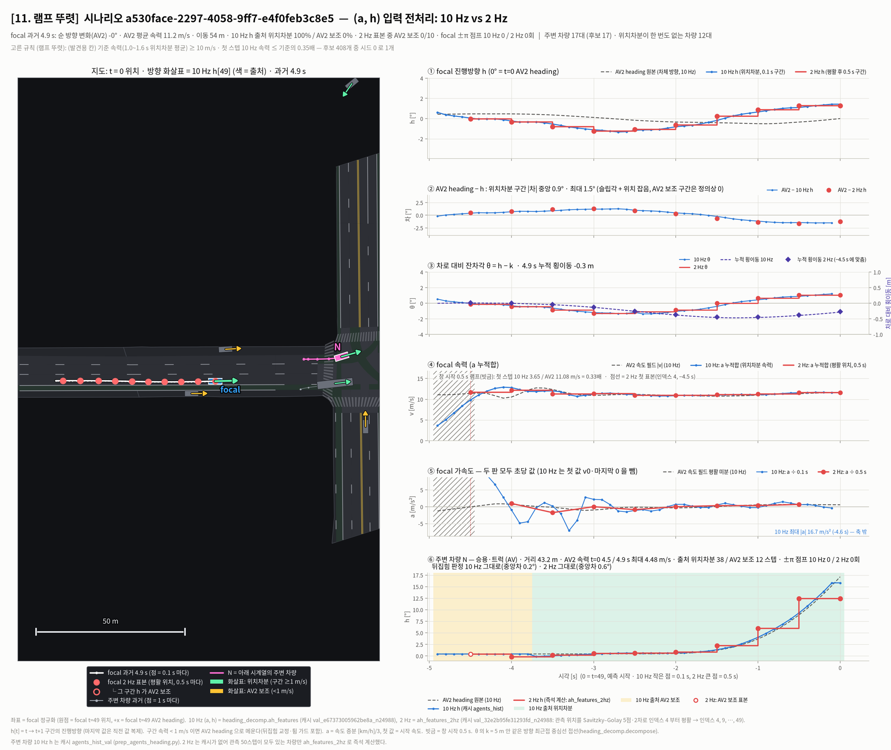

- 나머지 사본: `panel_01_straight`, `panel_02_left_turn`, `panel_05_lane_change`, `panel_08_many_stopped` (같은 폴더). 3·6·10 은 `viz/v4/heading_prep/` 에만 있다.

---

## 8. 결과 특성 표 (필수 요건 10)

| 상황·조건 | 수치 | 특성 해석 | 대표 시나리오 |
| --- | --- | --- | --- |
| 창 시작 약 1.1 s (이동 focal 16,208) | 첫 스텝 0.48배, \|a\| 9.9 m/s², 0.7 s 에 1.07배로 넘침 | AV2 위치 트랙의 창 경계 효과(원인 미확인, 추정). 10 Hz a 가 약 1 g 가짜 가속을 싣는다. 2 Hz 첫 표본은 중앙값만 1.017배이고 개별 값은 흔들린다 | 패널 11, 1·5·6 |
| 저속 위치차분 | \|Δh\| 중앙 8.2 °/s → 2 Hz 4.3 (1–2 m/s 구간) · 슬립 p95 24.5° (1–3 m/s 구간) | 스텝당 변위가 수 cm 라 위치 잡음이 방향을 흔든다. 2 Hz 가 약 절반으로 줄인다 | 패널 4 |
| 회전 중 (focal 과거 상태) | 슬립 중앙 5.5~6.5°, 4.9 s 복원 AV2 2.3~2.4 m vs h 0.04~0.05 m | 차체 방향과 이동방향이 어긋나는 것으로 **추정**(슬립·추정 오차를 가르지 않음). h 를 위치차분으로 만드는 근거 | 패널 2, 10 |
| 정지 주변 차량 (53.4%) | AV2 보조의 85% 를 냄. 26% 가 잡음 위치차분 ≥ 3 | 방향 정보는 사실상 AV2 box 뿐이다. 판정은 잡음이 정한다 | 패널 8 |
| 정지 차량 + 10 Hz 뒤집음 | 차로 기준: AV2 98.1% / 10 Hz 10.3% 맞음 (차로 안 6,162) · 미래 전진 기준: 97.9 / 17.1% (n=140, 독립 재현 표본 4,000) | `align_ref` 가 정지 차량에서 **방향을 틀리게 만든다** | 패널 7, 트리 B 잎 e5f24bc4 |
| 이동 2~5 m 주변 차량 | 10 Hz 차로 반대 22.7% / 2 Hz 9.2% / AV2 2.7% (차로 안·50스텝 관측 8,655) · 판정 불일치 27.4% | 잡음과 실제 이동이 섞이는 경계 구간. 두 주기에서 판정이 가장 많이 갈린다 | 트리 B 잎 761c7f97 |
| 20 m 이상 움직인 주변 차량 | 뒤집음 0.14~0.16%, 차로 반대 ≤ 0.4% (세 값 같음) | 위치차분이 믿을 만하고 뒤집힘 교정이 의도대로 동작하는 것으로 **추정** | 패널 1·3 N |
| ±π 점프 (50스텝 관측 주변 차량 256,686) | 10 Hz 13.6 → 2 Hz 10.1%. 점프 차량 중 모든 관측 스텝이 \|h\| ≥ 150°(대향 방향)인 것은 49% | 약 절반은 wrap 경계(대향차의 작은 흔들림), 약 절반은 잡음 튐으로 **추정** | 패널 6 (경계), 8 (잡음) |
| focal AV2 보조 구간 뒤집음 | 10 Hz 180 시나리오 (t=0 h 뒤쪽 90), 2 Hz 70 | t=0 입력 방향이 frame 0° 와 180° 어긋날 수 있다. 원인은 정지 중 위치 잡음·창 시작 램프로 **추정** | 패널 9 |
| 차선변경 (과거) | 차로 대비 누적 ±2.5 m 초과 177개 (좌 97·우 80) | h 변화는 2° 안이지만 θ 가 수 초 동안 3° 로 유지된다 → θ 가 LC 를 드러낸다 | 패널 5 |
| 먼 주변 차량 (≥ 100 m) | 2 Hz 계산 가능 32%, 미관측 36% | 주변 차량 2 Hz 입력에는 끊긴 트랙 처리가 먼저 필요하다 | — |

---

## 9. 한계

- **시드·표본:** 시드 1개, val 만 봤다. 패널은 상황마다 1장이다.
- **정답 부재:** 원본 AV2 heading 이 옳다는 독립 정답은 없다. 두 참고 기준으로 판단했다.
  - 차로 방향: 교차로 밖·중심선 1 m 안만 본다. 뒤집힌 정지 차량의 22% 만 덮는다.
  - 미래 전진 방향: 정지 뒤 3 m 이상 전진한 소수만 본다(표본 4,000 에서 뒤집힘 n=140). 미래를 쓰므로 **분석용**이다.
  - 두 기준이 99.3% 일치하고 결론도 같다. 그래도 뒤집힌 정지 차량 대부분(차로 밖 · 전진 안 함)은 직접 검증하지 못했다.
- **과거 상태 분류:** 과거 창에 임계값을 옮긴 것이라 정답 기반 분류와 다르다. 차선변경은 교차로·차로 없음을 빼서 적게 잡힌다.
- **θ·누적 횡이동:** 교차로 안에서는 회전 차로를 잡아 의미가 없다(점무늬).
- **주변 차량 2 Hz:** 즉석 계산이다. 관측이 끊긴 트랙(47.7%)은 다루지 않았다.
- **결정 트리:** 서술용이다. 트리 B 의 주 분기는 규칙에서 나온 기계적 관계다.
- **슬립각·램프:** 슬립각은 실제 슬립·추정 오차·위치 잡음을 가르지 않았다. 램프 원인(창 단위 위치 평활 경계 효과)은 **추정**이다.
- **정리 안 한 파일:** 앞선 실행의 한글 이름 패널 7장은 `viz/v4/heading_prep/_stale/` 로 옮겨 두었다. `dev_n*/` 는 개발용 부분 실행이다.
