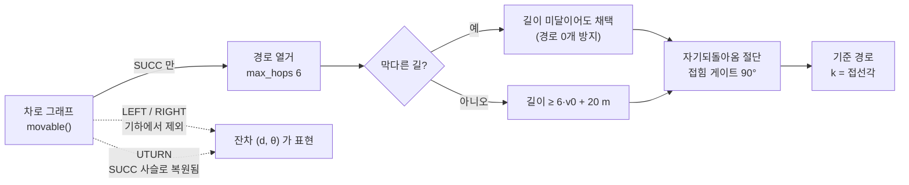

# v4 방향 표현 — `h = k + θ` 와 그 전제 조건

작업일: 2026-09-09 · 코드: `src/heading_decomp.py`, `src/lane_frame.py`

---

## 0. 한 문장으로

**"방향을 절대각으로 예측하지 말고 `도로가 휜 만큼(k)` + `차체가 더 휜 만큼(θ)` 으로 나눠라.
그러면 지도가 큰 부분을 공짜로 주고 모델은 0 근처의 작은 잔차만 배우면 된다."**

```
h  =  k  +  θ
      ↑     ↑
   지도가   모델이
   준다     배운다
```

## 1. 표기 — `kappa` 를 쓰지 않는 이유

`docs/action_design_explained.md` 에서 `kappa` 는 이미 **곡률 [1/m]** 이다. 방향 분해는
**각도 [rad]** 끼리의 덧셈이므로 같은 기호를 쓰면 단위가 섞인다. 그래서 `k` 로 쓴다.

| 기호 | 뜻 | 단위 |
| --- | --- | --- |
| `h` | 진행 방향 | rad |
| `k` | 차로 방향각 — '도로의 휘어짐' | rad |
| `θ` | 차로 대비 잔차각 — '차체의 휘어짐' | rad |
| `kappa_lane` | 차로 **곡률** (L0 용, 별개) | 1/m |

두 식은 같은 분해의 미분/적분 관계다:

```
h = k(s) + θ        를 호길이로 미분하면        dh/ds = kappa_lane(s) + dθ/ds
```

**각도 레벨(위)로 예측하면 적분이 한 단계 줄어든다.** 이게 실질적 이득이다:

| | 곡률 레벨 `kappa = kappa_lane + δ` | **각도 레벨 `h = k + θ`** |
| --- | --- | --- |
| 적분 단계 | δ → θ → p (2회) | θ → p (1회) |
| 잔차 편향의 영향 | δ 편향 0.005 /m 가 60 m 누적 → heading 17° | **거리 따라 안 커짐** |
| 정지 차량 (step 의 14.5%) | s 가 안 늘어 곡률이 정의 안 됨 | heading 그대로 정의됨 |
| 실현가능성 | 출력 형식이 **구조적으로** 보장 | Δθ 레이트 제한으로 **직접 걸어야** 함 |

## 2. `h` 를 AV2 heading 으로 쓰지 않는 이유

AV2 `heading` 은 **차체 방향**이라 이동방향과 슬립각만큼 어긋난다. 방향만 바꿔 궤적을
다시 굴리면(스텝 길이는 원본 고정 → 오차 원인이 방향뿐) 이렇게 된다.

| h 만드는 법 | 평균오차 | **최종오차** | p95 최종 | 보조 비율 |
| --- | --- | --- | --- | --- |
| 위치차분만 (보조 없음) | 0.000 m | **0.000 m** | 0.000 m | 0% |
| < 0.5 m/s 를 AV2 로 | 0.049 | 0.087 | 0.486 | 11.9% |
| **< 1.0 m/s 를 AV2 로** | **0.082** | **0.145** | 0.765 | **15.5%** |
| < 2.0 m/s 를 AV2 로 | 0.171 | 0.310 | 1.170 | 26.0% |
| AV2 heading 그대로 | 0.927 | **1.693** | 5.030 | 100% |

> val 3,000 시나리오 focal. `python src/heading_decomp.py --task recon`

### 기준속도를 1.0 m/s 로 정한 근거

저속에서는 위치차분 방향이 노이즈가 된다. 스텝간 방향 변화의 중앙값:

| 속력 | 위치차분 떨림 | AV2 떨림 | 판정 |
| --- | --- | --- | --- |
| < 0.5 m/s | **7~11°/step** (70~110°/s) | 0.03~0.09° | **차량 한계 밖 — 노이즈** |
| 0.5~1.0 | 2.97° (30°/s) | 0.20° | 여전히 의심 |
| 1.0~1.5 | 1.81° (18°/s) | 0.42° | 실제 저속 회전으로 설명 가능 |
| 2.0~3.0 | 0.76° | 0.33° | 깨끗 |

**1.0 m/s** 는 물리적으로 불가능한 구간을 전부 걷어내는 가장 낮은 값이고, 그때 복원오차
0.145 m 로 AV2 를 그대로 쓸 때(1.693 m)보다 **12배 정확하다**.

> 보조를 "직전 방향 유지"로 하면 0.111 m 로 조금 더 낫지만, 정지선에서 기어가며 도는
> 구간에서 유지 값이 낡는다. AV2 를 쓰되 `align_ref()` 로 180° 뒤집힘을 먼저 교정한다.

### 함정 — 튐 가드를 위치차분에 걸면 안 된다

`|Δh| > 30°` 가드는 AV2 **라벨 오류**(전수 조사에서 2,573만 step 중 11건, 최대 174°)를
잡으려던 것이다. 이걸 위치차분 h 에 걸면 정지 구간의 정상적인 변위 방향 변화까지 얼려서
**복원이 0.000 → 2.34 m 로 무너진다.** 가드는 보조 신호에만 건다.

## 3. 주변 차량 라벨 — 숫자를 나눠 봐야 한다

"주변 차량 heading 이 뒤집힌 트랙이 많다"는 관찰을 이동거리별로 갈랐다 (val 3,000 / 차량 12.5만 트랙).

| 트랙 총 이동거리 | 판정가능 트랙 | 뒤집힘 |
| --- | --- | --- |
| 0–2 m | 11,744 | **42.4%** |
| 2–5 m | 18,550 | 35.3% |
| 5–20 m | 24,137 | 12.3% |
| 20–50 m | 14,587 | **0.7%** |
| 50 m 이상 | 15,275 | **0.1%** |

`static`·`background` 클래스가 45~48% 로 나오는 게 결정적이다 — 안 움직이는 물체는
이동방향이 랜덤이라 절반이 뒤집힌 걸로 세진다. **실제로 움직인 차량의 라벨은 거의 안 뒤집혀 있다.**

→ 위치차분을 쓰는 이유는 "라벨이 망가져서"가 아니라 **"복원이 무손실이라서"** 다.
다만 저속 트랙에서는 뒤집힘을 검증할 방법이 없으므로 보조 신호는 교정하고 써야 한다.

## 4. θ 실측 결과

| 기준 | 중앙 | p90 | p95 | ±10° | 매칭률 |
| --- | --- | --- | --- | --- | --- |
| **point** (최근접 차로점) | 1.00° | 10.75° | 22.75° | 89.3% | 96.5% |
| **route** (경로 기준, 수정 후) | 1.00° | **8.00°** | **14.50°** | **91.9%** | **96.4%** |

6초 동안 **따라가야 할 변화량**이 분해의 실익을 가장 잘 보여준다.

| | 중앙 | p90 | p99 |
| --- | --- | --- | --- |
| `\|Δh\|` (절대각) | 2.39° | **52.79°** | 95.97° |
| `\|Δθ\|` (잔차) | 2.24° | **14.64°** | 50.17° |

**지도가 방향 변화의 약 2/3 를 대신 설명한다.**

한 가지 짚을 것 — h 를 AV2 로 쓰든 직접 만들든 **θ 분포는 사실상 같다**(±10° 89.3% vs 88.9%).
직접 만드는 이득은 전부 복원 쪽에 있지 θ 품질에 있지 않다.

## 5. 전제 조건이었던 것 — 경로 열거기의 결함 둘

`k` 는 기준 경로의 접선각에서 나온다. 그래서 **경로가 틀리면 θ 라벨이 통째로 오염된다.**
재다가 `lane_frame.build_routes` 에서 결함 두 개를 찾았다.

### 결함 1 — 차선변경 이음매에서 경로가 180° 접힌다

`movable()` 이 successor 뿐 아니라 차선변경(LEFT/RIGHT)도 돌려주는데, `stitch()` 가
이웃 차로 중심선을 **통째로** 이어붙인다. 이웃 차로는 현재 차로 **옆에서 처음부터** 시작하므로
이음매가 뒤로 접힌다.

| 경로가 쓴 이동 | 개수 | 접힘 |
| --- | --- | --- |
| succ 만 | 1,934 | **0%** |
| right+succ | 1,095 | 98.4% |
| left+succ | 880 | 99.3% |
| left+right+succ | 262 | 100% |

### 결함 2 — 경로가 6초를 못 덮는다

`max_hops=4` 인데 AV2 차로 조각이 조각당 ~15 m 라 4홉 ≈ 60 m 다. 6초에 90 m 가는 차량은
경로 끝을 지나치고, 대응점이 끝에 고정되어 `|d|` 가 무한정 커진다(최대 102 m).

| | 값 |
| --- | --- |
| 6초 실주행 거리 (중앙) | 36.5 m |
| 경로가 못 덮는 시나리오 | **34.5%** (부족분 중앙 18.4 m) |

### 수정 — succ-only 로 바꾸고 지평을 v0 로 잡는다



**왜 차선변경을 기하에서 빼는가** — 지도가 **전이 지점을 주지 않는다.** 어디서 차로를 바꿀지는
두 차로가 겹치는 구간 전체에 걸친 연속 자유변수라, 이음매 위치를 고르는 순간 지도에 없는 값을
기하에 박게 되고 그 전이 곡률(0.026~0.071 1/m, 실제 완만한 커브의 3~7배)이 `k` 로 둔갑한다.
**`h = k + θ` 는 `k` 가 도로만 담아야 성립한다.**

차선변경은 버리는 게 아니라 **다른 축으로 옮긴다**: 목표 차로 사슬이 별도의 succ-only 경로로
이미 열거되고(후보 반경 5.0 m > 차로 폭 3.42 m), 같은 사슬 안에서의 변경은 잔차 `(d, θ)` 가 표현한다.

### 결과

| 지표 | 수정 전 | 수정 후 |
| --- | --- | --- |
| `legacy=True` 하위호환 | — | **1459/1459 · 1447/1447 일치, 좌표 최대차 0.00e+00** |
| 접힘 >90° 경로 비율 | 55.4% | **0.000%** |
| 자기되돌아옴 경로 | 16,814 | **0** |
| 6초 못 덮는 경로 | 11.7% | **2.0%** |
| 경로 0개 시나리오 | 2 | **0** |
| 경로 수 / 시나리오 | 20.9 | 9.7 |
| 경로 접선 꺾임 (중앙) | **118.9°** | **3.5°** |
| 역주행 (모드) | 0.56% | **0.11%** |
| 투영 후 minADE6 | 3.432 | **1.702** |
| 모드 평균 ADE | 7.415 | **5.171** |

> 두 센터라인(`json`/`api`) 모두에서 같은 결과. `heading_decomp` 는 `api` 를 쓰므로 둘 다 확인해야 한다.

**도로이탈만 2.65% → 3.10% 로 나빠졌는데, 궤적 품질 회귀가 아니다.** 이탈점은 가장 가까운
차로 중심선에서 **1.79 m**(중앙) 떨어져 있고 그 중심선 자체는 **100% 도로 안**이다. 즉
`project()` 의 `half_w=1.75` 가 실제 차로 반폭(폭 3.42 m → 1.71 m)보다 커서 회랑 가장자리가
폴리곤을 살짝 넘는 것이다. 수정 전에는 접힌 경로의 투영이 안쪽으로 되짚어 들어가 가려져 있었다.

### 게이트 상수에 대한 경고

`MAX_KINK_DEG` 를 30° 로 두면 안 된다. **지도에 20.4 m 에 133° 를 도는 정상적인 교차로
차로가 실재한다**(27,509개 차로 중 json 3개 max 106°, api 8개 max 51°). 30° 로 자르면 그런
차로를 조용히 지우고 하위 경로까지 사라진다. 90° 로 두어 **접힘 검출기로만** 쓴다.

## 6. 도로 이탈 벌점 — 폴리곤이 아니라 차로 중심선 기준

### 하면 안 되는 것

`drivable_areas` 폴리곤의 **중심축에서 벗어난 만큼** 벌주면 안 된다. 그 중심축은 편도 2차선에서
**정확히 중앙 이중황색선**이라, 세게 걸면 **정면충돌 차선이 최적해**가 된다.

### 하는 것 — 차로 중심선 기준 단측 hinge

```
L4 = mean_t  max(0, |d_t| − w)        # 회랑 안이면 0, 밖으로 나간 만큼만
```

"중앙"이 두 개라 섞이기 쉽다:

| | 무엇의 중앙 | 벌점 |
| --- | --- | --- |
| **차로 중심선** | 차로 하나의 중앙 | 양측으로 걸어도 안전 — 실제로 있어야 할 자리다 |
| 주행가능영역 중심축 | 도로 전체의 중앙 = 중앙선 | **걸면 역주행이 최적해** |

차로 기준으로 하면 **SDF 전처리가 통째로 없어진다** — `to_frame()` 이 이미 `(s, d)` 를 준다.

### deadband `w` — 정답 궤적이 넘는 비율 = 오탐률

| w | 최근접 차로 기준 (step / 시나리오) | 자기 경로 기준 (step / 시나리오) |
| --- | --- | --- |
| 1.00 m | 19.8% / 40.9% | 25.2% / 43.7% |
| **1.75 m** (차로 반폭) | 6.7% / 17.1% | **11.9% / 25.4%** |
| 2.50 m | 3.4% / 9.4% | 6.9% / 15.9% |
| 3.50 m | 1.8% / 5.4% | 3.5% / 7.6% |
| 5.00 m | — | 1.0% / 2.9% |

**차로 반폭 1.75 m 는 너무 좁다** — 정답 궤적의 12% step 을 벌준다. 실제 주행은 중앙
0.40 m 로 중심선에 붙어 다니지만 꼬리가 두껍다(교차로 코너 컷, 차선변경 전개, 넓은 도로).
**`w = 2.5~3.5 m`, 가중치는 작게 단일 항**으로 쓴다 — off-road 손실을 4항 세트로 넣은
실험은 `minFDE 1.86 → 1.99` 로 오히려 나빠졌다.

기준을 무엇으로 할지는 단계가 있다:

| | 최근접 차로 | 자기 경로 |
| --- | --- | --- |
| 경로 열거 필요 | 없음 | L3 필요 |
| 잡는 것 | 도로 이탈, 차로 이탈 | + **갈림길을 잘못 탄 모드** |
| 오탐 (w=2.5) | 3.4% | 6.9% |

## 6.5 L3 선행 확인 — 후보 경로 recall

문서가 정한 go/no-go 는 `recall@5 ≥ 0.90` 이다. 재보니 **게이트가 걸렸는데, 원인이
경로 열거기가 아니라 출력 밴드**였다 (val 3,000, 과거 적합도 정렬, `src/route_recall.py`).

| 출력 밴드 | recall@1 | recall@5 | 천장(@40) | 대가 |
| --- | --- | --- | --- | --- |
| `w=1.75` 차로 반폭 | 63.9% | 77.9% | **79.7%** | 없음 — 역주행·도로이탈 **구조적으로 불가능** |
| **규칙 밴드 + 교차로 완화** | 72.0% | **87.4%** | **89.9%** | 규칙상 갈 수 있는 쪽만 열림 → 보장 유지 |
| `w=3.6` 평평 | 81.1% | **94.5%** | 96.6% | 밴드의 **27.6% 대향차로 / 21% 도로 밖** |

K 를 40까지 늘려도 `w=1.75` 는 79.7% 가 천장이다 — **후보를 더 만들어도 안 오른다.**
succ-only 로 바꾸면서 차선변경이 잔차 `d` 로 옮겨갔으니 당연하다(차선변경은 `d` 가 차로폭만큼 움직인다).

**규칙 밴드**를 채택했다. `w=3.6` 만 판정선을 넘지만, 그 통과는 **보장을 팔아서** 산 것이다 —
이 설계를 고른 근거가 "실현 불가능한 궤적 26% → 0%" 인데 ±3.6 으로 열면 출력 공간 자체가
역주행을 허용한다. 규칙 밴드의 천장 89.9% 는 판정선과 표본오차 안에서 같다(n=2,380).

> 정렬도 공짜로 개선된다. **과거 적합도 순**으로 매기면 호길이 순 대비 recall@1 이
> 43.1% → 63.9% 로 오른다(recall@5 는 비슷). 미래를 안 보므로 추론에서도 쓸 수 있다.

## 7. 개발 순서와 근거

| 순서 | 무엇 | 왜 그 순서인가 |
| --- | --- | --- |
| 1 | heading 라벨 품질 전수 조사 | θ 가 라벨 잡음에 묻히면 분해 자체가 무의미 |
| 2 | `build_heading` — h 를 위치차분으로 | 복원 무손실이 이 표현의 전제 |
| 3 | **경로 열거기 수정** | k 가 경로에서 나오므로 경로가 틀리면 θ 가 통째로 오염 |
| 4 | θ 입력 채널 A/B | 문서가 "L1 은 정보 0" 이라 했으므로 **검증 대상** |
| 5 | 벌점 (차로 기준 hinge) | 3번이 있어야 자기 경로 기준으로 승격 가능 |

## 8. 아직 안 된 것 (정직하게)

- **곡률은 여전히 잡음이다.** 원시 중심선을 유한차분한 `|kappa|` 는 p99 0.379 / max 3.589 1/m 로,
  L0 의 `kappa_lane` 테이블은 이 상태로 못 만든다. 스플라인 적합이 선행돼야 한다.
- **6초를 못 덮는 시나리오가 13.8% 남는다.** 6홉으로도 `6·v0 + 20 m` 를 못 채우는 고속 구간.
- **`half_w = 1.75` 가 출력 공간의 천장이다.** 이 값으로는 차선변경을 잔차로 표현할 수 없다
  (차선변경은 `d` 가 차로폭만큼 움직인다). 회랑 밴드 완화가 별도로 필요하다.
- **규칙 밴드로도 recall 천장이 89.9% 다.** 남는 10% 는 succ-only 후보 집합이 표현 못 하는
  미래이고, 학습으로 못 넘는 ADE 하한으로 남는다.

## 9. 재현

```bash
python src/heading_decomp.py --task speed              # 기준속도 근거
python src/heading_decomp.py --task recon              # 복원오차 교환
python src/heading_decomp.py --task flip               # 주변 차량 뒤집힘
python src/heading_decomp.py --task theta --ref route  # θ 분포
python src/simulate_v4_lane.py --limit 300             # 경로 열거기 효과 (--legacy 1 로 수정 전)
```
