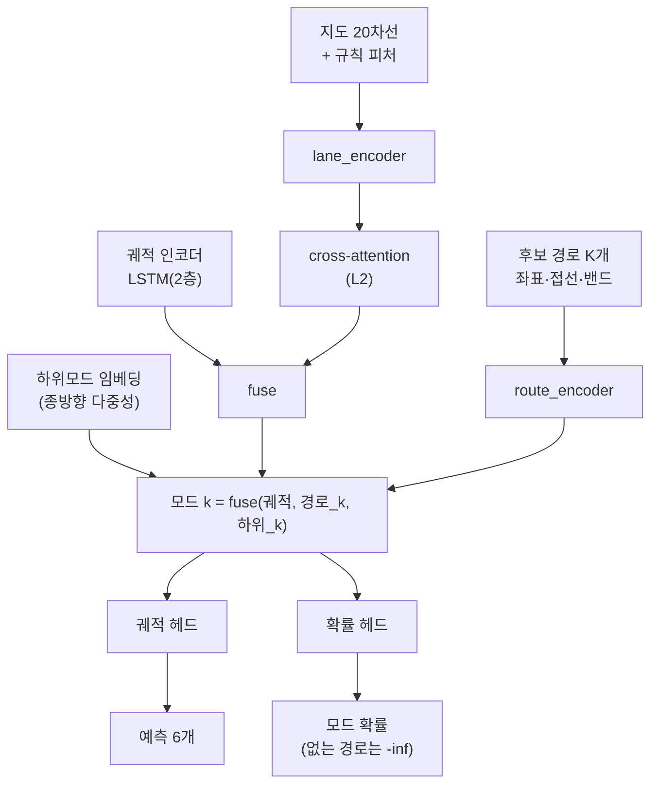

# 단계 2 (L3) — 예측 모드를 '익명 슬롯'에서 '지도에서 열거된 후보 경로'로

작업일: 2026-09-10 · 코드: `src/model_v4.py`, `src/train_v4.py`, `src/dataset_lane.py`

---

## 0. 한 문장으로

**"다중모드를 만드는 것은 정보가 아니라 이산 조건 변수다. 그 조건 변수는 지도에서 실제로
열거된 경로여야 한다 — 다만 지도가 갈림길을 주지 않는 곳에서는 다른 축이 필요하다."**

## 1. 왜 L3 가 대체 불가인가

모드가 학습된 익명 슬롯이면 갈림길에서 모델이 **액션의 평균**을 뱉는다. T자에서 좌회전과
직진이 반반이면:

```
좌회전   kappa = 0.083   (반경 12 m)
직진     kappa = 0
평균     kappa = 0.0415  (반경 24 m)
```

이 평균 곡률로 20 m 를 가면 방향이 48° 꺾이고 횡가속도는 6.0 m/s² 로 마찰 한계 안이다.
**즉 모든 검사를 통과한다** — 매끄럽고, 실행 가능하고, 속도도 정상이다. 그런데 이 궤적은
교차로를 비스듬히 가로질러 반대편 중앙분리대로 들어간다. **적분기가 평균을 그럴듯함으로
세탁한다.** L2(정보)로는 못 잡고, **폴리곤 기준** L4 로도 못 잡는다 — 큰 교차로는 폴리곤
전체가 주행 가능이라 벌점이 0이기 때문이다. (이 프로젝트가 채택한 **차로 중심선 기준** L4 는
교차로에서도 `|d|` 가 커져 일부 잡는다. 원문의 이 한계는 폴리곤 SDF 안에 대한 것이다.)

## 2. 구조



경로 하나는 **호길이 등간격 64점**으로 표현하고 점마다 6채널을 준다:
좌표 2 + 단위접선 2 + 밴드(좌/우 횡오프셋 상한) 2. 여기에 경로 길이 1채널.

## 3. 처음 결과 — 오히려 25% 나빠졌다

| | minADE6 | minFDE6 | params |
| --- | --- | --- | --- |
| 기준선 `lane_rules_s0` (익명 슬롯 K=6) | **1.292** | 2.883 | 414,294 |
| `v4_l2` — 새 하네스의 L2 경로 | **1.292** | **2.883** | 414,294 |
| `v4_l3` — 경로 조건화 모드 | **1.616** | 3.742 | 435,065 |

> `v4_l2` 가 기준선을 소수점까지 재현한다. 하네스가 동등하므로 차이는 전부 레벨 때문이다.

## 4. 원인 — 지도가 갈림길을 주지 않으면 모드가 붕괴한다

후보 경로 6개가 6초 지평에서 서로 얼마나 떨어져 있는지 쟀다 (val 1,000).

| 지평에서 경로끼리 최대 거리 | 시나리오 비율 |
| --- | --- |
| < 1 m | **28.2%** |
| < 2 m | 28.3% |
| < 5 m | 46.0% |
| < 10 m | 56.1% |

**시나리오의 28.2% 에서 모드 6개가 사실상 1개다.** 직선 도로에는 갈림길이 없으니 당연하다.

> 중복 제거 뒤 **구별되는 분기 수**로 보면: 0개 3.75% / 1개 12.55% / 2개 22.45% / 3개 21.75% /
> 4개 28.95% / 5개 5.90% / 6개 4.65%. **지도가 분기를 하나 이하로만 주는 시나리오가 16.3%** 다.
> 타일링이 채우는 것은 **슬롯**이지 분기가 아니다 — 두 양을 같은 이름으로 부르면 안 된다.
그런데 익명 슬롯은 그 자리에서 놀고 있지 않았다 — **속도 프로파일**(빨리/천천히)로 갈라져
있었다. 경로 조건화가 그 축을 통째로 없앤 것이다. `minADE6` 이 사실상 `minADE1` 이 된다.

## 5. 고침 — 모드를 (분기 × 종방향 하위모드) 로 쪼갠다

문서가 L3 에 맡긴 것은 **이산 분기 선택**이지 종방향 다중성이 아니다. 지도가 못 주는 축은
학습된 임베딩이 맡는 것이 설계 의도에 맞다.

1. **중복 제거** — 지평의 0.5배·1.0배 지점에서 모두 2.5 m 이내면 같은 분기로 보고 버린다.
2. **타일링** — 구별되는 분기가 R개면 K개 슬롯을 `i mod R` 로 채우고, 슬롯마다
   `sub = i // R` 인덱스를 준다.
3. **하위모드 임베딩** — 같은 경로에 배정된 슬롯이 서로 다른 예측을 내게 하는 축.

중복 제거 후 구별되는 분기는 **중앙 3개**(1개인 시나리오 12.55%, 6개 이상 4.65% — 4절의 분포와 같은 val 2,000 기준)이고,
샘플 처리 시간도 87.6 → 43.1 ms 로 줄었다(버릴 경로를 안 만드니까).

| | minADE6 | minFDE6 | 기준선 대비 |
| --- | --- | --- | --- |
| `v4_l3` 중복 제거 전 | 1.616 | 3.742 | +25.1% |
| **`v4_l3b` 중복 제거 + 하위모드** | **1.414** | **3.153** | **+9.5%** |

퇴행의 **62% 를 되찾았다.** 남은 +9.5% 의 원인은 아래에서 따로 짚는다.

### 잔여 +9.5% 는 어디서 오나 — 밴드 천장 탓이 아니다

처음엔 "표현력 천장(recall@5 = 87.4%)" 으로 설명했는데 **그건 틀렸다.** 코드가 반박한다:

```python
if self.level == "l3":
    return head, logits, {}          # 자유 xy — rollout 도 band 도 안 거친다
```

L3 는 경로를 **조건**으로만 쓰고 출력은 자유 위치 회귀다. 밴드에 갇히지 않으므로
밴드 recall 천장은 **L0·L4 의 제약이지 L3 의 제약이 아니다.**

실제로 어디에 몰려 있는지 직접 쟀다 (val 2,000, l3b 체크포인트 vs 기준선 저장 예측):

| 구별 분기 수 | 시나리오 | 기준선 | l3b | 퇴행 | 전체 퇴행 중 몫 |
| --- | --- | --- | --- | --- | --- |
| 1 | 251 | 1.187 | 1.362 | +0.175 | 18.8% |
| 2 | 449 | 1.188 | 1.232 | +0.044 | 8.4% |
| 3 | 435 | 1.399 | 1.529 | +0.129 | 24.0% |
| 4 | 579 | 1.332 | 1.430 | +0.098 | 24.1% |
| 5 | 118 | 1.538 | 1.502 | **−0.035** | −1.8% |
| 6+ | 168 | 1.136 | 1.507 | **+0.370** | 26.5% |

※ 6+ 행의 168개에는 지도 경로가 없는 75개가 섞여 있고, 그 75개는 l3b 를 부채꼴 폴백 데이터로
잘못 평가한 값이다. 실제 6분기 93개만 떼면 퇴행은 +0.310 이다.

- **분기 수와 퇴행의 상관은 +0.025** — 사실상 0이다. "분기가 적어 모드가 굶는다"는
  가설은 반증된다.
- 가장 큰 단일 덩어리는 **지도가 경로를 못 주는 75개**다. 폴백이 직진 하나뿐이라 `minADE1` 로
  채점됐다: 기준선 0.710 → l3b **1.326**, 퇴행 +0.616, 전체 격차(1.416 − 1.292 = 0.124 m)의 약 19%.
  처음엔 1.154 / +0.445 / 14.2% 로 적었는데, l3b 를 부채꼴 폴백 데이터로 평가한 방법 오류였다.
  이 버킷을 부채꼴 폴백으로 고치려던 시도는 실패했다(아래 실측).
- 지도가 경로를 준 1,925개에서도 **+0.104** 가 남는다. 실제 6분기 버킷만 떼면 **+0.310** 으로
  가장 크다 — **모드 예산을 지도 분기에 묶은 대가**로 읽힌다(안 갈 분기에도 모드를 하나씩 쓴다).
- `v4_l3b` 는 15에폭 마지막 구간에서도 1.454 → 1.414 로 아직 내려가는 중이다(`v4_l2` 는 같은
  구간 −0.021). **과소학습 가능성**이 남아 있고 이건 아직 확인 못 했다.

> **부채꼴 폴백(`v4_l3c`)에 무엇을 기대할 수 있나 — 상한 계산.** 75개 버킷은 기준선
> minADE6 이 0.710 으로 **전체 평균보다 훨씬 쉬운** 시나리오다. 그 버킷을 기준선 수준까지 **완벽히** 고쳐도 전체는
> 1.414 − 0.0375 × (1.326 − 0.710) ≈ **1.391 이 상한**이라고 봤다. 하지만 이 계산은 "그 버킷을 고쳐도
> 나머지는 그대로"를 전제하는데, 실제로 고쳤더니 나머지 1,925개가 나빠져 전제가 반증됐다(아래 실측).
>
> 상한은 예측이 아니다. 실측은 아래 표에 채운다 — **폴백 6개 호가 그 쉬운 버킷에서 오히려
> 틀린 다중모드를 만들 가능성**이 있고, 그러면 직진 하나보다 나쁠 수 있다.
>
> **실측 결과 — 부채꼴 폴백은 실패했다.** 각 체크포인트를 **자기 데이터**로 평가했다
> (l3b 는 `fallback="straight1"`, l3c 는 `"fan"`. 이걸 섞으면 안 된다 — 앞서 l3b 를 부채꼴
> 데이터로 재서 그 버킷을 1.154 라고 적었는데, 자기 데이터로는 **1.326** 이다).
>
> | | 전체 2,000 | 폴백 75 · minADE6 | 폴백 75 · **top1** | 나머지 1,925 |
> | --- | --- | --- | --- | --- |
> | `v4_l3b` 직진 1개 | **1.416** | 1.326 | 1.326 | **1.419** |
> | `v4_l3c` 부채꼴 6개 | 1.424 | **0.931** | **1.420** | 1.443 |
>
> **두 가지를 갈라 읽어야 한다.**
>
> 1. **폴백 버킷의 개선은 대부분 채점 인공물이다.** l3b 는 그 버킷을 모드 1개로 채점했고
>    (`route_mask` 합 1) l3c 는 6개로 채점한다. 호가 조금도 낫지 않아도 **6개 중 최소를
>    고르는 것만으로** 내려간다. 확률 최상위 모드 하나로만 재면 1.326 → **1.420 으로 오히려
>    나빠진다.**
> 2. **진짜 손해는 손대지 않은 1,925개에 있다.** 그 시나리오들은 두 실행의 **입력 데이터가
>    한 바이트도 다르지 않은데** 1.419 → 1.443 으로 나빠졌다. 원인은 학습 쪽이다 — train 의
>    약 3.1%(50k 중 ~1,562개)가 바뀌어 gradient 로 모델 전체를 흔들었다.
>
> → **부채꼴 폴백은 국소적으로 이기고 전역적으로 진다. 국소적 승리조차 대부분 채점 방식 변화다.**
>
> **원칙 하나** — 모드 개수가 바뀌는 변경은 `minADE6` 만으로 판정하면 안 된다. `minADE1`
> (확률 최상위 모드)을 반드시 함께 찍어야 공정하다.
>
> **아직 못 가른 것**: 손해가 (a) 부채꼴 기하 탓인지 (b) `route_mask` 1 → 6 으로 WTA 손실
> 지형이 바뀐 탓인지. 가르려면 **직진을 6슬롯에 복제한 판**(기하 다양성 0, 모드 예산만 6)이
> 필요하다 — `fallback="straight6"`. 그게 l3b 수준이면 (b), l3c 수준이면 (a) 다.


## 6. 밴드 — 출력 공간이 허용하는 횡오프셋

`succ-only` 경로에서는 차선변경이 잔차 `d` 로 표현되므로 `±1.75 m`(차로 반폭)로 자르면
표현력이 `recall@40 = 79.7%` 에서 막힌다. 그렇다고 `±3.6 m` 로 평평하게 열면 밴드의
**27.6% 가 대향차로, 21% 가 도로 밖**이 되어 출력 공간의 보장이 사라진다.

**규칙상 차선변경이 허용된 쪽과 교차로 안에서만** 넓힌다 (`lane_frame.rule_band`).

| 밴드 | recall@1 | recall@5 | 천장(@40) |
| --- | --- | --- | --- |
| ±1.75 고정 | 63.9% | 77.9% | 79.7% |
| **규칙 밴드 + 교차로 완화** | 72.0% | **87.4%** | **89.9%** |
| ±3.6 고정 | 81.1% | 94.5% | 96.6% |

교차로를 완화하는 이유: 교차로 차로는 좌우 이웃이 없어 규칙만 보면 반폭으로 묶이는데,
실제 차량은 회전호를 그보다 크게 벗어나 코너를 자른다. 이 완화 하나로 87.4% 가 된다.

## 7. 시각화

`src/visualize_v4_modes.py` — 예측 끝점에 그 모드가 조건으로 쓴 **경로 번호**를 적고,
`l0` 에서는 밴드를 칠해 출력 공간이 허용하는 범위를 보인다. 칸 제목에 구별 분기 수와
밴드 이탈 step 수가 들어가서, "모드가 후보 경로"라는 주장이 장면마다 검증된다.

```bash
python src/visualize_v4_modes.py --ckpt runs/lstm_v4_l3b_s0.pth --level l3 --out v4_modes.png
```

## 8. 정직하게 — 이 단계로 산 것과 판 것

| 산 것 | 판 것 |
| --- | --- |
| 모드가 지도에서 열거된 실제 경로가 됨 (평균 세탁 방지) | minADE6 1.292 → 1.414 (+9.5%) |
| 모드마다 자기 경로가 있어 L4 를 걸 기준이 생김 | 모드 예산을 지도 분기에 묶는 비용 |
| 모드 확률이 '어느 갈림길'이라는 해석을 가짐 | params +9% |

문서가 밝힌 대로 **다운스트림이 플래너면 이 거래가 맞고, 리더보드 순위가 목표면 다른 선택이
낫다.** 이 단계의 지표는 minADE6 단독이 아니라 위반율과 함께 읽어야 한다.

## 9. 재현

```bash
python src/train_v4.py --level l2 --theta 0 --tag v4_l2_s0     # 기준선 재현 (1.292)
python src/train_v4.py --level l3 --theta 0 --tag v4_l3b_s0    # 경로 조건화 (1.414)
```
