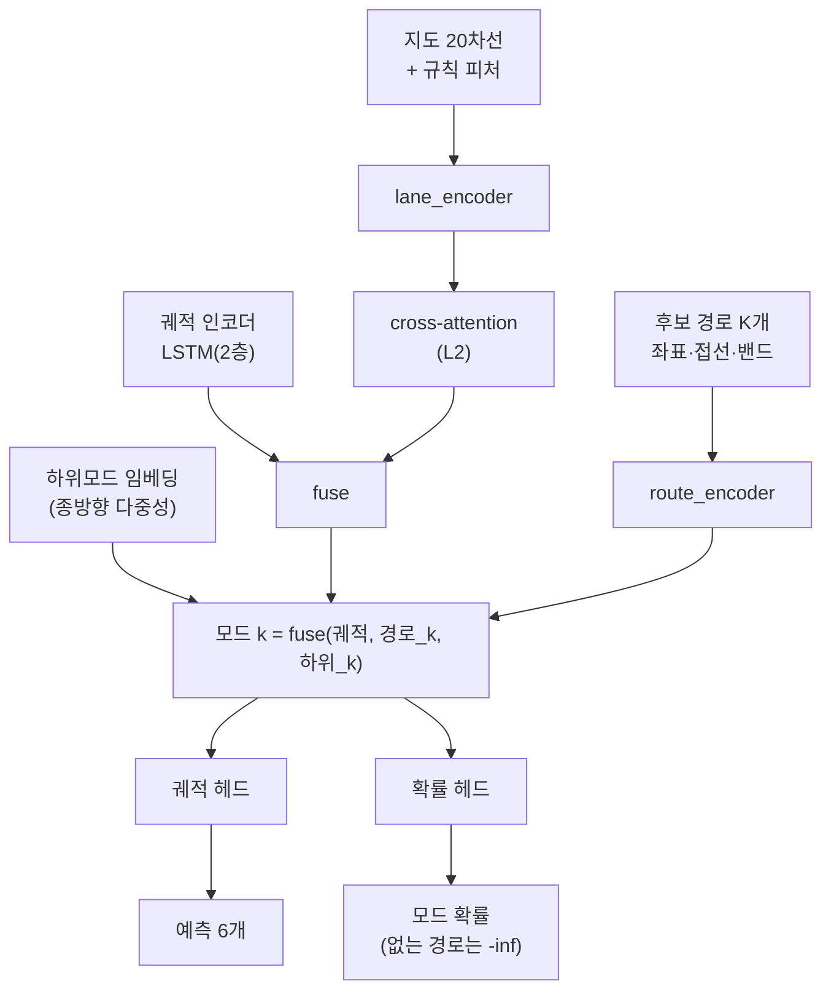

# 단계 2 (L3) — 예측 모드를 '익명 슬롯'에서 '지도에서 열거된 후보 경로'로

작업일: 2026-09-10 · 코드: `src/model_v4.py`, `src/train_v4.py`, `src/dataset_lane.py`

---

## 0. 한 문장으로

**"다중모드를 만드는 것은 정보가 아니라 이산 조건 변수다. 그 조건 변수는 지도에서 실제로
열거된 경로여야 한다 — 다만 지도가 갈림길을 주지 않는 곳에서는 다른 축이 필요하다."**

## 1. 왜 L3 가 대체 불가인가

모드가 학습된 익명 슬롯이면 갈림길에서 모델이 **액션의 평균**을 뱉는다. T자에서 좌회전과
직진이 반반이면:

```
좌회전   kappa = 0.083   (반경 12 m)
직진     kappa = 0
평균     kappa = 0.0415  (반경 24 m)
```

이 평균 곡률로 20 m 를 가면 방향이 48° 꺾이고 횡가속도는 6.0 m/s² 로 마찰 한계 안이다.
**즉 모든 검사를 통과한다** — 매끄럽고, 실행 가능하고, 속도도 정상이다. 그런데 이 궤적은
교차로를 비스듬히 가로질러 반대편 중앙분리대로 들어간다. **적분기가 평균을 그럴듯함으로
세탁한다.** L2(정보)로도 L4(벌점)로도 못 잡는다 — 큰 교차로는 폴리곤 전체가 주행 가능이라
벌점이 0이기 때문이다.

## 2. 구조



경로 하나는 **호길이 등간격 64점**으로 표현하고 점마다 6채널을 준다:
좌표 2 + 단위접선 2 + 밴드(좌/우 횡오프셋 상한) 2. 여기에 경로 길이 1채널.

## 3. 처음 결과 — 오히려 25% 나빠졌다

| | minADE6 | minFDE6 | params |
| --- | --- | --- | --- |
| 기준선 `lane_rules_s0` (익명 슬롯 K=6) | **1.292** | 2.883 | 414,294 |
| `v4_l2` — 새 하네스의 L2 경로 | **1.292** | **2.883** | 414,294 |
| `v4_l3` — 경로 조건화 모드 | **1.616** | 3.742 | 435,065 |

> `v4_l2` 가 기준선을 소수점까지 재현한다. 하네스가 동등하므로 차이는 전부 레벨 때문이다.

## 4. 원인 — 지도가 갈림길을 주지 않으면 모드가 붕괴한다

후보 경로 6개가 6초 지평에서 서로 얼마나 떨어져 있는지 쟀다 (val 1,000).

| 지평에서 경로끼리 최대 거리 | 시나리오 비율 |
| --- | --- |
| < 1 m | **28.2%** |
| < 2 m | 28.3% |
| < 5 m | 46.0% |
| < 10 m | 56.1% |

**시나리오의 28.2% 에서 모드 6개가 사실상 1개다.** 직선 도로에는 갈림길이 없으니 당연하다.
그런데 익명 슬롯은 그 자리에서 놀고 있지 않았다 — **속도 프로파일**(빨리/천천히)로 갈라져
있었다. 경로 조건화가 그 축을 통째로 없앤 것이다. `minADE6` 이 사실상 `minADE1` 이 된다.

## 5. 고침 — 모드를 (분기 × 종방향 하위모드) 로 쪼갠다

문서가 L3 에 맡긴 것은 **이산 분기 선택**이지 종방향 다중성이 아니다. 지도가 못 주는 축은
학습된 임베딩이 맡는 것이 설계 의도에 맞다.

1. **중복 제거** — 지평의 0.5배·1.0배 지점에서 모두 2.5 m 이내면 같은 분기로 보고 버린다.
2. **타일링** — 구별되는 분기가 R개면 K개 슬롯을 `i mod R` 로 채우고, 슬롯마다
   `sub = i // R` 인덱스를 준다.
3. **하위모드 임베딩** — 같은 경로에 배정된 슬롯이 서로 다른 예측을 내게 하는 축.

중복 제거 후 구별되는 분기는 **중앙 3개**(1개인 시나리오 10%, 6개 이상 7%)이고,
샘플 처리 시간도 87.6 → 43.1 ms 로 줄었다(버릴 경로를 안 만드니까).

| | minADE6 | minFDE6 | 기준선 대비 |
| --- | --- | --- | --- |
| `v4_l3` 중복 제거 전 | 1.616 | 3.742 | +25.1% |
| **`v4_l3b` 중복 제거 + 하위모드** | **1.414** | **3.153** | **+9.5%** |

퇴행의 **62% 를 되찾았다.** 남은 +9.5% 는 표현력 천장(recall@5 = 87.4%)과 모드 예산을
지도 분기에 묶은 대가다.

## 6. 밴드 — 출력 공간이 허용하는 횡오프셋

`succ-only` 경로에서는 차선변경이 잔차 `d` 로 표현되므로 `±1.75 m`(차로 반폭)로 자르면
표현력이 `recall@40 = 79.7%` 에서 막힌다. 그렇다고 `±3.6 m` 로 평평하게 열면 밴드의
**27.6% 가 대향차로, 21% 가 도로 밖**이 되어 출력 공간의 보장이 사라진다.

**규칙상 차선변경이 허용된 쪽과 교차로 안에서만** 넓힌다 (`lane_frame.rule_band`).

| 밴드 | recall@1 | recall@5 | 천장(@40) |
| --- | --- | --- | --- |
| ±1.75 고정 | 63.9% | 77.9% | 79.7% |
| **규칙 밴드 + 교차로 완화** | 72.0% | **87.4%** | **89.9%** |
| ±3.6 고정 | 81.1% | 94.5% | 96.6% |

교차로를 완화하는 이유: 교차로 차로는 좌우 이웃이 없어 규칙만 보면 반폭으로 묶이는데,
실제 차량은 회전호를 그보다 크게 벗어나 코너를 자른다. 이 완화 하나로 87.4% 가 된다.

## 7. 시각화

`src/visualize_v4_modes.py` — 예측 끝점에 그 모드가 조건으로 쓴 **경로 번호**를 적고,
`l0` 에서는 밴드를 칠해 출력 공간이 허용하는 범위를 보인다. 칸 제목에 구별 분기 수와
밴드 이탈 step 수가 들어가서, "모드가 후보 경로"라는 주장이 장면마다 검증된다.

```bash
python src/visualize_v4_modes.py --ckpt runs/lstm_v4_l3b_s0.pth --level l3 --out v4_modes.png
```

## 8. 정직하게 — 이 단계로 산 것과 판 것

| 산 것 | 판 것 |
| --- | --- |
| 모드가 지도에서 열거된 실제 경로가 됨 (평균 세탁 방지) | minADE6 1.292 → 1.414 (+9.5%) |
| 모드마다 자기 경로가 있어 L4 를 걸 기준이 생김 | 표현력 천장 89.9% |
| 모드 확률이 '어느 갈림길'이라는 해석을 가짐 | params +9% |

문서가 밝힌 대로 **다운스트림이 플래너면 이 거래가 맞고, 리더보드 순위가 목표면 다른 선택이
낫다.** 이 단계의 지표는 minADE6 단독이 아니라 위반율과 함께 읽어야 한다.

## 9. 재현

```bash
python src/train_v4.py --level l2 --theta 0 --tag v4_l2_s0     # 기준선 재현 (1.292)
python src/train_v4.py --level l3 --theta 0 --tag v4_l3b_s0    # 경로 조건화 (1.414)
```
