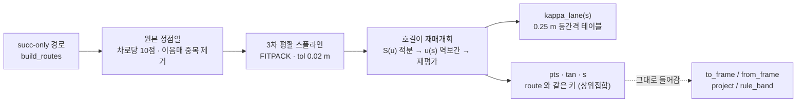

# v4 L0 — 경로별 곡률 테이블 `kappa_lane(s)`

작업일: 2026-09-10 · 코드: `src/lane_spline.py` · 전제: `docs/v4_heading_representation.md` (경로 열거기 수정)

---

## 0. 한 문장으로

**"지도 중심선을 그대로 미분하면 곡률이 아니라 잡음이 나온다. 스플라인을 먼저 적합하고,
그 스플라인의 곡률을 테이블로 쓴다."**

```
kappa  =  kappa_lane(s)  +  delta
          ↑                 ↑
       이 문서가 만든다     모델이 배운다
```


## 1. 왜 필요한가 — 원시 곡률은 잡음이다

AV2 지도에는 곡률 필드가 없다. 중심선 점열뿐이라 계산해내야 하는데, **그 점열의 형태가
문제**다. 전수로 세어 보면 이렇다 (val 120 시나리오, 차로 8,030개).

| | 값 |
| --- | --- |
| 차로당 중심선 점 개수 | **정확히 10점** (8,030개 차로 전부) |
| 차로 길이 | 중앙 19.97 m · p95 58.5 m |
| 정점 간격 | 중앙 2.22 m · p95 6.51 m · **max 20.36 m** |
| 정점 꺾임각 | 중앙 0.00° · p95 12.92° · max 91.83° |

`lane_frame.densify()` 는 정점 사이를 **직선으로** 채운다. 직선 위에서 곡률은 0 이고
정점에서만 방향이 꺾이므로, 유한차분 곡률은 **'선분 위 0 + 정점 델타함수'** 가 된다.

| 적합 전 (val 300 · 경로 2,791 · 95만 점) | p50 | p95 | p99 | max |
| --- | --- | --- | --- | --- |
| `\|kappa\|` [1/m] | 0.0000 | 0.0339 | 0.3005 | **327.244** |
| `\|dkappa/ds\|` [1/m²] | 0.0000 | 0.1949 | 0.8781 | **1308.29** |

`max 327 1/m` 은 **회전반경 3 mm** 다. 도로가 아니라 표현 방식의 산물이다.

이 테이블을 L0 에 넣으면 `delta` 가 배우는 것이 "이 운전자가 차로보다 얼마나 더 휘는가"가
아니라 **"지도 정점 잡음을 어떻게 상쇄하는가"** 가 된다. 곡률 레벨 분해의 전제가 무너진다.

> 10점은 매끄러운 도로를 성기게 샘플한 것이지 **도로가 실제로 꺾인 자리가 아니다.**
> 그러므로 정점 사이를 직선이 아니라 곡선으로 메우는 것이 원본에 더 가깝다.

## 2. 무엇을 하나



**적합은 반드시 원본 정점에 한다.** `densify` 된 점열에 적합하면 정점 사이를 직선보간해
만들어낸 점들이 "여기는 직선이다"라는 **가짜 증거를 간격에 비례한 개수만큼** 집어넣는다.
간격 0.24 m 구간과 20 m 구간의 가중치가 80배 벌어지는 것도 같은 문제다.

**차선변경 blend 는 넣지 않는다.** 경로가 이미 succ-only 이고, 차선변경을 기하에 넣으면
지도에 없는 전이 지점을 골라야 한다. 그 전이 곡률(0.026~0.071 1/m — 실제 완만한 커브의
3~7배)이 '도로의 휘어짐'으로 둔갑한다. 차선변경은 잔차 `(d, θ)` 가 표현한다.
**이 파일도 같은 원칙을 지킨다 — 경로 폴리라인 하나를 매끄럽게 만들 뿐, 경로에 없는 기하를
만들지 않는다.**

## 3. 곡선 종류를 무엇으로 골랐나

`python src/lane_spline.py --task compare --limit 120` (경로 1,147개).

| 설정 | ms | 정점편차 평균/p95/max [m] | `\|k\|` p99/max | `\|dk/ds\|` p95/p99/max |
| --- | --- | --- | --- | --- |
| 보간 k=3 | 0.99 | 0.000 0.001 0.007 | 0.162 / 2.178 | 0.0278 / 0.1117 / **13.29** |
| 보간 k=5 | 1.21 | 0.000 0.001 0.008 | 0.165 / 3.542 | 0.0305 / 0.1148 / 12.29 |
| FITPACK k=3 tol=0.01 | 1.06 | 0.006 0.020 0.055 | 0.156 / 1.333 | 0.0160 / 0.0584 / 2.375 |
| **FITPACK k=3 tol=0.02** | **1.07** | **0.012 0.037 0.116** | **0.154 / 0.713** | **0.0139 / 0.0462 / 0.736** |
| FITPACK k=3 tol=0.05 | 1.00 | 0.027 0.086 0.283 | 0.150 / 0.641 | 0.0115 / 0.0378 / 0.517 |
| FITPACK k=3 tol=0.20 | 0.96 | 0.087 0.304 0.758 | 0.136 / 0.731 | 0.0092 / 0.0295 / 0.804 |
| FITPACK k=5 tol=0.02 | 1.25 | 0.011 0.036 0.110 | 0.154 / 0.693 | 0.0148 / 0.0446 / 1.618 |
| 벌점평활 lam=1 | 3.21 | 0.004 0.023 0.240 | 0.151 / 0.493 | 0.0153 / 0.0410 / **0.233** |
| 벌점평활 lam=10 | 2.80 | 0.017 0.094 0.562 | 0.141 / 0.509 | 0.0120 / 0.0271 / 0.167 |

### 3.1 3차다 (5차 아님)

3차면 C² 라 **곡률이 연속**이고 그게 요구사항이다. 5차(C⁴, `dkappa/ds` 까지 연속)도 재봤지만
같은 tol 에서 `|dkappa/ds| max` 가 **0.736 → 1.618** 로 나빠지고 경로 끝 1 m 구간의
`|kappa|` 평균이 0.0108 → 0.0190 으로 부푼다. **차로당 10점뿐인 데이터에 차수를 올리면
매끄러워지는 게 아니라 흔들린다.**

### 3.2 잔차제약(FITPACK)이지 벌점평활이 아니다 — 여기가 핵심

숫자만 보면 벌점평활(`scipy.make_smoothing_spline`)이 이겨 보인다. `|dk/ds| max` 가 0.233 로
FITPACK 의 3분의 1 이다. 그런데 **경로 끝에서 무너진다.**

| 경로 끝에서의 거리 | 0~1 m | 1~2 m | 2~5 m | 5~10 m | 10~20 m |
| --- | --- | --- | --- | --- | --- |
| 벌점평활 lam=1 | **0.00134** | 0.00492 | 0.01005 | 0.01398 | 0.01478 |
| FITPACK tol=0.02 | **0.01079** | 0.00964 | 0.01090 | 0.01409 | 0.01479 |

> 표의 값은 그 구간의 평균 `|kappa|` [1/m]. 벌점평활은 끝 1 m 에서 **11배 붕괴**한다.

**이건 구현 실수가 아니라 추정량의 성질이다.** 평활 스플라인은 곧 natural spline 이라
(Reinsch), 거칠기 벌점 `∫f''²` 자체가 경계에서 `f''=0` 을 만든다. 경계 조건을 안 거는
P-스플라인을 직접 짜서 확인해도 **같은 붕괴가 나온다.**

참값을 아는 합성 곡선으로 보면 명확하다.

| 곡률 복원 | 내부 (중앙 80%) | s=0 끝점 |
| --- | --- | --- |
| R=25 m 사분원 | 벌점 **+2.4%** / FITPACK **+0.7%** | 벌점 **−100.0%** / FITPACK +12.2% |
| R=150 m 완만커브 | 벌점 +2.7% / FITPACK +0.1% | 벌점 **−100.0%** / FITPACK +2.5% |

벌점평활은 양 끝에서 **정확히 0** 을 낸다. FITPACK 은 급커브에서 +12%, 완만한 커브에서
+2.5% 과대에 그치고 **내부 정확도도 더 낫다.**

#### 이게 왜 치명적이냐 — 오염 구간을 실제로 쓴다

val 400 시나리오에서 예측에 쓰는 `s` 구간이 경로 끝에서 얼마나 떨어져 있는지 쟀다.

| | p05 | p25 | p50 | p75 | p95 |
| --- | --- | --- | --- | --- | --- |
| t=0 위치 `s0` (앞끝까지) | −2.20 | 6.46 | **15.06** | 25.62 | 56.13 m |
| 뒷끝 여유 `L − s_end` | −13.37 | 33.75 | 50.63 | 69.07 | 102.16 m |

| | 비율 |
| --- | --- |
| 앞끝 5 m 안에서 시작 | 18.2% |
| 뒷끝 5 m 안에서 종료 | 13.4% |
| **양끝 오염이 안 걸리는 시나리오** | **68.9%** |

**시나리오의 31.1% 가 붕괴 구간을 실제로 쓴다.** 무시할 수 없다.

원호로 연장했다 잘라내는 보정도 만들어 봤다. 같은 표본(경로 500개)에서 끝 1 m 의
`|kappa|` 가 0.00113 → **0.00667** 로 **절반만** 회복한다 (그 표본의 내부값 0.01342 대비
50%). 비용은 2패스라 2배가 된다. FITPACK 은 그 문제가 애초에 없다. **채택.**

> 연장 보정을 만들 때 함정 하나 — 연장 방향을 **현(chord) 방향**으로 잡으면 안 된다.
> 원호에서 현은 접선과 Δθ/2 만큼 어긋나서, 15 m 연장하면 끝이 1.3 m 벌어지고 이음매에
> 없던 꺾임이 생긴다. 접선은 1차 적합 곡선에서 가져와야 한다.

### 3.3 tol = 0.02 m

FITPACK 의 `s` 는 '잔차 제곱합의 상한'이라 점당 허용 편차 `tol` 로 환산해 `s = n·tol²` 로
준다. `tol` 은 **지도 정점에서 얼마나 벗어나도 되는가** 다.

`0.01 → 0.02` 에서 `|dkappa/ds| max` 가 **2.375 → 0.736** 으로 무너진다. 그 위로는 꼬리가
거의 안 줄고 정점을 버리는 대가만 남는다 (0.05 에서 0.517, 0.20 에서 오히려 0.804 로 반등).
`tol=0.02` 의 정점편차 max **0.116 m 는 차로 폭 3.42 m 의 3.4%** 다.

`tol=0` (보간)은 쓸 수 없다. 정점을 그대로 지나가려면 `|dkappa/ds| max` 가 **13.29** 로
원시 상태와 다를 바 없어진다.

### 3.4 정점 가중은 균등

간격이 0.24~20 m 로 널뛰니 호길이 가중이 나을 것 같지만, 재보면 차이가 없다
(`|kappa| max` 0.713 → 0.722, 정점편차는 오히려 나빠짐). **남는 큰 곡률은 과대표집이 아니라
지도가 실제로 주장하는 급회전이다.**

## 4. 결과

`python src/lane_spline.py --task kappa --limit 300` (경로 2,791개 · 95만 점 · fallback 0건).

| | p50 | p95 | p99 | p99.9 | max |
| --- | --- | --- | --- | --- | --- |
| `\|kappa\|` 적합 전 [1/m] | 0.0000 | 0.0339 | 0.3005 | 0.5766 | **327.244** |
| `\|kappa\|` **적합 후** | 0.0003 | 0.0775 | **0.1487** | 0.2716 | **0.865** |
| `\|dkappa/ds\|` 적합 전 [1/m²] | 0.0000 | 0.1949 | 0.8781 | 1.6065 | **1308.29** |
| `\|dkappa/ds\|` **적합 후** | 0.0000 | **0.0131** | **0.0438** | 0.1434 | **3.512** |

반경으로 환산하면 물리적 타당성이 바로 보인다 (승용차 최소회전반경 ~5 m).

| `\|kappa\|` 임계 | 반경 | 적합 전 | 적합 후 |
| --- | --- | --- | --- |
| > 0.05 | < 20 m | 4.40% | **8.23%** |
| > 0.10 | < 10 m | 3.26% | 2.96% |
| > 0.20 | < 5 m | 1.92% | **0.35%** |
| > 0.50 | < 2 m | 0.180% | **0.003%** |
| > 1.00 | < 1 m | 0.0117% | **0.0000%** |

**`> 0.05` 만 늘어나는 게 핵심이다.** 원시 곡률은 선분 위에서 0 이고 정점에서만 튀므로
*완만한 회전을 아예 표현하지 못한다.* 적합 후에는 회전이 **실제로 일어나는 구간 전체에
퍼져서** 중간 크기 곡률이 정당하게 늘어나고, 물리적으로 불가능한 극단이 사라진다.

부수 효과로 경로 접선의 스텝간 꺾임도 정리된다 (val 150 · 경로 1,447개).

| 접선 꺾임 [deg/step] | 중앙 | p99 | max |
| --- | --- | --- | --- |
| 적합 전 | 4.681 | 18.592 | 26.27 |
| **적합 후** | **0.617** | **6.463** | **9.83** |

호길이 위상 민감도도 같이 좋아진다 — `s` 가 1 m 어긋났을 때 기준 heading `k` 의 오차가
**p99 13.05° → 8.68°**, max 50.85° → 34.42° 다.

## 5. 원래 중심선에서 얼마나 벗어나는가

두 가지를 나눠 재야 한다. **섞으면 결론이 뒤집힌다.**

| 무엇에 대한 편차인가 | 평균 | p95 | max |
| --- | --- | --- | --- |
| **지도 정점** (지도가 실제로 준 데이터) | 0.012 | 0.037 | **0.116** m |
| **densify 된 폴리라인** (기존 라벨의 기준) | 0.015 | 0.049 | **0.967** m |

정점 편차는 어디서나 **0.116 m 이내**다. 정점 꺾임이 30~60° 인 곳에서도 max 0.063 m 로,
꺾임이 커진다고 스플라인이 지도를 버리지 않는다 (상관 r = 0.345).

| 정점 꺾임 | 비율 | 편차 평균 | p95 | max |
| --- | --- | --- | --- | --- |
| 0~1° | 83.13% | 0.0093 | 0.0281 | 0.0845 m |
| 1~5° | 6.27% | 0.0238 | 0.0586 | 0.0985 m |
| 5~15° | 8.52% | 0.0226 | 0.0617 | 0.1156 m |
| 15~30° | 1.99% | 0.0260 | 0.0645 | 0.1028 m |
| 30~60° | 0.09% | 0.0309 | 0.0622 | 0.0627 m |

### 폴리라인 편차 0.967 m 의 정체 — 스플라인이 멀어진 게 아니다

**직선보간의 새그(sagitta)를 없앤 것**이다. 곡률 `kappa` 인 호를 간격 `h` 로 현으로 이으면
현이 호 안쪽으로 `kappa·h²/8` 만큼 들어간다. 정점 구간 45,980개에서 관측 편차와 이 예측식을
맞춰 봤다.

| | 평균 | p95 | max |
| --- | --- | --- | --- |
| 관측 최대편차 | 0.0203 | 0.0653 | 0.9672 m |
| 새그 예측 `kappa·h²/8` | 0.0091 | 0.0581 | 0.9108 m |

**상관 r = 0.886, 최소제곱 기울기 1.030** (절편 0). 즉 큰 편차는 전부
**정점 간격이 넓은 굽은 구간**에서 나오고, 그 크기는 새그 공식이 그대로 설명한다.
정점 간격 max 가 20.36 m 이므로 `kappa=0.02` 만 되어도 새그가 1.04 m 다.

> 정리하면 — **스플라인은 지도 정점에서 최대 0.116 m 안에 붙어 있고, 폴리라인과 벌어지는
> 0.967 m 는 폴리라인 쪽이 틀린 것이다.**

## 6. 기존 `d` / `θ` 라벨이 얼마나 재기준화되는가

`python src/lane_spline.py --task rebase --limit 300` (val 287 시나리오 · 17,507 step,
오라클 경로 기준).

| 이동량 | 평균 | p50 | p95 | p99 | max |
| --- | --- | --- | --- | --- | --- |
| `\|Δd\|` 횡오프셋 [m] | 0.0228 | 0.0101 | 0.0686 | 0.2491 | 1.992 |
| `\|Δθ\|` 잔차각 [deg] | 0.5745 | 0.1336 | 3.0949 | 6.0297 | 14.755 |
| `\|Δs\|` 호길이 [m] | 0.0137 | 0.0018 | 0.0626 | 0.1804 | 0.805 |

`|Δd| ≤ 0.05 m` 인 step 이 **91.9%**, `|Δθ| ≤ 1°` 인 step 이 **85.6%** 다.
라벨 자체의 크기(`|d|` 중앙 0.367 m, p95 3.05 m)에 비하면 중앙값은 3% 수준이고,
꼬리에서만 유의미하게 움직인다.

### 이 이동은 잡음 제거지 단순 이동이 아니다

`θ = h − k` 이고 `h` 는 궤적에서만 나오므로, **θ 의 변화는 기준 접선각 `k` 의 변화**다.
폴리라인 기준은 정점마다 방향이 꺾이므로(스텝간 중앙 4.681°) 그 꺾임이 θ 에 그대로 실린다.
스플라인 기준은 0.617° 다. 그래서 θ 의 **스텝간 떨림**이 줄어야 하고, 실제로 준다.

| (h 를 위치차분으로 정한 step 만) | 평균 | p50 | p90 | p95 | p99 |
| --- | --- | --- | --- | --- | --- |
| `\|θ\|` 적합 전 [deg] | 6.649 | 1.088 | 10.127 | 21.984 | 167.40 |
| `\|θ\|` 적합 후 | 6.596 | 1.041 | 9.901 | 21.949 | 167.29 |
| `\|Δθ/step\|` 적합 전 [deg] | 0.776 | 0.187 | 1.736 | 2.847 | 8.416 |
| **`\|Δθ/step\|` 적합 후** | **0.608** | 0.175 | **1.299** | **2.186** | **5.009** |

**떨림이 p90 −25%, p95 −23%, p99 −40% 다.** θ 분포 자체는 거의 안 변하는데(p90 10.13 → 9.90)
스텝간 변화만 줄어든다 — 재기준화가 **라벨을 옮긴 게 아니라 라벨에서 지도 잡음을 뺀 것**이다.

> `|θ|` p99 가 167° 인 것은 오라클 경로가 후진·정지 트랙에서 반대 방향으로 매칭된 꼬리다.
> 이 표는 **적합 전후 짝비교**로만 읽어야 하고, θ 분포의 절대값은
> `docs/v4_heading_representation.md` 4절(route 기준 p90 8.00°)을 봐야 한다.

## 7. 호길이 위상 보정 — 설계 문서의 부호를 뒤집어야 한다

`docs/action_design_explained.md` 7절이 지적한 함정이다. 적분기가 주는 `s` 는 **차가 실제
달린 거리**이고 테이블은 **중심선 호길이**로 색인된다. 차가 중심선에서 `d` 만큼 벗어난 채
곡률 `kappa` 인 커브를 돌면 평행곡선의 호길이 미분이

```
ds_off = (1 - kappa·d) · ds_ref
```

라 두 거리가 어긋난다 (`d` 는 `to_frame` 과 같은 좌(+) 부호. 좌회전 `kappa>0` 에서 안쪽
`d>0` 이 더 짧다). 따라서 조회에 쓸 식은

```
s_ref = s_off / (1 - kappa·d)          ← 나눗셈
```

이다. **설계 문서의 `s_ref = s × (1 − kappa·d)` 는 방향이 반대다.** 그 식은 중심선 거리에서
실주행 거리를 얻는 식이라, 조회에 쓰면 오차를 두 배로 만든다.

원 궤적으로 검증한 것 — 반경 25 m 원의 **안쪽 2 m** 로 사분원을 돌면 36.128 m 를 달리고,
대응하는 중심선 거리는 39.270 m 다.

| | 값 | 판정 |
| --- | --- | --- |
| 참값 | 39.270 m | |
| `s / (1 − kappa·d)` = 36.128/(1−0.08) | **39.270 m** | 맞음 |
| `s × (1 − kappa·d)` = 36.128×0.92 | 33.238 m | 3.14 m **반대로** 틀림 |

`kappa_at(fit, s, d)` 가 이 보정을 포함한다. 안 고치면 `kappa=0.02, d=1.5 m, s=60 m` 에서
`s_ref` 가 1.8 m 어긋나고, 위 5절의 민감도(`s` 1 m 당 p99 8.68°)로 회전 구간에서 방향이 틀어진다.

> **남는 2차 항** — 차가 실제로 그리는 곡률은 `kappa/(1 − kappa·d)` 라 중심선 곡률과 다르다
> (`kappa=0.05, d=1.5` 에서 8%). 그건 잔차 `delta` 가 흡수한다. 여기서 같이 보정하면
> `delta` 의 정의가 `d` 에 의존하게 되어 학습 대상이 흔들린다. **일부러 안 한다.**

## 8. 비용과 train 20만 전처리 추정

`python src/lane_spline.py --task cost --split train --limit 300 --workers 4`.
**측정 당시 이 머신에서 GPU 학습이 돌고 있었다** (load average 25~99 / 64코어). 그래서
아래는 **경합 상태의 보수적 값**이다.

| 단계 | 평균 | 중앙 | p95 | 비중 |
| --- | --- | --- | --- | --- |
| 지도 읽기 + parquet | 54.11 ms | 50.31 | 95.92 | **82.9%** |
| 경로 열거 (`build_routes`) | 5.17 ms | 4.69 | 11.00 | 7.9% |
| **스플라인 적합 (이 파일)** | **6.01 ms** | 5.15 | 12.33 | **9.2%** |
| 합계 | 65.29 ms | | | |

시나리오당 경로 9.2개, 테이블 3,252점.

| train 199,908 시나리오 | workers=4 | 8 | 16 | 32 |
| --- | --- | --- | --- | --- |
| **전체 파이프라인** | **1.05 시간** | 0.52 | 0.26 | 0.13 |
| 스플라인 적합만 (지도를 이미 읽는 경우) | **0.08 시간** | 0.04 | 0.02 | 0.01 |

**결론: 비용은 문제가 아니다.** 지도 읽기가 83% 를 먹으므로, L3 후보 경로 전처리에
곡률 테이블을 **같은 패스에 얹으면 사실상 공짜**(+9.2%)다. 별도 패스로 돌려도 1시간이다.
val(24,988)은 같은 조건에서 8분이다.

> 재현 시 주의 — `--workers` 를 코어 수까지 올리면 안 된다. 이 머신은 학습이 같이 도는 일이
> 잦고, load average 가 코어 수에 근접하면 처리량은 안 오르고 학습만 느려진다.
> `src/lane_spline.py` 의 기본값을 4 로 두었다.

## 9. 아직 안 된 것 (정직하게)

- **경로 끝 곡률은 여전히 +2.5~12% 과대다.** FITPACK 은 벌점평활처럼 0 으로 무너지지는
  않지만 끝점에서 데이터가 한쪽뿐이라 과대추정한다. 급커브(R=25 m)에서 +12.2%,
  완만한 커브(R=150 m)에서 +2.5%. 실주행 대부분이 후자라 실질 영향은 작지만 0은 아니다.
- **`|dkappa/ds| max 3.512`** 가 남는다 (p99.9 는 0.1434). 표본을 늘리면 꼬리가 자란다
  — 경로 1,147개에서 0.736 이던 것이 2,791개에서 3.512 가 됐다. 클리핑은 안 걸었다.
  곡률을 자르면 접선각 `k(s)` 와 어긋나서 `h = k + θ` 와 `kappa = kappa_lane + delta` 의
  미분/적분 관계가 깨지기 때문이다.
- **`|kappa| max 0.865`(반경 1.16 m)는 지도가 그렇게 주장하는 것**이다. 정점 간격이
  0.24 m 인 곳에 급한 방향 전환이 들어 있다. 지도 오류로 보이지만 이 문서에서는 손대지
  않았다 — 어디까지가 오류인지 판정할 근거가 없다. 반경 2 m 미만은 전체의 0.003% 다.
- **`rule_band` 는 아직 원본 차로 길이를 누적해 구간을 잡는다.** 적합 곡선은 길이가
  최대 0.24% (max 0.21 m) 달라져서 뒤로 갈수록 경계가 어긋난다. `fit["lane_s"]` 로 정확한
  값을 넘겨 두었으니 `lane_frame` 을 손댈 때 바꿔 끼우면 된다.
- **L0 는 아직 학습에 안 들어갔다.** 이 문서는 테이블을 만들고 그 품질을 잰 것까지다.
  `kappa = kappa_lane + delta` 가 실제로 `minADE` 를 개선하는지는 A/B 로 확인해야 한다.

## 10. 재현

```bash
python src/lane_spline.py --task compare --limit 120            # 3절 곡선 종류 비교
python src/lane_spline.py --task kappa   --limit 300            # 4절 적합 전후 분포
python src/lane_spline.py --task rebase  --limit 300            # 6절 라벨 재기준화
python src/lane_spline.py --task cost --split train --limit 300 # 8절 비용과 20만 추정
python docs/make_lane_curvature_figure.py                       # 맨 위 그림
```

```python
from lane_spline import fit_route, kappa_at

fit = fit_route(graph, route)      # build_routes 가 돌려준 경로 하나
fit["kappa"]                       # (N,) 0.25 m 등간격 kappa_lane [1/m]
fit["lane_s"]                      # 적합 곡선 위에서의 차로 경계 호길이
kappa_at(fit, s, d)                # 임의 s 조회 (호길이 위상 보정 포함)
```

`fit` 은 `build_routes` 의 `route` 와 같은 키(`pts`/`tan`/`s`/`lanes`)를 갖는 **상위집합**이라
`lane_frame` 의 `to_frame` / `from_frame` / `project` / `rule_band` 에 그대로 넣을 수 있다
(경로 1,447개 통과, 실패 0건).
