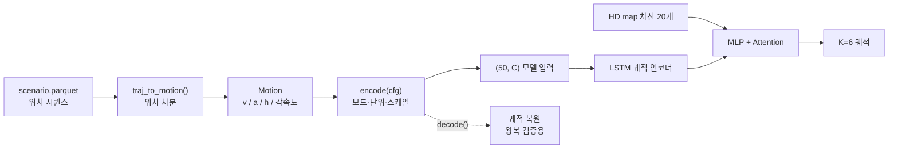

# v4 검토 — 궤적 입력 표현을 (속도·가속도·방향)으로 바꾸기

작업일: 2026-08-26 ~ 08-27 · 위치: `Argoverse2study/src/` · 상태: 실험 완료, 적용 보류

---

## 1. 무엇을 왜 바꾸려 하는가

현재 v3 모델의 궤적 입력은 **5채널** 입니다.

```
x = (x, y, vx, vy, heading),  50 step @10Hz
```

여기에 제안된 변경은 이것을 **운전 조작에 가까운 표현**으로 바꾸자는 것입니다.

> "a = 액셀/브레이크 (+면 가속, −면 감속), h = 방향. 속도는 km/h로 보고 싶다."

동기는 두 가지입니다.

1. **해석 가능성** — `vx=8.6, vy=-0.01` 보다 `31 km/h, +4 km/h/s 가속, 직진` 이 사람이 읽기 쉽습니다.
2. **좌표 의존성 제거** — 위치 `(x, y)` 는 장면마다 값의 범위가 다르지만, 속도·가속도·방향은
   어디서 찍은 데이터든 같은 의미를 갖습니다.

이 문서는 그 변경이 타당한지를 **AV2 실데이터로 재고, 논문으로 대조하고, 실제로 학습시켜 비교한** 기록입니다.

---

## 2. 먼저 짚을 것 — "a = 0 이면 정지" 는 데이터와 맞지 않습니다

제안에는 "a가 0일 때 정지" 라는 전제가 있었는데, 가속도가 0이라는 건 **속도가 변하지 않는다**는
뜻이지 **멈춰 있다**는 뜻이 아닙니다. AV2 val 400개 시나리오(44,000 step)로 확인했습니다.

| `\|a\| < 0.1 m/s²` 인 스텝 (전체의 21.7%) | 비율 |
| --- | --- |
| speed < 1 km/h → 진짜 정지 | 54.5% |
| speed > 30 km/h → 고속 등속 주행 | 19.5% |
| 그 사이 | 26.0% |

같은 `a=0` 이 절반은 정지, 5분의 1은 시속 30km 이상 순항입니다.
**가속도만 보면 이 둘을 구분할 방법이 없습니다.**

> 이건 말장난이 아니라 예측 성능에 직결됩니다. 정지한 차는 6초 뒤에도 그 자리에 있고,
> 30km/h로 순항하는 차는 50m를 갑니다. 같은 입력에 정답이 50m 다릅니다.

---

## 3. 핵심 실험 — (a, h) 만으로 궤적을 복원할 수 있는가

표현이 정보를 잃는지 확인하는 가장 확실한 방법은 **되돌려 보는 것**입니다.
(a, h) 로 바꾼 뒤 다시 적분해서 원래 궤적이 나오는지 봤습니다.

```
v[t+1] = v[t] + a[t]·dt
p[t+1] = p[t] + v[t]·(cos h[t], sin h[t])·dt        dt = 0.1s
```

**val 300개, 과거 5초(50 step) 복원 오차:**

| 초기속도 v0 를 무엇으로 주는가 | ADE | FDE |
| --- | --- | --- |
| 실제값 | **0.007 m** | 0.012 m |
| 실제값 ±10% | 0.70 m | 1.39 m |
| 실제값 ±20% | 1.39 m | 2.77 m |
| **0 으로 가정** | **6.81 m** | **13.35 m** |
| 데이터셋 평균(5.7 m/s) | 7.38 m | 14.47 m |

**결론:** (a, h) 는 **v0 하나가 빠진 완전한 표현**입니다.
v0를 주면 오차가 사실상 0이고, 모르면 13m 어긋납니다.

그리고 v0 는 (a, h) 안에서 복원되지 않습니다 — 상관계수를 다 재봤습니다.

| v0 와의 상관계수 | 값 |
| --- | --- |
| `sum(a)·dt` (속도 변화 총량) | −0.43 |
| `mean(a)` | −0.43 |
| `\|Δheading\|` 총량 | −0.11 |
| `max\|a\|` | −0.15 |

가장 높은 게 0.43입니다. **가속도 이력으로 현재 속도를 추정할 수는 없습니다.**

---

## 4. 관련 연구

이 아이디어(제어입력 기반 표현)는 학계에서 활발히 다뤄졌습니다. 확인한 것만 적습니다.

| 논문 | 확인한 내용 |
| --- | --- |
| [Deep Stochastic Kinematic Models (2024)](https://arxiv.org/html/2406.01431) | 같은 모델(MTR)에 **파라미터화만 바꿔** Waymo에서 비교. 아래 표 참조 |
| [Trajectron++ (ECCV 2020)](https://arxiv.org/abs/2001.03093) + [공개 코드](https://raw.githubusercontent.com/StanfordASL/Trajectron-plus-plus/master/experiments/nuScenes/process_data.py) | "dynamically-feasible" 를 표방하는 대표 모델인데, 차량 노드 **입력**은 `position(x,y) + velocity(x,y,norm) + acceleration(x,y,norm) + heading(x,y,°,d°)` 를 **전부** 넣음. 동역학은 출력 쪽에서 씀 |
| [Deep Kinematic Models (Cui et al., ICRA 2020)](https://arxiv.org/abs/1908.00219) | 모델이 제어입력을 내고 kinematic layer가 적분 → 물리적 실현가능성 보장 (초록만 확인) |

**Deep Stochastic Kinematic Models 의 파라미터화 비교 (Waymo):**

| 파라미터화 | 전체 데이터 minADE | 전체 mAP | 1% 데이터 minADE |
| --- | --- | --- | --- |
| MTR 베이스라인 | 0.8131 | 0.3872 | 1.4735 |
| F1 (vx, vy) | 0.8241 | 0.3880 | 1.2819 |
| F2 (ax, ay) | 0.8217 | 0.3892 | **1.2819** |
| **F3 (speed, heading)** | **0.8102** | **0.3914** | 1.3525 |
| F4 (조향각, 가속도) | 0.8220 | 0.3910 | 1.2932 |

읽는 법 두 가지:
- 데이터가 **충분하면** 속도를 직접 쓰는 F3가 이깁니다.
- 데이터가 **적으면**(1%) 가속도 기반 F2가 이깁니다 — 물리 구조를 강하게 넣는 게 유리해집니다.

**공통점: 제어입력(가속도)은 출력 쪽 파라미터화로 쓰이고, 입력에서 상태(속도)를 빼는 사례는 찾지 못했습니다.**

---

## 5. 실측으로 드러난 함정 두 가지

### 5.1 가속도는 노이즈입니다

가속도는 위치를 **두 번 미분**한 값이라 측정 노이즈가 증폭됩니다. val 300개 실측:

| 스무딩 창 | std [m/s²] | `\|a\|>3` 비율 | lag-1 자기상관 |
| --- | --- | --- | --- |
| 1 (원본) | 4.40 | 19.2% | **0.353** |
| 3 | 3.16 | 15.9% | 0.845 |
| 5 | 2.70 | 13.4% | 0.911 |
| 15 | 1.46 | 6.5% | 0.971 |

lag-1 자기상관 0.353 은 **거의 백색잡음**이라는 뜻입니다. 실제 차량 가속은 부드러워서 연속된 값이
비슷해야 하는데(0.9 이상), 원본은 프레임마다 튑니다.

문제는 스무딩하면 복원이 깨진다는 것입니다.

| 스무딩 창 | (a,h) 복원 ADE |
| --- | --- |
| 1 | 0.007 m |
| 3 | 0.58 m |
| 5 | 1.03 m |
| 9 | 1.87 m |

**깨끗한 a 와 무손실 복원을 동시에 얻을 수는 없습니다.**

### 5.2 heading 을 무엇에서 만드느냐

| h 출처 | 복원 손실 | 특성 |
| --- | --- | --- |
| 이동방향 (위치 차분 `atan2`) | **0.007 m** | 무손실이지만 저속에서 방향이 튐 (`\|h\|>170°` 가 3.05%) |
| AV2 `heading` 필드 | 0.547 m | 부드러움 (p1 −57° ~ p99 +49°, wrap 없음) |

정지·저속에서는 이동 거리가 거의 0이라 방향이 노이즈가 됩니다. 정지 판정 기준을 올리면 완화됩니다.

| 정지 판정 기준 | `\|h\|>170°` 스텝 | 복원 손실 |
| --- | --- | --- |
| 0.1 m/s | 3.05% | 0.007 m |
| **1.0 m/s** | **0.99%** | 0.042 m |
| 2.0 m/s | 1.16% | 0.083 m |

→ `stop_ms = 1.0` 을 채택했습니다. wrap 위험 1%에 손실 4cm.

---

## 6. 후보 표현 정리

논의 끝에 두 안으로 좁혔습니다.

- **① 3채널** `(v, a, h)` — 속도 + 가속도 + 방향
- **② 2채널** `(a, h)` — 가속도와 방향만으로 속도까지 표현

여기에 비교용 후보를 더해 전부 실측했습니다 (val 300개, 과거 50 step).

| 표현 | 채널 | 복원 손실 ADE | 채널 스케일(std) | 판정 |
| --- | --- | --- | --- | --- |
| **① (v, a, h[rad])** | 3 | **0.007 m** | 0.87 / 0.65 / 0.67 | 문제없음 |
| **② (a누적, h[rad])** | **2** | **0.007 m** | 0.82 / 0.67 | 됨 (7절 참조) |
| (v, a, sin h, cos h) | 4 | 0.007 m | 0.87 / 0.65 / 0.22 / 0.41 | wrap 위험 없음 |
| (vx, vy) 속도벡터 | 2 | 0.007 m | 0.88 / 0.16 | 가장 단순 |
| (v, h) | 2 | 0.007 m | 0.87 / 0.67 | 가속도 없음 |
| (v, 각속도) | 2 | 0.645 m | 0.87 / **6.31** | 비추천 |
| (a, h) + v0 별도 | 2+1 | 0.007 m | 0.65 / 0.67 | v0를 따로 줘야 함 |

`(v, 각속도)` 는 방향을 각속도 적분으로 복원하는데, 적분 기준점(t=49 방향=0) 가정의 오차가
누적돼 0.645m를 잃습니다. 각속도 채널의 스케일도 나쁩니다.

---

## 7. ② 2채널로 속도까지 담는 방법

**가속도의 정의를 한 칸 바꾸면 됩니다.**

기존 정의는 초기속도를 잃습니다 (적분상수가 사라짐):

```
a[t] = (v[t+1] − v[t]) / dt        t = 0 … T−2
```

바꾼 정의 — **직전 속도를 0으로 두고 시작**:

```
ã[t] = (v[t] − v[t−1]) / dt ,   v[−1] := 0

  → ã[0] = v0 / dt              첫 스텝이 초기속도를 통째로 싣는다
  → v[t] = dt · Σ(k=0..t) ã[k]  누적합으로 속도가 복원된다
```

즉 **"차가 t=0 직전까지 정지해 있다가 한 스텝 만에 v0까지 가속했다"** 고 치는 것입니다.
물리적으로는 가상이지만 수학적으로 무손실이고, 실측 복원 오차 0.007m로 확인했습니다.

> 이 정의에서는 원래 제안의 직관이 **정확히 성립합니다** — 모든 a가 0이면 누적합도 0이라
> 속도가 0, 진짜로 정지 상태입니다.

### ② 의 약점 두 가지

**(1) 첫 스텝만 성격이 다릅니다**

| 채널0 | 평균 | std | 최대 |
| --- | --- | --- | --- |
| t=0 (= v0) | 10.30 km/h | 8.97 | 50.8 |
| t>0 (= a·dt) | 0.23 km/h | 1.58 | 15.3 |

t=0 값이 나머지보다 6배 큰 스케일입니다. 모델이 "0번 스텝은 의미가 다르다"를 따로 배워야 합니다.

**(2) 속도를 알려면 모델이 누적합을 해야 합니다** — 이게 더 큰 문제입니다.

t=49의 속도를 알려면 LSTM이 50스텝을 정확히 더해야 합니다. 중간에 조금씩 틀리면 속도 추정이
어긋나고 그 오차가 예측 위치로 직결됩니다. `v`를 직접 주면 그 스텝 하나만 보면 됩니다.

> **표현이 수학적으로 무손실인 것과, 신경망이 그 정보를 쓰기 쉬운 것은 다른 문제입니다.**
> 이 문서의 실험은 사실상 이 명제를 검증하는 것입니다.

---

## 8. 구현

기존 v3 파이프라인은 **한 줄도 건드리지 않고**, 갈아끼울 수 있는 형태로 새로 만들었습니다.

| 파일 | 줄 수 | 역할 |
| --- | --- | --- |
| `src/motion_repr.py` | 300 | 궤적 ↔ (v, a, h) 변환 순수 함수. 6개 모드, 왕복 검증 포함 |
| `src/dataset_motion.py` | 68 | `Av2MapDataset` 을 감싸 **x 채널만** 교체 (지도·정답·순서 동일) |
| `src/model_motion.py` | 51 | v3 모델과 동일. `in_dim` 만 인자로 받음 |
| `src/train_motion.py` | 110 | `train_map.py` 와 손실·평가·하이퍼파라미터 동일. `--repr` 로 표현 선택 |



**핵심 설계 원칙 3가지**

1. **위치 차분에서만 파생량을 만든다.** AV2의 `velocity`/`heading` 필드를 쓰면 위치와 어긋나
   1.31m를 잃습니다 (velocity 필드와 위치차분 속력의 RMS 차이가 1.19 m/s).
2. **단위는 km/h, 학습 입력은 나눠서 넣는다.** 표시는 사람이 읽기 좋게, 스케일은 신경망에 맞게.
3. **복원 함수를 항상 같이 만든다.** 표현이 정보를 잃는지는 왕복시켜 보면 즉시 드러납니다.

**스케일 상수** (val 300개 실측으로 결정, 나눈 뒤 std 0.5~1.0)

| 채널 | 원값 std | 나누는 값 | 결과 std |
| --- | --- | --- | --- |
| v [km/h] | 17.3 | 20 | 0.87 |
| a [km/h/s] | 9.74 | 15 | 0.65 |
| h [rad] | 0.67 | 1 | 0.67 |
| sin h / cos h | — | 나누지 않음 | 0.22 / 0.41 |

참고로 **현재 5채널은 채널간 std 비율이 74배**입니다 (x[m] std 15.9 vs heading[rad] std 0.21).
새 표현은 4배 이내로 들어옵니다.

---

## 9. 실험 설계

표현 말고는 **아무것도 바꾸지 않았습니다.**

| 통제한 것 | 값 |
| --- | --- |
| 모델 구조 | v3 그대로 (LSTM 2층 128 + 차선 MLP + MultiheadAttention 4heads + K=6) |
| 지도 입력 | `lanes (20,10,2)` + `lane_mask` 동일 |
| 정답 | `y (60,2)` 위치, 동일 |
| 손실 | winner-takes-all(minFDE) + cross-entropy, 동일 |
| 학습 | 50,000 시나리오 / 15 epoch / lr 5e-4 / batch 32 / Adam / grad clip 5.0 |
| 평가 | val 2,000 / minADE6, minFDE6 |
| 시드 | 0 (가중치 초기화·배치 순서까지 동일) |

| 실험군 | 입력 | 채널 | 파라미터 |
| --- | --- | --- | --- |
| `raw5` (기준선) | x, y, vx, vy, heading | 5 | 413,014 |
| `vah3` (① 안) | v[km/h], a[km/h/s], h[rad] | 3 | 411,990 |
| `ah0_2` (② 안) | a누적(첫값=v0), h[rad] | 2 | 411,478 |
| `vah4` (① + wrap 제거) | v, a, sin h, cos h | 4 | 412,502 |

파라미터 차이는 0.4% 이내라 용량 차이로 결과가 갈릴 여지는 없습니다.

---

## 10. 결과

### 10.1 최종 성능 (val 2,000 / 15 epoch 중 best)

| 실험군 | 입력 | 채널 | minADE6 | minFDE6 | 기준선 대비 |
| --- | --- | --- | --- | --- | --- |
| `raw5` (기준선 = 현재 v3) | x, y, vx, vy, heading | 5 | 1.318 | 2.921 | — |
| **`vah3` (① 3채널)** | v, a, h[rad] | 3 | **1.280** | 2.891 | **−2.9%** |
| **`vah4` (① 4채널)** | v, a, sin h, cos h | 4 | **1.265** | **2.790** | **−4.0%** |
| `ah0_2` (② 2채널) | a누적(첫값=v0), h[rad] | 2 | 1.406 | 3.008 | **+6.7%** |

> **하네스 검증:** `raw5` 가 1.318 / 2.921 로 나왔습니다. 기존 v3 기록(1.32 / 2.95)을 재현한 것이므로
> 이 비교 실험 자체가 신뢰할 만하다는 뜻입니다.

### 10.2 epoch별 minADE6

| epoch | raw5 | vah3 ① | vah4 ① | ah0_2 ② |
| --- | --- | --- | --- | --- |
| 1 | 2.255 | 2.307 | 2.125 | **3.887** |
| 2 | 1.886 | 1.928 | 1.894 | 3.548 |
| 3 | 1.670 | 1.700 | 1.663 | 3.493 |
| 4 | 1.641 | 1.617 | 1.594 | 2.817 |
| 5 | 1.498 | 1.503 | 1.526 | 1.996 |
| 6 | 1.448 | 1.490 | 1.519 | 1.691 |
| 7 | 1.449 | 1.475 | 1.458 | 1.631 |
| 8 | 1.415 | 1.393 | 1.428 | 1.626 |
| 9 | 1.399 | 1.377 | 1.383 | 1.528 |
| 10 | 1.402 | 1.352 | 1.365 | 1.585 |
| 11 | 1.365 | 1.332 | 1.388 | 1.517 |
| 12 | 1.376 | **1.286** | 1.335 | 1.442 |
| 13 | 1.345 | 1.324 | 1.340 | 1.469 |
| 14 | 1.330 | **1.280** | **1.265** | 1.406 |
| 15 | 1.318 | 1.286 | **1.265** | 1.448 |

### 10.3 읽어야 할 세 가지

**① ② 안은 초반 수렴이 눈에 띄게 느립니다.**
epoch 1에서 `ah0_2` 는 3.887, 나머지는 2.1~2.3 입니다. 4 epoch까지 2.8 이상에 머물다가
그 뒤에야 따라붙습니다. 이것이 **"속도를 알려면 50스텝을 누적해야 한다"는 부담의 직접적인 증거**입니다.
정보는 다 있지만 모델이 그걸 꺼내 쓰는 법을 먼저 배워야 합니다.

**② ② 안은 끝까지 따라잡지 못했습니다.** 15 epoch 전부에서 기준선보다 나빴고(15전 15패),
최종 격차도 +6.7%로 남았습니다.

**③ ① 안의 우세는 후반에 안정적입니다.**

| 비교 | 기준선을 이긴 epoch | 마지막 5 epoch 차이 |
| --- | --- | --- |
| vah3 vs raw5 | 9 / 15 (**마지막 5 epoch은 5/5**) | −0.045 (std 0.024) |
| vah4 vs raw5 | 9 / 15 | −0.028 (std 0.033) |
| ah0_2 vs raw5 | 0 / 15 | +0.13 |

`raw5` 자신의 마지막 5 epoch 변동폭이 0.022 인데 vah3와의 차이가 0.045 이므로,
**차이가 학습 후반의 자연 변동보다 2배 큽니다.**

### 10.4 이 실험의 한계

- **시드 1개(seed=0)만 돌렸습니다.** 3% 안팎의 차이는 시드에 따라 뒤집힐 수 있습니다.
  후반 5 epoch 전승과 변동폭 대비 2배라는 점에서 방향성은 신뢰할 만하지만,
  확정하려면 시드 3개 반복이 필요합니다 (병렬로 약 80분).
- 학습 데이터는 20만 개 중 **5만 개**만 썼습니다. 논문(F2 vs F3)에서 보듯 데이터 양이
  파라미터화 우열을 바꿀 수 있으므로, 전량 학습에서는 결과가 달라질 여지가 있습니다.
- 4개를 한 GPU에서 병렬로 돌렸습니다. 데이터 로딩이 병목이라 GPU 경합의 영향은 없었지만
  (epoch당 284~302초로 균일), 완전히 순차 실행한 것은 아닙니다.

---

## 11. 결론

**1. ② 안(2채널)은 기각합니다.**
표현 자체는 무손실인데(복원 오차 0.007m) 성능은 6.7% 나빠졌습니다.
**"표현이 정보를 보존하는 것"과 "신경망이 그 정보를 쓸 수 있는 것"은 다른 문제**라는 게
실험으로 확인됐습니다. 이 결과 하나가 이 문서에서 가장 값진 부분입니다.

**2. ① 안을 채택 권고합니다.**
채널을 5개에서 3개로 **줄이고도** 성능이 2.9% 좋아졌고, 방향을 sin/cos로 풀어 wrap을 없앤
4채널은 4.0% 좋아졌습니다.

**3. 개선의 출처는 스케일 정리로 보입니다.**
현재 5채널은 채널간 표준편차 비율이 74배(x[m] 15.9 vs heading[rad] 0.21)라 큰 채널이
LSTM 입력을 지배합니다. 새 표현은 4배 이내입니다.

**4. 덤으로 얻는 것 — 해석 가능성.**
입력이 `vx=8.6, vy=-0.01` 에서 `31 km/h, +4 km/h/s, 직진` 으로 바뀝니다.
실패 사례를 볼 때 "감속 중이었는데 가속으로 예측했다" 같은 진단이 가능해집니다.

### 최종 권고

```
mode  = "vah",  unit = "kph",  heading = "sincos"
채널   = ( v[km/h]/20,  a[km/h/s]/15,  sin h,  cos h )
설정   = stop_ms 1.0,  가속도 스무딩 창 5
```

3채널을 유지하고 싶다면 `heading="rad"` 로 두면 됩니다 — 그것도 기준선보다 낫습니다.
(다만 `|h|>170°` 가 1% 생깁니다.)


---

## 12. 예상 질문과 답변

**Q1. 왜 굳이 표현을 바꾸나? 지금도 minADE 1.32로 돌아가는데.**
두 가지입니다. (1) 해석 가능성 — 입력이 "31km/h, 감속 중, 좌회전 중"으로 읽히면 실패 사례를
분석하기 훨씬 쉽습니다. (2) 다음 작업인 **역주행 방지**와 짝이 맞습니다. 차선에 방향 벡터를
넣으려면 궤적 쪽에도 방향이 명시적으로 있어야 대응이 자연스럽습니다.

**Q2. v0를 따로 스칼라로 주면 (a,h) 2채널로 되지 않나?**
됩니다. 다만 그건 "2채널"이 아니라 "2채널 + 스칼라 1개"입니다. ② 안은 그 스칼라를
**첫 스텝의 가속도 값에 녹인** 것이라 진짜 2채널입니다. 수학적으로는 동일합니다.

**Q3. 채널을 5개에서 3개로 줄이면 정보가 줄어드는 것 아닌가?**
아닙니다. 왕복 복원 실험에서 오차 0.007m로 확인했습니다 — **정보량은 같습니다.**
바뀌는 건 정보의 *형태*이고, 실험의 질문은 "같은 정보를 어떤 형태로 줄 때 LSTM이 잘 쓰는가"입니다.

**Q4. 그러면 왜 ②(2채널)가 ①(3채널)보다 불리할 거라고 예상했나?**
정보 접근 비용 때문입니다. ②에서 "지금 속도"를 알려면 50스텝 누적합이 필요합니다.
①은 그 값이 채널에 그냥 들어 있습니다. 신경망은 누적합을 정확히 하는 걸 어려워합니다.

**Q5. km/h 를 쓰면 학습에 나쁘지 않나? 보통 m/s를 쓰는데.**
단위 자체는 상수배일 뿐이라 **스케일만 맞으면 학습에 차이가 없습니다**. 그래서 표현 단위는
읽기 좋은 km/h로 두고, 신경망에 넣기 전에 20으로 나눕니다. 실제로 `v[km/h]/20` 의 표준편차가
0.87로 이상적인 범위입니다.

**Q6. 가속도가 그렇게 노이즈면 아예 빼는 게 낫지 않나?**
그래서 `(v, h)` 2채널도 후보에 넣었습니다. 다만 가속도를 스무딩(창 5)해서 넣으면
lag-1 자기상관이 0.35 → 0.91로 올라가 신호가 됩니다. ①에서는 **v는 원본, a만 스무딩**해서
복원 무손실을 유지하면서 a만 깨끗하게 만들었습니다.

**Q7. 위치 (x, y)를 빼도 지도 attention이 동작하나?**
동작합니다. 정규화 규약상 focal의 현재 위치는 **항상 원점 (0,0)**이고, 차선 좌표도 focal
기준 상대좌표입니다. 즉 "지금 어디 있는가"는 좌표계 자체에 이미 들어 있습니다.
과거 위치는 v와 h를 적분하면 나옵니다.

**Q8. 복원 오차 0.007m는 어디서 오나? 무손실이라며?**
정지 구간에서 이동방향이 노이즈라 직전 방향으로 고정하는데, 그때 생기는 mm 단위 오차입니다.
정지 처리를 끄면 오차가 정확히 0이 되고, 대신 방향 채널이 지저분해집니다. 트레이드오프를
`stop_ms` 인자로 조절할 수 있게 열어 뒀습니다 (채택값 1.0 m/s → 손실 0.042m).

**Q9. 학습 비교가 공정한가?**
표현 외 모든 것을 고정했습니다 — 같은 시드, 같은 시나리오 5만 개, 같은 배치 순서, 같은 모델
구조·손실·에폭·lr. 데이터셋도 `Av2MapDataset`을 감싸서 지도·정답·순서가 물리적으로 동일합니다.
파라미터 수 차이는 0.4% 이내입니다.

**Q10. 논문에서 가속도 기반이 이긴 사례(F2)가 있는데, 왜 우리는 속도 기반을 권하나?**
그 사례는 **데이터 1%만 썼을 때**입니다. 데이터가 적으면 물리 구조를 강하게 넣는 쪽이 유리하고,
충분하면 상태를 직접 주는 쪽이 이깁니다(F3). 우리는 20만 개 중 5만 개를 쓰므로 후자에 가깝습니다.
다만 이건 가설이고, 이 문서의 실험이 그 답입니다.

**Q11. 출력(예측)도 가속도로 바꾸나?**
이번엔 **입력만** 바꿨습니다. 출력은 계속 위치 `(60,2)`입니다. 그래야 minADE/minFDE를 그대로
비교할 수 있습니다. 출력을 제어입력으로 바꾸는 건 논문들이 실현가능성 보장을 위해 하는 것으로,
별도 작업입니다.

**Q12. 지도(HD map)도 같이 들어가나? 조건이 정말 v3와 같나?**
네. `dataset_motion.py` 는 v3가 쓰던 `Av2MapDataset` 을 **그대로 감싸고 x 채널만 갈아끼웁니다.**
`lanes (20,10,2)`, `lane_mask (20)`, 정답 `y (60,2)`, 시나리오 순서까지 물리적으로 동일한 객체입니다.
모델도 `model_map.py` 와 레이어 정의가 같고 `in_dim` 만 인자로 뺀 것이라, `in_dim=5` 로 만들면
파라미터가 413,014개로 v3와 정확히 일치합니다. 학습 루프도 손실·평가·하이퍼파라미터가 같습니다.
증거는 `raw5` 가 v3 기록(1.32/2.95)을 1.318/2.921로 재현한 것입니다.

**Q13. 실패하면 어떻게 하나?**
"실패"의 정의가 중요합니다. 성능이 같으면 **해석 가능성이 공짜로 얻어지는 것**이라 채택할 이유가
있습니다. 눈에 띄게 나빠지면 원인(누적합 부담인지, 위치 정보 부재인지)을 3채널/4채널/2채널
비교로 좁힐 수 있게 실험군을 설계했습니다.

---

## 13. 다음 단계

- [ ] 표현 결정 후 `dataset_map.py` 에 반영 (또는 `dataset_motion.py` 를 정식 채택)
- [ ] **차선 방향 벡터 추가** — `lanes (20,10,2) → (20,10,4)` `[x,y,dx,dy]`, 역주행 방지.
      궤적 쪽 heading 과 짝이 맞아 이번 변경과 함께 가면 자연스러움
- [ ] 조각 연결정보(`successors`) 활용 → 교차로 회전 예측 개선 (v3 hard 케이스의 주 실패 원인)
- [ ] 주변 차량(agent) 인코딩 추가 — 현재 focal 한 대만 보고 있음
