# v4 — 지도를 아는 궤적 예측

> Argoverse 2 Motion Forecasting · 한 페이지 누적 정리 · 최종 갱신 2026-09-17
> 이 페이지는 단계가 끝날 때마다 갱신된다. 상세는 각 단계의 리포지토리 문서에 있다.

---

## 0. 한 장 요약

**"미래 위치를 찍지 말고 지도가 아는 것과 모르는 것을 나눠라."**

방향을 `h = k + θ` 로 쪼갠다 — `k`(도로가 휜 만큼)는 **지도가 주고**, `θ`(차체가 더 휜 만큼)만
**모델이 배운다**. 예측 모드도 학습된 익명 슬롯이 아니라 **지도에서 실제로 열거된 경로**로 바꾼다.

```
h  =  k  +  θ          예측 모드 = 후보 경로 K개
      ↑     ↑
   지도가   모델이       "어느 갈림길로 갈 것인가" 를 지도가 이산 선택지로 준다
   준다     배운다
```

### 현재 성적

| 단계 | 무엇 | minADE6 | minFDE6 | 밴드 이탈 | dθ p99 |
| --- | --- | --- | --- | --- | --- |
| — | 기준선 (v3 + 차로 규칙 피처) | **1.292** | 2.883 | — | — |
| **L2** | 지도 cross-attention (하네스 재현) | 1.292 | 2.883 | — | — |
| **L3** | 모드 = 후보 경로 | **1.414** | 3.153 | — | — |
| **L0** | 출력 = 액션 (a, θ) + Frenet 적분기 | 1.666 | 3.957 | 1.35 | **7.0°** |
| **L4** | + 이탈 hinge (버려진 모드) | **1.756** | 4.147 | **0.71** | 8.0° |
| **L0 · (a,h)** | 입력 (a, h) 2채널 + θ₀ 가드 | 1.593 | 3.783 | 1.56 | 6.3° |
| **L4 · (a,h)** | 입력 (a, h) 2채널 + θ₀ 가드 + 이탈 hinge | 1.705 | 3.947 | 0.90 | 8.0° |
| **L0 · (a,h) 전체** | 위 L0 + 전체 데이터 (train 199,908) | **1.449** | **3.393** | 1.56 | 8.0° |
| **L4 · (a,h) 전체** | 위 L4 + 전체 데이터 | 1.480 | 3.409 | **0.60** | 8.0° |
| **L0 · (a,h) 전체 · 벌점** | + 흔들림 벌점 `--smooth 0.1` | 1.520 | 3.660 | 1.60 | 2.7° |
| **L4 · (a,h) 전체 · 벌점** | + 흔들림 벌점 `--smooth 1.0` | 1.586 | 3.775 | 0.81 | 6.5° |
| L0 · (a,h) 전체 · 벌점 · 2 Hz | 입력만 2 Hz (`--input ah2_2hz`, 벌점 1.0) | 1.610 | 3.838 | 1.54 | 1.0° |
| L4 · (a,h) 전체 · 벌점 · 2 Hz | 입력만 2 Hz (벌점 1.0) | 1.643 | 3.879 | 0.67 | 7.7° |
| **L4 · (a,h) 전체 · 벌점 · 30에폭** | 위 L4 벌점 판 + 30에폭 코사인 학습률 | **1.402** | **3.279** | **0.52** | 7.3° |
| L4 · (a,h) 전체 · 벌점 · 2 Hz · 30에폭 | 위 2 Hz 판 + 30에폭 코사인 | 1.490 | 3.414 | 0.56 | 7.4° |

> (a, h) 두 줄이 위 L0·L4 보다 좋아 보이는 건 그 사이 적분기 기하가 고쳐졌기(`bbefc60`) 때문이다.
> 같은 코드로 다시 채점하면 정확도는 비슷하거나 조금 나쁘다. 다만 기존 판은 옛 조건으로 학습된 가중치라
> 입력 효과는 아직 모른다 — 2.4절.
>
> 전체 데이터 여섯 줄은 val 24,988 기준이다(위 줄들은 val 2,000). 벌점 없는 두 줄은 액션이 매 스텝
> 부호를 뒤집으며 진동한다(7.3° 초과 35%·20%) — 2.5절. 2 Hz 두 줄은 10 Hz 보다 최근 5에폭 평균이 6~7% 나쁘다 — 2.6절.
> L0 는 2026-09-16 부터 흔들림 벌점을 포함한다(기본 1.0).
> 30에폭 코사인 두 줄(2026-09-17)은 15에폭 상수 판보다 크게 낫고, 벌점을 켜고도 벌점 없는 15에폭 판보다 낫다. 에폭 수와 학습률 스케줄이 함께 바뀌어 어느 쪽 효과인지는 모른다 — 2.12절.

**minADE6 이 1.292 → 1.756 (+36%) 로 올라가는 것이 설계상 정상이다.** 출력 공간을 규칙으로
좁히면서 실현가능성·규칙 준수를 사는 거래이기 때문이다. 가격표:

| 산 것 | 판 것 |
| --- | --- |
| 라벨 상한(7.3°/step) 초과 step **71.4% → 0.4%**(L0b) / **4.4%**(L4_nw, 최종 채택 모델) — 크기만 본 지표라 진동은 못 잡는다(2.5절) | minADE6 +36% |
| 밴드 이탈 **50% 감소** (최근 5에폭 평균 1.39 → 0.70 — 위 표의 1.35/0.71 은 best 에폭 값이다. '밴드 이탈' = 시나리오당 유효 모드별 '밴드 밖 step 비율' 의 합, 범위 0~6) | minFDE6 +44% |
| 모드가 지도의 실제 분기가 됨 (평균 세탁 방지) | |
| 역주행 0.56% → **0.11%** | |

**이 표는 minADE6 단독으로 읽으면 안 된다.**

---

## 1. 왜 이 거래인가

| 사는 것 | 파는 것 |
| --- | --- |
| 실행 불가능한 궤적 26% → 0% *(Cui et al. ICRA 2020 — 다른 데이터셋의 선행 연구 수치, 이 프로젝트 실측이 아니다)* | minADE 약간 |
| 6초 heading 오차 7.69° → 4.92° *(같은 논문 인용값)* | 리더보드 순위 |
| 역주행·도로이탈을 **출력 형식이** 막음 | |

`minADE` 는 실현가능성을 재지 않는다. 정답에 가깝기만 하면 물리적으로 불가능해도 점수가 좋다.
예측을 사람이 그림으로 보는 게 아니라 **플래너가 입력으로 받는다면** 실행 불가능한 26% 는 치명적이다.

> 정직하게 — AV2 리더보드 상위권(QCNet, MTR++, Wayformer)은 전부 위치를 직접 회귀하고
> 액션 공간 지도 융합이 0이다. **다운스트림이 플래너면 이 거래가 맞고, 순위가 목표면 다른 선택이 낫다.**

---

## 2. 방향 표현 — `h = k + θ`

### 2.1 왜 각도 레벨인가

설계 문서의 원안은 곡률 레벨(`kappa = kappa_lane + delta`)이었다. 두 식은 같은 분해다:

```
h = k(s) + θ    를 호길이로 미분하면    dh/ds = kappa_lane(s) + dθ/ds
```

각도 레벨로 올리면 **적분이 한 단계 줄어든다.**

| | 곡률 레벨 | **각도 레벨** |
| --- | --- | --- |
| 잔차 편향의 영향 | δ 편향 0.005/m 가 60 m 누적 → heading 17° | **거리 따라 안 커짐** |
| 정지 차량 (step 의 14.5%) | s 가 안 늘어 곡률이 정의 안 됨 | heading 그대로 정의됨 |
| 실현가능성 | 출력 형식이 **구조적으로** 보장 | **Δθ 레이트 제한으로 직접 걸어야 함** ← 대가 |

마지막 줄이 실제로 물렸다 — 5절 참조.

### 2.2 `h` 는 AV2 heading 이 아니라 위치차분으로 만든다

AV2 `heading` 은 **차체 방향**이라 이동방향과 슬립각만큼 어긋난다. 방향만 바꿔 궤적을 다시
굴리면(스텝 길이는 원본 고정 → 오차 원인이 방향뿐):

| h 만드는 법 | 최종오차 | 보조 비율 |
| --- | --- | --- |
| 위치차분만 | **0.000 m** | 0% |
| **< 1.0 m/s 를 AV2 로 보조** | **0.145 m** | 15.5% |
| AV2 heading 그대로 | **1.693 m** | 100% |

기준속도 1.0 m/s 의 근거 — 저속에서 위치차분 방향이 무너지는 지점:

| 속력 | 위치차분 떨림 | AV2 떨림 | 판정 |
| --- | --- | --- | --- |
| < 0.5 m/s | **7~11°/step** (70~110°/s) | 0.03~0.09° | 차량 한계 밖 — 노이즈 |
| 0.5~1.0 | 2.97° | 0.20° | 의심스러움 |
| 1.0~1.5 | 1.81° | 0.42° | 실제 저속 회전으로 설명 가능 |

**1.0 m/s 는 물리적으로 불가능한 구간을 전부 걷어내는 가장 낮은 값**이고, 그때도 AV2 를
그대로 쓸 때보다 12배 정확하다.

> **이 결론이 학습에 들어간 건 늦었다.** 단계 1~4 의 v4 학습 입력은 전부 기준선 5채널
> `(x, y, vx, vy, h_AV2 − yaw0)` 였다. θ 입력 채널 A/B 에서 이득이 없어 입력을 고정하면서 heading
> 출처까지 **AV2 원본**으로 남았고, 그 채널은 wrap 도 없어 시나리오의 5.10% 에서 입력이 2π
> 점프했다. 적분기 시작값 θ₀ 도 AV2 차체 방향 기준이었다. 위치차분 heading 이 실제 학습 입력이
> 된 건 2.4절의 (a, h) 입력부터다(`b1db1a6`).

### 2.3 θ 의 실제 분포

| 기준 | 중앙 | p90 | ±10° 이내 |
| --- | --- | --- | --- |
| 최근접 차로 | 1.00° | 10.75° | 89.3% |
| **경로 기준** | 1.00° | **8.00°** | **91.9%** |

6초 동안 **따라가야 할 변화량**이 분해의 실익이다: `|Δh|` p90 **52.8°** vs `|Δθ|` p90 **14.6°**
— 지도가 방향 변화의 약 2/3 를 대신 설명한다.

### 2.4 v4 입력 — `(a, h)` 2채널 (2026-09-14)

사용자가 의도한 v4 구조는 **(a, h) 입력 → 모델이 (a, h) 형태로 예측 → 함수로 궤적 복원**이다.
출력과 적분기는 이미 `(a, Δθ) → h = k(s) + θ` 였고 입력만 5채널이었다. 그래서 입력을 바꿨다.

| 채널 | 무엇 | 왜 |
| --- | --- | --- |
| `a` | 속도 증분 [km/h] ÷ 3, **첫 값에 v0** | (a, h) 만으로는 초기속도가 빠져 궤적을 못 복원한다(v0 를 0 으로 두면 FDE 13.4 m). 첫 스텝에 v0 를 실으면 누적합으로 속도가 무손실 복원된다 |
| `h` | 위치차분 진행방향(1 m/s 미만만 AV2 보조), focal 정규화, wrap | 수치상 `k + θ` 와 같다. 지도는 모델이 따로 받으므로 k·θ 로 쪼개 넣지 않는다 |

두 채널 모두 **관측 50스텝만** 쓴다. `build_heading` 은 전방차분이라 110스텝을 넣으면 h[49] 가
첫 예측 대상 pos[50] 을 보는데, 이 누수는 시나리오의 57.7% 에서 h[49] 를 바꿨다(중앙 0.14°, p90 1.34°).

> 예전 파이프라인(v3 지도 모델, 규칙 피처 없음, 시드 1개)에서는 이 2채널이 5채널보다
> **6.7% 나빴다**(1.406 vs 1.318). 그 근거를 보고 난 뒤의 선택이다.

**검증**

| 항목 | 결과 |
| --- | --- |
| (a, h) 만으로 관측 5초 재구성 (val 300) | 중앙 0.000 m / p95 0.251 m |
| h 채널 ±π 점프가 있는 시나리오 (val 300) | **1.33%** (기존 5채널은 val 3,000 에서 5.10%) |
| 인과성 — 미래(t≥50)를 흔들고 `__getitem__` 통과 (val 150) | y 를 뺀 18개 필드 **비트 불변** |
| 기존 5채널 경로 회귀 (val 12 샘플 비트 비교) | 18개 필드 동일, 새 필드 `h0` 는 스칼라 |

**적분기 시작값 θ₀ — 가드가 필요하다**

기존 `θ₀ = −k(s0)` 는 정규화 프레임의 0 방향(= AV2 차체 방향)을 진행방향으로 본다. 그래서 슬립각만큼
어긋난다(|h0| 중앙 0.79°, p90 5.2°, p99 19.8°). 그렇다고 `wrap(h0 − k(s0))` 를 그대로 쓰면
θ 가 첫 스텝부터 ±90° 에 걸려 `ds = 0` 이 되고 **궤적이 옆으로 미끄러진다.**

| θ₀ | 90° 넘는 모드 (val 2,000 · 살아있는 모드 11,625) | 시나리오 |
| --- | --- | --- |
| `−k(s0)` (기존) | 48 (0.41%) | 20 |
| `wrap(h0 − k(s0))` | 151 (1.30%) | 44 |
| **가드** — 90° 안일 때만 새 값 | **44 (0.38%)** | **18** |

새로 90° 를 넘는 26개 시나리오 중 23개가 5 m/s 미만(저속 뒤집힘 판정·후진)이었다.

**θ₀ 규칙은 학습과 추론이 같아야 한다.** 기존 규칙으로 학습한 가중치에 추론 때만 가드를 붙이면
시작 오프셋이 60스텝 내내 남아 minADE6 이 7~8% 나빠진다(l0b 1.594 → 1.701). 이득은 재학습으로만 잴 수 있다.

> 검증 중 버그 하나 — 데이터셋에 이미 있던 `h0 = (cos θ, sin θ)` 방향벡터가 새 스칼라 `h0` 를
> 덮어써 필드가 `(2,)` 로 나갔다. 방향벡터도 관측값이라 인과성 검사로는 못 잡고, 학습 스모크에서 잡혔다.

**학습 결과** — L0·L4 의 (a, h) 판 2개만 돌렸다(사용자 결정, 50k / 15에폭, 시드 1개).

학습 로그만 보면 (a, h) 판이 좋아 보인다(L0 1.666 → 1.593, L4 1.756 → 1.705). **하지만 이건 입력 효과가 아니다.**
기존 체크포인트의 로그 값은 적분기 기하 수정(route_point, `bbefc60`) 전에 평가된 것이고, 같은 체크포인트를
현재 코드로 다시 재면 L0 1.594 / L4 1.682 가 나온다. 네 체크포인트를 모두 현재 코드로 굴린 비교
(val 2,000, `src/compare_v4_ah2.py`):

| | minADE6 | minFDE6 | 7.3°/step 초과 step | 밴드 이탈 | 첫 스텝 θ=±90° 모드 |
| --- | --- | --- | --- | --- | --- |
| L0 5채널 | 1.594 | **3.626** | 0.60% | **1.35** | 101 |
| L0 (a, h) | **1.593** | 3.783 | **0.15%** | 1.56 | **56** |
| L4 5채널 | **1.682** | **3.807** | 5.23% | **0.71** | 120 |
| L4 (a, h) | 1.705 | 3.947 | **3.36%** | 0.90 | **64** |

- **정확도는 나아지지 않았다.** minADE6 은 L0 에서 같고(−0.1%) L4 에서 +1.4%, minFDE6 은 두 판 모두 약 +4% 나쁘다.
  예전 파이프라인에서 2채널이 +6.7% 나빴던 것보다는 격차가 작지만 이득은 아니다.
- **실현가능성은 좋아졌다.** 요레이트 상한(7.3°/step)을 넘는 step 이 0.60% → 0.15%, 5.23% → 3.36% 로 줄었고,
  첫 스텝부터 ±90° 에 걸려 옆으로 미끄러지며 출발하는 모드가 절반 가까이 줄었다(101 → 56, 120 → 64).
- **차로 밴드 이탈은 늘었다** (1.35 → 1.56, 0.71 → 0.90).

**그래서 말할 수 있는 건 여기까지다: (a, h) 가 낫다는 증거는 없다. minFDE6 과 밴드 이탈은 나쁘고, 실현가능성만 좋다.**

"L0 minADE6 같음"을 두 입력이 대등하다는 뜻으로 읽으면 안 된다. 채점 코드는 같지만 **학습 조건이 다르다** —
(a, h) 판은 θ₀ 가드와 새 기하(route_point)로 학습됐고, 기존 판은 옛 기하로 학습된 가중치를 채점만 새 기하로 했다.
route_point 는 학습 중 경로 끝에서 끊기던 gradient 를 살리므로, 5채널을 새 기하로 재학습하면 1.594 보다 좋아질 수
있고 그러면 (a, h) 는 L0 에서도 나쁜 쪽이 된다. (θ₀ 는 기존 판이 학습·채점 모두 기존 규칙이라 불일치가 없었고,
가드로 재학습했을 때 어느 쪽으로 움직일지는 모른다.)

입력 효과만 떼려면 **입력만 다르고 나머지는 (a, h) 판과 같은** 5채널 기준선이 필요하다:

```bash
python src/train_v4.py --level l0 --input raw5 --th0 guard --fallback straight1 --theta 0 --rules 1 --seed 0 \
    --limit 50000 --val-limit 2000 --epochs 15 --lr 5e-4 --batch 32 --smooth 0 --tag v4_l0_raw5g_s0
python src/train_v4.py --level l0 --input raw5 --th0 guard --fallback straight1 --theta 0 --rules 1 --seed 0 \
    --limit 50000 --val-limit 2000 --epochs 15 --lr 5e-4 --batch 32 --smooth 0 --offlane 1.0 --off-nonwinner 1 --tag v4_l4nw_raw5g_s0
```

캐시를 쓰려면 같은 인자로 `src/prepare_v4.py` 를 먼저 돌리고 학습 명령에 `--cache` 를 붙인다.

### 2.5 전체 데이터 학습 · 흔들림 벌점 (2026-09-16)

> **한 줄** — 전체 데이터(4배)로 학습하니 minADE6 가 7~12% 좋아졌지만, 액션 (a, θ) 이 **매 스텝 부호를 뒤집으며 진동**했다.
> 흔들림 벌점으로 진동을 없애면 그 이득의 대부분을 내준다. 그래도 **L4 는 벌점을 건 채로 기존 (a, h) 50k 판보다 모든 지표가 낫다.**

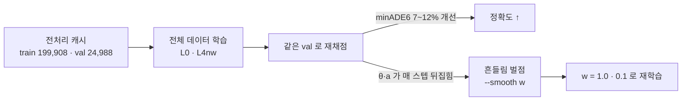
```mermaid
flowchart LR
    A["전처리 캐시<br/>train 199,908 · val 24,988"] --> B["전체 데이터 학습<br/>L0 · L4nw"]
    B --> C["같은 val 로 재채점"]
    C -->|"minADE6 7~12% 개선"| D["정확도 ↑"]
    C -->|"θ·a 가 매 스텝 뒤집힘"| E["흔들림 벌점<br/>--smooth w"]
    E --> F["w = 1.0 · 0.1 로 재학습"]
```

**① 먼저 전처리 캐시 — 에폭 시간의 거의 전부가 즉석 전처리였다**

`__getitem__` 이 샘플마다 parquet·지도 JSON 을 다시 읽어 샘플당 약 87 ms 가 들었고, 그동안 GPU 는 놀았다.
`src/prepare_v4.py` 로 train·val 전체를 한 번 굽고(17분, 2.7 GB, 원본과 비트 단위로 같은 경로) `train_v4.py --cache` 로 읽는다.

| | 데이터 (train / val) | 에폭 시간 (train + val 평가) |
| --- | --- | --- |
| 기존 (a, h) 판 — 캐시 없음 | 50,000 / 2,000 | 213~215 s |
| 전체 데이터 — 캐시 | 199,908 / 24,988 | **120~123 s** (벌점 판 127~133 s) |

4배 데이터를 절반 남짓한 시간에 돈다. 이제 병목은 CPU 1코어에 묶인 파이썬 학습 루프다(GPU 사용률 약 50%).

**② 전체 데이터 결과 — 정확도는 오르고 액션은 진동했다**

같은 val 로 다시 채점했다(`src/compare_v4_full.py`, 아래 ④ 표). 진동의 모양:
- 7.3°/step 을 넘는 연속 두 step 의 **79%(L0)·53%(L4)가 부호 반전**이다 — θ 가 +8°, −8° 를 번갈아 낸다.
- 6초 동안의 순 방향 변화는 중앙 10° 남짓이라 위치는 수 cm 만 흔들린다. 그래서 **거리 손실(minADE)이 이 방향을 감독하지 못한다.**
- 정답에 가장 가까운 모드와 확률 1위 모드도 33~35%(L0)가 이렇다 — 버려진 모드만의 문제가 아니다.
- **왜** — 레이트 상한(8°/step)은 크기만 막고 진동은 막지 않는다. 학습 스텝이 4배가 되자 출력이 상한까지 포화했다.
  학습 로그의 dθ p99 가 1에폭부터 상한 8.0° 에 붙어 있던 것이 신호였다.

가속도 a 도 같았다. 그리고 **50k 판과 5채널 판도 이미 진동하고 있었다** — 재채점한 저크 RMS 28~49 m/s³ 는
0.1초마다 가속도가 3~5 m/s² 씩 바뀌는 수준이다. 지금까지 쓴 실현가능성 지표(7.3° 초과)는 요레이트 **크기**만 봐서 이걸 못 잡았다.

**③ 흔들림 벌점 — 동작 원리**

`jitter = 평균[ Δ(a / 8 m/s²)² + Δ(dθ / 8°)² ]` — 이웃 스텝 차이의 제곱을 살아있는 모든 모드에서 평균한다.
`train_v4.py --smooth w` 로 손실에 `w · jitter` 를 더한다.

| 설계 | 이유 |
| --- | --- |
| a·θ 두 채널 모두 | 두 채널 모두 진동했다 |
| 각자 출력 상한으로 나눔 | 단위를 없애 같은 눈금에 둔다 — 1°/step² 와 1 m/s²/step 이 둘 다 0.016, 상한끼리 뒤집는 진동은 4 |
| 승자 모드도 포함 | 승자도 진동했다 (승자를 빼는 L4 hinge 와 다른 점) |
| 이웃 차이의 제곱 | 완만한 변화는 거의 공짜이고, 뒤집기는 크게 벌한다 |

`--smooth 0` 이면 기존 코드와 loss·minADE6 가 소수 6자리까지 같다(검증) — 이전 결과는 그대로 재현된다.

> **결정 (2026-09-16) — 흔들림 벌점은 L0 의 일부다.** 흔들림은 액션 출력이 만드는 문제라
> **L0 = 액션 출력 + Frenet 적분기 + 흔들림 벌점**으로 정의한다. 그래서 `--level l0` 이면 `--smooth` 기본값이 1.0 이다
> (L4 는 그 위에 이탈 hinge). 벌점 없이 학습한 예전 판을 재현하려면 `--smooth 0` 을 준다 — 9절 명령과 `run_v4*.sh` 에 넣어 두었다.

**④ 결과** — val 24,988 · best 에폭 / 최근 5에폭 평균 · 시드 1개

| 판 | minADE6 | minFDE6 | 이탈 | 7.3° 초과 | θ 각가속 RMS [°/s²] | 저크 RMS [m/s³] |
| --- | --- | --- | --- | --- | --- | --- |
| L0 50k | 1.564 | 3.712 | 1.54 | 0.18% | 350 | 42.0 |
| L0 전체 | **1.449** / 1.478 | **3.393** / 3.506 | 1.56 | 35.28% | 1004 | 88.2 |
| L0 전체 · 벌점 1.0 | 1.585 / 1.608 | 3.873 / 3.962 | 1.60 | 0.08% | **6** | **1.4** |
| L0 전체 · 벌점 0.1 | 1.520 / 1.607 | 3.660 / 3.925 | 1.60 | **0.01%** | 50 | 8.6 |
| L4 50k | 1.678 | 3.912 | 0.87 | 3.42% | 332 | 27.6 |
| L4 전체 | **1.480** / 1.543 | **3.409** / 3.611 | **0.60** | 19.65% | 780 | 70.2 |
| L4 전체 · 벌점 1.0 | 1.586 / 1.651 | 3.775 / 4.009 | 0.81 | **0.70%** | **28** | **4.1** |

50k 판은 val 2,000 에서 best 를 골랐고 전체 판은 이 집합에서 골랐다. 그래서 val 2,000 재채점도 함께 남겼다
(`runs/v4_full_compare.json`, 5채널 판 포함).

- **벌점은 진동을 없앤다.** L0 저크 RMS 88 → 1.4~8.6 m/s³, θ 각가속 1004 → 6~50 °/s² — 벌점 없는 50k 판보다도 5~60배 낮다.
- **대가는 정확도다.** 최근 5에폭 평균으로 L0 +9%(1.478 → 1.608), L4 +7%(1.543 → 1.651).
- **w = 0.1 과 1.0 은 구별이 안 된다.** best 에폭은 0.1 이 좋아 보이지만(1.520 vs 1.585) 최근 5에폭 평균은 같다(1.607 vs 1.608).
  L0 에서는 벌점 1.0 판과 50k 판의 순서도 val 집합에 따라 뒤집힌다(val 2,000 에서는 1.571 vs 1.593).
- **L4 전체 · 벌점 1.0 은 기존 L4 (a, h) 50k 판보다 모든 지표가 낫다** — minADE6 −5.5%, minFDE6 −3.5%,
  이탈 0.87 → 0.81, 7.3° 초과 3.42 → 0.70%, 저크 RMS 27.6 → 4.1. val 2,000 에서도 모든 지표가 같은 방향이다.
  5채널 L4 와 비교하면(val 2,000: 1.682 / 3.807 / 이탈 0.71) minADE6 는 낫고(1.624), minFDE6 은 비슷하며(3.837), 이탈은 나쁘다(0.83).

**그래서** — 전체 데이터는 도움이 되지만, 그 이득의 상당 부분은 실제 차가 못 내는 진동과 함께 왔다.
진동을 막은 조건에서 전체 데이터의 이득은 L4 에서 minADE6 5.5% 이고, L0 에서는 가중치에 따라 −2.8% ~ +1.3% 로 불분명하다.

### 2.6 입력 2 Hz 다운샘플 (2026-09-17)

> **한 줄** — 입력만 평활 + 10 Hz → 2 Hz 로 바꿨더니 **정확도가 6~7% 나빠지고**(최근 5에폭 평균) 에폭 시간은 그대로였다.
> 흔들림과 7.3° 초과는 비슷하게 낮다. **기본 입력은 10 Hz 로 둔다.**

**무엇을 바꿨나** (`--input ah2_2hz`, `heading_decomp.ah_features_2hz`)
- 관측 위치를 Savitzky–Golay(5점·2차)로 평활한 뒤 0.5초 간격으로 뽑는다. 입력이 50 → **10 스텝**이 된다.
- 창 가장자리 램프(관측 첫 0.4초)는 평활에서 뺀다.
- 정답, 후보 경로, 적분기 시작값(h0)은 10 Hz 와 같다. **입력만 다른 A/B** 다.
- h 채널의 ±π 점프는 1.65% → 0.50% 로 줄었다(train 전체). 캐시는 40 workers 로 8분에 만들었다.

**결과** — 벌점 1.0 · 전체 데이터 · 시드 0, 비교 상대는 2.5절의 10 Hz 판이다.

| 판 | best 에폭 (val 24,988) | 최근 5에폭 평균 | val 2,000 재채점 | 이탈 | 7.3° 초과 | 에폭 중앙 | 끝 에폭 train loss |
| --- | --- | --- | --- | --- | --- | --- | --- |
| L0 · 10 Hz | ep13 **1.585** / 3.873 | **1.608 / 3.962** | **1.571** / 3.826 | 1.60 | 0.08% | 127 s | **2.26** |
| L0 · 2 Hz | ep5 1.610 / **3.838** | 1.725 / 4.254 | 1.618 / 3.847 | 1.54 | 0.00% | 128 s | 2.34 |
| L4 · 10 Hz | ep5 **1.586 / 3.775** | **1.651 / 4.009** | **1.624** / 3.837 | 0.81 | **0.70%** | 133 s | **2.31** |
| L4 · 2 Hz | ep13 1.643 / 3.879 | 1.749 / 4.161 | 1.652 / **3.853** | **0.67** | 1.42% | 135 s | 2.38 |

- **정확도가 나쁘다.** best 에폭 기준 L4 +3.6%, 최근 5에폭 평균 L0 +7.3% · L4 +5.9%.
- **덜 맞춘 것이다.** 2 Hz 판은 학습 loss 자체가 높다. 과적합이 아니다.
  마지막 0.5초 안의 가속·회전 변화가 한 스텝으로 뭉개져, 짧은 지평에 필요한 정보가 줄어든 것으로 **추정**한다(확인 안 함).
- **빨라지지 않았다.** LSTM 입력이 50 → 10 스텝으로 줄어도 에폭 시간은 그대로다. 시간은 디코더·적분기·손실의 파이썬 루프에서 쓴다.
- **좋아진 것은 L4 이탈뿐이다**(0.81 → 0.67). 7.3° 초과는 오히려 늘었다(0.70 → 1.42%).
- **시드 1개다.** L0 의 best 에폭 차(1.585 vs 1.610)는 노이즈 범위다.
  최근 5에폭 평균의 차(L0 0.12 m, L4 0.10 m)는 같은 판 안 이웃 에폭끼리의 차(6~15에폭 중앙 0.02~0.035 m)보다 3~5배 크다.
  다만 L4 는 두 판의 6~15에폭 범위가 겹친다(10 Hz 1.617~1.706, 2 Hz 1.643~1.806). 확정하려면 시드를 늘려야 한다.

### 2.7 에폭당 시간 — 모든 v4 판

에폭 시간 = train 한 바퀴 + val 평가(`runs/*.json` 의 `history[].sec` 중앙값). **workers 와 동시 실행 수가 판마다 달라** 위쪽 여섯 줄끼리는 벽시계 비교가 안 된다.

| 판 | train / val | 전처리 | workers · 동시 실행 | 에폭 중앙 | 15에폭 합계 |
| --- | --- | --- | --- | --- | --- |
| L2 (`v4_l2_s0`) | 5만 / 2천 | 에폭마다 즉석 | 24 · 여러 판(수 미기록) | 156 s | 39.0분 |
| L3 (`v4_l3b_s0`) | 5만 / 2천 | 에폭마다 즉석 | 24 · 2판 | 188 s | 47.1분 |
| L0 (`v4_l0b_s0`) | 5만 / 2천 | 에폭마다 즉석 | 16 · 3판 | 280 s | 90.0분 |
| L4 (`v4_l4_nw_s0`) | 5만 / 2천 | 에폭마다 즉석 | 16 · 3판 | 284 s | 90.1분 |
| L0 (a, h) 5만 | 5만 / 2천 | 에폭마다 즉석 | 20 · 2판 | 213 s | 53.7분 |
| L4 (a, h) 5만 | 5만 / 2천 | 에폭마다 즉석 | 20 · 2판 | 215 s | 53.7분 |
| **L0 (a, h) 전체** | **20만 / 2.5만** | **캐시** | 8 · 단독 | **120 s** | 28.8분 |
| **L4 (a, h) 전체** | 20만 / 2.5만 | 캐시 | 8 · 단독 | **123 s** | 31.2분 |
| L0 전체 · 벌점 1.0 | 20만 / 2.5만 | 캐시 | 8 · 단독 | 127 s | 31.8분 |
| L0 전체 · 벌점 0.1 | 20만 / 2.5만 | 캐시 | 8 · 단독 | 131 s | 32.6분 |
| L4 전체 · 벌점 1.0 | 20만 / 2.5만 | 캐시 | 8 · 단독 | 133 s | 32.9분 |
| L0 전체 · 벌점 1.0 · 2 Hz | 20만 / 2.5만 | 캐시 | 8 · 단독 | 128 s | 32.1분 |
| L4 전체 · 벌점 1.0 · 2 Hz | 20만 / 2.5만 | 캐시 | 8 · 단독 | 135 s | 33.7분 |
| **L4 전체 · 벌점 1.0 · 30에폭 코사인 (10 Hz)** | 20만 / 2.5만 | 캐시 | 8 · **2판 병렬** (+ 시각화 작업) | 143 s | 70.8분 (30에폭) |
| **L4 전체 · 벌점 1.0 · 30에폭 코사인 (2 Hz)** | 20만 / 2.5만 | 캐시 | 8 · **2판 병렬** (+ 시각화 작업) | 141 s | 70.4분 (30에폭) |

| 캐시 만들기 | 시간 |
| --- | --- |
| 10 Hz (train + val 전체, 32 workers, 디스크 캐시 차가움) | 17분 |
| 2 Hz (40 workers, 디스크 캐시 데워짐) | 8분 |

- **캐시의 효과:** 샘플당 전처리가 약 87 ms → 0.06 ms 로 줄었다. 데이터가 4배인데 에폭은 절반 남짓이다.
- **이제 병목은 파이썬 학습 루프다:** 메인 프로세스가 CPU 1코어를 거의 다 쓰고 GPU 사용률은 약 50% 다.
- **벌점의 비용:** 흔들림 계산과 스텝마다의 값 동기화로 에폭당 약 +7~10 s 다(120 → 127 s, 123 → 133 s).
- **시간 흔들림:** 1에폭만 짧은 판(L0 전체 78 s)이 있다. 외부 부하 변동으로 보며, 그래서 중앙값을 쓴다.
- **병렬 실행(30에폭 두 판):**
  - 다른 작업이 없던 1에폭은 112 · 114 s 였다. 단독 판들의 에폭 범위(112~145 s) 안이다 → 병렬 자체로는 거의 느려지지 않았다. GPU 여유가 있고 병목이 판마다 다른 CPU 코어이기 때문이다.
  - 3에폭부터는 시각화 에이전트(CPU 16 workers)가 같이 돌아 140 s 대가 됐다.
  - 두 판 합계 벽시계는 **70분**이다. 차례로 돌렸다면 약 134분(2 × 30 × 134 s)이 걸렸을 것이다.

### 2.8 시각화로 본 모델 특성 (L4 전체 · 벌점 1.0, val 24,988)

시각화 전용 에이전트가 만든 분석이다(`docs/v4_viz_report.md`, 스크립트 `src/viz_v4_{dump,cases,stats}.py`). 그림은 `docs/figures/v4/` 에 있다.

**대표 시나리오 — 좋음 / 평균 / 안좋음 / 최악 (minADE6 백분위 0–10 / 45–55 / 90–99 / 99–100, 각 9개)**

파랑이 짙고 굵을수록 확률이 높다. ★ = 정답에 가장 가까운 모드, ▲ = 확률 1위, 검정 = 정답, 보라 = 앞차.

| 좋음 | 평균 |
| --- | --- |
|  |  |
| 9개 중 8개가 직선·저속·정지이고 지도 경로가 정답과 맞는다 | 경로는 맞는데 **속도(종방향)** 가 어긋난다. 교차로에서는 1위가 다른 분기로 간다 |

| 안좋음 | 최악 |
| --- | --- |
|  |  |
| 9개 중 5개가 회전이다. 정답은 도는데 1위(또는 모든 모드)가 직진한다 | 지도가 준 후보 경로에 정답 방향이 **아예 없다**(경로 커버리지 실패) |

**한 장 자세히 보기** — 지도 · 시계열(v · a · h · θ · 경로 d · 앞차 거리) · 모드별 손실

| 정속인데 끝 1초에 감속 | 교차로 우회전에서 분기를 잘못 고름 |
| --- | --- |
| 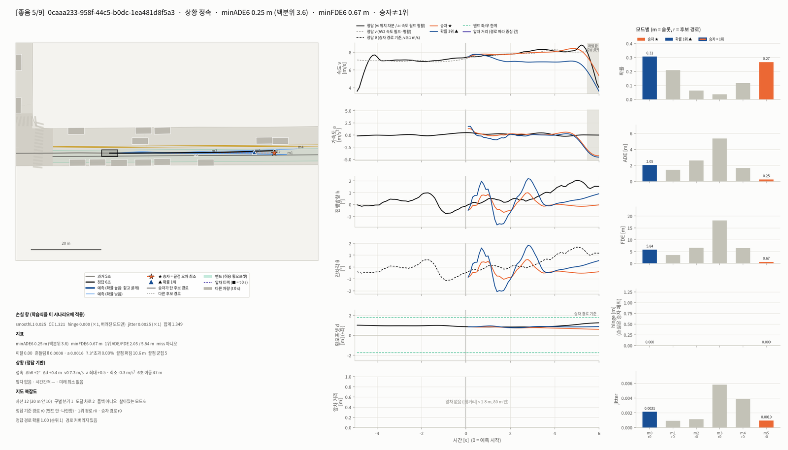 | 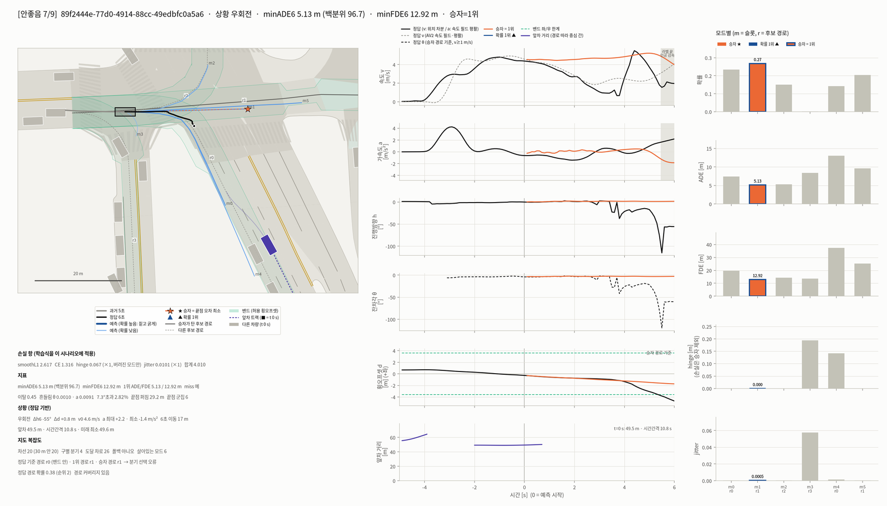 |
| 정답 위치의 속력이 끝 1초에 8.2 → 4.0 m/s 로 떨어지고(속도 필드는 평평) 모델도 따라 감속한다 — 라벨 인공물 추종 | 1위(=승자)가 직진 경로를 탔고, 정답 경로는 확률 2위(0.38)였다 |

**상황·조건별로 어디서 틀리나**


- **회전이 가장 어렵다** — 평균 minADE6 은 좌회전 2.74 · 우회전 2.39 · 차선변경 1.9 m 이고, 정속 1.24 · 정지 0.40 m 다.


- **6초 방향 변화 |Δh| 가 오차를 가장 강하게 가른다** — 5° 미만 1.30 m 에서 60–90° 2.83 m 로 늘어난다. 속력·앞차 유무의 차는 작다.


- **분기가 많을수록 조금 나빠진다** — n_distinct 1 → 6 에서 1.49 → 1.85 m 다. 폴백(경로 없음) 장면은 오히려 쉽다.

**손실로 본 '왜'**


- **손실의 47~85% 는 모드 확률(CE)이다.** 회전에서만 거리 손실 비중이 41~45% 로 커진다.
  흔들림 벌점은 최종 모델에서 손실의 0.2% 이하다 — 진동이 이미 눌려 있어서 남은 값이 작다.


- **모드 선택 실패는 minADE6 이 아니라 '확률 1위 궤적'을 망친다.** minADE6 분포는 거의 같지만, 1위 ADE 중앙이 1.18 → 3.29 m 로 벌어진다. 1위가 정답에 가장 가까운 모드인 경우는 37% 뿐이다.


- **나쁜 시나리오를 가르는 것은 경로 커버리지다.** 분기 선택 오류는 모든 그룹에서 45~51% 로 비슷하다. 반면 커버리지 실패는 좋음 5.5% → 최악 52.8% 로 늘어난다.
- **큰 오차는 주로 종방향(속도)이다** — 안좋음 그룹의 끝점 오차는 |Δs| 8.0 m 대 |Δd| 3.0 m 다.


- **라벨 끝 인공 감속을 배웠다.** AV2 위치 라벨은 11초 창의 끝 0.5초에서 속력이 0.49배로 떨어진다(속도 필드는 평평).
- 모델도 끝 1초에 등속 대비 1.0~1.3 m 덜 간다(정답은 1.16 m).

**다양성 — 시나리오의 다양성을 반영하나**


- **모드는 지도와 속력에 반응해 퍼진다**(끝점 퍼짐이 분기 수와 속력에 따라 커진다).
- **확률은 분기에 거의 고르게 편다**(유효 분기 수가 분기 수의 72~98%). 그래서 정답 경로가 확률 1위인 비율은 분기 2개 73% 에서 6개 33% 로 떨어진다.


- **정답이 어느 후보 경로 밴드에도 없는 경우가 14.1% 다.** 이때 minADE6 은 2.53 m(성공 시 1.43 m)다. 지도가 한 갈래만 줄 때(35%) 가장 자주 일어난다.

**그래서** — 다음 개선 후보는 모델보다 **후보 경로 커버리지**(한 갈래만 주는 장면)와 **확률 1위 선택**(분기가 많을 때 확률이 퍼짐)이다.

### 2.9 에폭별로 본 학습 방향 (L4 전체 · 벌점 1.0 · 2 Hz)

**어떻게 봤나**
- `train_v4` 가 매 에폭 체크포인트를 남기고(`--save-every`, 기본 1), 시각화 에이전트가 `src/viz_v4_epochs.py` 로 에폭마다 같은 시나리오를 채점했다.
- 평가 집합은 val 앞 2,000 이다. 에폭 순위는 전체 24,988 과 같다 — 곡선 상관 0.97, best 에폭 둘 다 13.
- 에폭 15 의 val 24,988 값은 학습 로그를 2e-8 차로 재현한다. 원본 리포트: `docs/v4_epochs_v4_l4nw_ah2_2hz_full_sm1_s0.md`.
- 10 Hz 판은 에폭 체크포인트가 없어 학습 로그만 겹쳤다.

**무엇이 먼저 배워지나**


- **먼저(에폭 4):** 매끄러움·차로 유지·모드 CE. 흔들림 θ −80%, 이탈 −28%, CE −6% 다.
- **그다음(에폭 5):** 정확도. minADE6 1.845 → 1.749(−5.2%)지만 에폭 사이 요동에 묻혀 유지되지 않는다.
- **마지막(에폭 14):** 확률 정리. 유효 분기 수 2.75 → 2.57, 정답 경로가 확률 1위인 비율 52.7 → 56.0%.
- 요컨대 **행동을 매끄럽게 하고 차로에 붙이는 것을 먼저 배우고, 어느 길로 갈지 확률을 정리하는 것은 늦다.**

**상황마다 방향이 다르다**


- **좋아짐:** 정지 0.65 → 0.35 m(에폭 2), 정속 1.34 → 1.19 m(에폭 4).
- **제자리:** 좌·우회전(변화가 요동 이하). 우회전은 에폭마다 2.38 ~ 3.59 m 를 오간다.
- **나빠짐:** 급가속 minADE6 +4%, minFDE6 +8%. 같은 기간 끝점 퍼짐이 14.6 → 11.9 m 로 줄어, 모드가 종방향으로 모이면서 6개 중 최선이 나빠진 것으로 추정한다.
- **best 에폭을 고르는 것은 회전이다.** 에폭 13 → 15 에 전체 minADE6 가 +0.112 m 나빠진다. 그 합산 차의 76% 가 우회전, 36% 가 좌회전이고, 회전을 뺀 나머지는 오히려 좋아진다(1.478 → 1.462).
  → best 에폭 하나 대신 **최근 몇 에폭 평균**이나 상황별 지표로 판을 고르는 편이 안전하다.

**실현가능성은 한 방향이 아니다**


- **흔들림은 모든 상황에서 에폭 4 까지 꺾인다.**
- **7.3° 초과는 끝까지 늘어난다**(0.83 → 1.31%). 늘어난 곳은 정지(0.19 → 2.22%)와 급가속(0.21 → 1.09%, 대부분 정지 출발) 같은 저속 출발 장면이다.
- **원인(추정):** 흔들림 벌점은 Δθ 의 **변화**만 벌하므로 일정하게 큰 Δθ 는 막지 못한다. 게다가 저속에서는 θ 가 위치를 거의 바꾸지 않아 거리 손실도 이를 감독하지 못한다.
  → 다음 후보: 저속 구간의 Δθ **크기**에 거는 벌점, 또는 속력에 맞춘 레이트 상한.

**라벨 끝 인공 감속을 점점 더 따라간다**


- **추종 비율이 커진다.** 끝 1초 부족 거리의 추종 비율(모델 ÷ 정답)이 확률 1위 모드 0.64 → 1.08, 승자 0.73 → 0.96 이다.
- **속력은 반영하지 못한다.** 모델은 속력과 무관하게 1.16~1.27 m 를 덜 가는데, 정답은 속력에 따라 0.85 → 2.72 m 로 커진다.
  → 라벨의 창 가장자리 효과를 그대로 둘지(공식 평가 라벨) 보정할지 정해야 한다(8절).

**10 Hz 판과 비교한 학습 곡선**


- **에폭 5 부터 벌어진다.** 에폭 1~4 는 두 판이 같다가, 에폭 5 부터는 매 에폭 2 Hz 가 나쁘다(+0.006 ~ +0.154 m).
- **학습 데이터에서도 덜 맞춘다.** 학습 손실 중 거리 + CE 가 최근 5에폭 2.249 vs 2.197 이다. 과적합이 아니라 입력 정보가 준 차이로 본다(2.6절).
- **2 Hz 가 나은 것은 흔들림 하나다**(최근 5에폭 0.0041 vs 0.0066). 에폭 시간은 같다.

**고정 시나리오 14개 — 에폭 1·3·5·10·15 의 예측 겹치기**


| 우회전인데 후보가 모두 직진 | 급감속 |
| --- | --- |
| 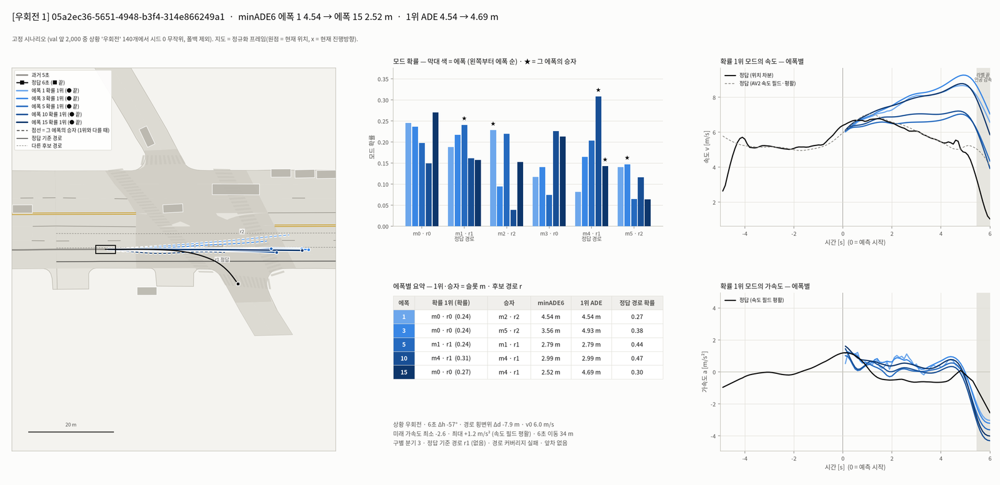 | 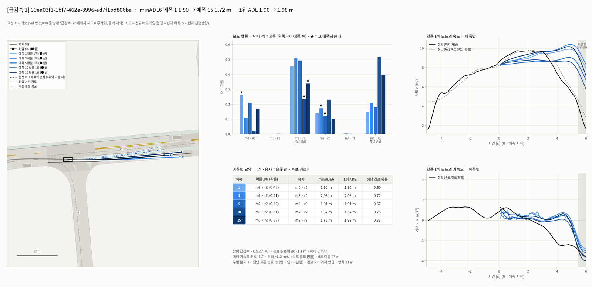 |
| 1위가 나란한 직진 차로 두 개 사이를 오간다. minADE6 개선(4.54 → 2.52 m)은 느린 모드가 승자가 된 덕이고, 1위 ADE 는 그대로다 | 에폭별 속도·가속도 곡선으로 감속 시작 시점을 어떻게 잡아 가는지 본다 |

- **정지 장면(패널 14):** 에폭 5 부터 제자리 모드를 배웠다(minADE6 1.39 → 0.11 m). 그런데 확률 1위는 계속 출발하는 모드다. **"멈출 수 있다"는 배웠지만 "멈출 것이다"를 고르지 못한다.**

**그래서** — 에폭을 늘리면 매끄러움과 확률 정리는 좋아지지만, 회전 정확도와 저속 출발의 회전율은 좋아지지 않는다.
다음 개선은 에폭 수가 아니라 다음 셋이다.
- 후보 경로 커버리지
- 확률 1위 선택
- 저속 Δθ 크기 제약

### 2.10 예측 궤적 그림 — 평균 사례 (10 Hz · 2 Hz)

학습된 모델이 실제로 낸 궤적을 HD 맵 위에 그렸다(`src/viz_v4_gallery.py`). 모델은 L4 전체 데이터 · 흔들림 벌점 1.0 이고, 입력은 10 Hz / 2 Hz 다.

**고르는 법** (val 24,988, 고른 ID 는 `runs/v4_gallery_<tag>.json`)
- **평균값 기준(주 그림):** minADE6·minFDE6 가 전체 평균에 가장 가까운 9개. 거리 = |ADE − 평균| / σ + |FDE − 평균| / σ 다.
- **중앙값 기준(참고):** minFDE6 순위 가운데 9개. 예전 v3 평균 그림(`pred_lanerules_avg.png`)과 같은 규칙이다.
  - 다만 예전 그림은 val **앞 300개**에서 뽑았다.

| 판 | 평균 minADE6 (σ) | 평균 minFDE6 (σ) | 중앙값 minADE6 | 중앙값 minFDE6 |
| --- | --- | --- | --- | --- |
| 10 Hz | 1.586 (1.708) | 3.775 (4.310) | 1.154 | 2.566 |
| 2 Hz | 1.643 (1.810) | 3.879 (4.581) | **1.139** | **2.489** |

- 2 Hz 는 **중앙값은 더 작은데 평균·σ 는 더 크다.** 오차 분포의 꼬리가 두껍다 — 대부분은 비슷하게 맞히고, 틀릴 때 크게 틀린다.

**그림 읽는 법**
- 흰색 = 과거 5초, 파랑 = 정답, 초록 점선 = best of 6(정답 끝점에 가장 가까운 모드).
- 주황 = 나머지 5개 모드. 확률이 높을수록 진하고 굵다.
- ▲ = 확률 1위 모드의 끝점(숫자 = 확률). 굵은 회색 띠 = 지도에서 열거한 후보 경로, 분홍 점선 = v3 규칙 모델(비교용).
- 칸 제목 = 상황(6초 방향 변화), 교차로 여부, 후보 경로 수, minADE6/minFDE6, 1위가 best 인지, 밴드 이탈 모드 수.

**10 Hz · 평균값 기준**

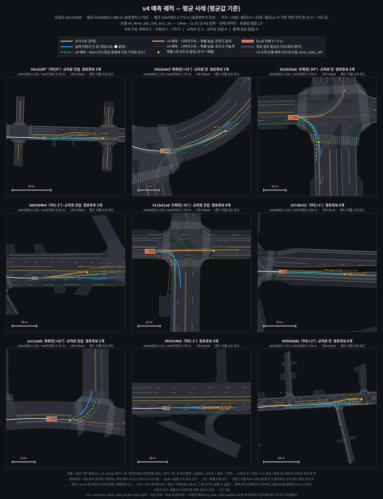

| 칸 | 무엇이 보이나 |
| --- | --- |
| 34c32df7 직진 18 m/s | 확률이 세 경로에 평평(0.31~0.35)하다. 정답은 차로를 유지했는데 1위는 5 m 뒤처지고 왼쪽으로 간다 |
| 5428a9ef 좌회전 | 경로 선택은 맞다(0.87). 1위는 4 m 뒤처지고 best 는 3 m 앞선다 — **속도 모드가 정답을 사이에 둔다** |
| 922b29ab 출발 후 우회전 | 확률이 좌회전 0.40 / 우회전 두 경로로 갈린다. 1위는 정답 경로지만 6 m 뒤처진다 |
| bb0304b4 가속 직진 | 차로 확률이 반반(0.53/0.47)이라 1위·best 가 모두 왼쪽 차로로 쏠린다 |
| 911bd1ad 우회전 | 직진에 0.56 이 쏠려 **1위가 직진으로 틀린다**(끝점 22 m). best 는 정답 우회전 |
| 187d0c02 가속 직진 | 1위 = best, 경로도 맞다. 4 m 앞선 것뿐이다 |
| acc1aafe 좌회전 | 확률이 직진 0.55 / 좌회전 0.45. 1위는 느린 직진 모드로 15 m 뒤처진다 |
| 493534b8 거의 정지 | 정지를 덜 읽어 1위가 11 m, best 가 4 m 앞선다 |
| 86965dda 오른쪽 차로로 이동 | 정답 차로 확률은 3위(0.20)고 확률이 현재 차로에 쏠린다. 확률 0 인 두 모드는 옆길에서 밴드 밖으로 멈춘다 |

- **평균적인 사례에서 틀리는 방식은 셋이다.**
  1. 확률이 경로들에 고르게 퍼져 1위가 틀린 분기를 고른다.
  2. 경로는 맞는데 속도(종방향)가 앞서거나 뒤처진다.
  3. 차로 변경을 확률 1위로 올리지 못한다.

**10 Hz vs 2 Hz — 같은 9개 시나리오** (각 판의 best of 6 과 확률 1위만)

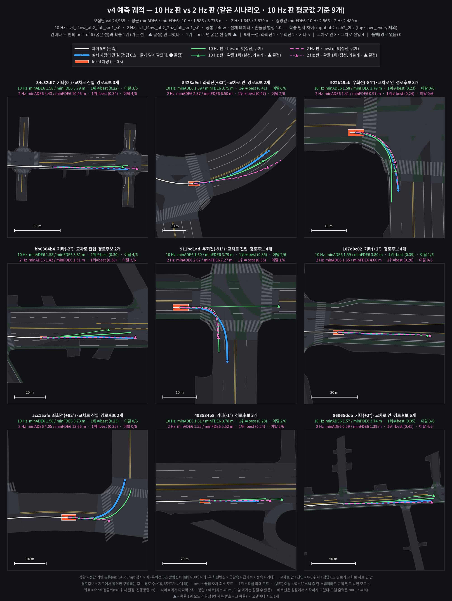

| 칸 | 두 판이 갈리는 곳 |
| --- | --- |
| 34c32df7 | 둘 다 정답 차로를 골랐다. 2 Hz 는 감속(18 → 11 m/s)을 못 읽어 10 m 앞선다 (minFDE 3.79 → 10.46) |
| 5428a9ef | 경로는 둘 다 맞다. 2 Hz 는 곡선 바깥으로 5~6 m 벗어난다 (3.75 → 6.50) |
| 922b29ab | **2 Hz 우세.** 정답 경로를 1위로 골라 best 가 1 m 안에 든다 (3.79 → 0.97) |
| bb0304b4 | **2 Hz 우세.** 정답 차로에 0.73 을 줘 1위 = best (3.81 → 1.51) |
| 911bd1ad | 2 Hz 는 1위가 정답 우회전이지만 두 선 모두 약 7 m 느리다 (3.79 → 7.27) |
| 187d0c02 | 둘 다 1위 = best 이고 선이 거의 겹친다 |
| acc1aafe | 2 Hz 는 직진에서 14 m 뒤처져 좌회전을 놓친다 (3.73 → 13.66) |
| 493534b8 | 두 판 모두 정지를 덜 읽는다 (best +3.8 / +5.5 m) |
| 86965dda | **2 Hz 우세.** 정답인 오른쪽 차로에 0.41(1위)을 준다 (3.74 → 1.39) |

- **2 Hz 는 경로 선택에서 이기는 칸이 있고, 속도·감속을 읽는 칸에서 진다.** 이는 2.6절의 "짧은 지평 정보 손실" 추정과 맞는 방향이다.
- **주의 — 선택 효과:** 이 9개는 10 Hz 기준 평균 사례라서 10 Hz 값은 3.7~3.8 m 로 모이고 2 Hz 값만 퍼진다. "3칸 우세 / 6칸 열세"를 두 판의 우열 근거로 쓰면 안 된다(우열은 2.6절 표).

**2 Hz · 평균값 기준**

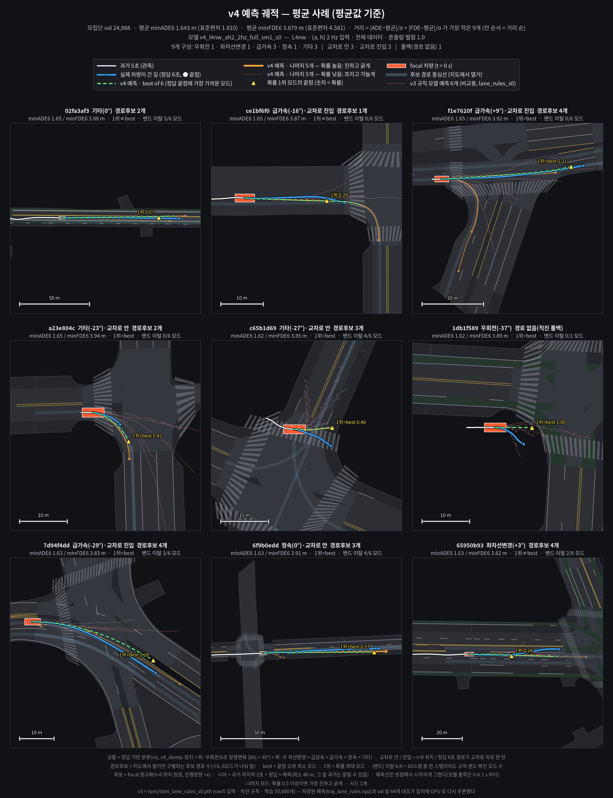

- **속도가 원인인 칸:**
  - 1위가 현재 차로를 유지한 채 15 m 뒤처진다(02fa3af3).
  - 속도 모드 두 개(−4 / +4 m)가 정답을 사이에 둔다(ce1bf6f0).
  - 1위 = best 인데 강한 가속을 덜 따라간다(f1e7620f).
- **경로가 원인인 칸:**
  - 왼쪽 차선변경을 못 읽었다(65950b93, 왼쪽 차로 확률 0.11).
  - 어느 후보 경로도 정답을 따르지 않는다(c65b1d69).
  - 경로가 없어 직진 한 모드로 옆으로 3.9 m 틀린다(1db1f589, 폴백).

**참고 — 중앙값 기준 (예전 v3 평균 그림과 같은 규칙)**

| 10 Hz | 2 Hz |
| --- | --- |
| 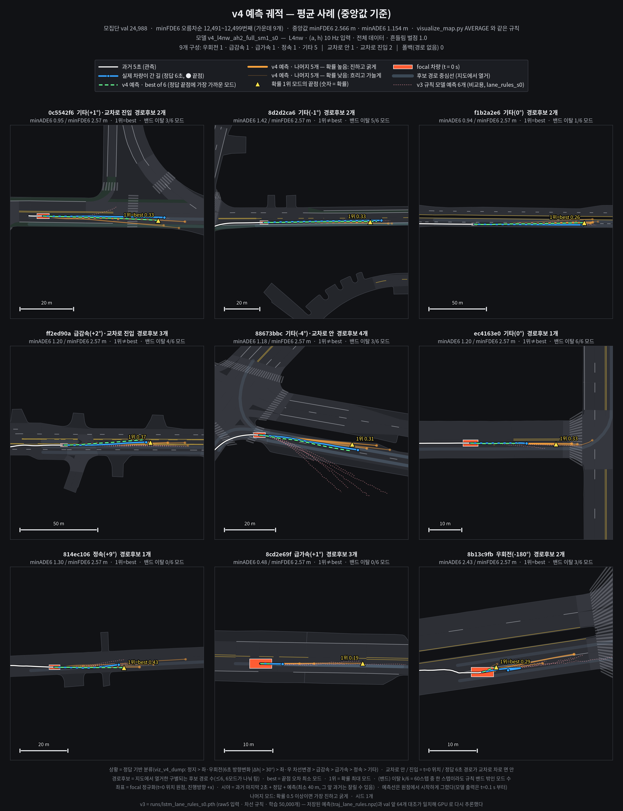 | 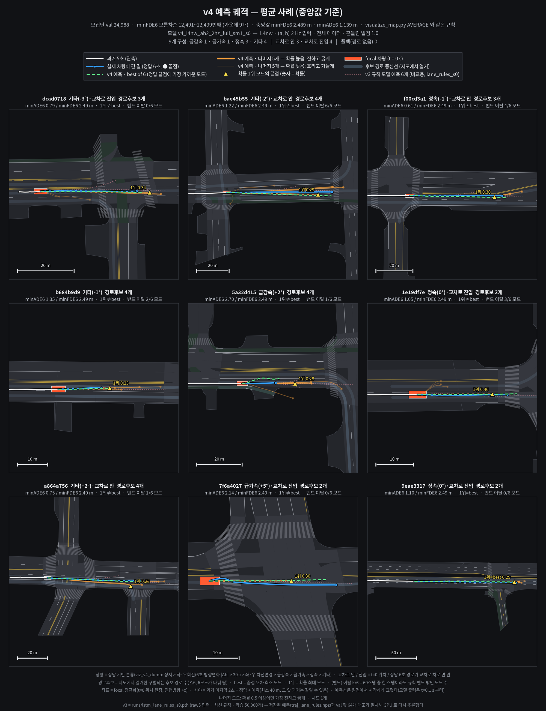 |
| 대부분 경로는 맞고 2~3 m 앞서거나 뒤처진다. 정지·출발 장면(ec4163e0, 8cd2e69f)은 확률이 '계속 감'이나 균등 쪽으로 퍼진다 | 속도 모드 두 개가 정답을 사이에 두는 칸이 둘(f00cd3a1, 1e19df7e)이고, 출발이 늦은 장면(7f6a4027)에서 1위가 11 m 뒤처진다 |

**그림을 만들며 찾은 것**
- **밴드 이탈 수가 부풀려지는 경우:** 출발 시점에 차가 이미 밴드 경계를 0.01~0.03 m 넘어 있으면, 모드 대부분이 첫 스텝부터 이탈로 잡힌다(8d2d2ca6, ec4163e0).
- **첫 점이 크게 어긋나는 모드:** 살아 있는 모드의 0.27% 가 정답 첫 점에서 1 m 넘게 떨어져 시작한다. 경로에서 먼(|d| 중앙 3.6 m) 저확률 모드에 몰려 있고, 원인은 조사하지 않았다.
- **후진 차량이 회전으로 분류된다:** 7 m 전진 후 2 m 후진한 차량이 '우회전 −180°' 로 분류됐다(8b13c9fb). 상황 분류는 후진을 따로 다루지 않는다.

### 2.11 주변 차량 heading 전처리 (2026-09-17)

> **한 줄** — 지금까지 전체 데이터셋의 heading 전처리는 **예측 대상 차량(focal) 한 대뿐**이었다.
> 주변 차량을 입력으로 쓰는 모델을 위해, **가까운 주변 차량 32대의 과거 5초 heading** 을 focal 과 같은 규칙으로 train·val 전체에 구웠다.
> **아직 모델에는 쓰지 않는다.**

**왜 필요한가**
- v4 는 focal 궤적과 지도만 입력으로 받는다(`dataset_lane.py` 가 focal 트랙 하나만 읽는다).
- 앞차 반응·끼어들기처럼 **주변 차량에 따라 달라지는 행동**을 배우려면 주변 차량의 상태가 입력에 들어가야 한다.
- 그때 AV2 heading 을 그대로 쓰면, focal 에서 걷어낸 문제(차체 방향 ≠ 이동 방향, 저속 잡음·180° 뒤집힘, 2.2절)가 다시 들어온다. 그래서 **같은 규칙으로 미리 만들어 둔다.**

**어떻게 만들었나** (`src/prep_agents_heading.py`)

| 항목 | 정의 |
| --- | --- |
| 대상 차량 | 현재 시점(t = 0)에 관측되는 vehicle · bus · motorcyclist · cyclist (자율주행 차량 트랙 포함) |
| 고르는 법 | focal 위치에서 가까운 순으로 **32대** — 넘치면 자른다 |
| 시간 구간 | 과거 5초 50스텝만. **미래(t > 0)는 한 줄도 읽지 않는다** → 모델 입력으로 써도 정답이 새지 않는다 |
| 진행방향 h | focal 과 같은 `build_heading` 이다. 위치 차분으로 만들고, 1 m/s 미만만 AV2 heading 으로 채운다(180° 뒤집힘 교정·튐 가드 포함). 중간에 끊긴 트랙은 관측된 이웃 스텝끼리 차분한다 |
| 좌표계 | focal 정규화 프레임 — h_n = wrap(h − θ_focal). 위치는 t = 0 의 focal 기준 |
| 출처 코드 `h_src` | 0 = 미관측, 1 = 위치 차분, 2 = AV2 보조, 3 = 이웃 값 유지 |
| 함께 저장 | t = 0 위치 · 거리 · 종류 · 자율주행 차량 여부 · 자르기 전 후보 수 |
| 저장 순서 | 모델 캐시와 **같은 시나리오 순서** — 인덱스로 바로 붙인다 |

**검증**

| 항목 | 결과 |
| --- | --- |
| 인과성 — 미래 스텝을 흔들고 다시 만들기 (64개) | 전 필드 **비트 불변** |
| 같은 규칙을 focal 에 걸기 | 모델 입력(ah2) 의 h 와 **차이 0** |
| 시나리오 순서 | 모델 캐시(train·val)와 **동일** |
| 좌표계 — 원본 위치로 방향을 다시 계산 (차량 175대) | 차이 1e-7 rad 이하 |

**결과** (`/data/argoverse2/cache/v4/agents_hist_{split}_361221aa2f2e23f3_n*`)

| | train | val |
| --- | --- | --- |
| 시나리오 | 199,908 | 24,988 |
| 시간 (40 workers) · 용량 | 259 s · 1.6 GB | 39 s · 203 MB |
| 시나리오당 주변 차량 (후보) | 19.7 (20.8) | 19.7 (20.8) |
| 32대에서 잘린 시나리오 | 14.5% | 14.5% |
| 관측 스텝의 h 출처 — 위치 차분 / AV2 보조 / 미관측 | 29.7% / **48.4%** / 21.9% | 29.7% / **48.4%** / 21.9% |
| 종류 — vehicle / bus / cyclist / motorcyclist | 97.5 / 1.35 / 0.91 / 0.27% | 97.5 / 1.31 / 0.89 / 0.27% |

- **AV2 보조가 절반에 가깝다.** 주변 차량에는 주차·정지 차량이 많아 1 m/s 미만 스텝이 흔하기 때문이다.
- **한 번도 움직이지 않은 차량은 방향을 검증할 수 없다.** 뒤집힘 교정은 그 트랙이 움직인 구간과 대조해서만 된다.
  - 예전 표본 분석(val 3,000 시나리오, 12.5만 트랙)에서 AV2 heading 이 이동방향과 반대로 나온 비율은 이동거리 0–2 m 트랙 42%, 50 m 이상 트랙 0.1% 였다.
    거의 안 움직인 트랙의 큰 값은 라벨이 망가져서라기보다 비교 기준(이동방향)을 세울 수 없어서다 — 그래서 검증이 안 된다.
    그런데 지금 규칙은 그 믿을 수 없는 이동방향으로도 교정을 건다 → 아래 '발견된 결함'.
  → 모델에 넣을 때 `h_src` 로 "움직여서 확인된 방향"과 "보조 방향"을 구분해야 한다.
- **창 가장자리 램프**(2.6·2.8절)는 주변 차량 트랙에도 똑같이 있다. 방향보다 속력에 영향을 주고, heading 에는 저속 판정을 통해서만 들어온다.

**쓰는 법**

```python
import numpy as np, json
A = "/data/argoverse2/cache/v4/agents_hist_train_361221aa2f2e23f3_n199908"
h   = np.load(f"{A}/h.npy",     mmap_mode="r")   # (N, 32, 50) focal 프레임 진행방향 [rad]
src = np.load(f"{A}/h_src.npy", mmap_mode="r")   # (N, 32, 50) 0 미관측 / 1 위치차분 / 2 AV2 보조
pos0 = np.load(f"{A}/pos0.npy", mmap_mode="r")   # (N, 32, 2) t=0 위치
# 모델 캐시(train_e9678c3a…)와 i 번째가 같은 시나리오다 — 두 scenario_id.json 이 같다
```

- 과거 위치까지 필요하면 `--with-pos` 로 다시 굽는다(약 2.9 GB 추가).
- 2 Hz 입력을 쓰는 모델이면, 주변 차량도 같은 2 Hz 규칙(평활 → 0.5초 뽑기)으로 만들어야 한다. 아직 캐시는 없다.

#### 10 Hz vs 2 Hz 전처리 비교 — 시각화 (val 24,988)

> **한 줄** — 2 Hz 는 방향 잡음과 ±π 점프를 절반 넘게 줄인다.
> 그런데 비교 중에 **정지 차량의 180° 뒤집힘 교정(`align_ref`)이 위치 잡음에 끌려 방향을 오히려 틀리게 만드는 결함**이 나왔다.
> 독립 검토자가 따로 짠 코드로 재현했다. **아직 고치지 않았다.**

| 항목 | 10 Hz | 2 Hz | 비고 |
| --- | --- | --- | --- |
| focal ±π 점프가 있는 시나리오 | 1.58% | 0.62% | |
| focal 방향 변화 중앙 (위치차분 구간, 1~2 m/s) | 8.2 °/s | 4.3 °/s | 저속일수록 차이가 크다 |
| 창 시작 속력 (첫 값 ÷ 실제) | 0.48배 → 약 1.1 s 동안 가짜 가속(\|a\| 중앙 9.9 m/s²) | 중앙 1.017배, IQR 0.95–1.07 | 2 Hz 는 인덱스 4 에서 시작해 중앙값만 맞는다 |
| 정지 주변 차량이 '차로 반대' (차로 안·50스텝 관측 42,094대) | 6.40% | 2.89% | AV2 원본 0.51% |
| focal 을 180° 뒤집은 시나리오 | 180 (0.72%) | 70 (0.28%) | 그중 10 Hz t=0 h 가 뒤를 향함 90 |
| 2 Hz 로 계산 가능한 주변 차량 | — | 52.3% | 관측 50스텝이 모두 있어야 한다 |


**발견된 결함 — 정지 차량을 잘못 뒤집는다**
- **규칙:** 위치차분 스텝이 3개 이상이면 AV2 heading 과 비교해, 중앙 차가 90° 를 넘을 때 그 트랙의 AV2 보조 값을 180° 돌린다.
- **왜 틀리나:** 서 있는 차도 위치 잡음(0.1 s 에 10 cm 이상)만으로 위치차분 스텝이 생긴다. 그 방향은 제멋대로라 판정이 동전 던지기가 된다.
- **크기:**
  - 정지 주변 차량(전체의 53.4%) 중 26% 가 판정을 받는다.
  - 차로 안 정지 차량의 t=0 방향이 차로와 반대인 비율: AV2 0.97% → 10 Hz **12.2%**
- **누가 맞나** (10 Hz 가 뒤집은 정지 차량):

| 기준 | n | AV2 원본이 맞음 | 10 Hz 가 맞음 |
| --- | --- | --- | --- |
| t=0 차로 방향 | 6,162 | 98.1% | 10.3% |
| 나중에 3 m 이상 전진한 방향 (지도와 무관, 독립 재현 표본 4,000) | 140 | 97.9% | 17.1% |

- **영향 범위:**
  - 주변 차량 캐시 — 아직 모델에 안 쓴다.
  - **focal 10 Hz 입력 180 시나리오(0.72%)** — 이미 학습에 들어가 있다.
- **고칠 방법 후보 (결정 필요):**
  - (1) 판정에 쓰는 위치차분을 충분히 움직인 트랙(예: 누적 2 m 이상)으로 제한한다.
  - (2) 정지 차량은 뒤집지 않는다.
  - 어느 쪽이든 캐시를 다시 굽고, focal 에도 걸리므로 모델을 재학습해야 한다.


- 패널 7: 주변 차량 N 은 최대 속력 0.2 m/s 인데 위치 잡음 스텝이 8개다. 10 Hz(파랑)는 뒤집혀 차로와 반대가 됐고, 2 Hz(빨강)는 판정을 안 해 AV2 그대로다.
- 전체 분석(정의·검증·결정 트리·패널 11장·특성 표): `docs/v4_heading_prep_viz.md`


### 2.12 30에폭 · 코사인 학습률 (2026-09-17)

> **한 줄** — 30에폭 + 코사인 학습률로 L4 · 벌점 1.0 판이 **1.586 → 1.402**(10 Hz), **1.643 → 1.490**(2 Hz)이 됐다.
> 벌점 없는 15에폭 판(1.480)보다도 낮고, 스텝마다 뒤집히는 지그재그는 다시 생기지 않았다(7.3° 초과 약 1%).
> 다만 **에폭 수와 학습률 스케줄을 함께 바꿨다.** 어느 쪽 덕인지는 대조판(상수 30에폭 · 코사인 15에폭)이 없어 모른다.

**왜 돌렸나**
- 15에폭 판들은 best 에폭이 5·13·14 로 흩어졌다. 마지막 에폭들의 train loss 도 오르내려(예: 10 Hz 벌점 판 2.278~2.351) 수렴했는지 판단하기 어려웠다.
- 상수 학습률 5e-4 에서는 val minADE6 가 에폭마다 평균 0.04~0.06 m 오갔다. 그래서 best 에폭 하나를 믿기 어려웠다.

**설정**
- 15에폭 L4 · 벌점 1.0 판과 같고, 바꾼 것은 `--epochs 30 --lr-sched cosine --lr-min 1e-5` 둘뿐이다.
- 학습률은 스텝마다 5e-4 에서 1e-5 로 내려간다.
- 10 Hz(`v4_l4nw_ah2_full_sm1_cos30_s0`)와 2 Hz(`v4_l4nw_ah2_2hz_full_sm1_cos30_s0`)를 tmux 두 세션에서 **병렬**로 돌렸다.
- 에폭마다 체크포인트를 남겼다(`runs/ckpt/<tag>/ep01~30.pth`).

**결과** (val 24,988 재채점 — `runs/v4_full_compare.json`)

| 판 | 입력 | 에폭 · 학습률 | best 에폭 | minADE6 | minFDE6 | 최근 5에폭 minADE6 | 이탈 | 7.3° 초과 | jerk RMS [m/s³] | θ 가속 RMS [°/s²] |
| --- | --- | --- | --- | --- | --- | --- | --- | --- | --- | --- |
| L4 전체 (벌점 없음) | 10 Hz | 15 · 상수 | 14 | 1.480 | 3.409 | 1.543 ± 0.055 | 0.60 | 19.65% | 70.2 | 780 |
| L4 전체 · 벌점 1.0 | 10 Hz | 15 · 상수 | 5 | 1.586 | 3.775 | 1.651 ± 0.028 | 0.81 | 0.70% | 4.1 | 28 |
| **L4 전체 · 벌점 1.0** | **10 Hz** | **30 · 코사인** | 29 | **1.402** | **3.279** | **1.407 ± 0.003** | **0.52** | 1.03% | **3.4** | 26 |
| L4 전체 · 벌점 1.0 | 2 Hz | 15 · 상수 | 13 | 1.643 | 3.879 | 1.749 ± 0.057 | 0.67 | 1.42% | 3.8 | 28 |
| **L4 전체 · 벌점 1.0** | **2 Hz** | **30 · 코사인** | 25 | **1.490** | **3.414** | 1.497 ± 0.002 | 0.56 | 1.09% | 5.6 | **25** |

- **표 읽는 법:**
  - 최근 5에폭 = 평균 ± 표준편차(모집단 표준편차, ddof=0)다.
  - jerk RMS = 80·√(흔들림 a), θ 가속 RMS = 800·√(흔들림 θ). 모두 살아있는 모드 기준이다.
  - 마지막 에폭(ep30)을 그대로 써도 10 Hz 1.406 / 3.299, 2 Hz 1.497 / 3.440 이다.

**무엇을 알았나**
- **30에폭 코사인 판은 벌점을 켜고도 벌점 없는 15에폭 판보다 낫다.**
  - 1.402 vs 1.480 으로 5% 낮다.
  - 그러니 2.5절의 "벌점 대가 7~9%" 에는 짧은 학습·큰 학습률의 몫이 섞여 있었을 수 있다.
  - 벌점 없는 30에폭 판이 없어서 벌점 자체의 대가는 아직 분리하지 못했다.
- **에폭 사이 흔들림이 사라졌다.**
  - 최근 5에폭 표준편차: 0.028 / 0.057 → **0.003 / 0.002**
  - 마지막 10에폭의 에폭 간 변화: 평균 0.036 / 0.063 → **0.006 / 0.008 m**
  - 이제 best 에폭 고르기에 기대지 않아도 된다(best 와 ep30 의 차이는 0.004~0.007 m).
  - 30에폭 판도 11–15에폭에는 15에폭 판만큼 흔들렸다(표본 표준편차 0.058 / 0.048).
  - 뒤반에 조용해진 것이 학습률 감소 때문인지 추가 학습 때문인지는 가르지 못한다. 반례도 있다: 10 Hz 11–15에폭의 minFDE6 표준편차는 학습률이 더 작은 코사인 판(0.195)이 상수 판(0.078)보다 크다.
- **뒤반(15에폭 이후)에 크게 좋아졌다.**
  - 10 Hz 는 15에폭부터 1.52 아래로 내려가 다시 올라오지 않았다(14 → 15 → 16에폭: 1.670 → 1.508 → 1.450).
  - 2 Hz 는 계단 없이 내려가 18에폭부터 1.55 아래에 머문다.
  - 15에폭 판의 best 를 10 Hz 는 9에폭(1.5861, 0.0002 m 차)·10에폭(1.566)에, 2 Hz 는 12에폭(1.603)에 넘어섰다.
- **10 Hz 와 2 Hz 의 격차는 학습을 늘려도 줄지 않았다.**
  - best 1.402 vs 1.490(+6.3%), 최근 5에폭 1.407 vs 1.497(+6.4%) 이다.
  - 15에폭 때는 best +3.6%(0.057 m), 최근 5에폭 +5.9% 였다. best 기준으로는 오히려 커졌지만 시드 1개라 단정하지 않는다.
- **이탈도 줄었다.** 10 Hz 0.81 → 0.52 로, 벌점 없는 판(0.60)보다도 낮다.
- **스텝마다 뒤집히는 지그재그는 다시 생기지 않았다.** 7.3° 초과는 약 1% 로, 벌점 없는 판(19.65%)과 비교가 안 된다.
- **다만 늘어난 것도 있다.**
  - 10 Hz 7.3° 초과: 0.70 → 1.03% (+47%)
  - 2 Hz jerk: 3.8 → 5.6 m/s³ (+48%). 그래도 벌점 없는 판(70)의 1/12 이다.
  - 1~2 s 주기의 느린 가속 출렁임(p90 꼬리)이 커졌다. 흔들림 벌점은 0.1 s 스텝 사이 차이만 벌해서 이런 느린 출렁임은 거의 못 잡는다.
- **아직 여지가 있을 수 있다.**
  - 마지막 5에폭에도 train loss 가 매 에폭 줄었다(에폭당 약 0.006, lr 1e-5 근처).
  - val 은 1.402~1.410 에서 평평했다.


**예측 궤적 — 평균 사례** (평균값 기준 9개, 규칙은 2.10절과 같다)

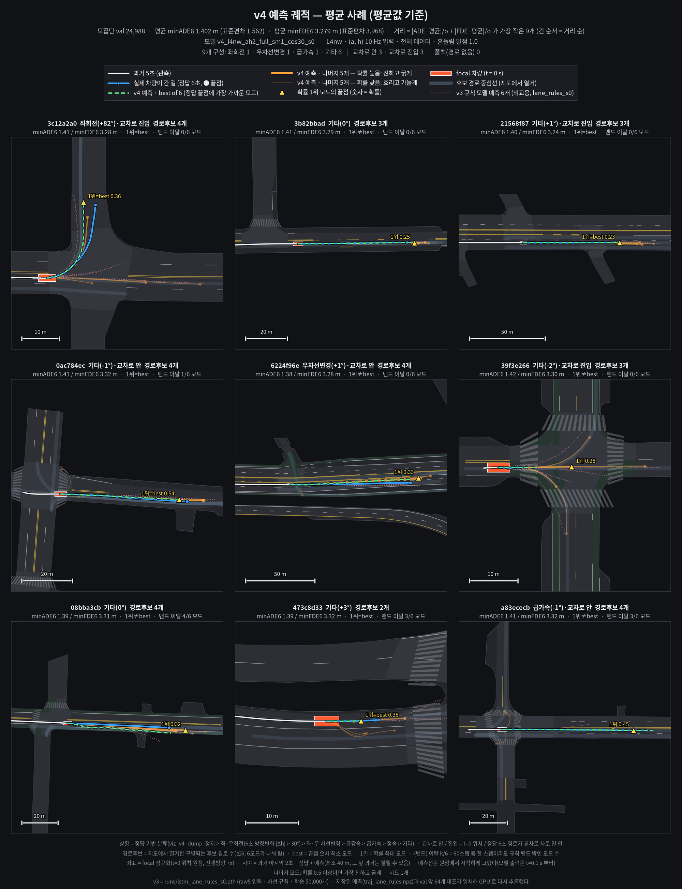
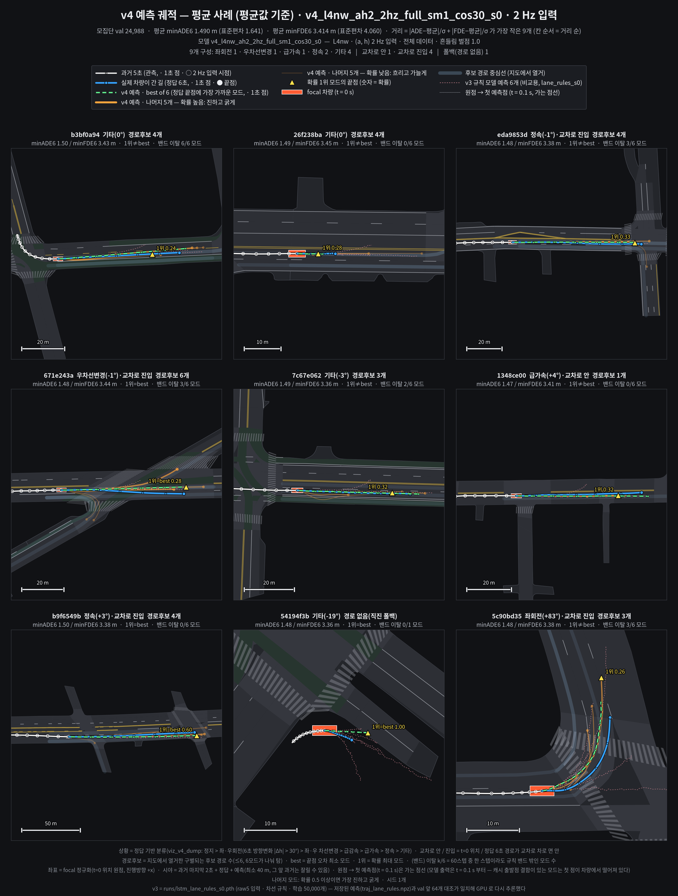

**두 판 겹쳐 보기** — 10 Hz 판 평균 사례 9개에 2 Hz 판의 best(굵은 점선)와 확률 1위(가는 점선)를 겹쳤다.

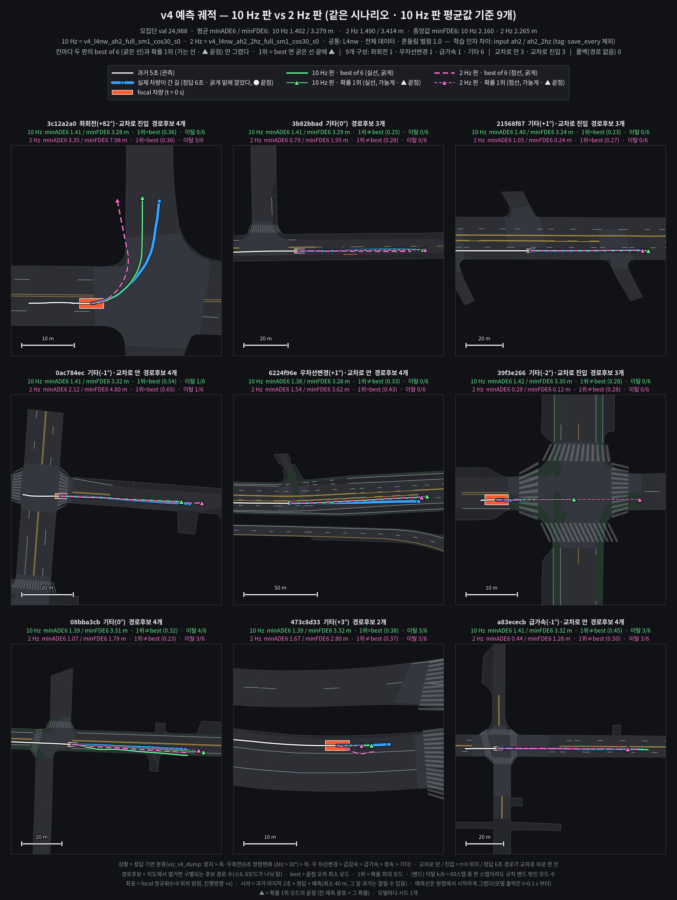

- **9칸 중 6칸은 2 Hz 의 끝점 오차가 더 작다. 하지만 이것은 칸을 고른 방식 때문이다(선택 효과).**
  - '이긴다' = 끝점 오차(minFDE6)가 1 cm 넘게 작다.
  - 10 Hz 판에서 평균 근처인 시나리오 500개로 넓혀도 2 Hz 가 61.6% 이긴다.
  - 거꾸로 2 Hz 판의 평균 근처 500개에서는 10 Hz 가 66.6% 이긴다.
  - val 전체에서 2 Hz 가 이기는 시나리오는 **46.8%** 뿐이다(1 cm 조건 없이 단순 비교하면 47.4%).
- **2 Hz 는 분포 전체가 조금씩 나쁘다.** 꼬리만 두꺼운 것이 아니다.
  - minFDE6 중앙값 2.160 → 2.265, p75 3.95 → 4.19, p90 6.98 → 7.30 이다.
  - 차이가 큰 상위 20% 시나리오가 합계 차이의 68% 를 낸다(상위 1% 는 6%).
- **경로 선택은 재는 기준에 따라 결론이 뒤집힌다.**
  - **슬롯 기준**(확률 1위 모드가 정답 경로 슬롯인가)으로는 2 Hz 가 낫다.
    - 분기가 2개 이상인 시나리오: 정답 경로 확률 순위 1위 49.2% → 56.3%, 1위 모드가 정답 경로 48.1% → 52.2%
    - val 전체로 재면 57.1 → 63.2%, 56.3 → 59.7% 다. 다만 여기에는 분기 1개·폴백 시나리오 3,919개가 늘 정답으로 들어가 있다.
  - **차로 기준**(1위 궤적의 6초 끝점이 정답 차로 1.75 m 안인가)으로는 10 Hz 78.0% vs 2 Hz 76.5% 로 10 Hz 가 낫다.
  - 슬롯 기준은 10 Hz 가 나란한 옆 차로 슬롯을 골라 제 차로로 돌아오는 궤적도 틀린 것으로 센다. 아래 시각화 분석 참고.
  - 그래서 "2 Hz 는 경로는 잘 고르고 속도·거리에서 진다"고 말할 근거는 약하다.
  - 9칸에서는 정답 경로 확률 1위가 10 Hz 3칸 · 2 Hz 7칸이고, 1위 모드의 경로는 5칸 · 5칸으로 같다.
- **2 Hz 가 크게 틀린 칸:** 좌회전(3c12a2a0)에서 **더 일찍·크게 꺾어** 회전 안쪽으로 7.9 m 들어갔다. 끝 진행방향은 101° 로 정답 83° 보다 크다. minFDE6 7.98 m 다(10 Hz 3.28 m).
- 숫자 출처: `runs/v4_gallery_*_cos30_s0.json`, 시나리오별 덤프 `viz/v4/<tag>/data/scenarios.parquet`.

**시각화로 본 특성 — 네 판 비교** (10 Hz · 2 Hz × 15에폭 상수 · 30에폭 코사인, val 24,988)

- 원본 문서: `docs/v4_viz_cos30.md`(예측 분석·네 판 비교), `docs/v4_epochs_cos30.md`(에폭별 학습 방향)
- **검증:**
  - 시각화 에이전트가 원본을 재현했다(덤프 ↔ 재채점 2e-8). 다른 코드로 70개 항목을 대조했다.
  - 새 컨텍스트 검토자가 핵심 주장 8가지를 따로 재계산했고, 그 지적 약 30건을 반영했다.
- **모든 비교의 전제:** 30에폭 판은 에폭 수와 학습률 스케줄을 함께 바꿨다. 그래서 30 − 15 차이는 **"뒤반(학습률 감소 + 추가 학습)"** 의 결과라고만 부른다. 시드는 1개다.

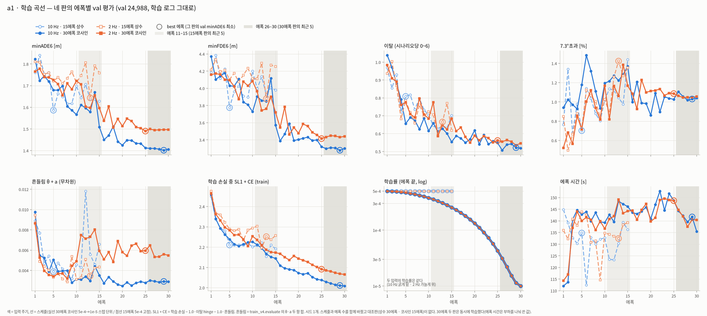

- **학습 곡선:** 에폭 1–15 에서도 코사인 판이 대체로 낮다(같은 에폭 평균 10 Hz −0.027, 2 Hz −0.059 m).

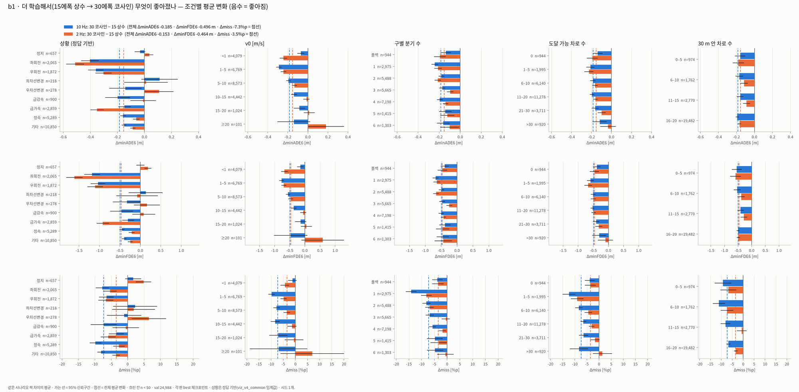

- **어디가 나아졌나:**
  - 회전이 가장 크다. minFDE6 은 좌회전 −1.18 / −1.61, 우회전 −1.04 / −1.11 m 다(10 Hz / 2 Hz).
  - 2 Hz 는 저속·급가속도 크게 나아졌다(급가속 −0.92 m).
  - 신뢰구간 기준으로 나빠진 칸은 **2 Hz 정지(+0.19 ± 0.08 m)** 하나다.

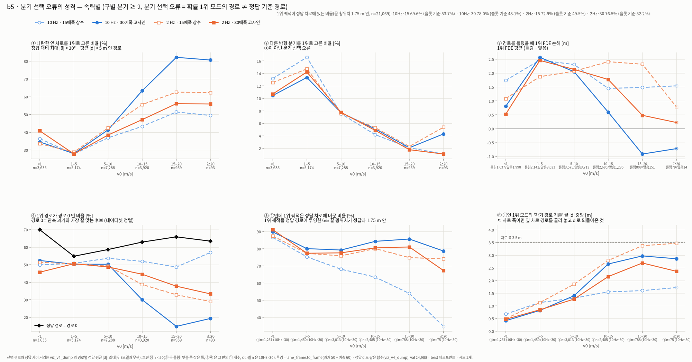

- **경로 선택은 재는 기준에 따라 달라진다** (분기 2개 이상, 21,069개).

| 기준 | 10 Hz 15 → 30 | 2 Hz 15 → 30 | 30에폭 2 Hz − 10 Hz |
| --- | --- | --- | --- |
| 슬롯 — 1위 모드의 경로 = 정답 경로 | 53.7 → 48.1% | 49.5 → 52.2% | +4.1 %p |
| 차로 — 1위 궤적의 6초 끝이 정답과 1.75 m 안 | **69.6 → 78.0%** | 72.9 → 76.5% | **−1.5 ± 0.5 %p** |

  - 10 Hz 30에폭 판은 고속(15–20 m/s)에서 **나란한 옆 차로 슬롯을 1위로 고르는 비율이 51 → 82%** 로 늘었다. 그 궤적의 86% 는 횡오프셋 d(끝 |d| 중앙 3.0 m ≈ 차로 폭)로 제 차로에 머문다.
  - 슬롯 기준 "분기 선택 악화"는 이 때문에 생긴 겉보기다.
  - 차로 기준 결론은 임계값을 1.0 · 2.5 m 로 바꿔도 같다.
  - 15에폭 쌍에서는 차로 기준으로 2 Hz 가 +3.3 %p 높았다. **어느 입력이 경로를 잘 고르는지는 학습마다 뒤집힌다.**

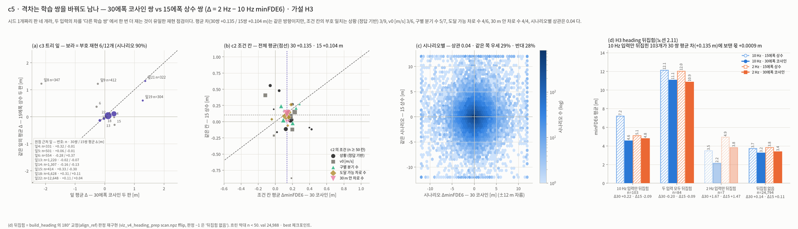

- **10 Hz 와 2 Hz 의 격차는 평균만 재현된다.**
  - 평균 차(2 Hz − 10 Hz minFDE6)는 30에폭 쌍 +0.135, 15에폭 쌍 +0.104 m 로 같은 방향이다.
  - 그러나 시나리오별 차이의 두 쌍 상관은 **0.04** 다. 결정 트리 설명력도 검증 R² 0.003 이다.
  - 즉 어느 시나리오에서 2 Hz 가 지는지는 학습마다 다르다.
  - 가설 점검:
    - 창 시작 램프(H1): 일관된 증거가 없다. 첫 0.5 s 를 가린 재학습 없이는 판단할 수 없다.
    - 10 Hz focal heading 뒤집힘(H3, 2.11절): 평균 차에 보탠 몫이 +0.0009 m 뿐이다.

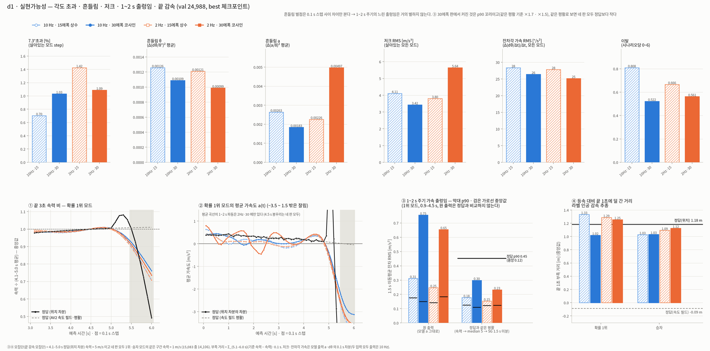

- **실현가능성:**
  - 7.3° 초과: 0.70 / 1.03 / 1.42 / 1.09% (10 Hz 15 · 30 / 2 Hz 15 · 30)
  - jerk RMS: 4.11 / 3.42 / 3.80 / **5.64** m/s³
- **1~2 s 주기의 느린 가속 출렁임(③):**
  - 모델 원출력 p90 은 15 → 30에폭에 0.31 → 0.75(10 Hz), 0.25 → 0.65(2 Hz)로 커졌다.
  - 정답(0.45)은 미리 평활된 값이다. 모델에도 같은 평활을 걸면 0.18 → 0.30, 0.15 → 0.23 으로 **네 판 모두 정답보다 작다.** 커진 것은 p90 꼬리뿐이다(10 Hz 중앙값은 오히려 줄었다).
  - 흔들림 벌점은 0.1 s 스텝 사이 차이만 벌해서 이런 느린 출렁임을 거의 못 잡는다.
- **라벨 끝 인공 감속(④):** 10 Hz 30에폭 판은 1위 모드의 끝 1초 부족 거리가 1.33 → 1.02 m 로 줄어, 인공 감속(정답 위치 1.18 m)을 덜 따라간다. 2 Hz 는 1.29 → 1.25 m 다.

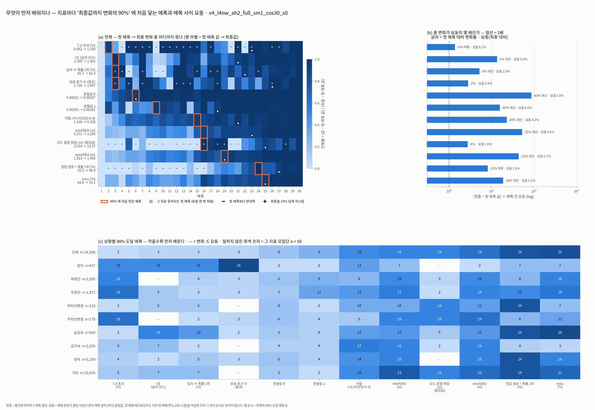

- **에폭별로 무엇이 먼저 배워지나:**
  - 매끄러움(흔들림 θ 는 에폭 4~6)과 모드 선택의 틀(CE · 승자≠1위 · 유효 분기 수는 에폭 3~4)이 먼저 90% 에 닿는다.
  - 정확도는 뒤반(minADE6 은 에폭 18~19)에 닿는다.
  - 2 Hz 판은 에폭 9–14 에 가속도 흔들림이 튀고, 뒤반에도 첫 에폭보다 높다(+32%).

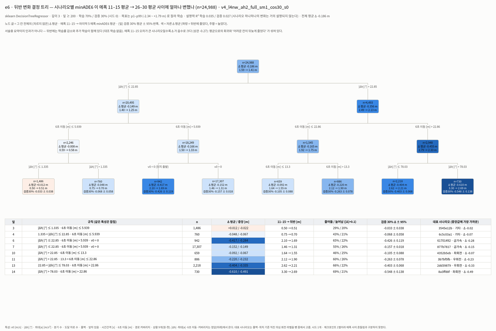

- **뒤반 개선 결정 트리 (10 Hz):**
  - 큰 회전(|Δh| > 78°)이면서 6초에 22.9 m 넘게 움직인 잎이 −0.61 m 로 가장 크다(검증 −0.55 ± 0.14). 정지 출발 잎은 −0.42 m 다.
  - 설명력은 검증 R² 0.027 로 낮다. 서술용이다.

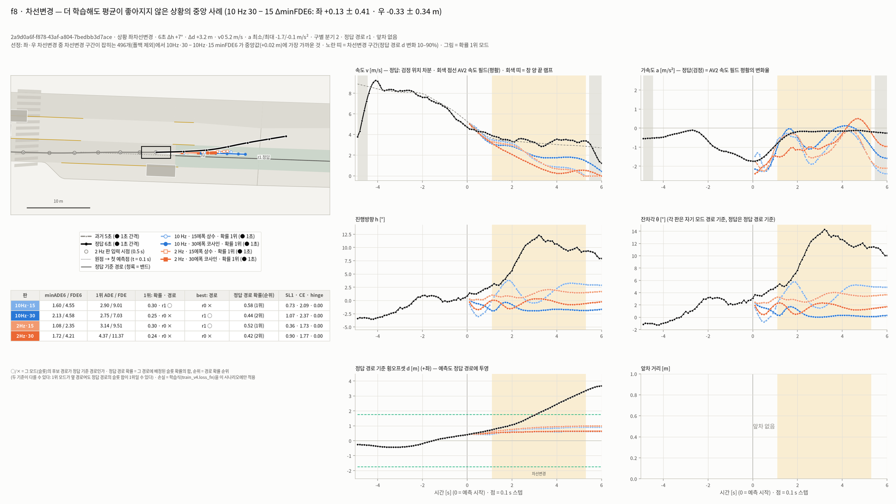

- **차선변경 (중앙 사례 2a9d0a6f):**
  - 정답은 6초 끝에 왼쪽으로 3.7 m 옮겨 간다. 네 판의 1위 모드는 모두 0.6–1.0 m 에 머물러 **차선변경을 그리지 않는다.**
  - 차선변경 상황은 뒤반에 평균이 좋아지지 않았다(10 Hz 좌 +0.13 ± 0.41, 우 −0.33 ± 0.34 m).

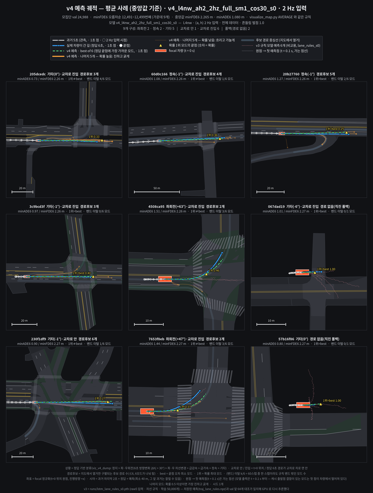

- **2 Hz 중앙값 사례 · 캐시 결함 장면:**
  - 20b27760 칸의 가는 점선(원점 → 첫 예측점)이 길게 튄다. 8절의 **출발 상태 (s0, d0) 결함** 때문이다(모델 출력이 아니다).
  - 그림은 원점과 첫 점 사이를 점선으로 그려 이런 장면을 드러낸다.


---

## 3. 전처리 — 후보 경로 열거기

`k` 는 기준 경로의 접선각에서 나온다. **경로가 틀리면 θ 라벨이 통째로 오염된다.**
그래서 먼저 열거기를 고쳤고, 결함이 둘 있었다.

### 결함 1 — 차선변경 이음매에서 경로가 180° 접힌다

| 경로가 쓴 이동 | 접힘 비율 |
| --- | --- |
| successor 만 | **0%** |
| 차선변경이 든 경로 | **98~100%** |
| 전체 | **55.4%** (val 1,459 · 열거된 경로 전수) |

이웃 차로는 현재 차로 **옆에서 처음부터** 시작하는데 중심선을 통째로 이어붙여서, 이음매가
중앙값 21 m 뒤로 접혔다.

### 결함 2 — 경로가 6초를 못 덮는다

`max_hops=4` 인데 AV2 차로 조각은 중앙 **약 20 m** 라 4홉이 약 80 m 다(val 80개 지도 5,391 차로 재측정: 중앙 20.6 m / 평균 23.9 m). 6초에 90 m 가는 차량은 경로 끝을
지나치고 `|d|` 가 최대 **102 m** 까지 커진다. **시나리오의 34.5%** 가 이 상태였다.

### 고침 — successor 만, 지평은 v0 로

**차선변경을 기하에서 빼는 이유**: 지도가 **전이 지점을 주지 않는다.** 어디서 차로를 바꿀지는
두 차로가 겹치는 구간 전체에 걸친 연속 자유변수라, 이음매 위치를 고르는 순간 지도에 없는 값을
기하에 박게 되고 그 전이 곡률(실제 커브의 3~7배)이 `k` 로 둔갑한다. **`h = k + θ` 는 `k` 가
도로만 담아야 성립한다.** 차선변경은 별도 succ-only 경로 + 잔차 `(d, θ)` 가 표현한다.

| 지표 | 수정 전 | 수정 후 |
| --- | --- | --- |
| 하위호환(`legacy=True`) | — | **2,906/2,906 일치, 좌표 최대차 0.00e+00** |
| 접힘 >90° 경로 | 55.4% | **0.000%** |
| 자기되돌아옴 경로 | 16,814 | **0** |
| 6초 못 덮는 경로 | 11.7% | **2.0%** |
| 경로 0개 시나리오 | 2 | **0** |

> `경로 0개` 는 **시작 차로는 찾았는데 열거기가 경로를 못 만든** 경우다(val 1,459, 두 센터라인).
> `candidate_lanes` 가 시작 차로 자체를 못 찾는 경우는 별개이고 열거기 수정과 무관하다 —
> `simulate_v4_lane --limit 300` 기준 수정 전후 모두 4개, val 전체로는 3.75% 다.
| 경로 접선 꺾임 (중앙) | **118.9°** | **3.5°** |
| 역주행 (모드) | 0.56% | **0.11%** |
| 투영 후 minADE6 | 3.432 | **1.702** |

---

## 4. 출력 밴드 — 어디까지 벗어날 수 있게 할 것인가

succ-only 경로에서는 차선변경이 잔차 `d` 로 표현되므로 밴드 폭이 곧 **L0·L4 의 표현력 천장**이다.
(L3 는 경로를 조건으로만 쓰고 출력은 자유 위치 회귀라 밴드에 갇히지 않는다 — 아래 5절 참조.)

| 밴드 | recall@1 | recall@5 | 천장(@40) | 대가 |
| --- | --- | --- | --- | --- |
| ±1.75 (차로 반폭) | 63.9% | 77.9% | 79.7% | 없음 — 보장 최대 |
| **규칙 밴드 + 교차로 완화** | 72.0% | **87.4%** | **89.9%** | 규칙상 갈 수 있는 쪽만 열림 |
| ±3.6 평평 | 81.1% | **94.5%** | 96.6% | 밴드의 **27.6% 대향차로 / 21% 도로 밖** |

`±3.6` 만 문서 판정선(recall@5 ≥ 0.90)을 넘지만 **그 통과는 보장을 팔아서 산 것**이다. (표는 val 3,000 중 10 m 이상 이동한 2,380 시나리오 기준 — 전체로 보면 규칙 밴드는 85.2% 다. 즉 채택한 규칙 밴드는 판정선 **미달**이고, 원 설계 문서는 미달이면 L3·L0 를 포기하라고 했는데 그 지시를 따르지 않고 진행했다.)
이 설계를 고른 근거가 "실현 불가능 26% → 0%" 인데, ±3.6 으로 열면 출력 공간 자체가 역주행을 허용한다.
**규칙 밴드를 채택**했다 — 규칙상 차선변경이 허용된 쪽과 교차로 안에서만 넓힌다.

---

## 5. 레벨별 결과

### L2 — 지도 cross-attention

새 하네스가 기준선을 **소수점까지 재현**(1.292 / 2.883 / params 414,294)한다.
이후 차이는 전부 레벨 때문이다.

### L3 — 모드 = 후보 경로

처음엔 **+25% 나빠졌다**(1.616). 원인은 모드 붕괴였다:

| 지평에서 경로끼리 최대 거리 | 시나리오 비율 |
| --- | --- |
| < 1 m | **28.2%** |
| < 5 m | 46.0% |

직선 도로에는 갈림길이 없으니 모드 6개가 사실상 1개가 되고 `minADE6` 이 `minADE1` 로 퇴화한다.
익명 슬롯은 그 자리에서 **속도 프로파일**로 갈라져 있었는데 그 축을 없앤 것이다.

**고침**: 중복 경로를 제거하고 모드를 `(분기 × 종방향 하위모드)` 로 쪼갰다.
구별 분기 중앙 3개. → **1.414 (+9.5%)**, 퇴행의 62% 회수.

**남은 +9.5% 는 밴드 천장 탓이 아니다.** L3 는 `return head, logits, {}` 로 자유 xy 를
내놓고 `rollout`·`band` 를 거치지 않는다 — 밴드 천장은 L0·L4 의 제약이다. 직접 재보면:

| 구별 분기 수 | 시나리오 | 기준선 | l3b | 퇴행 | 몫 |
| --- | --- | --- | --- | --- | --- |
| 1 | 251 | 1.187 | 1.362 | +0.175 | 18.8% |
| 2 | 449 | 1.188 | 1.232 | +0.044 | 8.4% |
| 3 | 435 | 1.399 | 1.529 | +0.129 | 24.0% |
| 4 | 579 | 1.332 | 1.430 | +0.098 | 24.1% |
| 5 | 118 | 1.538 | 1.502 | −0.035 | −1.8% |
| 6+ | 168 | 1.136 | 1.507 | **+0.370** | 26.5% |

※ 6+ 행의 168개에는 지도 경로가 없는 75개가 섞여 있고, 그 75개는 l3b 를 부채꼴 폴백 데이터로
잘못 평가한 값이다. 실제 6분기 93개만 떼면 퇴행은 +0.310 이다.

- 분기 수와 퇴행의 **상관 +0.025** — 모드 기아 가설은 반증된다.
- 가장 큰 단일 덩어리는 **지도가 경로를 못 주는 75개**다. 폴백이 직진 하나뿐이라 `minADE1` 로
  채점됐다: 기준선 0.710 → l3b **1.326**, 퇴행 +0.616, 전체 격차(1.416 − 1.292 = 0.124 m)의 약 19%.
  처음엔 1.154 / +0.445 / 14.2% 로 적었는데, l3b 를 부채꼴 폴백 데이터로 평가한 방법 오류였다.
  이 버킷을 부채꼴 폴백으로 고치려던 시도는 실패했다(8절).
- 나머지 +0.104 는 **모드 예산을 지도 분기에 묶은 대가**로 읽힌다(6분기 버킷 +0.310).
- l3b 는 15에폭에서도 아직 내려가는 중 — **과소학습 가능성은 아직 확인 못 했다.**

### L0 — 출력을 액션으로, Frenet 적분기

데카르트가 아니라 **경로 좌표계에서 적분**한다. 속도벡터가 차로 접선과 이루는 각이 곧 `θ` 이므로

```
ds = v·cos(θ)·dt      dd = v·sin(θ)·dt      p = P(s) + N(s)·d
```

로 **`d` 가 상태 변수로 직접 나온다.** L4 는 그 `d` 에 hinge 를 거는 것으로 끝나고,
`h = k(s) + θ` 도 정의 그대로 성립한다. 누적합만 쓰므로 순차 루프가 없고 exposure bias 가 0이다.

**그런데 처음 구현은 설계의 간판 주장을 깨고 있었다.** 학습된 L0 의 스텝간 방향 변화:

| | 중앙 | p99 | 라벨 상한(7.3°) 초과 |
| --- | --- | --- | --- |
| 학습된 L0 `\|Δθ\|/step` | **17.91°** | **174.09°** (= 1741°/s) | **71.4% of step** |
| 실제 차량 (라벨 전수조사) | 0.05° | 2.75° (p99.99 = 7.3°) | — |

**step 의 71.4% 가 실제 차량이 낼 수 없는 것**이었다 (val 300). 이 값은 레이트 제한을 넣기
**전 코드**로 잰 것이라 현재 코드로는 재현되지 않는다 — 지금 체크포인트를 현재 코드에 얹으면
같은 원시 출력이 Δθ 로 재해석된다. 실행가능성 보장은 **곡률** 파라미터화에서
나오는데(방향이 유계 곡률의 적분), 각도 레벨로 올리면서 `θ` 를 스텝마다 독립으로 내게 만들자
보장이 사라진 것이다. 2.1절 표에 예고돼 있던 대가이고, **minADE 로는 절대 안 보인다.**

**고침** — `θ` 를 값이 아니라 **변화율**로 낸다: `θ_t = θ_0 + Σ (8°·tanh)`.
8° 는 라벨 정상값 상한 7.3°/step 근거. 이러면 어떤 출력을 내도 요레이트가 **라벨이 실제로 보이는 상한 수준** 안에 있다 (8°/step = 80°/s, 라벨 상한 7.3°/step = 73°/s — 앞서 든 '승용차 한계 ~50°/s' 기준은 아니다).

| | minADE6 | dθ p99 | 실현 불가능 step |
| --- | --- | --- | --- |
| 레이트 제한 없음 | 1.607 | 174.09° | **71.4%** |
| **레이트 제한 8°/step** | 1.666 | **7.0°** | **0.4%** (구조 상한은 8°/step 이라 7.3°~8.0° 구간이 열려 있다) |

제한이 minADE6 을 +3.7% 올린다. **그게 실현가능성의 값이다** — 1.607 은 실제 차량이 못 내는
궤적으로 얻은 점수라 비교 대상이 아니다.

### L4 — 차로 이탈 단측 hinge

벌점을 **모든 모드에** 거는가(문서 원안), **버려진 모드에만** 거는가를 나눠 돌렸다.
후자의 근거는 실측이다 — 기준 경로를 하나 고르면 정답 궤적의 14.05% step 이 벌점을 받고,
승자는 정의상 정답에 가장 가까워 거리 손실이 이미 옳게 감독하므로 오탐만 얹힌다.

에폭 선택 노이즈를 빼려고 **최근 5에폭 평균**으로 본다:

| | minADE6 (best / 최근5) | 밴드 이탈 (best / 최근5) |
| --- | --- | --- |
| L4 없음 | 1.666 / 1.722 | 1.35 / **1.39** |
| 모든 모드 | 1.826 / 1.885 | 0.64 / **0.68** |
| **버려진 모드만** | **1.756 / 1.791** | 0.71 / **0.70** |

- **L4 는 작동한다** — 밴드 이탈 **50% 감소**.
- **버려진 모드에만 거는 쪽이 같은 감소를 더 싸게 산다** — 이탈은 사실상 동률인데
  minADE6 이 **0.09 m 낮다.** 측정이 시사한 설계가 학습 결과로 확인됐다.

---

## 6. 도로 이탈 벌점 — 폴리곤이 아니라 차로 중심선

### 하면 안 되는 것

`drivable_areas` 폴리곤의 **중심축에서 벗어난 만큼** 벌주면 안 된다. 그 중심축은 편도 2차선에서
**정확히 중앙 이중황색선**이라, 세게 걸면 **정면충돌 차선이 최적해**가 된다.

### 하는 것

```
L4 = mean_t  max(0, d_t − band_left) + max(0, −d_t − band_right)
```

"중앙"이 두 개라 섞이기 쉽다:

| | 무엇의 중앙 | 벌점 |
| --- | --- | --- |
| **차로 중심선** | 차로 하나의 중앙 | 양측이어도 안전 — 실제로 있어야 할 자리 |
| 주행가능영역 중심축 | 도로 전체의 중앙 = 중앙선 | **걸면 역주행이 최적해** |

차로 기준으로 하면 **SDF 전처리가 통째로 없어진다** — `to_frame()` 이 이미 `(s, d)` 를 준다.

---

## 7. 문서의 주장 중 실측으로 뒤집힌 것

| 문서 주장 | 실측 |
| --- | --- |
| "L1(입력에 차선 상대량)은 정보 기여 0" | **반증 못 함.** θ 입력 채널 1.292 → 1.284 (−0.6%). 시드 1개뿐이라 "기여 0" 을 확정한 것이 아니라 "유의한 이득을 못 봤다" 가 정확하다 |
| "off-road 예측은 사실상 **전부** 버려진 모드에 있다" | **과장.** 있는 그대로 재면 승자 14.4% vs 버려짐 18.1% = **1.25배**(균등 83.3%와 구별 안 됨). 기준 경로를 믿을 수 있는 경우로 좁히면 2.8~3.5배로 방향은 맞지만, **승자도 시나리오의 9~13%에서 위반**한다 |
| "L3 후보 경로 열거기는 `lane_graph.py` 로 이미 있음" | **아니다.** 열거기는 `lane_frame.build_routes` 이고 경로의 55%가 깨져 있었다 |
| "모델이 무슨 값을 뱉든 나오는 궤적은 실행 가능하다" | **곡률 레벨에서만 참.** 각도 레벨에서 θ 를 스텝마다 독립으로 내면 궤적의 **71.4%가 실현 불가능**해진다. Δθ 레이트 제한을 직접 걸어야 회복된다 |
| "레이트 제한으로 실현가능성이 회복된다" (이 페이지의 7.3° 초과 지표) | **크기만 회복된다.** 50k·5채널 판도 가속도가 매 스텝 뒤집혀 저크 RMS 28~49 m/s³ 였고, 전체 데이터 판은 θ 까지 ±8° 로 진동했다. 이웃 스텝 차이(흔들림)를 함께 재고, 벌점으로 막아야 한다 — 2.5절 |

추가로 찾은 것:
- **기준 경로를 과거만으로 하나 고르면 정답 궤적의 14.05% step(시나리오의 28.7%)에 벌점이 걸린다.**
  위반량 중앙 2.1 m / p90 14.8 m — 차로를 살짝 벗어난 게 아니라 분기를 잘못 잡은 것이다.
  → L0 은 **모드마다 자기 경로**를 갖고 그 프레임에서 `d` 를 적분하므로 이 함정을 비켜간다.
- **기존 기준선의 방향 입력 채널에 `wrap` 이 없다** — `head - theta` 가 (−2π, 2π) 범위라
  **시나리오의 5.10%에서 입력이 2π 점프**한다. 커밋된 1.292 를 포함한 기존 결과 전부가 이 상태다.
  (레벨 비교는 모두 같은 입력을 쓰므로 유효. 4단계 후 별도 A/B 예정)

---

## 8. 아직 안 된 것

- **곡률은 여전히 잡음** — 원시 중심선 유한차분 `|kappa|` p99 0.379 / max 3.589 1/m.
  L0 의 `kappa_lane` 테이블은 스플라인 적합 없이는 못 만든다. *(별도 진행 중)*
- **L0·L4 의 표현력 천장 89.9%** — 남는 10%는 succ-only 후보가 밴드 안에서 표현 못 하는
  미래이고 ADE 하한으로 남는다. (L3 는 자유 위치 회귀라 이 천장에 안 걸린다)
- **L3 잔여의 정확한 원인 미확정** — 모드 예산 비용이 유력하지만 과소학습 가능성을 못 갈랐다.
- **6초를 못 덮는 시나리오 13.8%** — 6홉으로도 `6·v0 + 20 m` 를 못 채우는 고속 구간.
- **`s_ref = s(1 − kappa_lane·d)` 보정 미적용** — 호길이 조회의 위상 오차. 커브에서
  `0.02 × 1.5 m × 60 m = 1.8 m` 어긋나는데 학습 손실에는 안 보인다.
- **L4 가중치를 1.0 하나만 봤다** — 문서가 "4항 세트는 minFDE 1.86 → 1.99 로 나빠졌다"고
  경고한 만큼 탐색이 필요하다.
- **경로 0개 시나리오(3.75%)의 폴백** — 단계 3·4 학습은 직진 하나만 줘서 그 시나리오가
  사실상 `minADE1` 로 채점됐다(기준선 0.710 → l3b 1.326 — 처음에 1.154 로 적었던 건 l3b 를 부채꼴 데이터로 평가한 방법 오류였다). 이후 부채꼴 호 6개로 바꿨고
  `v4_l3c` 로 검증했고 **실패했다** — 전체 1.416 → 1.424. 두 가지가 같이 나왔다:
  (1) 폴백 버킷의 개선(1.326 → 0.931)은 **채점 인공물**이다. 모드가 1 → 6 이 되어 "6개 중
  최소"를 고르게 된 것뿐이고, 확률 최상위 모드로만 재면 1.326 → **1.420 으로 나빠진다.**
  (2) 진짜 손해는 **입력이 한 바이트도 안 바뀐 나머지 1,925개**에 있다(1.419 → 1.443) —
  train 의 약 3.1% 가 바뀌어 gradient 로 모델 전체를 흔들었다.
  → **국소적으로 이기고 전역적으로 진다.** 기하 탓인지 모드 예산 탓인지 가르려고 직진 경로를
  6슬롯에 복제한 판(`v4_l3d`, 기하 다양성 0)을 돌렸다. 직진 1개 1.414 / 직진 6개 1.409 /
  부채꼴 1.424 로, **세 방식의 차이가 시드 1개의 노이즈 범위라 어느 쪽 탓인지 가를 수 없었다.**
  폴백 기본값은 단계 3·4 재현을 위해 직진 1개로 되돌렸다(`b1db1a6`).
- **θ₀ 가 90° 를 넘는 모드가 기존 규칙에서도 48개 있다** (val 2,000 살아있는 모드의 0.41%).
  경로가 차량 반대쪽을 향하는 경우로, 2.4절의 가드와는 별개 문제다.
- **(a, h) 입력 판에는 5채널 재학습 기준선이 없다** (50k·전체 데이터 모두). 입력·θ₀ 규칙·적분기
  기하가 한꺼번에 바뀌어서 입력 효과를 따로 가를 수 없다. 2.4절 끝의 기준선 명령이 그 판이다.
- **벌점 자체의 대가를 아직 모른다** — 30에폭 벌점 판(1.402)이 15에폭 벌점 없는 판(1.480)보다 낫다. 같은 30에폭 조건의 벌점 없는 판이 있어야 벌점의 대가를 가를 수 있다.
- **흔들림 벌점 가중치는 거의 탐색하지 않았다** — L0 는 1.0·0.1, L4 는 1.0 하나. 최근 5에폭 평균으로는 두 값이
  같아서(1.608 vs 1.607) 가중치 효과를 가르지 못했다. 다음 후보는 시드를 늘린 반복, 그리고 이웃 차이 대신
  2차 차분(Δ²)을 벌해 완만한 변화는 풀어 두고 뒤집기만 누르는 변형이다.
- **에폭 사이 val 흔들림** — 상수 학습률 15에폭 판은 minADE6 가 0.1 m 넘게 오갔다(예: 벌점 0.1 판 1.520 ~ 1.769).
  - 30에폭 코사인 판은 마지막 5에폭이 조용하다(표준편차 0.003, 2.12절).
  - 11–15에폭에는 여전히 흔들렸다. 학습률 감소와 추가 학습 중 무엇의 효과인지는 대조판이 없어 모른다.
  - 다른 판들(L0, 벌점 0.1, 벌점 없음)은 아직 15에폭 상수 판뿐이다. 서로 비교할 때는 여전히 최근 5에폭 평균을 같이 봐야 한다.
- **(a, h) 입력의 h 채널은 wrap 이라 시나리오의 1.33% 에서 ±π 점프가 스파이크로 들어간다.** 관측 50스텝을
  시간축으로 이어 붙이고 마지막 스텝만 (−π, π] 로 맞추는 unwrap 이 대안이다(관리 세션 제안, 채널 수는 그대로).
  입력이 바뀌어 재학습이 필요하므로 보류했다.
- **L4 판은 두 입력 모두 요레이트 상한 8°/step 에 붙어 있다** (dθ max 8.00°, 7.3° 초과 3.4~5.2%).
  전체 데이터 판에서는 이것이 매 스텝 부호가 뒤집히는 진동(19.7%)으로 커졌고, 흔들림 벌점 1.0 으로 0.70% 까지 내려갔다(2.5절).
- **2 Hz 입력은 이득이 없었다**(2.6절, 최근 5에폭 평균 6~7% 나쁨). 30에폭 코사인으로 늘려도 격차가 줄지 않았다(best +6.3%, 최근 5에폭 +6.4%, 2.12절). 원인은 확인하지 않았다(짧은 지평 정보 손실로 추정).
  10 Hz 입력에서 창 가장자리 램프(관측 첫 0.5초)만 버리는 변형은 아직 안 해 봤다.
- **정답 끝 0.5초의 인공 감속**(AV2 위치 라벨의 창 가장자리 효과)을 모델이 배운다. 라벨을 그대로 둘지(공식 평가와 같은 라벨) 보정할지 정하지 않았다.
- **에폭별 체크포인트는 2 Hz L4 판부터 있다**(`train_v4 --save-every`, 기본 1). 그 전 판들은 best 만 있어 에폭별 시각화를 못 한다.
- **나중으로 미룬 것** — φ(= θ) 입력 학습, 회전 시나리오의 에폭별 비교(φ 판에서).
- **주변 차량 heading 캐시는 만들었지만 아직 모델에 쓰지 않는다** (2026-09-17, `src/prep_agents_heading.py`).
  - 무엇: t = 0 에 관측되는 차량·버스·이륜차 중 가까운 32대의 과거 5초 h(focal 프레임)와 출처 코드, t = 0 위치·거리·종류. 미래는 읽지 않는다.
  - 규모: train+val 224,896 시나리오 1.8 GB, 40 workers 로 5분.
  - 모델 캐시와 인덱스가 같다. 시나리오당 평균 19.7대이고, 14.5% 는 32대에서 잘린다.
  - 관측 스텝의 48% 가 AV2 heading 보조다(주차·정지 차량). 움직인 적 없는 차량은 방향의 180° 뒤집힘을 검증할 수 없다.
- **후보 경로의 출발 상태 (s0, d0) 가 일부 모드에서 틀렸다** (2026-09-17 발견, 독립 검토가 원인 추적).
  - **원인:** `dataset_lane.py` 가 과거 5초 궤적 전체를 `lane_frame.to_frame` 으로 경로에 투영하고, 그 마지막 점을 (s0, d0)로 쓴다.
    - `to_frame` 은 첫 점(5초 전)을 경로 전체에서 가장 가까운 꼭짓점에 붙이고, 이후 점은 앞쪽 25 m 안에서만 찾는다.
    - 그래서 5초 전 위치가 경로 시작에서 멀면 대응점이 경로 뒤쪽에 잡히고, 현재 위치 옆 꼭짓점으로 돌아오지 못한다.
  - **증상:** 모델 적분기는 곡선 경로를 따라 s0 를 다시 찾는다. 그래서 첫 0.1 s 점이 차량에서 떨어진 곳에서 시작한다(중앙 4.2 m, 최대 36 m).
  - **규모:**
    - val: 모드 0.18%(시나리오 128개)
    - train: 모드 0.17%(시나리오 958개)
    - minADE6 평균에는 약 0.004 m 기여한다. 좌회전(1.5%)·분기 많은 곳에 몰린다.
  - **고치는 법:** (s0, d0)를 현재 위치만으로 투영하고, `prepare_v4` 에 "P(s0) + N·d0 가 현재 위치와 0.1 m 안" 검사를 넣는다.
    - 캐시를 다시 굽고 재학습해야 한다. 수정 여부는 아직 정하지 않았다.
- **`align_ref` 가 정지 차량을 잘못 뒤집는다** (2026-09-17 발견, 2.11절 끝).
  - 차로 안 정지 차량의 t=0 방향이 차로와 반대인 비율: AV2 0.97% → 10 Hz 12.2%
  - focal 10 Hz 입력도 0.72% 시나리오에 들어가 있다.
  - 고치면 캐시를 다시 굽고 재학습해야 한다. 수정 여부는 아직 정하지 않았다.

---

## 9. 재현

```bash
# 표현·전처리
python src/heading_decomp.py --task speed              # 기준속도 근거
python src/heading_decomp.py --task recon              # 복원오차 교환
python src/heading_decomp.py --task theta --ref route  # θ 분포
python src/route_recall.py --limit 3000                # L3 선행 확인
python src/simulate_v4_lane.py --limit 300             # 경로 열거기 효과 (--legacy 1 로 수정 전)

# 레벨별 학습 (각 50k / 15 epoch)
# --fallback 기본값은 straight1 이다 (b1db1a6 에서 되돌림). 아래 명령은 단계 1~4 수치를 재현한다.
python src/train_v4.py --level l2 --theta 0 --tag v4_l2_s0
python src/train_v4.py --level l3 --theta 0 --tag v4_l3b_s0
# L0 기본에 흔들림 벌점(1.0)이 들어간 뒤(2026-09-16)로는 벌점 없는 판 재현에 --smooth 0 이 필요하다
python src/train_v4.py --level l0 --theta 0 --fallback straight1 --smooth 0 --tag v4_l0b_s0
python src/train_v4.py --level l0 --theta 0 --fallback straight1 --smooth 0 --offlane 1.0 --off-nonwinner 1 --tag v4_l4_nw_s0

# (a, h) 2채널 입력 판 — L0·L4, θ₀ 가드 (사용자 결정으로 이 두 판만)
bash run_v4_ah2.sh
python src/compare_v4_ah2.py 2000 8   # 네 체크포인트를 현재 코드로 재측정 (2.4절 표)

# 전체 데이터 (a, h) + 흔들림 벌점 (2.5절) — 캐시(약 17분) 뒤 다섯 판을 차례로 (판당 약 30분)
bash run_v4_full.sh
python src/compare_v4_full.py         # 아홉 체크포인트를 같은 val 로 재채점 (2.5절 표, runs/v4_full_compare.json)

# (a, h) 2 Hz 입력 판 — 입력만 평활 + 10 Hz → 2 Hz (--input ah2_2hz), L0·L4nw, 벌점 1.0
bash run_v4_2hz.sh

# 시각화 — 시각화 전용 에이전트(.claude/agents/v4-visualizer.md)가 쓰는 스크립트. 학습 중에는 GPU 를 쓰지 않는다
python src/viz_v4_dump.py   --tag v4_l4nw_ah2_full_sm1_s0     # 추론 덤프 + 재현 확인
python src/viz_v4_cases.py  --tag v4_l4nw_ah2_full_sm1_s0     # 대표 시나리오 (2.8절)
python src/viz_v4_stats.py  --tag v4_l4nw_ah2_full_sm1_s0     # 상황·조건별 · 손실 · 다양성 (2.8절)
python src/viz_v4_epochs.py --tag v4_l4nw_ah2_2hz_full_sm1_s0 --device cuda   # 에폭별 학습 방향 (runs/ckpt/<tag>/epNN.pth 필요)
# 주변 차량 과거 heading 캐시 (모델 입력용, 미래 안 읽음) — 인과성·focal 규칙 재현 확인 후 굽기
python src/prep_agents_heading.py --split val --limit 64 --check
python src/prep_agents_heading.py --split val --workers 40 && python src/prep_agents_heading.py --split train --workers 40
python src/viz_v4_gallery.py --tag v4_l4nw_ah2_full_sm1_s0 --rule both --compare v4_l4nw_ah2_2hz_full_sm1_s0   # 평균 사례 궤적 (2.10절)
python src/viz_v4_dump.py    --tag v4_l4nw_ah2_2hz_full_sm1_s0 && python src/viz_v4_gallery.py --tag v4_l4nw_ah2_2hz_full_sm1_s0 --rule both

# 시각화
python src/visualize_v4_modes.py --ckpt runs/lstm_v4_l0b_s0.pth --level l0 --out v4_modes.png
```

## 10. 문서 지도

| 문서 | 내용 |
| --- | --- |
| `docs/v4_heading_representation.md` | 단계 1 — `h = k + θ`, 경로 열거기 수정, recall |
| `docs/v4_l3_route_modes.md` | 단계 2 — 모드 = 후보 경로 |
| `docs/v4_l0_l4_action_space.md` | 단계 3·4 — 액션 출력, Frenet 적분기, 이탈 벌점 |
| `docs/action_design_explained.md` | 원 설계 해설 (L0~L5) |
| `docs/heading_quality.md` | AV2 heading 라벨 품질 전수 조사 |
| `docs/v4_model_overview.md` | 모델 설명 한 장 — 전처리 · 구조 · 레벨 · 벌점 |
| `docs/v4_viz_report.md` | 시각화 분석 — L4 전체 · 벌점 1.0 (2.8절의 원본) |
| `docs/v4_epochs_v4_l4nw_ah2_2hz_full_sm1_s0.md` | 에폭별 학습 방향 — L4 2 Hz (2.9절의 원본) |
| `docs/v4_heading_prep_viz.md` | heading 전처리 10 Hz vs 2 Hz 비교 · align_ref 결함 (2.11절 끝의 원본) |
| `docs/v4_viz_cos30.md` | 30에폭 코사인 두 판 예측 분석 · 네 판 비교 (2.12절의 원본) |
| `docs/v4_epochs_cos30.md` | 30에폭 코사인 두 판의 에폭별 학습 방향 (2.12절의 원본) |
| `.claude/agents/v4-visualizer.md` | 시각화 전용 에이전트 정의 — 표준 작업 A(체크포인트 분석)·B(에폭별 분석) |
