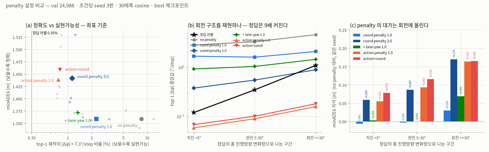
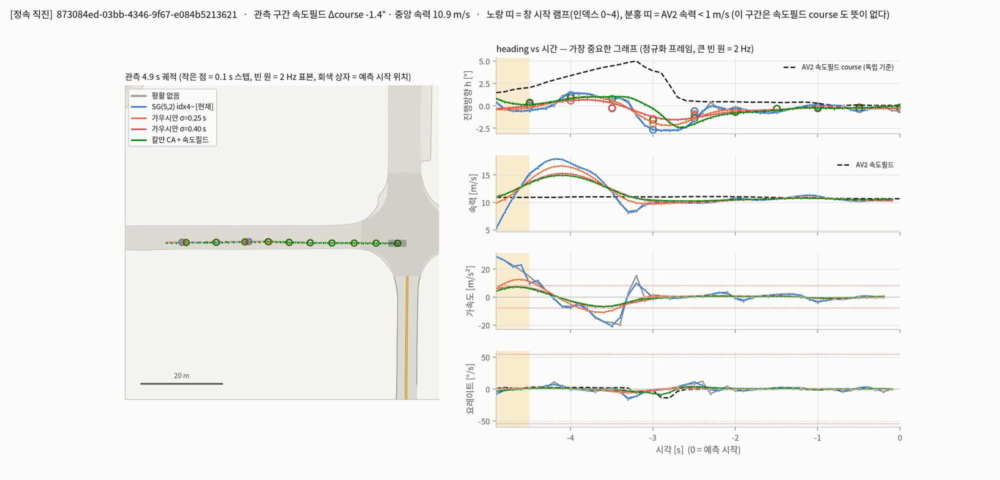

# v4 Progress Report — Previous Action Item 대응

> 기간 2026-09-16 ~ 10-06 · dataset Argoverse 2 (train 199,908 / val 24,988)
> baseline: L4 · action penalty 1.0 · 30 epoch cosine LR · seed 0~2
> 총 24판(8 conditions × 3 seeds) 학습 완료. 모든 비교는 **paired-seed**(같은 seed끼리 짝지어 차이를 봄) 기준임
> feasibility 지표는 전부 **predicted coordinate에서 복원한 heading** 기준임(model output 기준 아님)

---

## 1. Penalty — 꼭 필요한가, 필요하다면 어떻게

### 1.1 결론

1. **필요함** — penalty 없이 학습하면 top-1 trajectory step의 **8.47%**가 label 상한(7.3°/step)을 넘음. ground truth label은 0.35%임(24배)
2. **target을 model output(action)에서 predicted coordinate로 교체하는 것이 우월함** — coordinate penalty 1.0은 accuracy cost가 검출되지 않으면서(paired ΔminADE6 **+0.000 m**) violation을 **0.29배**로 낮춤
3. **현재 action penalty는 violation rate만 낮추고 turn 구조를 flatten시킴** — turn scenario의 |Δψ| median이 0.16°/step으로 ground truth(1.10°)의 1/7임. accuracy cost도 turn에 집중됨(+0.164 m)
4. **coordinate penalty 1.0을 기본 설정으로 전환했음**(2026-10-06) — `train_v4.py`의 `--smooth-mode` 기본값을 `xy`로, action penalty 기본 가중치를 0으로 변경했음. 기존 판 재현은 `--smooth-mode action`을 명시함
5. kinematic realism이 우선 기준이면 coordinate penalty 3.0이 대안임 — minADE6는 현행과 동일하고(1.442 vs 1.440) turn의 heading 변화 분포 재현이 훨씬 나음(0.90° vs 0.16°, ground truth 1.10°)

### 1.2 측정 설계

1. 5개 condition × 3 seeds = 15판을 동일 조건(30 epoch cosine · train 199,908 / val 24,988)으로 학습했음
2. 평가 지표를 **predicted coordinate에서 복원한 heading**으로 통일했음 — ψ = atan2(Δy, Δx), |Δψ| > 7.3°/step인 step 비율임. 양쪽 step 속력이 1 m/s 이상일 때만 셈(정지 구간은 heading이 정의되지 않음)
3. 평가 대상은 **top-1 mode**임 — 실제 사용되는 trajectory임. alive 6 modes 기준값도 함께 기록했음
4. ground truth label에 동일한 식을 적용해 기준선을 둠(0.35%)
5. 재현 확인 — 재채점한 minADE6가 학습 로그의 best 값과 소수점 3자리까지 일치했음
6. baseline과 신규 판의 val cache는 directory명(source hash)이 다르나 **배열 단위로 내용이 동일함을 확인했음** — paired 비교의 전제임
7. 측정 코드 `src/score_xy_viol.py`, 결과 `runs/v4_xy_viol.json`, 작도 `src/viz_v4_penalty_pareto.py`임

### 1.3 결과 — penalty 유무와 target별 비교

| condition | minADE6 (3 seeds 평균) | seed range | coordinate violation (top-1) | paired ΔminADE6 vs no penalty | violation 배율 |
| --- | --- | --- | --- | --- | --- |
| no penalty | **1.359** | 0.035 | 8.47% | — | 1.00× |
| **coordinate penalty 1.0** | **1.359** | **0.006** | 2.28% | **+0.000** (부호 불일치 = 검출 불가) | **0.29×** |
| coordinate penalty 3.0 | 1.442 | 0.137 | 1.13% | +0.083 (부호 일치) | 0.15× |
| action penalty 1.0 (현행) | 1.440 | 0.105 | **0.76%** | +0.081 (부호 일치) | 0.10× |
| action + coordinate | 1.459 | 0.107 | 0.79% | +0.100 (부호 일치) | 0.10× |
| ground truth label | — | — | 0.35% | — | — |

1. **8.47% → 2.28% 구간은 accuracy cost 없이 얻어짐** — coordinate penalty 1.0의 paired 차이가 seed별로 +0.018 / −0.003 / −0.014로 부호가 갈림
2. **2.28% 아래로 내리는 것부터 비용이 발생함** — target이 action이든 coordinate든 약 +0.08 m로 동일함. 즉 cost는 target이 아니라 **얼마나 강하게 누르는가**의 함수임
3. action penalty도 coordinate violation을 실제로 낮춤(8.47% → 0.76%) — 1.5의 counterfactual 해석을 정정함
4. **seed range가 penalty 강도에 비례함** — no penalty 0.035, coordinate 1.0 **0.006**, 강한 penalty 3종 0.105~0.137임. 기존에 "seed noise 0.140"으로 보고한 값은 데이터셋 고유 성질이 아니라 **strong penalty 조건에서만 나타나는 optimization 불안정**이었음

### 1.4 회전량별 분해 — 비용이 어디에서 발생하나

ground truth의 총 진행방향 변화량으로 val을 3구간으로 나눠 다시 측정했음(직진 15,711 / 완만 5,256 / 회전 4,021건).

| | 직진 <5° | 완만 5–30° | 회전 ≥30° |
| --- | --- | --- | --- |
| **paired ΔminADE6 vs no penalty** | | | |
| coordinate penalty 1.0 | −0.006 (불일치) | −0.003 (불일치) | **+0.030** |
| action penalty 1.0 | +0.055 | +0.093 | **+0.164** |
| action + coordinate | +0.079 | +0.116 | +0.165 |
| **\|Δψ\| median [°/step]** | | | |
| ground truth label | 0.12 | 0.35 | **1.10** |
| action penalty 1.0 | 0.06 | 0.09 | **0.16** |
| coordinate penalty 3.0 | 0.38 | 0.55 | **0.90** |
| coordinate penalty 1.0 | 1.69 | 1.63 | 2.12 |
| no penalty | 2.86 | 3.34 | 4.68 |

1. **penalty의 accuracy cost는 turn에 집중됨** — action penalty의 비용이 직진 +0.055 대비 turn **+0.164 m**로 3배임
2. **"실제 회전을 억제한다"는 서술은 과장이었음(2026-10-07 정정)** — 두 session이 서로 다른 모집단으로 총 회전량을 측정했고, 합치면 다음과 같음

| 측정 | 모집단 | ground truth | no penalty | action 1.0 | coordinate 1.0 |
| --- | --- | --- | --- | --- | --- |
| 조건부 | winner mode · 3판 모두 정답 route 선택 (2,062건) | 63.8° | 56.7° | **56.5°** | 52.5° |
| 무조건 | top-1 mode · turn 구간 전체 (4,021건) | 65.6° | 45.4° | **40.5°** | 42.7° |

3. **조건부 기준으로는 penalty 효과가 거의 없음**(56.7 vs 56.5) — route를 올바로 선택하고 best mode를 쓰면 penalty를 걸어도 충분히 회전함
4. 두 측정의 차이 약 16°는 **route 선택과 top-1 mode 선택**에서 발생함 — 회전 능력이 아니라 **mode selection 문제**이며, lane change의 top-1 적중률 문제와 동일한 원인임
5. 어느 기준으로도 **3판 모두 ground truth보다 적게 회전함**(조건부 7~11°, 무조건 20~25°) — **penalty와 무관한 공통 결함**임
6. penalty가 바꾸는 것은 회전의 **분포 모양**임 — 왕복 포함 총 heading 변화량이 action penalty 0.60배 / coordinate 1.0 1.90배 / no penalty 2.82배(ground truth 대비)임
7. ground truth는 직진 0.12° → 회전 1.10°로 **9배 증가**함. action penalty는 0.06° → 0.16°로 **2.7배**에 그쳐 turn 구조를 재현하지 못함
3. coordinate penalty 3.0이 **turn의 heading 변화 분포를 가장 잘 재현함**(0.90° vs ground truth 1.10°) — minADE6는 action penalty와 동일함(1.442 vs 1.440)
4. coordinate penalty 1.0은 반대로 모든 구간에서 ground truth보다 과하게 움직임(1.63~2.12°) — violation 2.28%의 내용임
5. **violation rate 단일 지표로는 action penalty가 1위지만, ground truth 분포 재현으로 보면 coordinate penalty 3.0이 1위임** — 두 기준이 갈리므로 목적에 따라 선택해야 함

### 1.5 metric 결함 — self-referential measurement

| condition | model output 기준 | predicted coordinate 복원 기준 |
| --- | --- | --- |
| penalty 1.0 · 30 epoch | 0.005% | **0.735%** |
| penalty 0.1 | 0.001% | **1.324%** (1,191배 차이) |
| ground truth label | — | 0.351% |

1. violation rate를 **model이 출력한 각도**에서 측정하고 있었음 — penalty가 직접 최소화하는 변수임
2. 학습된 model에서 term을 제거하는 counterfactual로 기여도를 분리했음

| removed term | violation rate (baseline 0.735%) |
| --- | --- |
| integrator geometry correction | **0.186%** (−75%) |
| route curvature | 0.423% (−42%) |
| model output (Δθ) | 0.733% (−0.3%) |

3. 즉 **학습이 끝난 model에서는** Δθ를 제거해도 coordinate violation이 0.3%만 변함
4. **정정** — 이로부터 "penalty가 trajectory와 무관한 변수를 누른다"고 해석했으나, 1.3의 학습 A/B에서 action penalty가 coordinate violation을 8.47% → 0.76%로 낮추는 것이 확인됨. counterfactual은 **고정된 해 주변의 민감도**를 재는 것이고, penalty는 route 선택·속도 profile을 포함한 **해 전체를 바꾸는 방식으로** 작동함
5. 유지되는 결론은 **measurement 측면**임 — model output 기준 지표는 penalty를 걸면 정의상 내려가므로 **penalty 설정 비교에 사용할 수 없음**. 1.3·1.4의 모든 수치를 coordinate 기준으로 다시 측정한 이유임

### 1.6 Literature review

1. kinematic integrator/control output으로 violation을 0%로 만든 사례 3편은 **smoothness loss term이 없음** (DKM, PTNet, TPK)
2. 단 "smooth output ≠ accurate heading"이 반복 보고됨 — Bézier basis를 써도 heading error는 별도 loss로 처리해야 했음 (SIMPL: minFYE6 0.297 → 0.076)
3. 동일한 self-reference 문제를 지적한 논문 3편 확인 — MultiPath++ (model output 기준 0.00% ↔ coordinate 기준 1.22%), Greer YawLoss, Grad-CAPS
4. smoothness evaluation의 사실상 표준은 모두 **coordinate 기반**임 (WOSAC angular velocity distribution, curvature, turning radius)
5. seed variance를 다룬 STEP(2025)은 "작은 성능 차이는 training noise로 설명되는 경우가 많다"고 보고함 — 본 프로젝트 관측과 일치함

### 1.7 구현

1. predicted coordinate에서 복원한 heading의 step 변화가 7.3°를 초과하는 분량만 hinge로 penalize함 — 임계 내 turn은 누르지 않음
2. unit test 통과 — straight 0, 임계 내 turn(7°/step) 0, stationary 0, zigzag(20°/step)만 penalty 발생함
3. `--smooth-mode {action,xy,both} --smooth-xy <weight>`로 선택함

---

## 2. Preprocessing = smoothing + downsampling

### 2.1 결론

1. **downsampling은 현행 유지함** — 순서(smoothing → sampling)와 RAMP_SKIP=4가 측정상 타당했음
2. **기존 smoothing은 no-op였음** — filter cutoff가 2.38 Hz라 2 Hz sampling의 anti-aliasing 역할을 전혀 못 했음
3. **새 smoothing은 input quality를 개선했으나 model accuracy 이득은 검출되지 않았음** → 채택 보류함

### 2.2 기존 방식 무효 확인

| metric (2 Hz input, straight scenarios) | no smoothing | 기존 SG(5,2) |
| --- | --- | --- |
| heading jitter p90 | 3.23 °/s | **3.23 °/s** |
| zigzag ratio | 36.7% | 36.6% |
| velocity-field course angle과의 차 | 1.04° | 1.05° |

### 2.3 Data characterization

1. signal과 noise가 교차하는 frequency는 **0.6~1.0 Hz**였음 — stationary vehicle(pure noise)과 moving vehicle의 position spectrum이 그 부근에서 만남
2. position noise 구성 — low-frequency drift σ 13.5 cm + white noise σ 0.77 cm + heavy tail(stationary step의 4.02%가 1 m/s 초과)
3. AV2 position은 dataset 단계에서 이미 smoothing되어 있었음 → 본 작업은 second-pass smoothing에 해당함

### 2.4 변경 내용

| item | 변경 | 근거 |
| --- | --- | --- |
| position smoothing | Gaussian σ = 0.25 s (cutoff 0.53 Hz), 경계는 2nd-order polynomial extrapolation | signal이 우세한 대역만 통과시킴. 1st-order 경계 처리는 window 끝 yaw rate를 0.33배로 감쇠시킴 |
| heading | speed-weighted circular blend (crossover 3 m/s) | 기존 hard switch(1 m/s)가 step당 ±150 °/s의 discontinuity를 생성했음 |
| 180° flip correction | 실제 이동 구간에서만 판정 | stationary vehicle은 position noise가 판정을 결정했음 |
| downsampling | 변경 없음 (smoothing → 5-step sampling) | downsampling만으로 heading jitter p90이 6.04 → 3.23 °/s로 감소함 |

### 2.5 결과 — before vs after

| metric | 기존 | 변경 후 |
| --- | --- | --- |
| straight heading jitter p90 | 2.70 °/s | **2.22 °/s** (−18%) |
| jerk p90 | 9.75 m/s³ | **7.61 m/s³** (−22%) |
| turn preservation ratio | 1.022 | **1.022** (감쇠 없음) |
| model accuracy (3 seeds, paired) | — | **−0.053 ± 0.069 m, 부호 불일치 → 검출 불가** |

1. input quality는 개선됐으나 accuracy 개선은 seed variance와 구분되지 않았음
2. smoothing의 효과는 noise가 큰 **neighborhood vehicle input**에서 재검증할 예정임

---

## 3. Neighborhood vehicles

### 3.1 결론

1. 요청대로 **radius 30 m** 단순 방식으로 구현 완료했음
2. 3 seeds 완료 — paired ΔminADE6 **−0.028 ± 0.048 m**, seed별 +0.019 / −0.026 / −0.076으로 **부호가 갈려 전체 지표로는 효과가 검출되지 않음**
3. 회전량별로 나눠도 동일함 — 직진 −0.007 / 완만 −0.049 / 회전 −0.081, 모두 부호 불일치임
4. 평균은 개선 방향이고 turn 구간에서 가장 큼 — 효과가 있다면 **neighbor가 실제로 영향을 주는 scenario에 국한될 가능성이 큼**. 3.3의 전용 평가군으로 판정해야 함

### 3.2 구현

1. input — radius 30 m 내 vehicle의 past 5 s를 0.5 s 간격으로, channel 5개(relative position 2, sin/cos heading, observation mask)
2. encoder — vehicle별 MLP embedding 후 focal trajectory feature를 query로 attention pooling함
3. parameter 450,681 → 556,153
4. 기존 neighbor cache를 재사용했음(가까운 32대·past 5 s·focal frame·미래 미사용), past position 포함본을 추가로 생성했음

### 3.3 평가 계획

1. 전체 minADE6로는 효과가 검출되지 않음이 확인됨(3.1) — lane change 분석에서 지정한 **"prediction window 내 신규 시작 309건"**을 전용 평가군으로 재측정해야 함
2. 평가군이 309건(val의 1.2%)이므로 전체 지표에서는 0.15 m급 효과도 0.002 m로 희석됨 — 전용 평가군 없이는 판정 자체가 불가능함

---

## 4. U-turn / Lane change

### 4.1 결론

1. **U-turn은 제외함** — val 73건(0.29%)으로 희소함
2. **lane change는 제시된 두 가설 모두 기각됨**

| hypothesis | 판정 | 근거 |
| --- | --- | --- |
| (1) smoothing으로 해결됨 | 기각 | input heading error는 7.3° → 1.9°로 개선되나 lane change metric은 seed range 내에서 변화 없음 |
| (2) rule(1.75 m band) 추가 | 기각 | band는 binding constraint가 아님. 3.6 m 적용군 463건 hit rate 12.5% vs 1.75 m 적용군 159건 11.9% |

### 4.2 실제 원인

1. **lateral mode axis 부재** — 동일 route의 sub-mode 간 종방향 endpoint spread 11.32 m, 횡방향 0.31 m (실패의 55.7%)
2. **candidate route coverage 부족** — ground truth를 ±1.75 m 내에 담는 route가 존재하는 비율 3.7%
3. **관측 불가능 구간** — lane change의 49%가 prediction window에서 신규 시작함
4. model은 initial residual angle을 정상적으로 수신하고도 ground truth보다 3배 빠르게 0으로 수렴시킴

### 4.3 규모와 처방

1. lane change 627건(2.51%), U-turn 73건(0.29%)
2. lane change를 완전히 해결해도 전체 minADE6 개선 상한은 **−0.015 m**로, seed range(0.105)의 1/7임 — accuracy metric으로는 관측되지 않는 문제임
3. 원인 ①에 대한 처방으로 동일 route의 2·3번째 mode를 ±lane width(3.42 m)로 유도하는 auxiliary loss를 구현했음
4. 3 seeds 완료 — paired ΔminADE6 **−0.013 ± 0.060 m**, 부호 불일치로 전체 지표에서는 효과가 검출되지 않음. 2에서 예측한 대로(상한 −0.015 m) **전체 metric으로는 판정 불가**이며, lane change 627건 전용 평가군으로 재측정해야 함
5. 부작용 점검 — alive 6 modes 기준 coordinate violation이 1.72% → 2.98%로 증가했으나 top-1은 0.76% → 0.78%로 변화 없음. 즉 **횡방향으로 벌어진 보조 mode에서만 증가**했고 주 예측은 영향받지 않았음

---

## 5. Data cleansing — 폐기 vs 보정

### 5.1 결론

1. **폐기 대상은 거의 없음** — 결함 2건을 수정하면 폐기 대상이 train의 0.17%(약 340건)로 감소함
2. pedestrian·cyclist는 폐기 시 오히려 성능이 저하됨 (val minADE 1.490 → 1.522)
3. 결함 2건을 수정한 preprocessing으로 재학습한 결과 **3 seeds 모두 개선 방향**임 — paired ΔminADE6 −0.043 ± 0.049 m(−0.003 / −0.028 / −0.098). 크기는 작으나 부호가 일치해 **보정이 유효함을 확인했음**

### 5.2 전수 집계 (train + val 224,896건)

| item | ratio | 해석 |
| --- | --- | --- |
| no candidate route | 3.9% | 81.5%가 pedestrian·cyclist. vehicle만 0.78% |
| off-road | 4.6% | 99.7%가 pedestrian·cyclist |
| coverage failure | 14.4% | turn·lane change가 대부분이라 폐기 불가 |
| our heading의 급격한 변화 | 0.79% | AV2 원본 0.01% — roughness는 preprocessing에서 유입된 것임 |

### 5.3 발견 결함 2건 (수정 완료)

1. **candidate lane distance를 centerline vertex 기준으로 측정하고 있었음**
   - vehicle "no route" 사례의 91%가 실제로는 lane polyline 위에 있었음(중앙 0.49 m)
   - vertex 간격이 5 m를 초과하는 구간에서 lane 위 차량이 search radius 밖으로 배제됐음
   - point-to-segment distance로 수정했음
2. **AV2 body heading이 반전된 scenario 18건의 minADE6이 15.07 m였음** (전체 1.49)
   - normalization frame과 candidate route filter가 동일 각도를 사용해 scene 전체가 반전됨
   - 이동 구간 기준 판정으로 교정했음

### 5.4 폐기 불가 항목

1. window edge ramp (첫/끝 0.5 s의 position-derived speed가 실제의 약 절반)
2. stationary track의 heading 미정의 (33.4%)
3. slip angle

---

## 6. Visualization framework

### 6.1 결론

1. agent 기반 자동화 framework를 정식화했음 — 정성 평가 산출물이 재현 가능해졌음
2. 요청하신 **scenario grouping + ID 기록**을 산출물 규격에 반영했음

### 6.2 구성

1. agent 정의 파일에 필수 요건 11가지를 명시했음 — time series, 상태별 통계, scenario별 지표, loss 분해, grouped small multiples, unit 통일, step marker, 대표 scenario, 자체 검증, 특성 표, decision tree
2. 표준 작업 A(checkpoint 분석: dump → cases → stats → gallery), 표준 작업 B(epoch별 학습 방향)로 고정했음
3. 모든 분석에서 **독립 검토 agent**가 핵심 수치를 재계산함 — 지금까지 3회 수행, 지적 사항 60여 건 반영했음
4. scenario ID는 유형별로 묶어 json에 저장함 — 예: lane change 분석의 `id_groups.json`(실패 유형 A/B/C/D × 시작 시점 12칸)

---

## 7. 비교 방법론 — seed variance

### 7.1 관측

1. 동일 설정을 seed만 바꿔 실행한 결과가 1.407 / 1.415 / **1.547**이었음(range 0.140)
2. seed 2는 training failure가 아님 — train loss가 가장 낮았음. 더 낮은 training loss가 더 낮은 generalization으로 이어진 사례임

### 7.2 정정 — seed variance는 조건에 의존함

| condition | minADE6 seed range | coordinate violation |
| --- | --- | --- |
| coordinate penalty 1.0 | **0.006** | 2.28% |
| no penalty | 0.035 | 8.47% |
| cleansed (action penalty 1.0) | 0.026 | 0.75% |
| action penalty 1.0 | 0.105 | 0.76% |
| action + coordinate | 0.107 | 0.79% |
| coordinate penalty 3.0 | 0.137 | 1.13% |

1. seed range가 **penalty 강도와 함께 커짐** — 약하거나 없으면 0.006~0.035, 강하면 0.105~0.137임
2. 즉 "seed noise 0.140"은 데이터셋·모델 고유 성질이 아니라 **strong penalty 조건의 optimization 불안정**임
3. 불안정의 형태는 "3판 중 1판이 1.53 부근으로 이탈"임 — 평균이 아니라 **실패 판 1개가 range를 만듦**
4. 부수 효과로, penalty를 coordinate 1.0으로 바꾸면 **재현성도 개선됨**(range 0.140 → 0.006)

### 7.3 적용 규칙

1. 비교의 1차 기준은 **paired-seed 차이의 부호 일치 여부**임 — 평균 크기보다 우선함
2. 단일 임계(기존 "0.15 m 미만은 보고하지 않음")는 사용하지 않음 — 조건마다 range가 다르므로 **해당 조건의 range를 함께 기재함**
3. 신규 주장은 seed 3개 이상이며, 평균·range·seed별 부호를 모두 기재함
4. 효과가 특정 scenario에 국한될 수 있는 변경(neighbor, lane change)은 **전체 지표로 판정하지 않고 전용 평가군을 둠**

### 7.4 적용 예

| comparison | paired difference | seed별 부호 | 판정 |
| --- | --- | --- | --- |
| 10 Hz → 2 Hz input | +0.113 ± 0.016 | 일치 | **2 Hz가 유의하게 나쁨** |
| no penalty → action penalty 1.0 | +0.081 | 일치 | **accuracy cost 확인** |
| no penalty → coordinate penalty 1.0 | +0.000 | 불일치 | **cost 검출 불가** |
| cleansed preprocessing | −0.043 ± 0.049 | 일치 | 개선 방향 일관 |
| neighborhood vehicles | −0.028 ± 0.048 | 불일치 | 검출 불가 |
| lateral mode axis | −0.013 ± 0.060 | 불일치 | 검출 불가 |
| preprocessing smoothing | −0.053 ± 0.069 | 불일치 | 검출 불가 |

---

## 8. 실험 현황

조건당 3 seeds · 30 epoch cosine · train 199,908 / val 24,988. 총 24판 완료임.

| experiment | 판정 대상 | 결과 |
| --- | --- | --- |
| no penalty | penalty의 accuracy cost | 완료 — +0.081 m, violation 8.47% |
| coordinate penalty 1.0 | penalty target 교체 | 완료 — **cost 검출 불가, violation 0.29×** |
| coordinate penalty 3.0 | 강한 coordinate penalty | 완료 — +0.083 m, violation 0.15× |
| action + coordinate | 두 target 동시 적용 | 완료 — +0.100 m, 단독 대비 이득 없음 |
| neighborhood vehicles | neighbor input 효과 | 완료 — 전체 지표로는 검출 불가 |
| lateral mode axis | lane change | 완료 — 전체 지표로는 검출 불가 |
| cleansed preprocessing | 결함 2건 수정 효과 | 완료 — −0.043 m, 부호 일치 |

### 다음 단계

1. coordinate penalty 1.0을 **기본 설정으로 전환 완료**(2026-10-06) — 이후 모든 비교의 baseline을 교체했음
2. **lane heading alignment loss 학습 중**(6판) — 아래 참조
3. neighbor·lateral mode를 **lane change 309건 전용 평가군**에서 재측정해야 함

### lane heading alignment loss — 결과

1. 근거 — Greer et al., *Lane Heading Auxiliary Loss*(arXiv:2011.06679)의 YawLoss임. ① predicted coordinate 2점의 arctan으로 heading 생성 ② tolerance 내 0인 hinge ③ 모든 live mode에 적용 — 세 요소를 그대로 따랐고, target만 "그 mode가 주행하는 candidate route의 tangent angle"로 바꿨음
2. 도입 이유 — `jitter_xy`는 급변만 억제하고 **회전 방향을 지시하지 않음**. route tangent는 turn에서 실제로 회전하므로 정렬시키면 turn 구조가 생성됨. 또한 coordinate heading과 integrator heading의 차이(geometry term)가 violation의 주항이었으므로(기여 75%) 이를 직접 겨냥함
3. tolerance는 ground truth 분포에서 결정했음 — |ψ_gt − lane tangent|의 p95(route가 3 m 이내인 경우) = **15.07°**. 전체 p50 1.11° / p90 10.41° / p99 90.39°
4. **ground truth 자체의 tail이 두꺼움**(p99 90°)이 확인됨 — route가 ground truth에서 멀거나(5.3%) 교차로에서 nearest vertex가 route의 역방향 구간에 붙는 경우임. 따라서 |d| ≤ 3 m gate와 hinge ratio 2배 clamp를 함께 적용했음
5. **weight 1.0 결과 — 지금까지 중 가장 저렴한 trade-off임**

| condition | minADE6 | seed range | coordinate violation | paired Δ vs no penalty |
| --- | --- | --- | --- | --- |
| no penalty | 1.359 | 0.035 | 8.47% | — |
| coordinate penalty 1.0 | 1.359 | 0.006 | 2.28% | +0.000 (불일치) |
| **+ lane-yaw 1.0** | **1.372** | **0.005** | **1.33%** | **+0.013 (불일치)** |
| coordinate penalty 3.0 | 1.442 | 0.137 | 1.13% | +0.083 (일치) |
| action penalty 1.0 | 1.440 | 0.105 | 0.76% | +0.081 (일치) |

6. violation을 2.28% → 1.33%로 낮추는 cost가 **0.013 m**임. 같은 폭을 penalty weight로 사면(2.28% → 1.13%) **0.083 m**로 **6배 비쌈** — penalty를 강화하는 것보다 **방향을 지시하는 쪽이 효율적임**
7. turn 구간의 |Δψ| median이 **1.46°로 ground truth(1.10°)에 가장 근접함**(action penalty 0.16°, coordinate 3.0 0.89°). 단 직진 구간은 0.93°로 ground truth(0.12°)보다 8배 큼 — tolerance 15° 내부의 미세 진동은 설계상 건드리지 않기 때문임
8. **사전 기록한 위험(lane change 역방향 억제)은 실현되지 않았음** — 전용 평가군에서 오히려 개선 방향이었음

| 평가군 | coordinate 1.0 | + lane-yaw 1.0 | paired Δ | violation |
| --- | --- | --- | --- | --- |
| 전체 (24,988) | 1.359 | 1.372 | +0.013 (일치) | 2.28% → **1.33%** |
| D2 lane change (627) | 2.001 | 1.985 | −0.016 (불일치) | 2.27% → **0.89%** |
| prediction window 내 신규 (1,083) | 1.581 | 1.576 | −0.005 (불일치) | 1.41% → **0.52%** |
| U-turn (73) | 2.657 | 2.684 | +0.027 (불일치) | 2.24% → 2.04% |

9. **weight 3.0 결과 — lane change에서 처음으로 3 seeds 부호가 일치했음**

| 평가군 | coordinate 1.0 | + ly 1.0 | + ly 3.0 | ly3 paired Δ | seed별 부호 |
| --- | --- | --- | --- | --- | --- |
| 전체 24,988 | 1.359 | 1.372 | 1.376 | +0.017 | 일치 |
| **D2 lane change 627** | 2.001 | 1.985 | **1.932** | **−0.069** | **일치** |
| prediction window 내 신규 1,083 | 1.581 | 1.576 | 1.575 | −0.007 | 불일치 |
| U-turn 73 | 2.657 | 2.684 | 2.673 | +0.016 | 불일치 |

10. smoothing · band rule · neighborhood vehicles · lateral mode axis가 **전부 검출 불가**였던 문제에서 처음 확인된 일관된 효과임. lane change violation도 2.27% → 0.78%로 감소함
11. **방향성이 반대인 두 loss가 구분됨** — coordinate penalty 3.0은 lane change −0.011(불일치)이고 prediction window 내 신규에서 **+0.061(일치, 악화)**, U-turn에서 **+0.201(일치, 악화)**임. smoothness 강화는 횡방향 운동을 함께 억제하나 lane-yaw는 그렇지 않음
12. 전체 accuracy 기준으로는 weight 1.0이 knee point이고(1.372 vs 1.376), lane change까지 포함하면 3.0임
13. 재실행 경위 — 다른 session이 학습 중 `src/dataset_lane.py`를 수정해 cache key가 변경되면서 batch 전체가 즉시 실패했음. 해당 변경은 default off라 출력이 동일함을 bit-exact로 확인하고 cache re-keying으로 복구했음 — 다른 session이 학습 중 `src/dataset_lane.py`를 수정해 cache key가 변경되면서 batch 전체가 즉시 실패했음. 해당 변경은 default off라 출력이 동일함을 bit-exact로 확인하고 cache re-keying으로 복구했음

### neighborhood vehicles / lateral mode axis — 전용 평가군 재측정

1. 두 변경 모두 **lane change 전용 평가군에서도 효과가 검출되지 않음**(부호 불일치)

| 변경 | 전체 | D2 lane change (627) | prediction window 내 신규 (1,083) |
| --- | --- | --- | --- |
| neighborhood vehicles 30 m | +0.053 (일치) | −0.041 (불일치) | +0.015 (불일치) |
| lateral mode axis | +0.067 (일치) | −0.010 (불일치) | +0.041 (불일치) |

2. 단 **비교 기준이 바뀌었음** — 두 변경은 action penalty 위에서 학습했는데 현재 baseline은 coordinate penalty임. 전체 지표에서 나빠 보이는 것은 baseline이 개선된 결과임
3. 판정하려면 **동일 penalty 위에서 재학습**해야 함

### 실행 환경 메모

1. cache는 preprocessing source의 hash로 키가 결정됨 — 학습 대기 중 `src/`를 수정하면 cache miss로 즉시 실패함. 실제로 이 문제로 13시간의 GPU idle이 발생했음
2. 대응 — 남은 12판을 **단일 script**로 재구성했음. batch 3판씩 병렬, 앞 batch 종료 후 다음 batch 시작, 중간에 cache를 다시 생성함(약 12분)
3. 학습 진행 중에는 `src/` 수정을 중단함

---

## 9. Summary

1. penalty는 **필요함** — 제거하면 top-1 trajectory step의 8.47%가 label 상한을 넘음(ground truth 0.35%)
2. penalty target을 model output에서 **predicted coordinate로 교체하면 accuracy cost 없이** violation을 0.29배로 낮춤 — 8.47% → 2.28% 구간은 무상임
3. 2.28% 아래로 내리는 것부터 약 +0.08 m의 cost가 발생하며, 이는 target이 아니라 **penalty 강도**의 함수임
4. 현행 action penalty의 cost는 **turn scenario에 집중됨**(+0.164 m)이고 turn의 |Δψ| median이 ground truth의 1/7임. 단 **총 회전량 기준으로는 penalty가 주원인이 아님**(2026-10-07 정정) — 예측 40.5° vs ground truth 65.6°인데 penalty 없이도 45.4°임. penalty가 바꾸는 것은 회전의 **분포 모양**임
5. 기존 violation metric은 penalty가 최소화하는 변수를 그대로 측정하는 self-referential metric이었음 — 모든 비교를 coordinate 기준으로 재측정했음
6. preprocessing smoothing은 기존 방식이 무효였고, 신규 방식은 input quality를 개선했으나 accuracy 이득은 검출되지 않았음
7. lane change 실패 원인은 smoothing도 band rule도 아닌 **lateral mode axis 부재**였음 — 구현했으나 전체 지표로는 효과가 검출되지 않아 전용 평가군이 필요함
8. data cleansing 대상은 폐기가 아니라 보정이 적절함 — 결함 2건 수정으로 폐기 대상이 0.17%까지 감소했고, 재학습에서 3 seeds 모두 개선 방향이었음
9. **seed variance 0.140 m는 데이터셋 고유 성질이 아니라 strong penalty 조건의 optimization 불안정이었음** — coordinate penalty 1.0에서는 0.006으로 감소함. 비교 기준을 paired-seed 부호 일치로 전환했음
