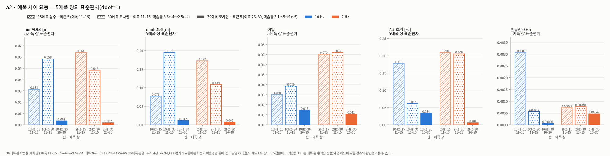

# v4 30에폭 코사인 — 예측 분석(두 판)과 네 판 비교

- **판** — 모두 L4nw · (a, h) 입력 · 전체 데이터 199,908 · 흔들림 벌점 1.0 · θ₀ guard · 시드 0 · best 체크포인트다.

| 약칭 | 태그 | 입력 | 스케줄 | best 에폭 · minADE6 / minFDE6 (val 24,988) |
| --- | --- | --- | --- | --- |
| 10Hz·15 | `v4_l4nw_ah2_full_sm1_s0` | 10 Hz | 15에폭 · 5e-4 고정 | 5 · 1.586 / 3.775 |
| 2Hz·15 | `v4_l4nw_ah2_2hz_full_sm1_s0` | 2 Hz | 15에폭 · 5e-4 고정 | 13 · 1.643 / 3.879 |
| **10Hz·30** | `v4_l4nw_ah2_full_sm1_cos30_s0` | 10 Hz | 30에폭 · 코사인 5e-4 → 1e-5 | 29 · **1.402 / 3.279** |
| **2Hz·30** | `v4_l4nw_ah2_2hz_full_sm1_cos30_s0` | 2 Hz | 30에폭 · 코사인 | 25 · **1.490 / 3.414** |

- **평가:** val 전체 24,988 (캐시).
- **그림 경로**
  - 그림 링크는 이 문서(`docs/`) 기준 상대경로(`../viz/...`)다.
  - 본문에 적은 `viz/v4/...` 는 저장소 루트 기준이다. `*.png` 는 git 이 무시한다.
  - 노션에 넣은 13장은 폭 2000 px 사본 `docs/figures/v4/cos30/` 로 링크한다(git 추적). 나머지 `../viz/...` 링크는 워크스테이션에서만 열린다.
  - 숫자 사본: `runs/v4_cos30_compare_summary.json` · `runs/v4_cos30_compare_tree_rules.txt` · `runs/v4_viz_l4nw_ah2*_cos30_s0_{summary,meta,picks}.json` · `runs/v4_gallery_*_cos30_s0.json`
  - 작업 A: `viz/v4/<태그>/` 의 `cases` · `stats` · `why` · `diversity` · `gallery`
  - 네 판 비교: `viz/v4/cos30_compare/` (24장)
- **숫자 출처**
  - 직접 계산한 값: `viz/v4/<태그>/data/{summary,meta,picks,gallery_picks}.json`, `viz/v4/cos30_compare/data/summary.json` · `tree_rules.txt`, `runs/v4_full_compare.json` · `runs/<태그>.json`.
  - 독립 검토(요건 9c)에서 온 값에는 `(검토 r01)` 처럼 출처를 달았다. 검토 스크립트와 json(`r01`~`r10`)은 세션 스크래치의 `review_cos30/` 에 있다(저장소 밖).
- **모든 비교에 걸리는 한계**
  - 30에폭 판은 스케줄(상수 → 코사인)과 에폭 수(15 → 30)를 **함께** 바꿨다. 상수 30에폭 판과 코사인 15에폭 판 같은 **대조판이 없다.**
  - 그래서 이 문서는 30 − 15 차이를 원인으로 나누지 않고 **"뒤반(학습률 감소 + 추가 학습)"** 의 결과라고만 부른다.
  - 판마다 시드는 1개다. 두 30에폭 판은 한 GPU 에서 동시에 학습했고, 15에폭 판은 따로 학습했다.
- **자매 문서:** 에폭별 학습 방향(작업 B)은 `docs/v4_epochs_cos30.md` 에 있다.

---

## 0. 발견 요약

| # | 발견 | 숫자 (val 24,988) |
| --- | --- | --- |
| 1 | **30에폭 코사인 판은 회전·저속에서 가장 많이 나아졌다** | 30 − 15 ΔminFDE6 은 10 Hz −0.496 ± 0.039 m, 2 Hz −0.464 ± 0.042 m 다.<br>좌회전 −1.18 / −1.61 m, 우회전 −1.04 / −1.11 m (10 Hz / 2 Hz).<br>2 Hz 는 급가속 −0.92 m, v0 < 1 m/s −0.67 m 도 크다.<br>95% 신뢰구간 전체가 0 위에 있는(나빠진) 칸은 2 Hz 정지(+0.19 ± 0.08 m) 하나다 |
| 2 | **에폭 사이 요동은 뒤반에 사라졌다. 원인은 가르지 못한다** | minADE6 5에폭 창 표준편차(ddof = 1)<br>• 30에폭 판: 에폭 11–15 0.058 / 0.048 → 26–30 **0.0035 / 0.0019**<br>• 15에폭 판 최근 5(= 11–15): 0.031 / 0.064<br>같은 에폭 11–15 의 10 Hz minFDE6 표준편차는 학습률이 더 작은 코사인 판(0.195)이 상수 판(0.078)보다 크다. 그래서 '요동은 학습률 크기를 따른다'고 말할 수 없다. 창마다 5점뿐이고 에폭 순서와 섞여 있으며, 대조판이 없다 |
| 3 | **10 Hz 의 '분기 선택 악화'는 슬롯 기준에서만 보인다** | 구별 분기 ≥ 2, n = 21,069<br>• 슬롯 기준(1위 모드의 경로 = 정답): 53.7 → 48.1% 로 떨어졌다.<br>• 차로 기준(1위 궤적의 6초 끝 횡오차 < 1.75 m): **69.6 → 78.0% (+8.4 ± 0.6 %p)** 로 올랐다.<br>• 임계값 1.0 / 2.5 m, 6초 이동 ≥ 20 m 부분집합에서도 방향이 같다(+11.3 / +7.2 / +9.9 %p, 4.b 민감도 표).<br>v0 15–20 m/s 에서는 나란한 옆 차로 슬롯을 1위로 고른 비율이 51 → 82% 이고, 그중 차로 기준을 만족한 비율은 54 → 86% 다 |
| 4 | **"2 Hz 가 경로를 더 잘 고른다"는 슬롯 기준에서만 맞다** | 30 쌍, 구별 분기 ≥ 2<br>• 슬롯 기준: 10 Hz 48.1 · 2 Hz 52.2%<br>• 차로 기준: 78.0 · 76.5%. 2 Hz − 10 Hz 는 **−1.5 ± 0.5 %p** 이고, 1.0 m 기준 −2.9 ± 0.6, 2.5 m 기준 −1.1 ± 0.5 다.<br>15 쌍은 차로 기준으로 2 Hz 가 +3.3 ± 0.6 %p 높았다. 방향이 학습마다 다르다 |
| 5 | **10 Hz vs 2 Hz 격차는 평균으로만 재현된다** | ΔminFDE6(2 Hz − 10 Hz)은 30 쌍 +0.135 ± 0.037 m, 15 쌍 +0.104 ± 0.041 m 다.<br>그러나 시나리오별 Δ 의 두 쌍 상관은 **0.04** 다.<br>조건 칸의 부호 일치는 상황 3/9, v0 3/6 이다.<br>결정 트리 설명력 R² 는 검증 0.003, 15 쌍에 대면 −0.018 이다 |
| 6 | **두 쌍 모두 10 Hz 가 나은 '후보' 잎: 느리게 가다 강하게 가속 (신뢰구간이 0 을 포함)** | 잎 21 (v0 ≤ 2.5 m/s · 6초 이동 > 34.7 m, n = 322)<br>• 전체 평균 Δ +1.37 m. 트리 분기를 고른 학습 표본이 섞인 값이다.<br>• 검증 30% +0.78 ± 0.83 m (0 포함), 15 쌍 +1.33 m.<br>• 대표 f3 한 장면은 15 쌍에서 −2.03 m 로 반대다.<br>'정지 출발' 잎 8 (n = 347, Δ −2.14, 검증 −1.62 ± 0.77)은 15 쌍에서 +1.23 으로 부호가 뒤집힌다 |
| 7 | **가설 점검: 어느 것도 일관된 증거가 없다** | **H1 창 시작 램프**<br>• 30 쌍은 램프 강도 구간별 Δ 가 +0.16 ~ +0.22 로 평평하다.<br>• 15 쌍은 −0.06 ± 0.10 → +0.28 ± 0.18 로 H1 방향이다.<br>• 램프는 이동 시나리오 거의 모두에 있다(램프 비율 p10–p90 0.30–0.63). 구간 비교로는 모두에 고르게 작용하는 효과를 가를 수 없어, 첫 0.5 s 를 가린 재학습 없이는 판단할 수 없다.<br>**H2 관측 끝 동역학**<br>• 30 쌍은 \|yaw\| ≥ 1°/s 에서 Δ +0.18 ~ +0.27 이다(< 1°/s 는 +0.05).<br>• 15 쌍은 +0.15 → −0.08 로 반대 방향이다.<br>**H3 10 Hz focal heading 뒤집힘:** 103개가 평균 차에 보탠 몫은 +0.0009 m 다 |
| 8 | **2Hz·30 은 가속도가 떨린다** | 흔들림 a 0.00497 (10Hz·30 0.00183)<br>저크 RMS 5.64 m/s³ (3.42)<br>\|저크\| p99 27.1 (12.1) |
| 9 | **1~2 s 출렁임: 30에폭에서 p90 꼬리만 커졌고, 정답보다 크지는 않다** | 끝 감속 모집단 **14,106**, 1위 모드<br>• 정답과 같은 평활(속력 → median 5 → SG 1.5 s 미분)을 건 p90: 15에폭 0.18 / 0.15 → 30에폭 **0.30 / 0.23 m/s²** (×1.7 / ×1.5). 정답은 0.45.<br>• 중앙값은 커지지 않았다. 10 Hz 는 원 출력 0.177 → 0.151, 같은 평활 0.126 → 0.109 로 줄었다. 2 Hz 는 같은 평활 0.121 → 0.123 이다.<br>• 원 출력 p90(0.31 / 0.25 → 0.75 / 0.65)은 평활하지 않은 값이라 정답과 비교하지 않는다.<br>• 2Hz·30 은 평균 곡선에도 1~2 s 파동이 남는다(원 출력 0.27, 다른 판 0.10~0.14) |
| 10 | **10Hz·30 은 라벨 끝 인공 감속을 덜 따라간다** | 등속 대비 끝 1초 부족 거리(1위, 중앙): 정답(위치) 1.18 m 에 대해 10Hz·15 1.33 → 10Hz·30 **1.02** m (추종 비율 1.13 → 0.86).<br>2 Hz 는 1.29 → 1.25 m 다.<br>에폭별로 보면 10 Hz 추종 비율은 에폭 16–30 동안 학습률이 23배 줄어도 0.79–0.87 로 평평하다(에폭 리포트 4절) |
| 11 | 이탈·손실 | 이탈 0.808 → 0.522 (10 Hz), 0.666 → 0.561 (2 Hz).<br>학습식 손실 평균(10 Hz): SL1 0.726 → 0.613, hinge 0.162 → 0.076.<br>CE 는 1.44~1.48 로 거의 그대로다 |
| 12 | **출발점 순간이동은 모델 출력이 아니라 캐시 전처리 결함이다** | 살아있는 모드의 0.13%(시나리오 0.40%, 최대 36.5 m)가 첫 0.1 s 점에서 정답과 2 m 넘게 떨어진다. 네 판이 같다.<br>10Hz·30 의 191개 중 186개는 캐시 시작 상태 (s0, d0) 를 경로 위로 되돌린 점부터 이미 차량에서 1 m 넘게 떨어져 있다.<br>학습 캐시에도 모드의 0.173% 가 같은 결함을 가진다. minADE6 평균에 보태는 몫은 약 0.004 m 다.<br>자세한 내용은 7절에 있다 |

---

## 1. 재현·검증

**원천 재현**

| 대조 | 결과 |
| --- | --- |
| 덤프 ↔ `runs/v4_full_compare.json` | 두 판 통과. 최대 차 2.1e-8 / 2.2e-8 (`meta.json`). 원본에서 정규화한 정답과 캐시 y 의 차는 1.5e-5 m 이하다 |

**요건 9b — 다른 코드 경로로 대조**

| 대조 | 결과 |
| --- | --- |
| 독립 스크립트 70항목 | **70/70 통과** (2단계 수정 뒤 다시 돌림). `viz_v4_compare` 함수는 쓰지 않았다.<br>대상: 네 판 minADE6 · minFDE6 · miss(캐시 y 로 모드별 반복), b1 · c1 · c2 칸, b2 선택률, b5 옆 차로 비율(행 반복), 분기 뒤집힘 수, 트리 잎 18(pandas 조건식), H3 기여, a2 요동 |
| 스크립트 안의 두 경로 대조 | • 상황 평균 groupby ↔ bincount: 2.7e-7<br>• Δ 표 ↔ pandas: 0<br>• 요동 ↔ `statistics.stdev`: 0<br>• 코사인 학습률 식: 3e-16<br>• 저크 RMS 직접 ↔ 80·√흔들림 a: 3e-9<br>• 출렁임 누적합 ↔ `np.convolve`: 3e-17 |
| 정답과 같은 평활 | 축 단위 벡터 계산 ↔ `viz_v4_dump._smooth_speed` 를 행마다 (300개): 3.0e-14 |
| 정답 출렁임 p90 | 같은 모집단(14,106)에서 행마다 `np.convolve` 로 다시 잼: 0.4519 = 0.4519 (차 0) |
| 트리 잎 | 규칙식 마스크 ↔ `decision_path`: 12잎 모두 같다. 에폭 리포트의 뒤반 트리도 두 판 모두 같다 |
| 정답 경로 투영 d ↔ 모델 d | 1위 모드가 정답 경로 위인 400개: 중앙 7e-8, p99 0.10, 최대 0.37 m, 끝점 최대 0.28 m. b5 ⑤와 f 그림 d 칸이 이 투영을 쓴다. f 그림 15개 모드에서는 최대 0.14 m |
| 차로 기준 정답률 (b5) | 병렬 풀 대신 시나리오 21,069개를 하나씩 도는 별도 스크립트로 네 판을 다시 쟀다. 차 0 이다. 민감도 표(4.b)는 검토 r04 · r10 과 표시 자리까지 같다 |
| 캐시 시작 상태 복원점 | `viz_v4_common.start_offset` ↔ 검토 r01 의 따로 짠 계산: 살아있는 모드 145,208개에서 최대 차 1.8e-15 m. 1 m 초과 256 · 0.5 m 초과 473 · 시나리오 128 개로 같다 |
| 평균 사례 그림 ↔ 표 | 9개 궤적으로 재계산한 차가 5.1e-7 m 이하다. 비교 갤러리의 2 Hz 쪽은 3.0e-7 이다 |

**요건 9a — 고친 그림을 모두 다시 열어 보았다**
- **2단계(독립 검토 반영)에서 다시 그린 것**
  - 비교 24장 (f8 새로 추가)
  - 두 판의 갤러리 4장과 비교 갤러리 1장
  - cases 개요 8장과 개별 그림 72장
  - 작업 B: 두 판 × 두 N 의 e1–e6(e6 새로 추가), 개요, 패널 14장
- **2단계에서 고친 것**
  - **모든 궤적 지도**
    - 원점에서 첫 예측점까지를 가는 점선으로 그렸다. 전에는 실선이라 순간이동이 도로 밖으로 꺾는 선처럼 보였다.
    - 1초 간격 점을 찍고, 2 Hz 판에는 0.5 s 입력 시점을 빈 원으로 찍었다(요건 7).
    - 제목에 태그와 입력 주기를 넣었다(요건 6).
  - **e1·e2:** 칸 제목을 '승자 ADE' 로 바꿨다. 그린 선이 승자 모드이기 때문이다. 정답선은 예측선 위로 올렸다.
  - **b5 ③:** 흐림을 '틀림 · 맞음 중 작은 집단의 n' 으로 판정한다.
  - **배치:** d1 ② 글상자를 빈 자리로 옮겼다. c5 (a) 글상자 줄 간격을 넓혔다. a1 에서 10 Hz 학습률 선을 아래에 굵게 깔았다.
  - **d1 ③:** 원 출력과 '정답과 같은 평활' 값을 나란히 그리고, 정답 p90 선은 같은 평활 쪽에만 그었다.
  - **f 그림 대표**
    - f1 은 분류 인공물 후보를 빼고, 모집단 다수(커버리지 성공 · 분기 ≥ 2)에서 골라 best of 6 로 그렸다.
    - f7 은 p90 사례로 바꿨다.
    - f8(차선변경)을 추가했다.
    - f3 · f4 제목에 '검증 신뢰구간이 0 을 포함하는 후보' 인지를 적었다.
  - **분류 인공물 표시:** f0 · cases 개요 · 작업 B 패널의 해당 칸에 ※ 와 각주를 달았다.
  - **`tree_rules.txt` 머리말:** 학습값 · 전체값 · 검증값 · 노드 색 기준 · \|θ₀\| 출처를 적었다.
- **1단계에서 고친 것**
  - b2 숫자 겹침, b3 칸별 n 누락, c1 글상자가 막대를 가림
  - c3 v0 임계값이 '0.00' 으로 적힘(실제 4.1e-5)
  - d1 라벨 겹침, e2 에서 10 Hz 선이 가려짐
  - f 그림의 빈 d 칸과 눌린 h 칸, 범례가 궤적을 가림
  - 작업 B e1·e2 꼬리말 겹침, e3 색 규칙, e5 스텝 점
  - b5 를 2×3 으로 바꾸는 중 네 판 중 한 판만 그려진 결함
- **'확인 필요'로 남긴 것:** 갤러리 좌표 점검(첫 예측점과 정답 첫 점의 차 < 0.5 m)에서 3장이 '확인 필요'다.
  - 해당 시나리오: 10Hz·30 평균의 a83ececb 0.87 m, 10Hz·30 중앙값의 5eb6f83f 0.81 m, 2Hz·30 중앙값의 20b27760 4.61 m.
  - 세 시나리오 모두 모델과 무관한 캐시 시작 상태 복원점이 이미 0.5 m 넘게 벗어나 있다(2.38 / 0.82 / 4.45 m). 그림 좌표의 문제가 아니라 7절의 전처리 결함이다. 이 원인은 `gallery_picks.json` 의 `coord_check.cause` 에도 적힌다.

---

## 2. 정의·임계값

상황 분류·앞차·miss·커버리지 등 공통 정의는 `docs/v4_viz_report.md` 2절과 같다. 여기에는 새로 쓴 것만 적는다.

| 항목 | 정의 |
| --- | --- |
| 뒤반 (학습률 감소 + 추가 학습) | 30에폭 코사인 판의 에폭 16–30. 30 − 15 비교와 에폭 11–15 → 26–30 비교는 이 둘이 겹친 결과다(대조판 없음) |
| Δ (짝 차이) | 같은 시나리오의 두 판 값 차. b절은 30 − 15, c절은 2 Hz − 10 Hz 다. 95% 신뢰구간 = 1.96·표준편차/√n |
| 우세 / 비김 | \|ΔminFDE6\| > 0.5 m 이면 우세, 아니면 비김 |
| 분기 선택 오류 (슬롯 기준) | 확률 1위 모드의 경로(슬롯 i mod 구별 분기 수) ≠ 정답 기준 경로. 구별 분기 ≥ 2 만 센다 |
| 정답 경로 = 경로 확률 1위 | 같은 경로 슬롯 확률의 합이 정답 경로에서 최대. 분기 선택 오류와 기준이 달라 둘이 다를 수 있다 |
| 나란한 옆 차로 | 분기 선택 오류 중, 고른 경로가 정답 궤적 대비 최대 \|θ\| < 30° 이고 평균 \|d\| < 5 m 인 것 (`viz_v4_dump` 경로별 값) |
| 차로 기준 (= 6초 끝 횡오차 기준) | • 정의: 1위 궤적을 정답 기준 경로에 투영(`lane_frame.to_frame`, 과거 50 + 예측 60)한 **6초 끝 횡위치**가 정답과 1.75 m(차로 폭 3.5 m 의 절반) 안이면 맞은 것으로 센다.<br>• 슬롯 기준과 달리, 옆 차로 슬롯을 타고 d 로 제 차로에 돌아온 궤적도 맞은 것으로 센다.<br>• 중간 경로와 종방향은 보지 않는다. 6초 이동이 짧으면 거의 늘 맞는다(4.b 민감도 표) |
| 1~2 s 출렁임 | • 정의: 가속도 a(t) 에서 1.5 s 중앙 이동평균을 뺀 잔차의 RMS. 예측 0.9–4.5 s, 1위 모드, **끝 감속 모집단 14,106**.<br>• 정답 a 는 AV2 속도 필드를 median 5 → SG 15/2 미분으로 평활한 값이다.<br>• 정답과 비교할 때는 모델 1위 속력에도 같은 평활을 건 값(관측부는 속도 필드)만 쓴다. 원 출력은 판끼리만 비교한다 |
| 끝 감속 모집단 (d1 ③④, 출렁임) | 4.1–5.0 s 정답(위치) 속력 > 5 m/s 이고, 네 판 모두 1위·승자 모드의 같은 구간 속력 > 1 m/s 인 것. 15,083 중 14,106 |
| 끝 1초 부족 거리 | Σ_{5.1–6.0 s} (4.1–5.0 s 평균 속력 − 속력) × 0.1 s. 정답 중앙값은 모집단마다 다르다.<br>• 3절 표(작업 A): 그 판 하나의 이동 시나리오, 10Hz·30 14,778개 → 1.15 m<br>• d1: 네 판 공통 14,106개 → 1.18 m<br>• 에폭 리포트: 30 에폭 공통 12,703 / 12,866개 → 1.25 / 1.24 m |
| 7.3°초과 | 살아있는 모드의 \|Δθ\| > 7.3° 스텝 비율. 집계 방식이 두 가지다.<br>• 3절 표의 상황 칸: 시나리오별 비율의 평균 (10Hz·30 정지 2.23%)<br>• 3절 '전체' 칸 · d1 · 에폭 리포트: 스텝 합산 (에폭 리포트 정지 마지막 3 에폭 2.34%) |
| 창 시작 램프 | 램프 비율 = 첫 스텝 속력 ÷ 1.0–1.5 s 평균 속력. 기준 속력 > 3 m/s 만 센다. 가짜 가속 = (0.5 s 속력 − 첫 속력) / 0.5 s |
| 관측 끝 동역학 | 관측 마지막 1초의 위치차분 속력 변화율 \|a\| 와 진행방향 변화율 \|yaw\|. 그 구간에 1 m/s 미만 스텝이 있으면 yaw = 0 |
| 결정 트리 | `DecisionTreeRegressor` 깊이 4 · 잎 ≥ 200 · 학습 70% / 검증 30% (시드 0) |
| 트리 목표값 | ΔminFDE6(2Hz·30 − 10Hz·30). 학습 때만 p1–p99(−9.0 ~ +8.9 m)로 자른다 |
| 트리 특성 | • 목록: v0 · \|Δh\| · 최대\|a\| · 분기 수 · 30 m 차로 수 · 도달 차로 수 · 폴백 · 앞차 · 시간간격 · \|θ₀\| · 관측 끝 \|a\|·\|yaw\| · 램프 가속 · 6초 이동 · 상황(원-핫).<br>• \|Δh\|·최대\|a\|·6초 이동은 **정답(미래)** 에서 온다.<br>• \|θ₀\| 는 입력이 아니라 10Hz·30 모델의 출력(첫 스텝 θ)이다. 이 트리의 분기에는 쓰이지 않았다 |
| v0 | 캐시 v0 = t = 0 의 AV2 속도 필드 크기. 정지 차량은 1e-19 수준이라, 트리 첫 분기 v0 ≤ 4.1e-5 m/s 는 사실상 't = 0 에 정지'(2,145개, 8.6%)다 |
| 6초 이동 | t = 0 부터 60스텝 경로 길이 (`viz_v4_dump` move6) |
| 시작 상태 복원점 오프셋 | 캐시 (s0, d0) 를 `model_v4.route_point` 와 같은 규칙으로 되돌린 점 P(s0) + N(s0)·d0 와 원점의 거리. 모델과 무관하며 0 이어야 정상이다 (`viz_v4_common.start_offset`) |
| 분류 인공물 후보 | 회전 라벨인데 6초 경로의 시작·끝 방향 차가 15° 안인 것(`turn_straight_by_position`, 3,932 중 107). 대표 선정에서는 '회전 라벨인데 끝 횡변위 < 1 m' 도 뺀다 |
| 평균 사례 (e) | 10Hz·30 판에서 (minADE6, minFDE6) 가 그 판 평균에 가장 가까운 9개. 거리 = \|ADE − 평균\|/σ + \|FDE − 평균\|/σ (`viz_v4_gallery.pick_mean`). 네 판이 같은 9개를 그린다 |
| 흐림 | 칸·점 표본 n < 50 |

---

## 3. 작업 A — 두 판의 예측 특성

**주요 수치** — 10Hz·15 는 `docs/v4_viz_report.md` 의 값이다.

| 항목 | 10Hz·15 | **10Hz·30** | **2Hz·30** |
| --- | --- | --- | --- |
| minADE6: 좌회전 · 우회전 · 정속 · 정지 | 2.74 · 2.39 · 1.24 · 0.40 | 2.34 · 2.03 · 1.08 · 0.37 | 2.42 · 2.14 · 1.17 · 0.35 |
| minADE6: 급감속 · 급가속 · 좌/우 차선변경 | 2.11 · 1.73 · 1.92 / 1.97 | 1.91 · 1.58 · 2.03 / 1.83 | 2.14 · 1.63 · 2.06 / 2.03 |
| miss (전체 · 좌회전 · 정속) | 60.4 · 88.2 · 54.8% | 53.0 · 80.4 · 45.0% | 55.3 · 82.0 · 47.8% |
| 승자 = 1위 | 36.7% | 37.4% | 37.5% |
| 1위 ADE 중앙 (승자 = 1위 / ≠) | 1.18 / 3.29 m | 0.99 / 2.87 m | 1.00 / 3.04 m |
| CE–minADE6 순위상관 | 0.06 | 0.09 | 0.14 |
| 커버리지 실패(14.1%) / 성공일 때 minADE6 평균 | 2.53 / 1.43 | 2.22 / 1.27 | 2.31 / 1.35 |
| 안좋음 그룹 끝점 \|Δs\| / \|Δd\| 중앙 | 8.05 / 2.98 m | 7.67 / 1.78 m | 7.80 / 1.84 m |
| 7.3°초과: 정지 · 급가속 (시나리오 평균) · 전체 (스텝 합산) | 0.29 · 0.39 · 0.70% | **2.23** · 1.00 · 1.03% | **1.87** · 0.76 · 1.09% |
| \|θ₀\| 15–30° 일 때 minADE6 (\|θ₀\| ≥ 15° 비중) | 3.12 m (4.2%) | 2.21 m (4.5%) | 2.37 m (4.8%) |
| 정답 경로 = 경로 확률 1위 (분기 2 → 6) | 73 → 33% | 69 → 27% | 73 → 32% |
| 끝 1초 부족 거리, 승자 / 1위 (정답 1.15 m, 그 판의 이동 시나리오) | 1.01 / 1.32 m | 1.01 / 1.01 m | 1.10 / 1.23 m |
| 고속 20–40 m/s 1위 부족 거리 (정답 2.72 m) | 1.64 m | 1.33 m | 1.73 m |

- **공통 모양은 그대로다.**
  - 회전이 가장 나쁘다.
  - 나쁜 그룹을 가르는 것은 커버리지 실패다(최악 그룹 49.6 / 48.4%).
  - 큰 오차는 종방향이다.
- **30에폭에서 달라진 것**
  - 안좋음 그룹의 **횡오차가 3.0 → 1.8 m** 로 줄었다.
  - 정지 차량의 7.3°초과가 **8배**(0.29 → 2.23%)가 됐다.
  - 분기가 많을수록 정답 경로가 확률 1위인 비율이 낮아졌다(분기 5: 45.8 → 35.5%). 4.b 에서 보듯 상당 부분은 옆 차로 슬롯을 고른 것이다.
- **갤러리 그림:** 원점에서 첫 예측점까지는 가는 점선이다. 과거 5초·정답에는 1초 간격 점이 있고, 2 Hz 판 과거에는 입력 시점(0.5 s) 빈 원이 있다.

| 그림 | 무엇이 / 어떻게 |
| --- | --- |
|  | **10Hz·30 평균 사례(평균값 기준, 1.402 / 3.279 m).**<br>• 구성: 기타 6 · 좌회전 · 우차선변경 · 급가속 각 1. 교차로 안 3 · 진입 3.<br>• 좌회전(3c12a2a0)은 1위 = best 다. 끝 방향 90°(정답 84°)로 회전을 따라가고, 끝점은 회전 안쪽으로 3.3 m 들어간다.<br>• 좌표 점검은 a83ececb(0.87 m, 캐시 시작 상태 결함) 때문에 '확인 필요'다 |
|  | **10Hz·30 중앙값 기준(minFDE6 2.160 m).**<br>• 직진 장면의 큰 오차는 대부분 종방향이다. 예외로 5ff97fee 는 best 의 끝점이 횡 −2.16 m 이고, 1위(0.27)는 종 −15.8 m 로 덜 간다.<br>• 급가속(5eb6f83f)은 1위(0.24)가 교차로를 가로질러 다른 분기로 간다.<br>• 5eb6f83f 는 출발점 0.81 m 어긋남(캐시 결함) 때문에 좌표 점검이 '확인 필요'다 |
|  | **2Hz·30 평균 사례(1.490 / 3.414 m).**<br>• 폴백 1개(54194f3b)가 섞였다.<br>• 좌회전(5c90bd35)의 1위(0.26)는 끝 방향 93°(정답 87°)로, 회전 안쪽으로 2.4 m 들어가고 정답보다 7.4 m 더 간다 |
|  | **2Hz·30 중앙값 기준(2.265 m).**<br>• 구성: 교차로 진입 6 · 폴백 2.<br>• 좌회전 두 개는 1위가 정답보다 짧게 가서(10.6 / 14.6 m, 정답 20.4 / 23.6 m) 회전을 덜 마친다. 7653f8eb 의 1위(0.37)는 끝 방향이 7.7°(정답 49.9°)라 회전 전에 멈춘 모양이다. 4508ca95 의 1위(0.46)는 26°(정답 61°)다.<br>• 20b27760 의 확률 0.005 모드는 첫 점이 4.6 m 떨어져 출발한다(캐시 결함, 7절). 그래서 좌표 점검이 '확인 필요'다 |
|  | **같은 9개에서 10 Hz vs 2 Hz** (`--rule none --compare` 로 다시 그림, 2 Hz 지표 대조 통과).<br>• 좌회전 3c12a2a0 에서 2 Hz 는 **더 일찍·크게 꺾는다.** 끝 방향 101°(정답 84°, 10 Hz 90°)이고, 회전 안쪽으로 7.9 m 들어간다(10 Hz 3.3 m). 종방향 차는 −0.9 m 뿐이다. 그래서 minADE6 / minFDE6 가 3.35 / 7.98 m 다.<br>• 39f3e266 은 2 Hz best 가 0.29 / 0.12 m 인데, 1위(0.28)는 교차로를 곧게 지나쳐 멀리 간다 |

- **끝 방향 정의:** 마지막 0.5 s 변위의 방향이다. 종·횡 차는 정답 마지막 1초 방향 기준이고, 횡의 + 는 왼쪽이다. 검토 r10 은 창을 달리 잡아 정답 82.6° 로 적었다.
- **cases 개요:** `viz/v4/<태그>/cases/overview_{good,avg,bad,worst}.png`. 그룹마다 9개이고, minADE6 백분위 0–10 · 45–55 · 90–99 · 99–100 이다.
  - 10Hz·30 구간: 0.00–0.36 · 0.92–1.11 · 2.72–7.05 · 7.05–55.17 m
  - 2Hz·30 구간: 0.00–0.38 · 0.99–1.18 · 2.92–7.39 · 7.39–55.60 m
  - 커버리지 실패 비율(그린 9개가 아니라 그룹 후보 전체 기준): 좋음 7.2 / 4.1% → 안좋음 32.1 / 30.3% → 최악 49.6 / 48.4% (10Hz·30 / 2Hz·30)
  - 최악 개요에는 후보 경로가 정답 방향을 담지 못한 직진·회전 장면이 모여 있다.
  - 10Hz·30 최악 개요의 fbeae30f('우회전', Δh −183°)는 실제로는 4 m 직진이다. ※ 표시를 달았다(분류 인공물 후보, 7절).
- **stats · why · diversity:** 15에폭 판과 같은 16장이 `viz/v4/<태그>/{stats,why,diversity}/` 에 있다. 숫자는 위 표에 모았다. 이번 검토 대상이 아니어서 2단계에서는 다시 열지 않았다.

---

## 4. 네 판 비교 (`viz/v4/cos30_compare/`)

**색 규칙**
- 판을 그리는 그림에서는 색 = 입력 주기(10 Hz 파랑 · 2 Hz 주황), 선·채움 = 스케줄(30에폭 코사인은 진한 실선·채운 점, 15에폭 상수는 옅은 점선·빈 점)이다.
- **예외**
  - c2 · c4 는 판이 아니라 '짝 차이'를 그린다. 30 쌍은 보라, 15 쌍은 회색이다(c4 의 15 쌍은 점선).
  - c5 (a) 의 보라는 '15 쌍에서 부호 재현'을 뜻한다. (b) 의 점 색은 조건 묶음(상황 · v0 · 분기 수 …)이라 판과 무관하다.
  - e1 · e2 는 어두운 지도라 10 Hz 초록 · 2 Hz 분홍이고, 정답은 파랑으로 맨 위에 그렸다.
  - f 그림 지도의 정답은 검정이다.

### a. 학습 곡선·요동

| 그림 | 무엇이 / 어떻게 |
| --- | --- |
|  | **네 판의 학습 로그.**<br>• 에폭 1–15 에서도 코사인 판이 대체로 낮다. 같은 에폭의 30 − 15 minADE6 평균은 10 Hz −0.027(15에폭 중 10번 낮음), 2 Hz −0.059(13번)다. 이 구간 코사인 학습률은 5e-4 → 2.55e-4 로 상수 판의 0.5–1배다.<br>• 가장 큰 한 에폭 하락은 10 Hz 가 에폭 14 → 15(1.670 → 1.508, 학습률은 아직 최대의 절반 이상)이고, 2 Hz 는 11 → 12(1.706 → 1.603)다. 에폭 16 에 계단이 있는 것은 아니다(2 Hz 는 15 → 16 → 17 이 1.596 → 1.537 → 1.604).<br>• SL1 + CE(학습)의 최근 5 평균은 2.197 → 2.017 (10 Hz), 2.249 → 2.074 (2 Hz)다 |
|  | **5에폭 창 표준편차(ddof = 1).**<br>• minADE6: 15에폭 최근 5 0.031 / 0.064, 30에폭 11–15 0.058 / 0.048, 30에폭 26–30 0.0035 / 0.0019. 흔들림(θ + a)과 이탈도 26–30 에 함께 조용해진다.<br>• 해석은 조심해야 한다.<br>&nbsp;&nbsp;– 10 Hz minFDE6 는 같은 11–15 에서 학습률이 더 작은 코사인 판이 0.195 로 상수 판 0.078 보다 크다.<br>&nbsp;&nbsp;– 창마다 5점뿐이다.<br>&nbsp;&nbsp;– 학습률 감소와 에폭 순서(추가 학습)가 겹친다.<br>• 따라서 '요동은 학습률 크기를 따른다'고 말할 근거가 없다 |

### b. 15에폭 상수 → 30에폭 코사인: 무엇이 달라졌나 (뒤반 = 학습률 감소 + 추가 학습)

| 그림 | 무엇이 / 어떻게 |
| --- | --- |
|  | **조건별 평균 변화.**<br>• ΔminFDE6 기여: 10 Hz 는 기타 35 · 좌회전 20 · 정속 19 · 우회전 16%, 2 Hz 는 좌회전 29 · 급가속 23 · 기타 23 · 우회전 18% 다.<br>• 속력으로는 10 Hz 가 1–10 m/s (−0.77 / −0.55), 2 Hz 가 10 m/s 미만(−0.70 ~ −0.47)에서 좋아졌다.<br>• 2 Hz 는 ≥ 10 m/s 에서 변화가 없다: −0.05 ± 0.09, +0.05 ± 0.18. ≥ 20 m/s 의 +0.59 ± 0.70 (n = 101)은 흐리게 그렸다.<br>• 95% 신뢰구간 전체가 0 위에 있는 칸은 2 Hz 정지 +0.19 ± 0.08 하나다. 평균만 양수인 칸은 이것 말고도 있다 |
|  | **오차 출처·손실·선택·다양성.**<br>• 끝점 \|Δs\| 평균 2.94 → 2.63, \|Δd\| 1.62 → 1.26 (10 Hz). 둘 다 줄었다.<br>• 1위 ADE / FDE 는 3.09 / 8.16 → 2.75 / 7.28 m 다.<br>• 정답 경로 1위는 10 Hz 55.5 → 49.2%, 2 Hz 52.6 → 56.3% 로 **반대로 움직였다.** 차로 기준으로는 둘 다 올랐다(+8.4 / +3.6 %p, b5).<br>• minFDE6 분해(10 Hz): 분기 1개 0.56 → 0.47, 승자 경로 맞음 1.67 → 1.40, 틀림 1.55 → 1.42 |
|  | **상황별 값.**<br>• 10Hz·30 의 정답 경로 1위는 정속 58 → 40%, 급감속 53 → 41% 로 크게 낮다. 행 라벨 n 은 상황 전체, 칸 안 n 은 구별 분기 ≥ 2 다.<br>• CE 변화는 대부분 ±0.1 안이다. 예외는 정지(10 Hz 1.49 → 1.33, 2 Hz 1.56 → 1.39), 2 Hz 급가속(1.54 → 1.66, +0.11), 2 Hz 급감속(1.70 → 1.60, −0.11)이다.<br>• 정지의 끝점 퍼짐은 10 Hz 에서 9.8 → 7.3 m 로 줄었다 |
|  | **묶음 조건.** (v0 · 최대\|a\| · \|Δh\| · \|θ₀\|) × (\|Δs\| · minFDE6 · 분기 오류)<br>• 종방향 오차는 v0 < 10 m/s 와 모든 \|Δh\| · 최대\|a\| 구간에서 줄었다.<br>• 10 Hz v0 15–20 에서는 2.90 → 3.04 m 로 늘었다. ≥ 20 (n = 101)은 3.73 → 3.24 m 로 줄었다.<br>• 10Hz·30 의 분기 오류는 v0 10–15 · 15–20 · ≥ 20 에서 47 → 68 · 53 → 84 · 51 → 85% 로, \|Δh\| < 5° 에서 45 → 54% 로 늘었다(고속 직진 = 나란한 차로가 많은 곳). \|Δh\| 30–90° 에서는 줄었다.<br>• \|θ₀\| 는 10Hz·30 모델 출력(슬롯 0)이다 |
|  | **분기 오류의 성격.**<br>① 나란한 옆 차로를 1위로 고른 비율: 10Hz·30 이 v0 15–20 에서 82%(10Hz·15 51%).<br>④ 이때 1위 경로가 경로 0 인 비율은 15%(정답은 66%).<br>⑤ ①인데 차로 기준을 만족한 비율 86%(54%).<br>⑥ 자기 경로 기준 끝 \|d\| 중앙 3.0 m.<br>③ 틀렸을 때의 1위 FDE 손해: 10Hz·30 v0 15–20 에서 −0.91 m (틀림 808 · 맞음 151). ≥ 20 의 −0.72 m 는 맞음 집단이 14개뿐이라 흐리게 그렸다.<br>• 고속에서 옆 차로 슬롯을 1위로 고르고도, 1위 궤적의 끝 횡위치는 대부분 정답 차로 안에 있다.<br>• 머리글: 차로 기준 정답률 69.6 / 78.0 / 72.9 / 76.5% (슬롯 기준 53.7 / 48.1 / 49.5 / 52.2%) |

**분기 선택 오류 분해 (규칙 트리, 구별 분기 ≥ 2 = 21,069)**

| 갈래 | 10Hz·15 | 10Hz·30 | 2Hz·15 | 2Hz·30 |
| --- | --- | --- | --- | --- |
| **차로 기준 정답** (1위 궤적 6초 끝 횡오차 < 1.75 m) | 69.6% | **78.0%** | 72.9% | 76.5% |
| &nbsp;&nbsp;└ 슬롯도 맞음 / 슬롯은 틀림 일 때 | 77.3 / 60.8% | 82.7 / 73.7% | 77.3 / 68.7% | 81.6 / 71.0% |
| 슬롯 기준 정답 (1위 경로 = 정답) | 53.7% | 48.1% | 49.5% | 52.2% |
| 1위 경로 ≠ 정답 | 46.3% | 51.9% | 50.5% | 47.8% |
| └ 나란한 옆 차로 | 7,686 (36.5%) | 9,068 (43.0%) | 8,640 (41.0%) | 8,163 (38.7%) |
| &nbsp;&nbsp;└ 그중 차로 기준 만족 | 70.5% | **82.8%** | 78.7% | 80.8% |
| &nbsp;&nbsp;└ 만족 / 불만족일 때 1위 FDE 평균 | 6.88 / 10.17 m | 6.26 / 9.24 m | 7.36 / 10.30 m | 6.45 / 10.01 m |
| └ 다른 방향 분기 | 9.8% | 8.8% | 9.5% | 9.0% |
| 15 → 30 에서 두 기준 모두 틀림 → 맞음 / 맞음 → 틀림 | — | 1,684 / 2,696 | — | 2,655 / 2,008 |

- '두 기준'은 경로 확률 1위와 1위 모드의 경로(슬롯)다. 차로 기준 비교가 아니다.

**차로 기준 민감도 (b5-s, `summary.json` 의 `b_route_nature.lane_sensitivity`, 검토 r04 · r10 과 같다)**

| 기준 | n | 정답률 10Hz·15 / 10Hz·30 / 2Hz·15 / 2Hz·30 | 10 Hz 30 − 15 | 2 Hz 30 − 15 | 30 쌍 2 Hz − 10 Hz | 15 쌍 2 Hz − 10 Hz |
| --- | --- | --- | --- | --- | --- | --- |
| 끝 횡오차 < 1.0 m | 21,069 | 54.8 / 66.2 / 59.0 / 63.3% | +11.3 ± 0.7 | +4.3 ± 0.7 | −2.9 ± 0.6 | +4.2 ± 0.7 |
| **< 1.75 m (기본)** | 21,069 | 69.6 / 78.0 / 72.9 / 76.5% | +8.4 ± 0.6 | +3.6 ± 0.6 | **−1.5 ± 0.5** | +3.3 ± 0.6 |
| < 2.5 m | 21,069 | 77.4 / 84.6 / 80.3 / 83.5% | +7.2 ± 0.5 | +3.2 ± 0.5 | −1.1 ± 0.5 | +2.9 ± 0.5 |
| < 1.75 m · 6초 이동 ≥ 20 m | 15,506 | 66.2 / 76.1 / 70.4 / 74.3% | +9.9 ± 0.7 | +3.9 ± 0.7 | −1.8 ± 0.6 | +4.3 ± 0.7 |
| < 1.75 m · 6초 이동 < 5 m | 1,595 | 91.7 / 94.2 / 93.9 / 92.9% | +2.4 ± 1.5 | −1.0 ± 1.4 | −1.3 ± 1.4 | +2.2 ± 1.5 |

- 단위는 %p 이고, ± 는 짝 차이의 95% 반폭이다.
- 결론의 방향(10 Hz 30 > 15, 30 쌍 10 Hz > 2 Hz, 15 쌍 2 Hz > 10 Hz)은 세 임계값과 6초 이동 ≥ 20 m 부분집합에서 모두 같다.
- 6초 이동 < 5 m 인 1,595개는 분기와 무관하게 92–94% 가 맞은 것으로 잡힌다. 차로 기준은 짧게 움직이는 장면을 구별하지 못한다.
- 전역 선분 투영으로 바꿔도 10Hz·30 은 77.99% 로 거의 같다 (검토 r04).

### c. 10 Hz vs 2 Hz (둘 다 30에폭)

| 그림 | 무엇이 / 어떻게 |
| --- | --- |
|  | **ΔminFDE6 분포.**<br>• 평균 +0.135, 중앙 +0.061 m.<br>• 2 Hz 우세 34.2 · 비김 27.3 · 10 Hz 우세 38.6%.<br>• \|Δ\| > 5 m 인 8.1% 가 평균 차의 37% 를 만든다.<br>• 두 판 minFDE6 의 로그 상관은 0.55 로, 시나리오 단위로는 많이 다르다 |
|  | **조건별 격차.**<br>• 30 쌍: 급감속 +0.42 ± 0.27 · 우차선변경 +0.40 ± 0.32 · 우회전 +0.20 · 기타 +0.18(기여 57%) · 정속 +0.12, v0 1–15 m/s +0.17 ~ +0.22, v0 < 1 −0.12.<br>• 회색(15 쌍): 급가속 +0.56 · 좌회전 +0.48 · v0 < 1 **+0.41** · v0 ≥ 10 음수로 **모양이 다르다** |
|  | **결정 트리.**<br>• 첫 분기는 t = 0 정지 여부, 다음은 6초 이동이다. 중요도: 6초 이동 0.38 · v0 0.35 · 관측 끝 \|a\| 0.16 · 분기 수 0.09.<br>• 설명력은 R² 학습 0.019 / 검증 0.003 뿐이다.<br>• 잎 12개 중 부호가 15 쌍에서도 같은 것은 6개(시나리오의 90%)다.<br>• 노드 색은 자른 Δ 평균, 글자는 원 Δ 평균이다. 6절 표 |
|  | **가설 H1 · H2.**<br>① 램프 강도(< 0.4 ~ ≥ 0.8)별 Δ: 30 쌍은 +0.22 · 0.16 · 0.17 · 0.18 · 0.22 로 평평하다. 15 쌍은 −0.06 ± 0.10 · +0.07 · +0.07 · +0.28 ± 0.18 · +0.18 로 램프가 약할수록(비율이 클수록) 커진다. 이는 H1 방향이고, 두 쌍의 결과가 다르다.<br>② 가짜 가속 크기별: 30 쌍 +0.09 ~ +0.25.<br>④ 관측 끝 \|a\| ≤ 0.5: 30 쌍 +0.04 (n = 11,972), 그 밖은 +0.16 ~ +0.36. 15 쌍은 ≥ 2 에서 −0.31 이다.<br>⑤ \|yaw\| < 1°/s: 30 쌍 +0.05 (n = 14,306), 그 이상은 +0.18 ~ +0.27. 15 쌍은 +0.15 → −0.08 로 **반대 방향**이다.<br>• **판단**<br>&nbsp;&nbsp;– H1: 일관된 증거가 없다. 램프는 이동 시나리오 거의 모두에 있어(비율 p10–p90 0.30–0.63), 구간 비교로는 모두에 고르게 작용하는 효과를 가를 수 없다. 첫 0.5 s 를 가린 재학습 없이는 판단할 수 없다.<br>&nbsp;&nbsp;– H2: 두 쌍에서 반대라 재현되지 않는다 |
|  | **재현성과 H3.**<br>(a) 잎 가중 상관 −0.14.<br>(b) 조건 칸 부호 일치: 상황 3/9 · v0 3/6 · 분기 수 5/7 · 도달 차로 4/6 · 30 m 차로 4/4.<br>(c) 시나리오 상관 0.04. 같은 쪽 우세 29%, 반대 28%.<br>(d) 10 Hz 만 뒤집힌 103개는 Δ30 +0.22, Δ15 −2.09 로 부호도 일정하지 않다. 평균 차 기여는 +0.0009 m 다 |

### d. 실현가능성

| 그림 | 무엇이 / 어떻게 |
| --- | --- |
|  | **첫 줄(네 판)**<br>• 7.3°초과 0.70 / 1.03 / 1.42 / 1.09%<br>• 흔들림 a 0.0026 / 0.0018 / 0.0023 / **0.0050**<br>• 저크 RMS 4.11 / 3.42 / 3.80 / **5.64** m/s³<br>• 잔차각 가속 RMS 28 / 26 / 28 / 25 °/s²<br>• 이탈 0.81 / 0.52 / 0.67 / 0.56<br>**② 평균 a(t)**<br>• 2Hz·30 은 1.5 s +0.58 → 2.3 s −0.46 → 2.9 s +0.49 m/s² 로 1~2 s 파동이 있다.<br>• 다른 세 판은 0.5–4.8 s 에서 −0.18 ~ +0.45 사이를 완만하게 움직인다.<br>• 4.5 s 무렵의 +0.35 ~ +0.42 봉우리는 네 판 모두에 있다.<br>**③ 1~2 s 출렁임 (모집단 14,106)**<br>• 원 출력 p90: 0.31 / 0.75 / 0.25 / 0.65<br>• 정답과 같은 평활 p90: 0.18 / 0.30 / 0.15 / 0.23. 정답은 0.45 (중앙 0.12)<br>**④ 끝 1초 부족 거리(1위)**<br>• 1.33 / 1.02 / 1.29 / 1.25 m. 정답(위치) 1.18, 속도 필드 −0.09 |

- 판 순서는 10Hz·15 / 10Hz·30 / 2Hz·15 / 2Hz·30 이다.
- 흔들림 벌점은 0.1 s 스텝 사이 차이만 벌한다. 1~2 s 주기의 느린 출렁임은 스텝 차가 작아 거의 걸리지 않는다.
- **같은 평활로 보면 네 판 모두 정답 p90(0.45)보다 작다.** 정답 가속도는 속도 필드를 SG 1.5 s 로 미분해 이미 평활된 값이다. 따라서 원 출력(평활 없음)을 정답과 비교하면 안 된다.
- **15 → 30 에서 커진 것은 p90 꼬리다.**
  - 같은 평활 p90 이 ×1.7 (10 Hz) · ×1.5 (2 Hz) 커졌다.
  - 중앙값은 10 Hz 에서 오히려 줄었다(원 출력 0.177 → 0.151, 같은 평활 0.126 → 0.109).
  - 10Hz·30 은 저크(스텝 차)가 4.11 → 3.42 m/s³ 로 줄었는데도, 출렁임 p90 은 원 출력 2.4배 · 같은 평활 1.7배가 됐다.
  - 2Hz·30 은 저크(3.80 → 5.64)와 출렁임이 함께 커졌다.
- 벌점 없는 30에폭 판이 없어서, 이 꼬리 증가가 벌점과 긴 학습 중 무엇 때문인지 가르지 못한다.

### e. 평균 사례 — 네 판

| 그림 | 무엇이 / 어떻게 |
| --- | --- |
|  | **best of 6** (칸 제목 = 승자 ADE / FDE, 정답선이 맨 위).<br>• 10Hz·30 기준 9개라 그 판은 모두 1.38~1.42 / 3.24~3.32 m 다. 다른 판은 같은 장면에서 넓게 흩어진다.<br>• 3c12a2a0 좌회전은 10Hz·15 가 6.78 / 17.60 m 로 직진한다.<br>• 같은 장면에서 2 Hz 두 판은 3.35~3.37 m 다. 끝 방향이 96° · 101°(정답 84°)로 더 꺾여 회전 안쪽으로 4.2 · 7.9 m 들어간다 |
|  | **확률 1위.**<br>• 9개 중 10Hz·30 의 1위 경로가 정답이 아닌(×) 장면은 3b82bbad · 21568f87 · 6224f96e · 39f3e266 이다.<br>• 39f3e266 은 네 판 모두 × 이고, 2Hz·30 의 1위 FDE 는 23.2 m 다(best 는 0.12 m) |
|  | 같은 9개를 30에폭 두 판의 best·1위로만 그린 판(3절) |

### f. 대표 시나리오

**f1–f8 의 공통 구성**
- 왼쪽: 지도와 표. 표 = minADE6/FDE6 · 1위 ADE/FDE · 1위 확률·경로 · best 경로 · 정답 경로 확률(순위) · 손실
- 오른쪽: v · a · h · θ · d(정답 경로 투영, 청록 = 밴드) · 앞차 거리
- 점은 0.1 s 스텝이다. 지도에는 1초 간격 점과 2 Hz 입력 시점(빈 원)이 있다.
- 노란 띠 = 차선변경 구간(f8), 회색 띠 = 창 양 끝 램프다.
- 대표 선정에서는 폴백과 분류 인공물 후보를 뺐다.

| 그림 | 무엇이 / 어떻게 |
| --- | --- |
|  | **작업 B 고정 시나리오 14개**의 네 판 1위. 칸 제목 = 1위 ADE (10Hz·15 · 10Hz·30 · 2Hz·15 · 2Hz·30).<br>• 판마다 크게 다른 장면이 많다. 우회전 2(06c020cd)는 4.3 · 4.3 · 1.4 · 1.0 m, 정지 2(1488d503)는 0.2 · 0.7 · 4.1 · 0.5 m 다.<br>• 좌회전 2(115aa2e3, 4.8 · 4.5 · 4.3 · **9.0** m)는 ※ 분류 인공물 후보다. 끝점 (16.3, +0.2) m 로 직진 후 정지했다.<br>• 급감속 2(0c8e7d59)는 ※ 경계 사례다. 최소 a −3.17 (임계 −3.0) 이고 최대 a +5.18 m/s² 다.<br>• 시드 1개짜리 판 사이의 차이는 시나리오 단위로 크다 |
|  | **f1 회전 개선** (f186d267, 우회전 −66°, v0 2.8 m/s, 분기 4, best of 6)<br>• **선정:** 10 Hz 에서 30 − 15 minFDE6 < −1 m 인 회전(인공물 후보·폴백 제외)은 1,756개(중앙 −3.10 m)다. 그중 다수인 커버리지 성공 · 분기 ≥ 2 인 1,225개(70%)의 중앙 사례를 골랐다.<br>• **결과:** best 가 옆 경로 r1(×)에서 정답 r0(○)으로 바뀌어 minFDE6 가 5.26 → 2.19 m 가 됐다. 정답 경로 확률은 0.30(2위) → 0.39(1위)다.<br>• 정답은 2.5 s 에 7.8 m/s 까지 가속하는데, 네 판의 best 는 5 s 에 5.4–7.2 m/s 로 더 늦게 가속한다.<br>• 1위 FDE 는 10Hz·30 도 17.4 m 로 크다(표) |
|  | **f2 분기 선택 개선** (2 Hz, 0f51684e, 분기 6)<br>• 두 기준이 모두 틀림 → 맞음인 2,655개의 중앙 사례다(반대 방향 2,008개).<br>• 1위가 r0 × → r1 ○ 로 바뀌었고, 정답 경로 확률은 0.18(3위) → 0.23(1위)이다.<br>• 1위 ADE 는 3.34 → 2.92 m 로 나아졌지만, best 는 2.18 → 2.78 m 로 오히려 나빠졌다 |
|  | **f3 2 Hz 불리 후보 잎** (잎 21, 0ae73fbe, v0 1.5 → 약 8 m/s 가속)<br>• 잎 평균 +1.37 m 이지만 검증 30% 는 +0.78 ± 0.83 으로 **0 을 포함한다.**<br>• 네 판 모두 경로는 맞다(10Hz·15 의 1위만 ×). minFDE6 는 10Hz·30 3.21, 2Hz·30 4.14 m 다.<br>• 이 시나리오 자체는 15 쌍에서 −2.03 m 로 반대다(2Hz·15 0.43 m) |
|  | **f4 2 Hz 유리 잎** (잎 8, 409c2ca0, 정지 출발 급가속)<br>• 검증 30% −1.62 ± 0.77 로 0 을 넘지만, 15 쌍에서는 +1.23 으로 부호가 반대다.<br>• 10Hz·30 의 1위는 6초 내내 서 있다(1위 ADE 5.07 m). 2Hz·30 은 출발하는 모드가 best(0.45 m)다 |
|  | **f5 라벨 끝 인공 감속** (1a94ebcb, 정속 15.4 m/s)<br>• 정답 속도 필드는 평평한데, 네 판의 1위는 5 → 6 s 에 감속한다.<br>• 15에폭은 12.7 → 9.2, 13.3 → 9.8 m/s, 30에폭은 14.9 → 11.7, 14.8 → 11.7 m/s 로 30에폭이 덜 줄인다.<br>• 10Hz·30 의 1위 a(t) 는 0–2 s 에 −2.6 ↔ +1.9 m/s² 로 출렁인다 |
|  | **f6 고속 옆 차로 슬롯** (c4b96f73, 12.1 m/s, 분기 2)<br>• 10Hz·30 은 r1(×)을 1위로 골랐지만, 투영 d 는 정답 경로에서 1 m 안이다.<br>• 1위 = best 1.21 m 로, 10Hz·15(r0 ○, 1.68 m)보다 낫다.<br>• 10Hz·30 의 1위 a(t) 는 1.6 s 에 −3.6 m/s² 까지 떨어지고, 앞(0.9 s)에서 +1.7, 뒤(2.4 s)에서 +1.4 m/s² 까지 오른다 |
|  | **f7 1~2 s 출렁임의 p90 꼬리** (d17ddc32, 정속 13.3 m/s, 분기 4)<br>• **선정:** 정속 · v0 ≥ 5 · 정답 출렁임이 중앙 이하 · 폴백 제외인 2,285개에서, 30에폭 두 판 모두 p90 근처인 장면을 골랐다(순위 10Hz·30 92, 2Hz·30 89 백분위).<br>• **원 출력 출렁임:** 10Hz·15 0.12 · 10Hz·30 0.98 · 2Hz·15 0.14 · 2Hz·30 0.23 m/s² (모집단 p90 0.21 · 0.94 · 0.17 · 0.24).<br>• **정답과 같은 평활:** 10Hz·30 0.40 · 2Hz·30 0.13, 정답 0.05.<br>• 네 판 모두 1위 경로는 정답 r3(○)이다. 그런데 10Hz·30 은 a(t) 가 0–3 s 에 −3.5 ↔ +1.3 m/s² 로 오르내리고, h 가 −7° → +4° 로 흔들린다.<br>• 그 결과 1위 ADE 가 2.78 m 로 10Hz·15(0.92 m)보다 나쁘다 |
|  | **f8 차선변경** (2a9d0a6f, 좌차선변경, Δd +3.2 m, v0 5.2 m/s, 분기 2)<br>• **선정:** 좌·우 차선변경 중 차선변경 구간이 잡히는 496개(폴백 제외)에서, 10Hz·30 − 10Hz·15 minFDE6 가 중앙값(+0.02 m)에 가장 가까운 장면을 골랐다.<br>• 상황 평균 Δ(10 Hz)는 좌 +0.13 ± 0.41, 우 −0.33 ± 0.34 m 로, 뒤반에 좋아지지 않은 상황이다.<br>• 정답은 1.1–5.3 s(노란 띠)에 정답 기준 경로에서 왼쪽으로 옮겨 6초 끝 d = 3.7 m 가 된다.<br>• 네 판의 1위는 모두 d 0.6–1.0 m 에 머물러 **차선변경을 그리지 않는다.** 속도도 정답(4.6 → 4–5 s 평균 3.4 m/s)보다 더 줄여 5 s 에 0.3–1.7 m/s 가 된다 |

---

## 5. 결과 특성 표 (요건 10)

| 상황·조건 | 수치 | 특성 해석 | 대표 시나리오 |
| --- | --- | --- | --- |
| 회전 (좌/우) | 30 − 15 ΔminFDE6: 10 Hz −1.18 / −1.04, 2 Hz −1.61 / −1.11 m.<br>minADE6 2.74 → 2.34 (좌, 10 Hz) | 뒤반에 가장 크게 나아진 상황이다. 곡선 추종과 분기 선택이 함께 나아졌다 | f1 `f186d267` |
| 저속 (v0 < 5)·급가속, 2 Hz | ΔminFDE6: v0 < 1 −0.67, 1–5 −0.70, 급가속 −0.92 m | 15에폭 2 Hz 판의 급가속 악화(작업 B 15에폭 리포트)가 30에폭 판에는 없다 | e1 `a83ececb` |
| 고속 (v0 ≥ 10), 2 Hz | ΔminFDE6 −0.05 ± 0.09 · +0.05 ± 0.18 · +0.59 ± 0.70 (n = 101) | 2 Hz 는 고속에서 30에폭 판도 나아지지 않았다 | — |
| 정지 | ΔminFDE6 +0.00 ± 0.10 (10 Hz), +0.19 ± 0.08 (2 Hz).<br>7.3°초과 0.29 → 2.23% (시나리오 평균) | 30에폭 판에서 나아지지 않았다. 정지 차량의 각도 초과가 늘었다(벌점은 dθ 의 변화만 벌한다) | `../viz/v4/v4_l4nw_ah2_full_sm1_cos30_s0/epochs_n24988/panel/13_stop_1_099f4ee9.png` |
| 고속 다차로 분기 선택, 10 Hz | 옆 차로 1위 51 → 82% (v0 15–20).<br>그중 차로 기준 만족 54 → 86%.<br>틀렸을 때 1위 FDE 손해 +1.48 → −0.91 m (맞음 151개).<br>차로 기준 정답률 69.6 → 78.0% | '분기 오류' 증가는 슬롯 기준의 겉모습이다. 옆 차로 슬롯을 골라도 끝 횡위치는 정답 차로 안이다. **이 구간에서는 슬롯·경로 확률 기준 지표를 그대로 읽으면 안 된다** | f6 `c4b96f73` |
| 경로 선택, 10 Hz vs 2 Hz | 슬롯 기준 48.1 vs 52.2%, 차로 기준 78.0 vs 76.5% (30 쌍).<br>15 쌍 차로 기준 69.6 vs 72.9%.<br>1.0 · 2.5 m 기준에서도 같은 방향 | 어느 입력이 경로를 잘 고르는지는 기준과 학습에 따라 뒤집힌다. 입력 효과로 말할 수 없다 | e2 `39f3e266` |
| 라벨 끝 인공 감속 | 1위 추종 비율 1.13 → 0.86 (10 Hz), 1.09 → 1.06 (2 Hz).<br>고속 20–40 m/s 1위 부족 거리 1.64 → 1.33 m (정답 2.72) | 10Hz·30 은 인공 감속을 덜 따라간다. 에폭 16–30 동안에는 평평해서, 학습률과 함께 변했다고 볼 수 없다 | f5 `1a94ebcb` |
| 1~2 s 가속 출렁임 | 모집단 14,106. 같은 평활 p90 0.18 → 0.30 (10 Hz), 0.15 → 0.23 (2 Hz), 정답 0.45.<br>10 Hz 중앙값은 줄었다.<br>2Hz·30 평균 곡선 0.27 | 흔들림 벌점(스텝 차)이 못 잡는 느린 출렁임이 **p90 꼬리**에서 커졌다. 정답보다 크지는 않다. 2 Hz 는 시나리오들이 같은 박자로 출렁인다 | f7 `d17ddc32` |
| 차선변경 | 30 − 15 ΔminFDE6 (10 Hz): 좌 +0.13 ± 0.41, 우 −0.33 ± 0.34 m.<br>minADE6 좌 1.92 → 2.03 m | 30에폭 판에서 나아지지 않았다. 대표 장면에서는 네 판 모두 차선변경을 그리지 않는다 | f8 `2a9d0a6f` |
| 10 Hz vs 2 Hz 평균 | +0.135 (30) · +0.104 (15) m.<br>시나리오 상관 0.04 | 평균 격차는 두 학습 쌍에서 같은 방향이다. 어디서 나는지는 학습마다 다르다 | c5 |
| 느리게 가다 강한 가속 (잎 21: v0 ≤ 2.5, 6초 > 34.7 m) | Δ +1.37 (30) · +1.33 (15).<br>검증 30% +0.78 ± 0.83 | 두 쌍 모두 평균은 10 Hz 쪽이지만 검증 신뢰구간이 0 을 포함한다. **후보**일 뿐이고, 가속 시작을 0.1 s 해상도로 보는 이점이라는 설명도 확인하지 않았다 | f3 `0ae73fbe` (15 쌍에서는 반대) |
| 정지 출발 (잎 8: v0 ≈ 0, 6초 > 13.9 m, 관측 끝 a ≈ 0) | Δ −2.14 (30) · +1.23 (15).<br>검증 −1.62 ± 0.77 | 부호가 학습마다 뒤집힌다. 입력 효과로 볼 수 없다 | f4 `409c2ca0` |
| 분기 6개 (잎 19: 6초 8.6–34.7 m) | Δ +1.28 (30) · +0.60 (15).<br>검증 +0.64 ± 0.77 | 두 쌍 모두 평균은 10 Hz 쪽이지만 검증 신뢰구간이 0 을 포함한다 | 잎 19 `62d82410` |
| 급감속·우차선변경 | Δ +0.42 ± 0.27 · +0.40 ± 0.32 (30).<br>15 쌍 −0.12 · −0.09 | 30 쌍에서만 2 Hz 가 불리하다 | — |
| heading 뒤집힘 (H3) | 10 Hz 만 뒤집힌 103개, 평균 차 기여 +0.0009 m | 격차를 설명하지 못한다 | c5 (d) |
| 창 시작 램프 (H1) | 램프 강도별 Δ: 30 쌍 +0.16 ~ +0.22 (평평), 15 쌍 −0.06 → +0.28 | 일관된 증거가 없다. 첫 0.5 s 를 가린 재학습 없이는 판단할 수 없다 | c4 |
| 캐시 시작 상태 결함 | 복원점 > 1 m 인 모드 0.176% (시나리오 128개).<br>좌회전 순간이동 1.50% | 모델 특성이 아니라 전처리 결함이다. 7절 | 2Hz·30 중앙값 갤러리 `20b27760` |

---

## 6. 결정 트리 잎 표 (요건 11)

- 목표: ΔminFDE6 = 2Hz·30 − 10Hz·30. 양수면 10 Hz 가 가깝다.
- 잎 값은 전체 24,988 의 원 Δ 다. 트리 분기를 고른 학습 표본(70%)이 섞여 있으므로, 일반화는 **검증 30%** 열로 본다.
- 검증 30% 는 트리 학습에 쓰지 않은 표본의 평균 ± 95% 반폭이다.
- 15 쌍은 같은 잎의 15에폭 두 판 Δ 평균이다.
- 대표는 잎 중앙값 Δ 에 가장 가까운 비폴백 시나리오다.
- 잎 통계는 규칙식 마스크로 따로 집계해 대조했다(12잎 일치).
- **서술용 요약이지 인과가 아니다.**

| 잎 | 규칙 | n | 평균 Δ [m] | 검증 30% | 15 쌍 | 대표 (상황, Δ) |
| --- | --- | --- | --- | --- | --- | --- |
| 4 | 정지 · 6초 이동 ≤ 6.5 · 최대\|a\| ≤ 3.1 | 331 | +0.32 | +0.09 ± 0.40 | −0.01 (반대) | `6924cd71` (정지, +0.02) |
| 5 | 정지 · 6초 이동 ≤ 6.5 · 최대\|a\| > 3.1 | 501 | +0.06 | +0.12 ± 0.30 | −0.01 (반대) | `dc51755b` (급가속, +0.04) |
| 6 | 정지 · 6초 이동 6.5–13.9 | 554 | −0.28 | −0.24 ± 0.39 | +0.37 (반대) | `10b6fe8b` (급가속, −0.05) |
| 8 | 정지 · 6초 이동 > 13.9 · 관측 끝 \|a\| ≤ 0.031 | 347 | **−2.14** | −1.62 ± 0.77 | +1.23 (반대) | `409c2ca0` (급가속, −1.39) · f4 |
| 9 | 정지 · 6초 이동 > 13.9 · 관측 끝 \|a\| > 0.031 | 412 | −0.23 | **+0.23** ± 0.71 | +1.22 (반대) | `4d43acd7` (급가속, −0.11) |
| 13 | 움직임 · 6초 이동 ≤ 8.6 · v0 ≤ 2.8 · 도달 차로 ≤ 8 | 1,220 | −0.02 | −0.08 ± 0.16 | −0.07 (재현) | `1a6495af` (기타, −0.00) |
| 14 | 움직임 · 6초 이동 ≤ 8.6 · v0 ≤ 2.8 · 도달 차로 > 8 | 1,307 | −0.16 | **+0.06** ± 0.18 | −0.13 (재현) | `0915e886` (정지, −0.00) |
| 15 | 움직임 · 6초 이동 ≤ 8.6 · v0 > 2.8 | 414 | +0.33 | +0.26 ± 0.28 | −0.30 (반대) | `0d4447af` (기타, +0.02) |
| 18 | 움직임 · 6초 이동 8.6–34.7 · 분기 ≤ 5 | 6,628 | +0.31 | +0.21 ± 0.13 | +0.11 (재현) | `1cab5f36` (급가속, +0.15) |
| 19 | 움직임 · 6초 이동 8.6–34.7 · 분기 6 | 304 | +1.28 | +0.64 ± 0.77 | +0.60 (재현) | `62d82410` (기타, +0.54) |
| 21 | 움직임 · 6초 이동 > 34.7 · v0 ≤ 2.5 | 322 | **+1.37** | +0.78 ± 0.83 | +1.33 (재현) | `0ae73fbe` (기타, +0.94) · f3 |
| 22 | 움직임 · 6초 이동 > 34.7 · v0 > 2.5 | 12,648 | +0.11 | +0.17 ± 0.10 | +0.04 (재현) | `130e1fa4` (기타, +0.11) |

- **정지 / 움직임:** v0 ≤ 4.1e-5 / > 4.1e-5 m/s 다.
- **설명력:** R² 학습 0.019 · 검증 0.003 이다. 상황만 쓴 트리는 −0.000, 15 쌍 Δ 에 대면 −0.018 이다.
- **잎 9 · 14 는 전체 평균과 검증 평균의 부호가 다르다.**
  - 잎 9: −0.23 vs +0.23 ± 0.71 / 잎 14: −0.16 vs +0.06 ± 0.18
  - 두 잎 모두 검증 신뢰구간이 0 을 크게 포함한다. 전체 평균의 음수는 트리가 분기를 고른 학습 표본에서 온 것으로 보인다. 학습 70% 만의 잎 평균(자른 값)은 −0.43 · −0.24 다.
  - 따라서 이 두 잎의 부호는 읽지 않는다.
- **검증 신뢰구간이 0 을 넘는 잎은 셋뿐이다:** 8(−), 18(+), 22(+). 그중 15 쌍에서도 같은 부호인 것은 18 · 22 로, 둘 다 효과가 작다(+0.11 ~ +0.31).
- **분기 규칙 원문:** `viz/v4/cos30_compare/data/tree_rules.txt`.
  - 잎의 '학습값'은 학습 70% 에서 p1–p99 로 자른 목표의 평균이라, 위 표의 전체값과 다르다(잎 4: 0.425 vs 0.319).
  - 그림 노드의 색은 자른 평균, 글자는 원 평균이다.
  - 임계값은 유효숫자 4자리다.

---

## 7. 한계

### 학습·통계

- **시드 1개 × 판 4개다.**
  - 입력 효과와 스케줄 효과를 학습 확률성과 가르지 못한다.
  - 두 학습 쌍의 시나리오별 Δ 상관이 0.04 라서, 조건·시나리오 단위의 10 Hz vs 2 Hz 차는 대부분 학습 확률성으로 봐야 한다. 평균 차(+0.10~+0.14 m)만 두 쌍에서 같은 방향이다.
- **대조판이 없다.**
  - 30에폭 판은 스케줄과 에폭 수를 함께 바꿨다. 상수 30에폭 판과 코사인 15에폭 판이 없어서 '학습률 감소'와 '추가 학습'을 가르지 못한다.
  - 요동 통계(5에폭 창 표준편차)는 창마다 5점뿐이고, 학습률과 에폭 순서가 같이 움직인다.
- **두 30에폭 판은 한 GPU 에서 동시에 학습했다.** 에폭 시간은 부하를 나눠 쓴 값이다. 15에폭 판은 따로 학습했다.
- **벌점 없는 30에폭 판이 없다.** 1~2 s 출렁임의 p90 꼬리 증가가 벌점의 부작용인지 긴 학습의 결과인지 가르지 못한다.
- **출렁임 지표는 실제 가감속 변화도 잡는다.** 정답과는 같은 평활을 건 값끼리만 비교했다.
- **트리 특성 일부(6초 이동 · 최대\|a\| · \|Δh\|)는 미래 정보다.** 예측 시점에 쓸 수 있는 규칙이 아니다.

### 지표 정의

- **분기 오류 해석은 정답 기준 경로 정의에 달려 있다.**
  - 정답 기준 경로 = 나란한 경로 중 평균 \|d\| 최소.
  - 나란한 차로가 여럿인 곳에서는 '정답 경로'가 하나로 잘 정해지지 않는다.
- **차로 기준은 6초 끝 횡오차만 본다.**
  - 중간에 차로를 넘나들었다 돌아온 궤적도 맞은 것으로 센다.
  - 6초 이동 < 5 m 인 1,595개는 분기와 무관하게 92–94% 가 맞은 것으로 잡힌다.
  - 임계값 1.0 / 2.5 m 와 6초 이동 ≥ 20 m 에서도 결론의 방향은 같다(4.b 민감도 표).
  - 다른 방향 분기로 간 궤적은 정답 경로에 투영하면 끝 횡위치가 크게 벗어나므로 틀린 것으로 잡힌다.

### 상황 분류 인공물 (분류기는 바꾸지 않음)

- **규모:** 회전 라벨 3,932개 중 **107개(2.7%)** 는 위치로 보면 직진이다(`viz_v4_common.turn_straight_by_position`, 검토 r10 과 같은 수).
  - 분류기의 저속 문턱(MOVE_V)은 바꾸지 않았다. 바꾸면 기존 수치가 모두 바뀐다. 조정 여부는 감독 세션이 정한다.
  - 대표 선정에서는 이 107개와 '회전 라벨인데 끝 횡변위 < 1 m' 인 장면을 뺐다.
  - 이미 고정된 대표에는 ※ 각주를 달았다(f0, cases 개요, 작업 B 패널·개요).
- **해당 대표 (검토 r10 의 값, 직접 계산과 같음)**
  - **115aa2e3 '좌회전'** (작업 B 고정 좌회전 2): 끝점 (16.3, +0.2) m 로 직진 후 정지했다. 정지 직전 heading 이 −26 → +30 → +88° 로 튀어 Δh +66° 가 됐다.
  - **fbeae30f '우회전' (Δh −183°)** (10Hz·30 cases 최악): 실제로는 4 m 직진이다(끝점 (3.99, 0.18) m).
  - **0c8e7d59 '급감속'** (작업 B 고정 급감속 2): 정답 가속도가 2.4 s 에 최소 −3.17 m/s²(임계 −3.0)이고, 0.9 s 뒤 3.3 s 에 최대 +5.18 m/s² 가 오는 경계 사례다.

### 출발점 순간이동 — 캐시 전처리 결함 (고치지 않음, 사용자 결정 필요)

- **현상 (검토 r01)**
  - 네 판 모두 살아있는 모드 145,208개 중 190–192개(0.13%, 시나리오 100–102개 = 0.40%)의 첫 예측점(0.1 s)이 정답 첫 점에서 2 m 넘게 떨어져 있다. 최대 36.5 m 다.
  - 네 판의 비율이 같다.
- **주 원인 A — 캐시 시작 상태 (10Hz·30 의 191개 중 186개, 검토 r03)**
  1. `src/dataset_lane.py:286` 은 경로별 시작 상태 (s0, d0) 를 `lf.to_frame(과거 50점 + 현재, 경로)` 의 마지막 값으로 잡는다.
  2. `src/lane_frame.py:320` 의 `to_frame` 은 규칙이 둘이다. 첫 점(5초 전 위치)은 경로 전체에서 가장 가까운 꼭짓점에 붙인다. 이후 점은 직전 대응점부터 앞쪽 25 m 안에서만 찾는다.
  3. 5초 전 위치가 경로 시작에서 멀면(순간이동 모드에서 중앙 26 m) 첫 대응점이 경로 뒤쪽에 잡힌다(7% 는 경로 끝점).
  4. 이후 앞쪽만 찾으므로, 현재 위치 옆의 꼭짓점으로 돌아오지 못한다. 순간이동 모드의 97.9% 에서 마지막 대응 인덱스가 참 최근접보다 뒤에 있다.
  5. 그렇게 저장된 (s0, d0) 는 그 꼭짓점의 접선을 곧게 늘였을 때만 맞는 값이다.
  6. 모델의 `route_point`(`src/model_v4.py:75`)는 곡선 경로를 따라 s0 지점을 다시 찾는다. 그래서 복원된 출발점 P(s0) + N(s0)·d0 가 차량에서 벗어난다. 원인 A 모드에서 중앙 4.3 m, 최대 35.9 m 다.
  7. 검토에서 이 규칙을 따로 구현하자 순간이동 모드의 97.9% 에서 캐시 (s0, d0) 가 재현됐다. 위 중앙값·비율은 검토의 `r02_teleport_modes.csv` 를 직접 다시 집계한 값이다.
- **나머지 원인 (검토 r03, 10Hz·30 / 네 판 합집합, 예시는 `r02_teleport_modes.csv` 에서 확인)**

| 원인 | 모드 수 | 예 |
| --- | --- | --- |
| B. 먼 꼭짓점에 붙어 \|d0\| 가 11–32 m. 시작점은 맞지만 θ₀ 가 ±90° 가드에 걸려 옆으로 미끄러진다 | 3 / 4 | 3e6a13f0 (\|d0\| 11.1 m), b5a9b79c (31.8 m) |
| C. 폴백 직선 경로인데 차량이 AV2 heading 반대로 움직인다(h0 −179°). 가드가 −k0 로 돌아가고 후진을 못 한다 | 1 (네 판 모두 1위, 확률 1.0) | 5d79f88e |
| D. 경로가 꺾이는 곳에서 \|d0\| ≈ 3.8 m | 1 | 079e7a45 |

- **규모**
  - **val:** 복원점이 1 m 넘게 벗어난 모드는 256개(0.176%), 시나리오 128개, 최대 35.9 m 다. 0.5 m 넘게는 473개다. 직접 계산했고 검토 r09 와 같다.
  - **학습 캐시 3개(ah2 두 개 · 2 Hz):** 모드 2,005개(0.173%), 시나리오 958개, 최대 85.2 m 다 (검토 r09). 학습에도 같은 비율로 들어 있다.
  - **확률:** 순간이동 모드 중 확률 0.001 이하인 비율은 **48 / 69 / 66 / 51%** 뿐이다(10Hz·15 / 10Hz·30 / 2Hz·15 / 2Hz·30). 1위 모드가 순간이동인 시나리오는 9 / 7 / 8 / 10개(0.03–0.04%)다 (검토 r01).
  - **점수 영향:** 살아있는 모든 모드가 결함인 시나리오는 5개다. minADE6 평균에 0.0042–0.0049 m 를 보탠다 (검토 r10).
- **어디서 많이 생기나** (10Hz·30, 시나리오 단위 순간이동 비율, 전체 0.40%, 검토 r03)

| 조건 | 비율 |
| --- | --- |
| 좌회전 (n = 2,065) | **1.50%** |
| 정지 (657) | 0% |
| 구별 분기 1–2 | 0.10–0.16% |
| 구별 분기 3–6 | 0.51–0.78% |
| 과거 5초 이동 < 5 m | 0% |
| 과거 5초 이동 15–30 m | **0.82%** |
| v0 < 1 m/s | 0.025% |

  - 모드 단위로는 캐시 \|d0\| ≥ 5 m 인 모드 94개 중 82% 가 순간이동한다(직접 계산).
  - \|h0\| > 90° 인 시나리오 200개 중 순간이동 시나리오는 4개다 (검토 r10). 이때는 후보 경로가 실제 진행과 반대 방향으로 열거된다.
- **그림 처리**
  - 원점에서 첫 예측점까지를 가는 점선으로 그려, 순간이동이 도로 밖으로 꺾는 실선처럼 보이지 않게 했다.
  - 갤러리 좌표 점검 기준을 1 m 에서 0.5 m 로 낮췄다. 그 결과 걸린 3장(1절)은 모두 이 결함 때문이다.
- **고치는 방법 (제안 — 사용자 결정 사항)**
  - (s0, d0) 를 현재 위치 하나만으로 투영한다.
  - `prepare_v4` 에 \|P(s0) + N·d0\| < 0.1 m 검사를 넣는다.
  - \|h0\| > 90° 이고 v0 > 2 m/s 인 시나리오 22개(직접 계산)를 따로 본다.
  - 캐시를 다시 굽고 재학습할지는 사용자가 정한다. 이 문서의 숫자는 모두 결함이 있는 현재 캐시와 가중치로 잰 것이다.

### 저장소

- `viz/` 아래 그림과 `data/` 는 git 이 무시한다.
- 이 문서의 그림 링크는 `docs/` 기준 상대경로라 워크스테이션에서만 열린다. 노션에 넣을 그림은 감독 세션이 `docs/figures/` 로 복사한다.

---

## 8. 재현

```bash
cd /home/user/Argoverse2study
pgrep -af "python -u src/train_v4[.]py"      # 비어 있어야 GPU 를 쓴다
PY=/home/user/miniforge3/envs/av2/bin/python
for T in v4_l4nw_ah2_full_sm1_cos30_s0 v4_l4nw_ah2_2hz_full_sm1_cos30_s0; do
  $PY src/viz_v4_dump.py --tag $T            # 추론 + 재현 확인 (GPU 11 s + CPU 약 2분)
  $PY src/viz_v4_cases.py --tag $T           # 대표 사례 40장 (약 2분)
  $PY src/viz_v4_stats.py --tag $T           # 통계·손실·다양성 16장
  $PY src/viz_v4_gallery.py --tag $T --rule both      # 평균·중앙값 갤러리 (v3 겹침에 GPU)
done
$PY src/viz_v4_gallery.py --tag v4_l4nw_ah2_full_sm1_cos30_s0 --rule none --compare v4_l4nw_ah2_2hz_full_sm1_cos30_s0
$PY src/viz_v4_compare.py                    # 네 판 비교 24장 + summary.json · tree_rules.txt (덤프 네 개 필요, 약 50 s, CPU 12 workers)
```
