# v4 예측 시각화·분석 — L4nw (a, h) 전체 데이터 · 흔들림 벌점 1.0

- **모델:** `runs/lstm_v4_l4nw_ah2_full_sm1_s0.pth`
  - L4 벌점(버려진 모드만), (a, h) 입력, θ₀ guard, 폴백 straight1, train 199,908, 시드 0
- **평가:** val 전체 24,988 (캐시)
- **그림 경로:** `viz/v4/v4_l4nw_ah2_full_sm1_s0/` (PNG 56장). 모든 숫자는 `data/summary.json`·`data/meta.json` 에서 직접 계산한 값이다(저장소 사본: `runs/v4_viz_l4nw_ah2_full_sm1_s0_{summary,meta,picks}.json`).

---

## 0. 발견 요약

| # | 발견 | 숫자 |
| --- | --- | --- |
| 1 | **회전·차선변경에서 크게 틀린다** | 평균 minADE6: 좌회전 2.74 · 우회전 2.39 · 차선변경 1.92~1.97 m / 정속 1.24 · 정지 0.40 m (전체 1.59). miss: 회전·우차선변경 85~89%, 정속 55% |
| 2 | **방향변화가 클수록 오차가 곧게 늘어난다.** 속력·앞차 유무의 영향은 작다 | 6초 \|Δh\| <5° → 60–90°: minADE6 1.30 → 2.83 m, miss 53 → 89%. v0 구간별 1.41~1.72 m |
| 3 | **모드 선택 실패는 minADE6 가 아니라 '1위 궤적'을 망친다** | 승자=1위 36.7%. minADE6 중앙은 같거나 다를 때 1.10 / 1.18 m. 1위 ADE 중앙은 1.18 / **3.29 m**. CE–minADE6 상관 ρ = 0.06 |
| 4 | **나쁜 시나리오를 가르는 것은 분기 선택이 아니라 경로 커버리지다** | 분기 선택 오류는 좋음~최악 모두 45~51%. 커버리지 실패는 좋음 5.5% → 평균 11.6% → 안좋음 31.7% → 최악 52.8% |
| 5 | **큰 오차는 주로 종방향(속도)이다** | 안좋음 그룹 승자 끝점 \|Δs\| 중앙 8.0 m vs \|Δd\| 3.0 m. 종방향이 더 큰 시나리오 68% |
| 6 | **라벨 끝 인공 감속을 모델이 배웠다** (새 발견) | AV2 위치는 11초 창 양 끝에서 속력이 떨어진다(끝 스텝 0.49배, 속도 필드는 1.01배). 모델도 끝 1초를 감속해 등속 대비 1.0~1.3 m 덜 간다(정답 1.16 m). 1위 모드 마지막 6스텝 평균 a −2.8 ~ −3.7 m/s² |
| 7 | **확률을 분기에 거의 고르게 편다** | 유효 분기 수 중앙이 분기 수의 72~98% (n_distinct 2→6: 1.97 / 2.72 / 3.24 / 3.74 / 4.34). 정답 경로가 확률 1위인 비율 73% → 33% |
| 8 | 시작 잔차각 \|θ₀\| ≥ 15° 인 4.2% 는 오차가 2배 | minADE6: <5° 1.45 m vs 15–60° 3.1~3.3 m. 30° 이상은 77~93% 가 v0 < 2 m/s. 정답 θ(t=0) 와의 상관은 0.71이라 상당수는 실제로 어긋난 출발이다 |

---

## 1. 재현 확인

`src/viz_v4_dump.py` 가 먼저 `runs/v4_full_compare.json` 과 대조한다. 어긋나면 멈추게 되어 있다.

| 지표 | 기준 (compare_v4_full) | 이번 계산 |
| --- | --- | --- |
| minADE6 / minFDE6 | 1.5863 / 3.7751 | 1.5863 / 3.7751 |
| 이탈 / 7.3°초과 | 0.8085 / 0.7014% | 0.8085 / 0.7014% |
| 흔들림 θ / a | 0.00126 / 0.00263 | 0.00126 / 0.00263 |

- 최대 차는 3e-8 이다.
- 시나리오 손실 분해를 배치로 다시 모으면 `train_v4.loss_fn + jitter` 와 4.8e-7 차로 같다.
- 원본 parquet 에서 만든 정답이 캐시 y 와 다른 최대값은 1.5e-5 m 다.

---

## 2. 정의·임계값 (`src/viz_v4_common.py` 상수)

**정답 기반 상황 분류** — 상호배타이며, 위에서부터 먼저 걸린 것으로 정한다.

| 우선 | 상황 | 조건 | 개수 (비율) |
| --- | --- | --- | --- |
| 1 | 정지 | 미래 6초 최대 속력 < 1 m/s | 657 (2.6%) |
| 2 | 좌 / 우회전 | 6초 순 진행방향 변화 Δh > +30° / < −30° | 2,065 (8.3%) / 1,872 (7.5%) |
| 3 | 좌 / 우차선변경 | \|Δh\| < 15° 이고 기준 경로 횡변위 Δd > +2.5 / < −2.5 m (조건 A) | 218 (0.9%) / 278 (1.1%) |
| 4 | 급감속 | 미래 최소 가속도 < −3.0 m/s² | 900 (3.6%) |
| 5 | 급가속 | 미래 최대 가속도 > +2.5 m/s² (62.7% 가 v0 < 1 인 정지 출발) | 2,859 (11.4%) |
| 6 | 정속 | \|v_end − v0\| < 1.5 m/s 이고 v0 > 2 m/s | 5,289 (21.2%) |
| 7 | 기타 | 나머지 | 10,850 (43.4%) |

조건 A (차선변경의 추가 조건) — 넷 다 만족해야 한다.
- 기준 경로가 진행방향과 나란하다.
- 기준 경로 기준 max\|d\| ≤ 5 m.
- 6초 이동거리 ≥ 10 m.
- 폴백이 아니다.

| 항목 | 정의 |
| --- | --- |
| 종방향 신호 | AV2 **속도 필드** 속력 → median 5 → Savitzky–Golay(15스텝, 2차)를 거쳐 속력과 가속도를 낸다. 위치 차분은 끝 인공 감속(발견 6) 때문에 쓰지 않는다. 위치로 재면 이동 시나리오의 약 80% 가 급감속이 된다 |
| Δh | 위치차분 진행방향(저속은 AV2 보조, `build_heading`)을 v ≥ 1 m/s 인 스텝만 이어 unwrap 한다. 양 끝 3스텝 평균의 차 |
| 정답 기준 경로 | 구별 후보 경로 중 (밴드 안·나란함 > 나란함 > 밴드 안 > 전체) 순으로 좁힌 뒤 정답 평균 \|d\| 가 최소인 것. 나란함 = 움직인 스텝의 \|θ_정답\| 최대 < 30°. 결과: 밴드 안·나란함 20,763 / 나란함 2,232 / 밴드 안 658 / 없음 1,335 |
| 앞차 | focal 이 실제로 달린 110스텝 경로(끝 접선으로 100 m 연장)를 기준선으로 잡는다. 그 위 2.5 < Δs ≤ 80 m, \|횡거리\| < 1.8 m, 방향차 < 45° 인 VEHICLE·BUS·MOTORCYCLIST 중 가장 가까운 차. 거리는 중심 간 거리이고, 2.5 m 미만은 중복 트랙으로 보고 뺀다. 시간간격 = 거리 / v0 (v0 < 0.5 이면 '정지 중'). t=0 에 앞차 있음 47.1%, 시간간격 중앙 3.55 s |
| 승자 / 1위 | 승자 = 살아있는 모드 중 끝점 오차 최소(학습 WTA 와 같음). 1위 = 확률 최대 |
| miss | minFDE6 > 2 m |
| 분기 선택 오류 | 1위 모드의 경로(슬롯 i → i mod n_distinct) ≠ 정답 기준 경로. n_distinct ≥ 2 만 센다 |
| 경로 커버리지 실패 | 정답 미래 60스텝이 어느 후보 경로의 규칙 밴드 안에도 끝까지 들지 않음 (`route_recall.py` 규칙밴드 정의) |
| 끝점 퍼짐 / 군집 | 살아있는 모드 끝점의 쌍별 평균 거리 / 2.5 m 안을 같은 곳으로 본 끝점 개수 |
| 유효 분기 수 | exp(경로별 확률 합의 엔트로피) |
| 시나리오 손실 | smoothL1(승자) + CE + 1.0·hinge(버려진 모드 평균) + 1.0·jitter(살아있는 모드 평균) |
| 대표 그룹 (minADE6 백분위) | 좋음 0–10 · 평균 45–55 · 안좋음 90–99 · 최악 99–100. 각 풀에서 시드 0 으로 9개를 뽑았다(`data/picks.json`) |
| 흐린 칸 | 표본 n < 50 |

**'기타'가 43% 로 쏠린 이유:** 정속 기준(6초 \|Δv\| < 1.5)이 엄격해서 완만한 가감속이 모두 여기로 떨어진다. 구성은 아래와 같고, 서로 겹칠 수 있다.
- 완만 감속 43.3%
- 완만 가속 34.3%
- v0 ≤ 2 m/s 22.4%
- 15–30° 커브 8.3%

---

## 3. 대표 시나리오 (`cases/`)

**그림 한 장 읽는 법**
- **왼쪽 지도:** 파랑이 짙고 굵을수록 확률이 높다. ★ = 승자, ▲ = 1위. 보라 = 앞차.
- **가운데 시계열:** v · a · h · θ · d(승자 경로 기준, 밴드 선) · 앞차 거리. 회색 띠는 라벨 끝 인공 감속 구간이다.
- **오른쪽:** 모드별 확률·ADE·FDE·hinge·jitter.
- **왼쪽 아래 글상자:** 손실 항, 상황, 지도 복잡도.

| 그림 | 무엇을 보여주나 / 알 수 있는 것 |
| --- | --- |
| 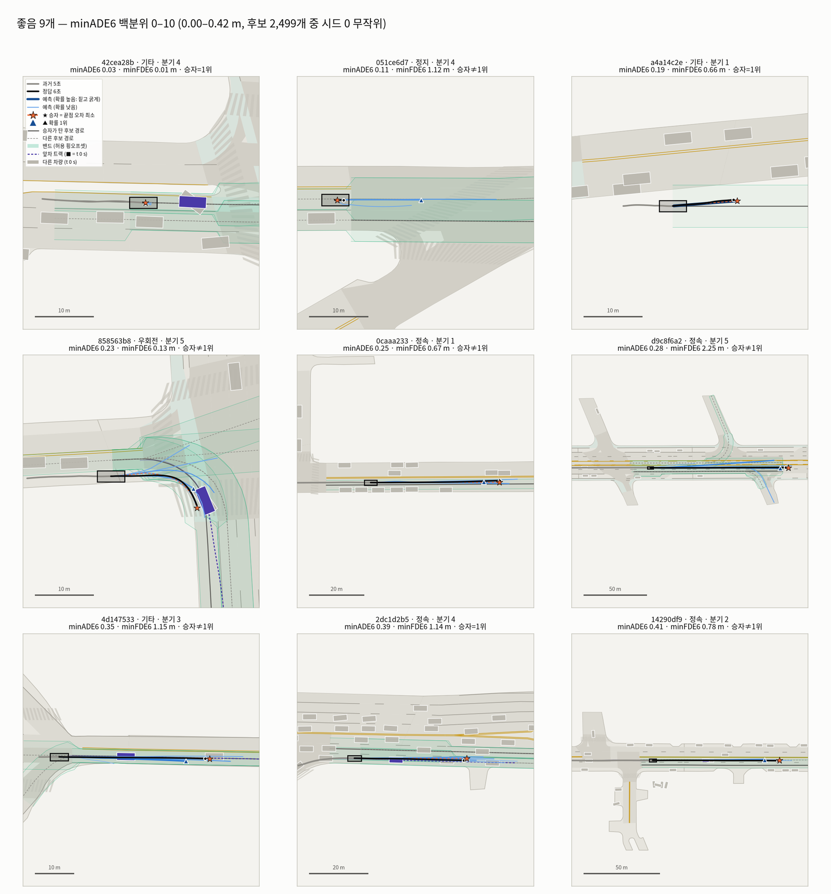 | **좋음 (0.00–0.42 m).** 9개 중 8개가 직선·저속·정지이고, 지도 경로가 정답과 맞는다. 이 그룹에서도 승자 ≠ 1위가 흔하지만(9개 중 6개) 1위가 가깝다 |
| 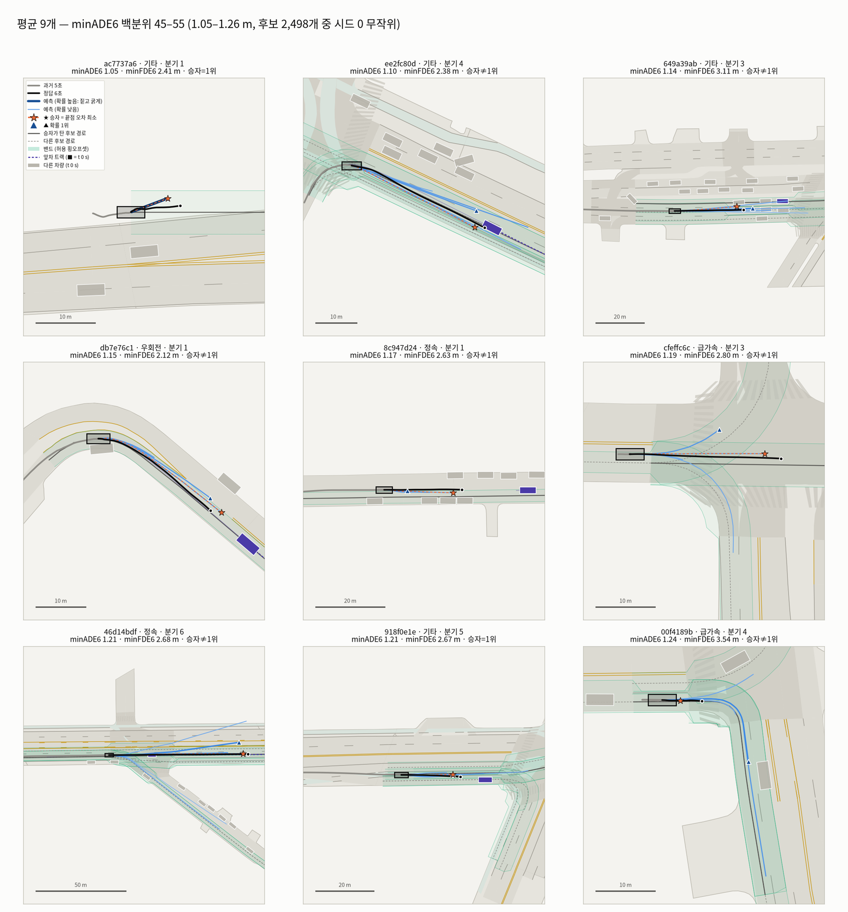 | **평균 (1.05–1.26 m).** 경로는 맞고 **속도(종방향)** 가 어긋난다. 교차로에서는 1위가 다른 분기로 간다(cfeffc6c) |
| 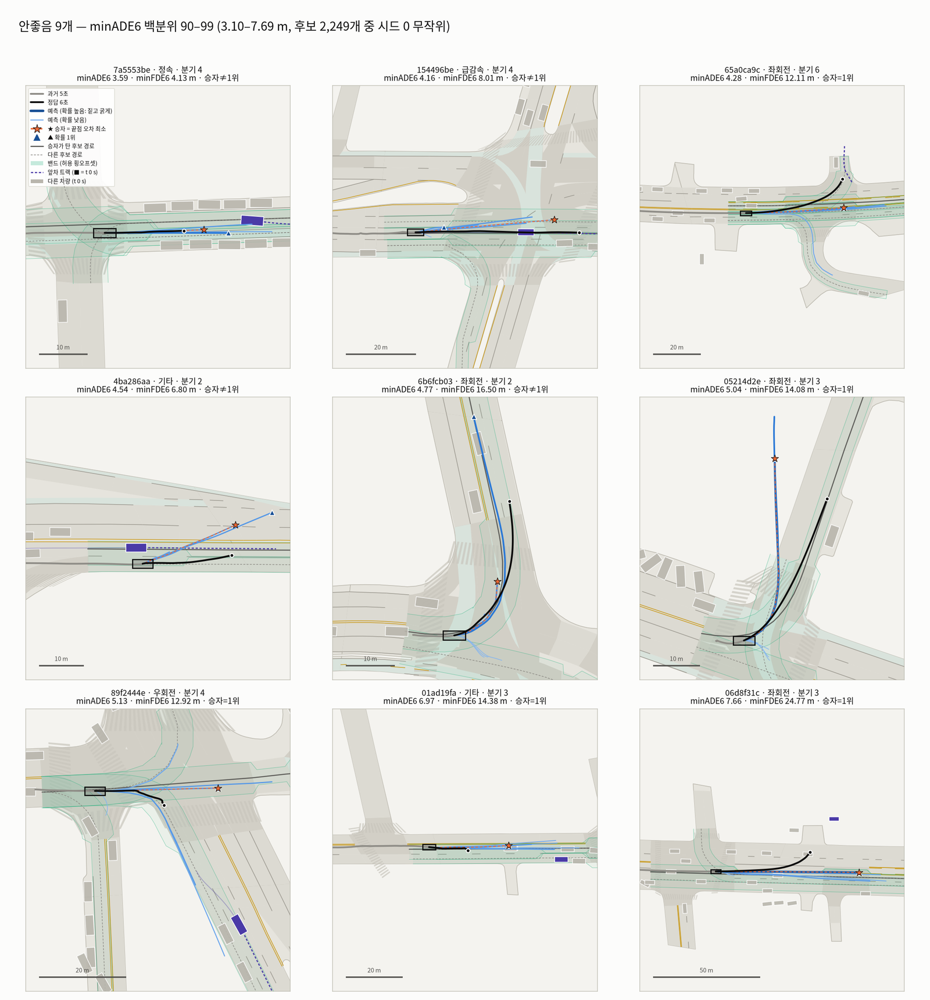 | **안좋음 (3.10–7.69 m).** 9개 중 5개가 회전이다. 정답은 도는데 1위(또는 모든 모드)가 직진하고(65a0ca9c, 06d8f31c), 승자=1위가 정답보다 빠르고 방향도 어긋난다(05214d2e: Δs +4.5, Δd +13 m) |
| 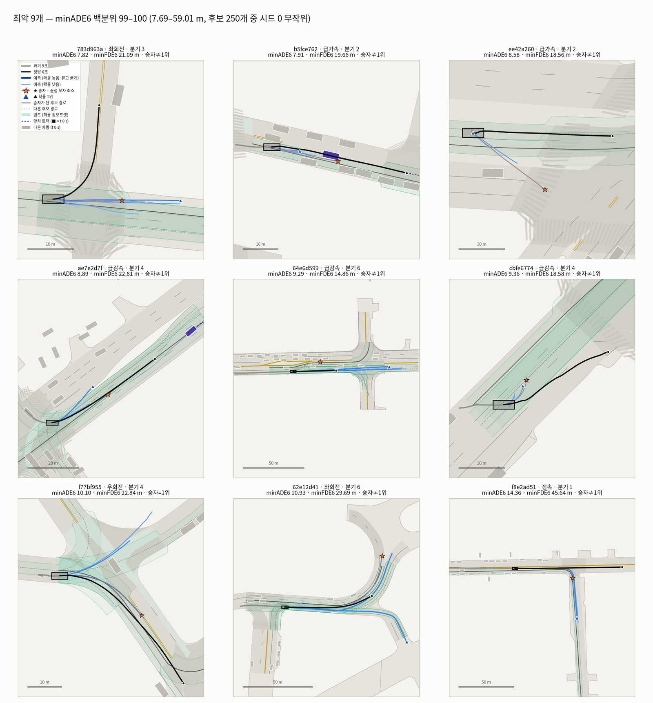 | **최악 (부록, ≥ 7.69 m).** 지도가 우회전 경로 하나만 줬는데 정답은 직진한다(f8e2ad51, 커버리지 실패). 정답이 좌회전인데 후보 경로 3개가 모두 정답과 안 맞아 모든 모드가 직진하는 경우도 있다(783d963a, 역시 커버리지 실패) |

개별 예
- `cases/good/2_051ce6d7.png` — **정지 vs 출발.** 승자는 서 있지만 1위(확률 0.21)는 4.5 m/s 까지 가속해 1위 FDE 가 13 m 다.
- `cases/good/5_0caaa233.png` — **정속인데도** 마지막 1초에 승자가 8.4 → 5.3, 1위가 6.9 → 3.6 m/s 로 감속한다. 정답의 위치 속력도 8.2 → 4.0 m/s 로 떨어지고, 속도 필드는 평평하다. 라벨 끝 인공 감속을 따라 한 것이다(5절 W5).
- `cases/bad/4_4ba286aa.png` — 속력이 1.2 m/s 로 떨어진 순간 입력 **h0 가 25° 로 튀었다**. θ₀ guard 가 그 값을 받아 살아있는 6모드가 모두 θ₀ 23~26° 로 비스듬히 출발했고, 1위는 도로를 벗어난다(hinge 3.6).
- `cases/bad/7_89f2444e.png` — 교차로 우회전이다. 1위=승자가 직진 경로(r1)를 탔고, 정답 경로(r0)는 확률 2위(0.38)인 **분기 선택 오류**다.

---

## 4. 상황·조건별 (`stats/`)

| 그림 | 무엇을 보여주나 / 알 수 있는 것 |
| --- | --- |
| 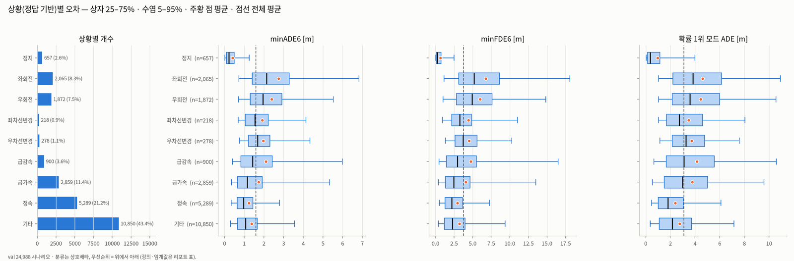 | **상황별 개수·오차 분포.** 회전이 가장 나쁘다(평균 minADE6 2.74 / 2.39 m, 1위 ADE 4.61 / 4.45 m). 정속 1.24 · 기타 1.37 m 다 |
| 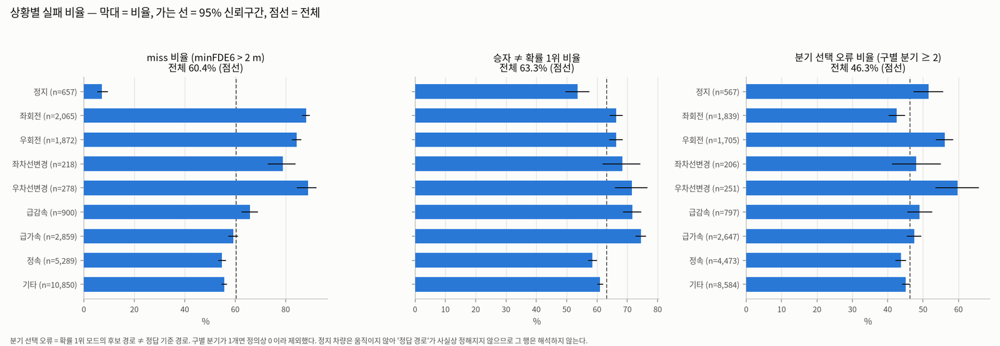 | **miss · 승자≠1위 · 분기 선택 오류.** miss 는 회전·우차선변경이 85~89% 다. 승자≠1위는 급가속 74%·급감속 72%·우차선변경 72% 로 높다. 분기 오류(n_distinct ≥ 2)는 우차선변경 60% · 우회전 56% 로 높고, 좌회전은 43% 다 |
| 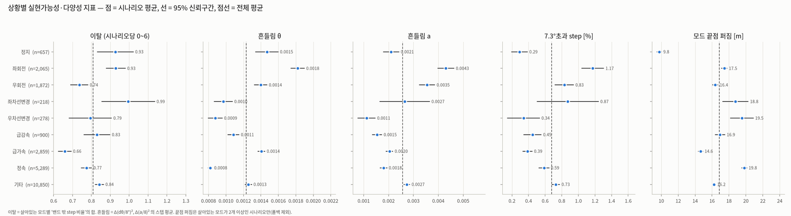 | **이탈·흔들림·7.3°초과·끝점 퍼짐.** 흔들림과 7.3°초과는 좌회전이 가장 높다(1.17%). 그래도 전 상황이 1.2% 이하라 벌점 판의 진동 억제가 상황과 무관하게 유지된다 |
| 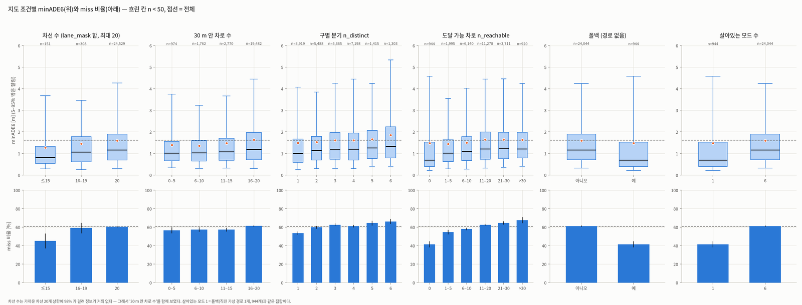 | **지도 조건.** 분기가 많을수록 조금 나빠진다(n_distinct 1 → 6: 1.49 → 1.85 m, miss 54 → 66%). 폴백(944개)은 쉬운 장면이다(1.48 m, miss 41%). 차선 수는 98% 가 상한 20 이라 판별력이 없다 |
| 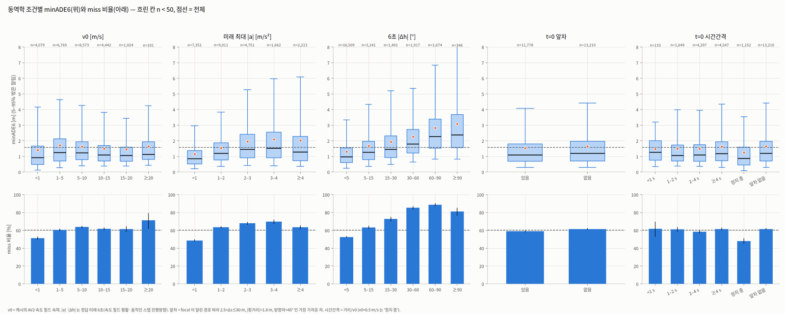 | **동역학 조건.** \|Δh\| 가 가장 강하다(1.30 → 3.08 m). 최대 \|a\| 도 영향이 있다(<1: 1.15 → 3–4: 2.09 m). v0 와 앞차 유무의 차는 작다(앞차 있음 1.52 / 없음 1.65 m) |
| 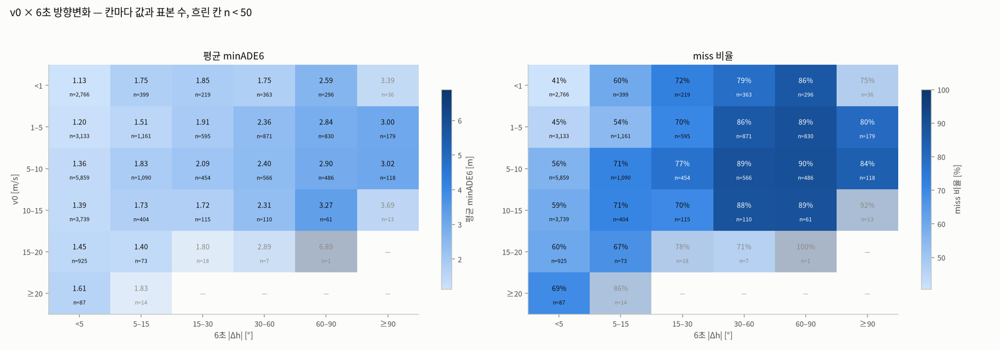 | **v0 × \|Δh\|.** 어느 속력에서나 방향변화가 커지면 나빠진다. 60–90° 회전은 v0 < 15 m/s 의 모든 구간에서 miss 86~90% 다 |
| 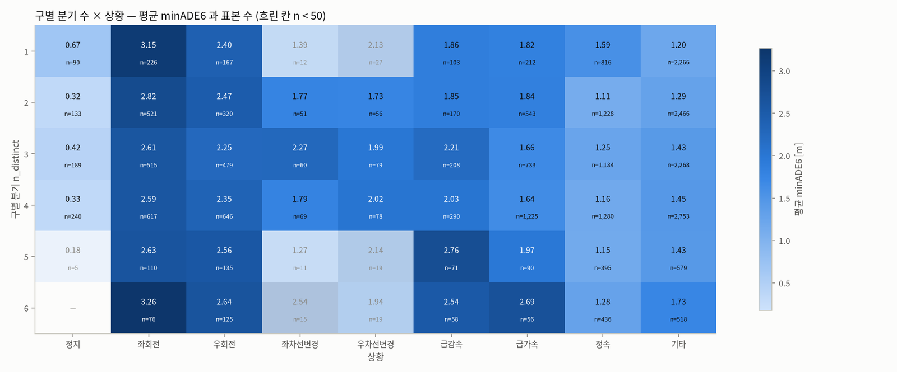 | **n_distinct × 상황.** 좌회전은 분기 수와 무관하게 2.6~3.3 m 다. 정지·정속은 분기가 많아도 낮다. 분기 수보다 **상황이** 오차를 가른다 |

---

## 5. 손실로 본 '왜' (`why/`)

| 그림 | 무엇을 보여주나 / 알 수 있는 것 |
| --- | --- |
| 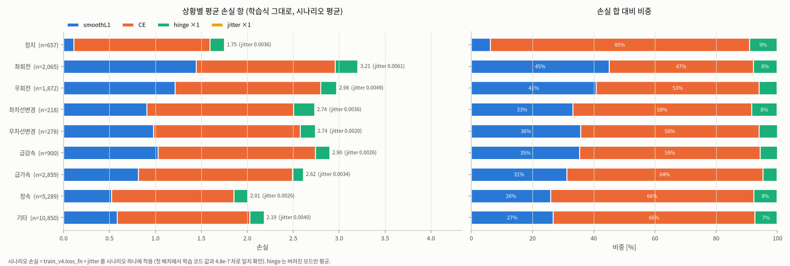 | **상황별 손실 항.** CE 가 손실의 47~85% 로 가장 크다. 회전에서만 smoothL1 비중이 41~45% 로 커진다. hinge 는 5~9%, jitter 는 0.2% 이하(0.002~0.006)다 |
| 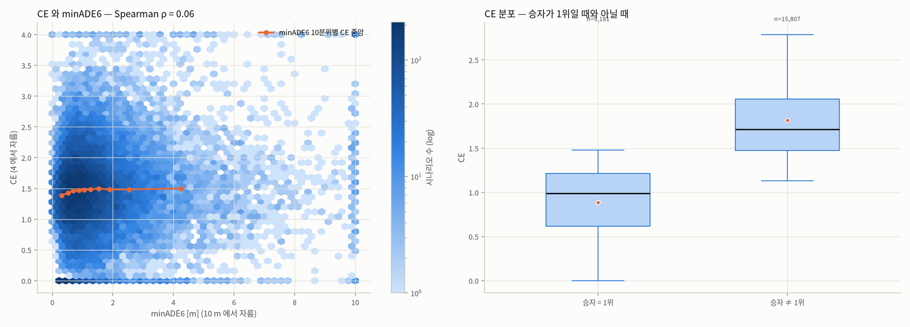 | **CE 와 minADE6.** 상관이 없다(ρ = 0.06, 10분위별 CE 중앙 1.38~1.50). 승자≠1위일 때 CE 중앙은 1.71 (같을 때 0.99)이다 |
| 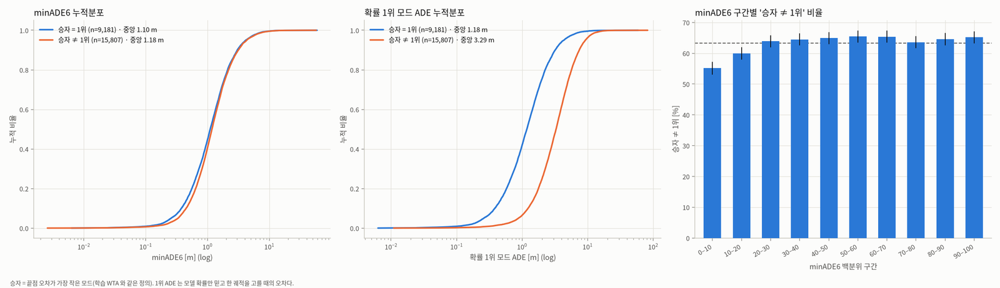 | **선택 실패의 비용.** minADE6 누적분포는 거의 겹친다. 1위 ADE 는 중앙 1.18 → 3.29 m 로 벌어진다. 승자≠1위는 좋은 10% 에서도 55% 다 |
| 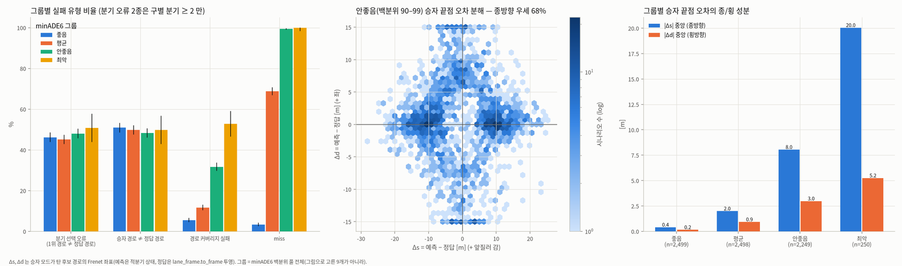 | **오차 출처.** 분기 선택 오류는 그룹과 무관하게 45~51% 다. **커버리지 실패와 miss 가 그룹을 가른다.** 끝점 오차는 모든 그룹에서 종방향 우세(65~73%)이고, 안좋음 그룹의 Δs 는 −9 m·+9 m 부근 두 봉우리다. 너무 덜 간 경우(Δs < −5 m)가 38%, 너무 멀리 간 경우(> +5 m)가 33% 다 |
| 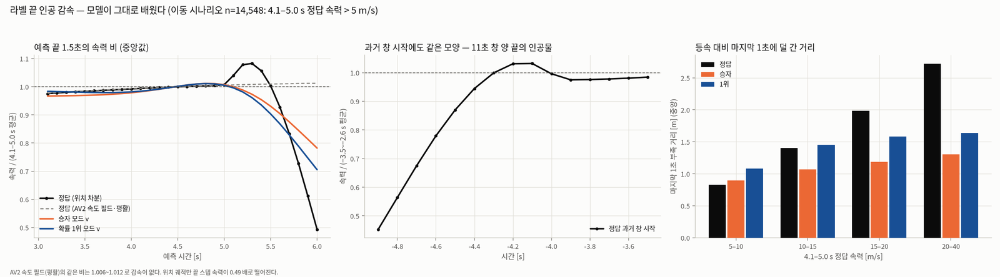 | **라벨 끝 인공 감속.** 이동 14,548개 기준으로 정답 속력은 5.2~5.3 s 에 +8% 넘쳤다가 6.0 s 에 0.49배가 된다. 과거 창 시작도 0.45배라 같은 모양이다. 속도 필드는 1.006~1.012 로 평평하다. 모델 끝 속력은 승자 0.78배 · 1위 0.71배다. 등속 대비 마지막 1초 부족 거리는 정답 1.16 · 승자 1.01 · 1위 1.32 m 이다. 고속(20–40 m/s, n=109)에서는 정답 2.72 m 를 모델이 1.30~1.64 m 만 따라간다. 그 차이(약 1.1~1.4 m)만큼 끝점이 앞서는 것으로 추정한다 |
| 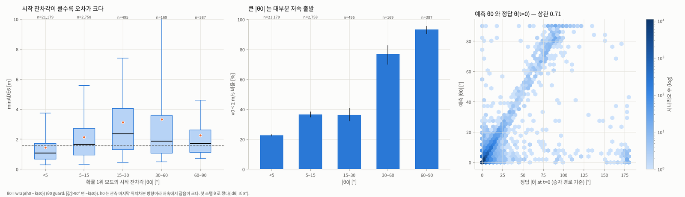 | **시작 잔차각 \|θ₀\|.** \|θ₀\| 가 5–15° 면 2.13 m, 15–60° 면 3.1~3.3 m 다(<5°: 1.45 m). 큰 값은 대부분 저속이다. 정답 θ(t=0)와의 상관이 0.71 이니, 잡음(예: bad/4)과 실제 어긋난 출발이 섞여 있다 |

---

## 6. 다양성 (`diversity/`)

| 그림 | 무엇을 보여주나 / 알 수 있는 것 |
| --- | --- |
| 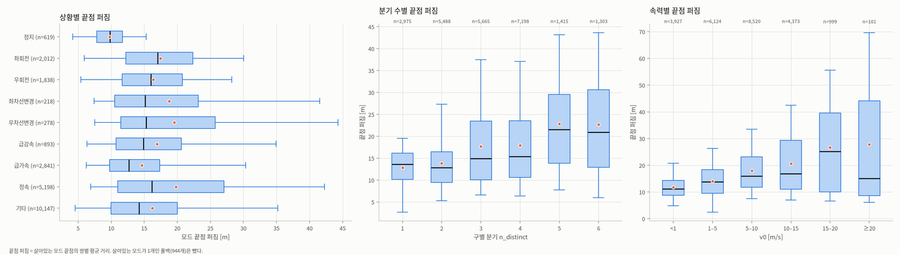 | **끝점 퍼짐.** 분기 수(n_distinct 1 → 5: 13.6 → 21.5 m)와 속력(v0 <1 → 15–20: 11.2 → 25.2 m)에 따라 커진다. 지도와 속력에 **반응한다** |
| 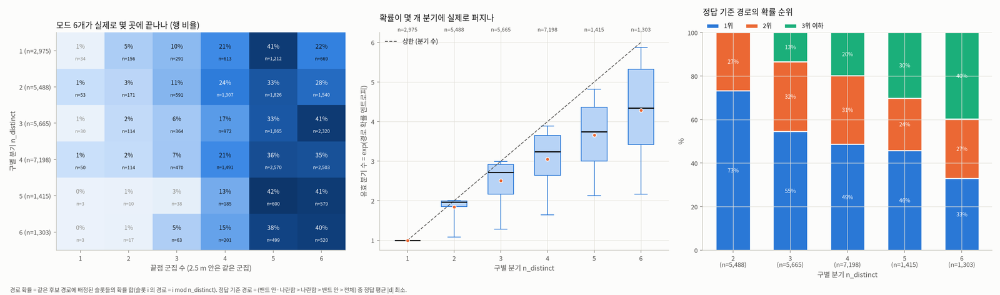 | **분기 덮기.** 분기가 1개여도 63% 가 끝점 5~6곳으로 퍼진다(종방향 다양성). 확률은 분기에 거의 고르게 편다(유효 분기 수가 상한의 72~98%). 정답 경로가 확률 1위인 비율은 n_distinct 2 에서 73%, 6 에서 33% 이고, n_distinct ≥ 2 전체로는 55.5% 다 |
| 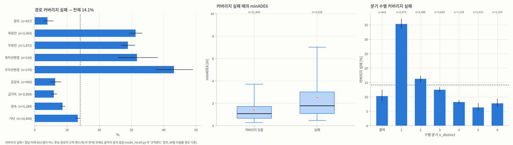 | **경로 커버리지 실패 14.1%.** 이때 minADE6 는 평균 2.53 / 중앙 1.79 m 다(성공은 1.43 / 1.08 m). 실패율은 우차선변경 43%·좌차선변경 32%·회전 29~31% 이고, 폴백이 아닌 **분기 1개 장면이 35%** 로 가장 높다. 지도가 한 갈래만 줄 때 정답이 다른 곳으로 가는 경우다 |

---

## 7. 한계

- **시드 1개·체크포인트 1개**라서 상황 간 작은 차이(±0.1 m)는 해석하지 않는다. 비율에는 Wilson 95% 신뢰구간만 그렸다.
- **분류 임계값 민감도를 재지 않았다.**
  - 정속 기준이 엄격해서 '기타'가 43% 다.
  - 차선변경은 좌·우 각 12개를 그림으로 점검했을 때 각각 1~2개가 경계 사례(지평 끝의 경로 꺾임·회전 시작)였다.
  - 가속도는 추적기 속도 필드라 잡음이 남는다(이동 시나리오 최대 가속 p99 약 8.5 m/s²).
- **앞차 정의의 한계**
  - 중심 간 거리라 차 길이를 보정하지 않았다.
  - 기준선이 focal 의 **실제 미래 경로**라서 분석용으로만 쓸 수 있다.
  - 차선변경 직전에는 옮겨 갈 차로의 차가 앞차로 잡힐 수 있다.
- **정답 기준 경로·커버리지**는 64점으로 리샘플한 캐시 경로 기준이다. 정지 차량은 '정답 경로'가 사실상 정의되지 않는다.
- **시나리오 손실의 가중:** hinge·jitter 는 배치에서는 모드 수로 가중되지만, 여기서는 시나리오별 평균으로 적었다.
- **라벨 끝 인공 감속:** 원인(AV2 쪽 평활의 가장자리 처리로 보임)을 확인하지 못했다. 모델 입력(과거 창 시작의 a 채널)에도 같은 모양이 들어간다.
- **git 에 안 들어가는 것:** `viz/` 아래는 전부 `.gitignore` 에 걸린다. PNG 는 `*.png`, `data/`(npz·parquet 약 600 MB)는 `data/` 패턴에 걸린다. 그래서 고른 시나리오 ID·숫자 요약·설정(`picks.json`·`summary.json`·`meta.json`, 합 32 KB)만 `runs/v4_viz_l4nw_ah2_full_sm1_s0_*.json` 으로 복사해 저장소에 남겼다. 그림은 워크스테이션의 `viz/` 에서 노션에 직접 올린다.

---

## 8. 재현

```bash
cd /home/user/Argoverse2study
pgrep -af "src/train_v4[.]py"                        # 학습이 돌면 --device cpu
python src/viz_v4_dump.py      # 추론+재현 확인+원본 파생량 (GPU 11 s + CPU 14 workers 약 2분)
python src/viz_v4_cases.py     # 대표 시나리오 40장 (약 50 s)
python src/viz_v4_stats.py     # 통계·손실·다양성 16장 + data/summary.json (약 15 s)
# 다른 체크포인트: 세 명령 모두 --tag v4_l4nw_ah2_full_s0
```
