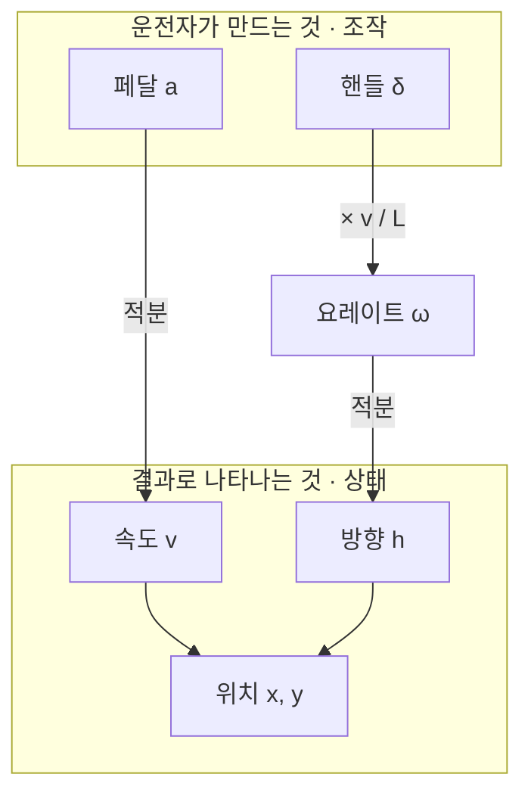

# 핸들링 관점 표현 — 방향(상태)을 조향(조작)으로

작업일: 2026-08-27 · 위치: `Argoverse2study/src/motion_repr.py` · 상태: 함수 구현·검증 완료, 실측 진행 중
선행 문서: [v4 검토 — 궤적 입력 표현을 (속도·가속도·방향)으로](./v4_motion_representation.md)

---

## 1. 문제의식 — `(a, h)` 는 짝이 맞지 않습니다

앞선 검토에서 입력을 `(v, a, h)` 로 바꿔 성능이 4% 좋아졌습니다. 그런데 이 조합에는
개념적으로 어긋난 부분이 하나 있습니다.

| 채널 | 정체 |
| --- | --- |
| `a` 가속도 | 운전자가 **만드는 것** (페달을 밟은 결과) = **조작** |
| `h` 방향 | 그 조작의 **결과로 나타나는 것** = **상태** |

운전자가 실제로 조작하는 것은 **페달과 핸들 두 개**입니다.
`a` 를 페달로 봤다면 짝은 방향이 아니라 **핸들**이어야 합니다.



그림에서 보듯 `a` 와 `h` 는 **층이 다릅니다.** `a` 는 위층(조작), `h` 는 아래층(상태)입니다.
같은 층에서 짝을 이루는 것은 `(a, δ)` 이고, 이것이 **자전거 모델(kinematic bicycle model)의
표준 제어입력**입니다. 앞 문서에서 본 Waymo 논문의 Formulation 4, Trajectron++ 의
유니사이클 제어 `(a, ω)` 가 모두 이 층에 있습니다.

---

## 2. 핸들링 량 후보 4가지

"얼마나 꺾는가" 를 표현하는 방법은 하나가 아닙니다.

| 량 | 정의 | 뜻 | 성질 |
| --- | --- | --- | --- |
| **ω** 요레이트 | `dh/dt` [rad/s] | 초당 몇 도 도는가 | 같은 곡선이라도 빠르면 커짐 (속도에 묶임) |
| **κ** 곡률 | `ω / v` [1/m] | 1m 갈 때마다 몇 rad 꺾이는가 | **속도와 무관한 경로 굽힘**. 정지에서 발산 |
| **δ** 조향각 | `atan(L·κ)`, L=2.8m | 앞바퀴 각도 ≈ 실제 핸들 각도 | `atan` 이 **자연 클리핑** — 곡률이 튀어도 ±90° 안 |
| **a_lat** 횡가속도 | `v · ω` [m/s²] | 코너에서 몸이 쏠리는 힘 | 마찰 한계(≈8 m/s²) 초과 = 물리적으로 불가능 → 노이즈 판별 가능 |

셋의 관계는 이렇습니다.

```
κ = ω / v          속도를 나눠 '경로의 모양' 만 남긴 것
δ = atan(L · κ)    그 곡률을 내려면 핸들을 얼마나 꺾어야 하는가
a_lat = v · ω      그 조작이 몸으로 느껴지는 크기
```

**같은 코너를 10km/h로 돌 때와 60km/h로 돌 때** — ω 와 a_lat 은 크게 달라지지만
κ 와 δ 는 거의 같습니다. "이 길이 얼마나 굽었나" 를 표현하려면 κ·δ 가 맞고,
"지금 얼마나 급하게 도는 중인가" 를 표현하려면 ω·a_lat 이 맞습니다.

---

## 3. 걸림돌 — 방향에도 '적분 상수' 가 또 필요합니다

`(a, h)` 에서 `v0` 가 빠졌던 것과 **완전히 같은 문제**가 반복됩니다.

| 표현 | 빠지는 정보 | 없으면 |
| --- | --- | --- |
| `a` (가속도) | 초기 **속도** `v0` | 위치 복원 FDE 13.35 m |
| `ω` / `δ` / `κ` (조향) | 초기 **방향** `h0` | 방향을 못 정해 궤적 전체가 회전 |

ω·δ·κ 는 전부 "얼마나 꺾는가" 라서 "어디를 향해 시작했는가" 가 없습니다.
정규화 좌표에서 `t=49` 의 방향을 0 으로 가정해 앵커로 쓸 수도 있지만,
실측해 보니 **t=48→49 이동방향의 표준편차가 26.1°** 라 그 가정만으로는 0.645 m 를 잃습니다
(앞 문서 6절 `(v, 각속도)` 행).

---

## 4. 해결 — 누적 트릭의 횡방향 버전

앞 문서 ② 안에서 쓴 방법을 방향에 그대로 적용하면 됩니다.
**"직전 값을 0으로 두고 시작한다"** 는 규약입니다.

```
종방향 (페달)                          횡방향 (핸들)
ã[0]  = v0 / dt                       ω̃[0]  = h0 / dt
ã[t]  = (v[t] − v[t−1]) / dt          ω̃[t]  = (h[t] − h[t−1]) / dt

v[t] = dt · Σ ã[0..t]                 h[t] = dt · Σ ω̃[0..t]
```

첫 스텝이 초기 상태를 통째로 싣고, 나머지는 순수한 조작량이 됩니다.
**결과: `(페달, 핸들)` 2채널로 완전 무손실.** 대칭이 깔끔합니다.

---

## 5. 구현한 함수

`src/motion_repr.py` 의 `Motion` 에 property 로 추가했습니다. 상수는 `WHEELBASE = 2.8 m`,
`V_FLOOR = 1.0 m/s` 입니다.

```python
class Motion:
    @property
    def kappa(self):
        """곡률 [1/m] = ω/v. 정지에서 발산하므로 속력에 하한(V_FLOOR)을 둔다."""
        return self.w_rads / np.maximum(self.v_ms, V_FLOOR)

    @property
    def delta_rad(self):
        """조향각 [rad] = atan(L·κ). 자전거모델의 앞바퀴 각도 = 사실상 핸들 각도.
        atan 이 씌워져 있어 곡률이 튀어도 ±90° 안에 갇힌다(자연 클리핑)."""
        return np.arctan(WHEELBASE * self.kappa)

    @property
    def a_lat(self):
        """횡가속도 [m/s²] = v·ω. 마찰 한계(약 8 m/s²)를 넘으면 물리적으로 불가능
        → 노이즈 판별에 쓸 수 있다."""
        return self.v_ms * self.w_rads

    @property
    def dw_degs(self):
        """h[-1]=0 으로 두고 만든 방향 증분 [deg/s]. 누적하면 h 가 그대로 나온다.
        → 첫 값이 초기 방향 h0 를 싣는다 (dv_kph 의 횡방향 버전)."""
        return np.degrees(np.diff(self.h_rad, prepend=0.0)) / 0.1
```

복원 쪽에서 중요한 것은 **조향각에서 요레이트를 되찾는 한 줄**입니다.

```python
if cfg.mode == "aw0":                       # (페달, 핸들) 2채널
    v = to_ms(np.cumsum(dv))                # 누적합 = 속력
    h = np.radians(np.cumsum(dw) * dt)      # 누적합 = 방향 (첫 값이 h0)
    return vh_to_traj(p0z, v, h, dt)

else:                                       # 조향각 → 요레이트
    w = np.maximum(v, V_FLOOR) * np.tan(d) / WHEELBASE
```

### 추가된 모드

| mode | 채널 | 구성 | 성격 |
| --- | --- | --- | --- |
| `aw0` | **2** | 페달(v0 포함), 핸들(h0 포함) | 순수 조작 표현. 무손실 |
| `vad` | 3 | v, a, **조향각 δ** | 상태 1 + 조작 2 |
| `vaw` | 3 | v, a, 요레이트 ω | 상태 1 + 조작 2 |
| `vahd` | 5 | v, a, sin h, cos h, δ | 상태 + 조작 혼합 (Trajectron++ 방식) |

`src/dataset_motion.py` 에 `aw0_2`, `vad3`, `vaw3`, `vahd5` 로 등록해 두어
`train_motion.py --repr vad3` 처럼 바로 학습할 수 있습니다.

---

## 6. 검증

### 6.1 이론값 대조 — 반경 20m 원호 주행

| 량 | 이론 | 구현 결과 |
| --- | --- | --- |
| κ | 0.0500 1/m | **0.0500** |
| δ | `atan(2.8 × 0.05)` = 8.00° | **7.97°** |

### 6.2 왕복 복원 (합성 궤적: 원호 + 가속)

| 모드 | 채널 | 왕복 ADE |
| --- | --- | --- |
| `aw0` | 2 | 9.8e-08 m |
| `vad` | 3 | 3.3e-08 m |
| `vaw` | 3 | 4.2e-08 m |
| `vahd` | 5 | 3.8e-08 m |

전부 부동소수점 정밀도 수준입니다 — **표현이 정보를 잃지 않습니다.**

### 6.3 실제 시나리오 인코딩 확인

가장 많이 꺾은 val 시나리오에서 `aw0` 의 핸들 채널이 `x[0] = 0.387`(h0 를 실음),
`x[24] = 0.000`(그 스텝에는 조작 없음)으로 의도대로 동작함을 확인했습니다.

---

## 7. 실측 결과 — 네 후보 중 셋이 탈락했습니다

AV2 val 500 시나리오 × 과거 50 step (24,000 스텝) 실측입니다.
**설계 단계의 제 예상(조향각 δ)은 데이터에 의해 반박됐습니다.**

### 7.1 네 후보의 분포

| 량 | p1 | p50 | p99 | std | \|max\| |
| --- | --- | --- | --- | --- | --- |
| ω [rad/s] | −0.581 | 0.000 | +0.611 | 1.418 | 31.4 (=π/dt, 한 스텝 180° 반전) |
| **κ [1/m]** | −0.238 | 0.000 | +0.274 | **8.996** | **746.8** (반경 1.3 mm) |
| δ [deg] | −33.7 | 0.0 | +37.5 | 10.19 | 89.97 (atan 포화) |
| a_lat [m/s²] | −3.41 | 0.00 | +3.47 | 1.648 | 78.7 (= 8 g) |

κ 는 **std 가 p99 의 33배**입니다. 분포가 완전히 꼬리에 지배되고 있다는 뜻입니다.

### 7.2 곡률 발산은 이론이 아니라 실측입니다

| v 구간 | 스텝 비중 | `\|κ\|>1` 비율 | `\|κ\|` max |
| --- | --- | --- | --- |
| 0~1 m/s | 17.80% | 1.22% | 746.8 |
| 1~5 m/s | 29.74% | 0.49% | 29.0 |
| 5~15 m/s | 47.45% | 0.00% | 0.4 |
| 15+ m/s | 5.01% | 0.00% | 0.1 |

**v ≥ 3 m/s 에서는 `|κ|>1` 이 0.000%** 입니다. 깨끗한 경계가 3 m/s 에 있습니다.
그리고 정지 heading-hold 를 끄면 v<1 구간에서 `|κ|>1` 이 **68.56%**, `|max|` 가
**204,902 1/m**(반경 5 마이크로미터)까지 갑니다. 우리가 넣어둔 hold 규칙이 발산을
가리고 있었을 뿐 없앤 것이 아닙니다.

### 7.3 노이즈 — 넷 다 가속도보다 나쁩니다

| 신호 | lag-1 자기상관 (전 속도) | v ≥ 3 m/s 만 |
| --- | --- | --- |
| v (대조군) | **+0.978** | — |
| 위치차분 가속도 (이미 "81%가 노이즈"로 판정된 것) | +0.378 | — |
| δ | +0.225 | +0.465 |
| a_lat | +0.041 | +0.323 |
| κ | −0.013 | +0.388 |
| ω | −0.141 | +0.403 |

넷 다 가속도보다 나쁘고, **노이즈는 전적으로 3 m/s 아래에 몰려 있습니다.**

### 7.4 넷은 사실상 같은 신호입니다

v ≥ 3 m/s 구간 상호 상관계수:

| 쌍 | 상관 |
| --- | --- |
| κ–δ | 0.974 |
| ω–δ | 0.945 |
| ω–κ | 0.933 |
| ω–a_lat | 0.904 |
| κ–a_lat | 0.704 |

`v` 가 이미 채널에 있으므로 **넷 중 하나만 고르면 됩니다.**

### 7.5 해법 — ω 를 AV2 heading 필드에서 만든다

| | 이동방향(위치차분) 기반 ω | **AV2 heading 필드 기반 ω** |
| --- | --- | --- |
| std | 81.25 deg/s | **5.37 deg/s** |
| \|max\| | 1,799 deg/s | **57.9 deg/s** |
| lag-1 자기상관 | −0.141 | **+0.965** |
| 마찰한계(8 m/s²) 초과 | 0.458% | **0.000%** |

heading 필드는 트래커가 이미 평활한 신호라 20배 이상 깨끗합니다.
**다만 heading 필드는 위치와 정합하지 않습니다**(차체 yaw vs 이동방향 = 슬립각).
그걸로 위치를 복원하면 ADE 0.499 m 를 잃습니다.

> 그래서 **입력 전용**입니다. 복원(디코더)은 `sin h / cos h` 가 담당하고,
> `ω_field` 는 인코더 입력으로만 씁니다. 입력에는 정합성이 필요 없으므로 이 분리가 성립합니다.

### 7.6 ω 클리핑은 절대 하면 안 됩니다

복원 경로에 클리핑을 걸었을 때:

| 클립 | 복원 ADE |
| --- | --- |
| 없음 | 0.0104 m |
| ±3 rad/s (172 deg/s — 물리한계보다 한참 위) | **1.545 m** |
| ±0.5 rad/s | 2.019 m |
| v<0.1 m/s 게이팅만 | 1.417 m |

저속 구간의 ±180° 스윙은 서로 상쇄되도록 짝지어 생기는데, 클리핑이 한쪽만 자르면
균형이 깨져 heading 이 **영구히 틀어집니다.** Trajectron++ 가 클리핑 대신
ε 분기(논문 ε=1e-3, 공식 코드 `|dφ| ≤ 1e-2`)를 쓰는 이유가 이것입니다.

단, **입력 채널에만 거는 클립은 무해**합니다 (±1 rad/s 면 0.004% 만 영향).

### 7.7 ω 를 '적분되는 목표'로 쓰면 오차가 2.9배로 증폭됩니다

같은 크기의 각도 오차를 절대 heading `h` 에 줄 때와 요레이트 `ω` 에 줄 때의 6초 FDE:

| 오차 | h 에 주면 | ω 에 주면 |
| --- | --- | --- |
| bias 1° | 0.500 m | **1.431 m** |
| bias 2° | 1.029 m | **3.121 m** |
| white noise 1° | 0.075 m | 0.225 m |

`h` 오차는 그 스텝에만 국소적으로 작용하지만 `ω` 오차는 적분되어 이후 모든 스텝에 남는
영구 드리프트가 됩니다. 실제 모델 오차는 시간상 강하게 상관되므로 bias 쪽이 현실에 가깝습니다.
**디코더는 `sin h / cos h` 를 유지하는 것이 맞습니다.**

### 7.8 문헌도 (a, δ) 에 우호적이지 않습니다

| 논문 | 내용 |
| --- | --- |
| [Deep Stochastic Kinematic Models](https://arxiv.org/html/2406.01431) (arXiv 2406.01431, 2024) | **F4 = (a, δ) 가 정확히 우리 검토안**인데, Waymo 전체에서 minADE **0.8220 으로 베이스라인 0.8131 보다 나쁨**. F3(speed, heading) 0.8102 에도 짐. F4 가 이긴 건 1% 저데이터(1.2932 vs 1.4735)뿐 |
| [Cui et al. ICRA 2020](https://arxiv.org/abs/1908.00219) | 운동학 레이어의 이득은 **위치가 아님** — 6초 위치오차 4.25 → 4.21 m 로 거의 동일. 개선된 건 heading 오차 7.69° → 4.92° 와 비실현 궤적 26.0% → **0.0%** |
| [Trajectron++](https://arxiv.org/abs/2001.03093) | δ 가 아니라 **ω 를 택함** (dynamically-extended unicycle, 상태 [x,y,φ,v] / 제어 [ω,a]). 제어 클리핑 없음 |
| Frenet Wrapper (arXiv 2306.00605) | 곡률/Frenet 계열은 표준 Argoverse 에서 **오히려 나빠짐** (LaneGCN minADE 0.645 → 0.737). 사는 것은 정확도가 아니라 분포 외 강건성 |

**요약: 제어 파라미터화는 데이터가 적을 때의 귀납편향으로 값어치가 있지, 대규모 학습에서
정확도를 올려주지 않습니다.** AV2 train 은 20만 시나리오라 저데이터 레짐이 아닙니다.

### 7.9 δ 를 배제할 결정적 이유 하나 더 — focal 이 다 차가 아닙니다

val 400개 표본의 focal 객체 종류:

| 종류 | 개수 | 비율 |
| --- | --- | --- |
| VEHICLE | 358 | 89.5% |
| **PEDESTRIAN** | **25** | **6.25%** |
| BUS | 13 | 3.25% |
| MOTORCYCLIST / CYCLIST | 4 | 1.0% |

**보행자에게는 wheelbase L 이 정의되지 않습니다.** `δ = atan(L·κ)` 는 의미 없는 값이 되고,
버스는 L 이 승용차의 2~3배라 같은 L 을 쓰면 계통 오차가 생깁니다.
ω 는 차종과 무관하게 정의되므로 이 문제가 없습니다.


---

## 8. 결론 — 권고 수정

**설계 단계의 예상(δ 조향각)을 철회합니다.** 실측이 셋을 배제했습니다.

| 후보 | 판정 | 이유 |
| --- | --- | --- |
| **ω 요레이트** | **채택** | v 로 나누지 않아 특이점 없음. heading 필드에서 만들면 lag-1 +0.965 로 유일하게 깨끗 |
| κ 곡률 | 기각 | v 로 나눠 발산 (\|max\| 746 1/m = 반경 1.3 mm), std 가 p99 의 33배 |
| δ 조향각 | 기각 | κ 의 발산을 ±90° 로 포화시킬 뿐. `\|δ\|>40°` 스텝의 v 중앙값이 1.31 m/s — 명백한 저속 노이즈. 게다가 focal 6.25% 가 보행자라 L 이 정의 안 됨 |
| a_lat 횡가속도 | 기각 | 통계는 가장 얌전하지만 v 를 곱해 저속 정보를 **버리기** 때문. 복원하려면 다시 v 로 나눠야 해서 특이점이 되돌아옴 |

그리고 **ω 도 h 를 "대체"하면 안 되고 "추가"여야 합니다** (7.7절 — 적분 목표로 쓰면 오차 2.9배).

### 최종 권고

```
mode = "vahw"  (5채널)
  v[km/h]      / 20      상태
  a[km/h/s]    / 15      종방향 조작
  sin h, cos h            상태 (복원 담당, 무손실)
  ω_field[rad/s] / 0.1    횡방향 조작 (AV2 heading 필드 기반, 입력 전용, ±1 클립)
```

`src/motion_repr.py` 의 `mode="vahw"`, `src/dataset_motion.py` 의 `vahw5` 로 구현했습니다.
왕복 복원 오차는 3.8e-08 m 로 무손실입니다.

> **스케일 상수를 고쳤습니다.** 기존 `w_rads=0.4 / w_degs=20.0` 은 실측 std(0.094 rad/s)의
> 4배라 나눈 뒤 std 가 0.23 밖에 안 됐습니다 — 신호가 죽습니다. `w_field=0.1` 로 수정했습니다.


## 9. 이번 검토에서 얻은 교훈

**1. "무손실"과 "쓸 수 있음"은 또 다시 다른 문제였습니다.**
κ 와 δ 는 수학적으로 완벽한 변환입니다 — ω 와 v 로부터 정확히 계산되고 되돌릴 수도 있습니다.
그런데 실제 데이터에서는 `|max| = 204,902 1/m` 같은 값이 나옵니다. 변환이 정확한 것과
그 결과가 신경망 입력으로 쓸 만한 것은 별개입니다.

**2. 같은 물리량이라도 어디서 만드느냐가 20배를 가릅니다.**
ω 를 위치차분에서 만들면 std 81 deg/s 쓰레기이고, AV2 heading 필드에서 만들면 5.4 deg/s 로
깨끗합니다. 신호의 출처가 표현의 선택만큼 중요합니다.

**3. 입력과 복원의 요구조건은 다릅니다.**
heading 필드는 위치와 정합하지 않아 복원에는 못 쓰지만(ADE 0.499 m), 입력에는 정합성이
필요 없으므로 쓸 수 있습니다. 이 분리를 인식하면 "깨끗한 신호"와 "무손실 복원"을
동시에 가질 수 있습니다.

**4. 클리핑은 적분되는 양에 쓰면 안 됩니다.**
물리한계보다 한참 위에서 잘라도 복원이 150배 무너집니다. 상쇄되도록 짝지어 있던 오차의
균형이 깨지기 때문입니다.


## 10. 예상 질문과 답변

**Q1. 왜 굳이 방향을 조향으로 바꾸나? `(v, a, h)` 로 이미 4% 좋아졌는데.**
두 가지입니다. (1) 개념적 일관성 — `a` 와 `h` 가 서로 다른 층(조작 vs 상태)에 있어
모델이 배워야 할 관계가 한 단계 더 있습니다. (2) 곡률·조향각은 **속도와 분리된 경로 정보**라,
같은 코너를 10km/h로 돌든 60km/h로 돌든 같은 값이 나옵니다. 지도의 차선 곡률과
직접 비교할 수 있게 되는 셈이라 다음 작업(차선 방향/곡률)과 맞물립니다.

**Q2. ω, κ, δ, a_lat 중 뭘 써야 하나?**
**ω 입니다.** 설계 단계에서는 δ(조향각)를 예상했지만 실측이 뒤집었습니다.
κ·δ 는 `v` 로 나누기 때문에 저속(전체 스텝의 17.8%가 v<1 m/s)에서 발산하고,
a_lat 는 반대로 `v` 를 곱해 저속 정보를 버립니다. ω 만 `v` 와 무관하게 정의되고
`|ω| ≤ π/dt` 로 유계입니다. 단 ω 도 **AV2 heading 필드에서** 만들어야 합니다
(위치차분 기반은 std 81 deg/s 로 못 씁니다).

**Q3. wheelbase L=2.8m 은 어디서 온 값인가? 차마다 다르지 않나?**
승용차 평균값입니다. 중요한 건 **L 이 상수라는 것**입니다 — δ = atan(L·κ) 에서 L 이 바뀌어도
단조 변환이라 정보량은 그대로고, 스케일만 조금 달라집니다. 트럭·버스가 섞이면 오차가 생기지만
AV2 focal 은 대부분 승용차입니다.

**Q4. 조향각을 쓰면 후진이나 제자리 회전은 어떻게 되나?**
`κ = ω/max(v, 1.0)` 이라 정지 상태에서는 분모가 1.0 으로 고정되어 발산하지 않고,
속도가 0이면 위치도 안 움직이므로 복원에도 영향이 없습니다. 다만 그 구간의 δ 값은
물리적 의미가 없는 숫자이므로, 정지 비율(전체의 14%)이 특징 품질에 미치는 영향은 확인이 필요합니다.

**Q5. `aw0` 2채널이 그렇게 아름다우면 왜 권하지 않나?**
정보 이론적으로는 완벽하지만(왕복 오차 1e-7), 신경망이 쓰기 어렵습니다.
속도와 방향 **둘 다** 50스텝 누적합으로 얻어야 하고, 중간에 조금씩 틀리면 위치 오차로 직결됩니다.
앞 실험에서 한쪽만 누적이었던 ② 안이 이미 6.7% 졌습니다.

**Q6. 그러면 실용적인 권고는?**
`vahw5` = `(v, a, sin h, cos h, ω_field)` 5채널을 `vah4` = `(v, a, sin h, cos h)` 와
같은 조건으로 학습해 비교하는 것입니다. 채널 하나 차이라 "요레이트를 추가하면 도움이 되는가"
라는 질문 하나만 남습니다. `vah4` 는 이미 5채널 기준선 대비 −4.0% 를 기록했으므로
그것이 비교 기준입니다.

**Q7. δ 를 아예 못 쓰나? 고속 구간만 쓰면 되지 않나?**
v ≥ 3 m/s 로 제한하면 `|κ|>1` 이 0.000% 로 깨끗해지는 건 맞습니다(7.2절).
문제는 전체 스텝의 47.5%가 그 아래에 있다는 것입니다 — 도심 데이터라 정지·저속이 많습니다.
그 절반을 마스킹하거나 0으로 채우면 그 자체가 또 다른 인공적 신호가 됩니다.
게다가 focal 의 6.25%가 보행자라 δ 는 정의 자체가 안 됩니다.

**Q8. 클리핑을 하면 발산을 막을 수 있지 않나?**
**입력 채널에는 되고, 복원 경로에는 절대 안 됩니다.** 복원 경로에 ω 를 ±3 rad/s
(172 deg/s, 물리한계보다 한참 위)로만 잘라도 ADE 가 0.0104 → 1.545 m 로 150배 무너집니다.
저속의 ±180° 스윙이 서로 상쇄되도록 짝지어 있는데 한쪽만 자르면 균형이 깨져 heading 이
영구히 틀어지기 때문입니다. 입력 채널에 거는 ±1 rad/s 클립은 0.004% 만 영향을 주므로 무해합니다.

---

## 11. 다음 단계

- [x] 실측으로 스케일 상수 확정 — `w_field = 0.1 rad/s` (기존 0.4 는 실측 std 의 4배라 신호가 죽었음)
- [ ] **`vahw5` vs `vah4` 학습 비교** (같은 조건, 50k / 15 epoch) — 핵심 질문.
      `vah4` 의 minADE6 1.265 가 기준
- [ ] `aw0_2` 로 누적합 가설 재검증 (양쪽 채널 모두 누적이면 얼마나 더 나빠지는가)
- [ ] 시드 3개 반복으로 앞 실험(v4) 결과 확정
- [ ] 차선에 **방향 벡터** 추가 — 궤적 쪽 heading·ω 와 지도 쪽 차선 방향이 짝이 맞음.
      Cui et al. 이 보인 것처럼 운동학 표현의 진짜 이득은 minADE 가 아니라
      **heading 정확도와 실현가능성**이므로, 역주행 방지 과제와 이 축에서 연결된다
